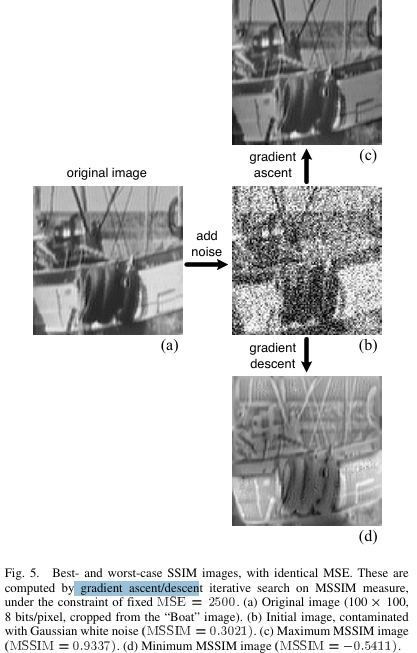

# Image quality assessment: From error visibility to structural similarity

> "Image quality assessment: From error visibility to structural similarity" TIP, 2004 Apr 30, `SSIM`
> [paper](https://ieeexplore.ieee.org/document/1284395) [code](https://cave.cs.columbia.edu/projects/categories/project?cid=Computational+Imaging&pid=Minimalist+Vision+with+Freeform+Pixels) [pdf](./2004_04_TIP_Image-quality-assessment--From-error-visibility-to-structural-similarity.pdf) [note](./2004_04_TIP_Image-quality-assessment--From-error-visibility-to-structural-similarity_Note.md)
> Authors: Zhou Wang,  A.C. Bovik,  H.R. Sheikh,  E.P. Simoncelli

## Key-point

- Task
- Problems
- :label: Label:

对亮度 $\mu$, 对比度 $\sigma$, 结构特征 $(x-\mu)/\sigma$ 的加权乘积，指数=1


## Contributions

- 提出基于物体结构化特征的指标

  > Under the assumption that human visual perception is highly adapted for extracting structural information from a scene, we introduce an alternative complementary framework for quality assessment based on the degradation of structural information.

- 主观 & 客观指标 SOTA

> Similarity Index and demonstrate its promise through a set of intuitive examples, as well as comparison to both subjective ratings and state-of-the-art objective methods


## Introduction

- Q：In practice, however, subjective evaluation is usually too inconvenient, time-consuming and expensive.


**IQA 指标分类 **:star:

> Objective image quality metrics can be classified according to the availability of an original (distortion-free) image, with which the distorted image is to be compared.

Full-reference，有参考图

> Most existing approaches are known as full-reference, meaning that a com plete reference image is assumedto beknown.

No-Reference 无参考图

> Inmanypractical applications, however, the reference image is not available, and a no-reference or "blind" quality assessment approach is desir able.

Reduced-reference，有部分参考信息但不是原图

> In a third type of method, the reference image is only par tially available, in the form of a set of extracted features made available as side information to help evaluate the quality of the distorted image. This is referred to as reduced-reference quality assessment. 


常用指标：MSE，PSNR

> The simplest and most widely used full-reference quality metric is the mean squared error (MSE), computed by av eraging the squared intensity differences of distorted and reference image pixels, along with the related quantity of peak signal-to-noise ratio (PSNR).

有物理意义，但主观视觉评估不是非常契合人类感知

> These are appealing because they are simple to calculate, have clear physical meanings, and are mathematically convenient in the context of optimization. But they are not very well matched to perceived visual quality

- "What’s wrong with mean-squared error" MIT-Press, 1993


IQA 经典系统 pipeline


- 预处理

GT 图像尽可能变高清；图像同一颜色空间，对齐；

> Fourth, a low-pass filter simulating the point spread function of the eye optics may be applied.


- CSF Filtering

提取不同频域特征，描述图像

> **The contrast sensitivity function (CSF)** describes the sensitivity of the HVS to different **spatial and temporal frequencies** that are present in the visual stimulus.

可以搞一个函数映射 or 在通道分解后的 normalization :star:

> Some image quality metrics include a stage that weights the signal according to this function (typically implemented using a linear filter that approximates the frequency response of the CSF). However, many recent metrics choose to implement CSF as a base-sensitivity normalization factor after channel decomposition.


- Channel Decomposition

分解为不同通道 or 特征；DCT 变换、

> The images are typically sepa rated into subbands (commonly called "channels" in the psychophysics literature) that are selective for spatial and temporal frequency as well as orientation. 


- Error Normalization & Pooling

> The error (difference) between the decomposed reference and **distorted signals in each channel is calculated and normalized according to a certain masking model,** which takes into account the fact that the presence of one image component will decrease the visibility of another image component that is prox imate in spatial or temporal location, spatial frequency, or orientation. 

Error Pooling 整合多个维度的 measure

>  Error Pooling: The final stage of all quality metrics must **combine the normalized error signals over the spatial extent of the image, and across the different channels, into a single value.**


## methods


为了提取结构信息，想先去除掉光照的影响

>  The luminance of the surface of an object being observed is the product of the illumination and the reflectance, but the struc tures of the objects in the scene are independent of the illumination. Consequently, to explore the structural information in an image, we wish to separate the influence of the illumination.

**分解为光照，对比度，结构，3个特征**

> The system separates the task of similarity measurement into three comparisons: luminance, contrast and structure.

### Code

先量化到 0-255

```python
def quantize(imTensor: torch.Tensor) -> torch.Tensor:
    """change pixel range from [-1,1] to [0,255]"""
    return ((imTensor.clamp(-1.0, 1.0) + 1.) / 2.).mul(255).round()
    
    
def calc_ssim(gt: torch.Tensor, out: torch.Tensor, *args) -> torch.Tensor:
    """
    args:
    gt, out -- (B,3,H,W) cuda Tensors in [-1,1]
    """
    return pytorch_ssim.ssim_matlab(quantize(gt), quantize(out), size_average=False)
```


对于单个通道，**取灰度的平均值作为亮度，$\mu_x$**

> First, the luminance of each signal is compared. As suming discrete signals, this is estimated as the mean intensity


对比度：将图像去除掉亮度信息，直接减掉；**之后计算方差作为对比度**

> Second, we remove the mean intensity from the signal. In discrete form, the resulting signal corresponds to the projection of vector onto the hyperplane defined by 
> $$
> x - \mu_x \to \sum x_i = 0
> $$
>  Weusethestandarddeviation (the square root of variance) as an estimate of the signal contrast.


计算结构信息：用亮度 $\mu_x$ 和对比度 $\sigma_x$ 去对图像归一化，得到结构信息 （假设 & 排除法）

> Third, the signal is normalized (divided) by its own standard deviation, so that the two signals being comparedhaveunitstan dard deviation. The structure comparison is conducted on these normalized signals $\frac{x - \mu_x}{\sigma_x}$


- Q：如何结合起来得到 SSIM 指标呢？

发现：**亮度、对比度、结构信息是相互独立的，就是说一个改变不会影响其他几个特征**

> An important point is that the three components are relatively independent. For example, the change of luminance and/or con trast will not affect the structures of images.

同时对 SSIM 提出几个性质，去满足 :star:

1. 对称 $ SSIM(x,y)= SSIM(y,x)$
2. $S(x,y) \leq 1$，只有 x=y 取等号


注意，前面的都是想象 :joy: **现在对亮度、对比度、结构特征用公式化**

接下来对照 code 看公式

```python
def ssim_matlab(img1, img2, window_size=11, window=None, size_average=True, full=False, val_range=255):
    # Value range can be different from 255. Other common ranges are 1 (sigmoid) and 2 (tanh).
    if val_range is None:
        if torch.max(img1) > 128:
            max_val = 255
        else:
            max_val = 1

        if torch.min(img1) < -0.5:
            min_val = -1
        else:
            min_val = 0
        L = max_val - min_val
    else:
        L = val_range

    padd = 0
    (_, _, height, width) = img1.size()
    if window is None:
        real_size = min(window_size, height, width)
        window = create_window_3d(real_size, channel=1).to(img1.device)
        # Channel is set to 1 since we consider color images as volumetric images

    img1 = img1.unsqueeze(1)
    img2 = img2.unsqueeze(1)

    mu1 = F.conv3d(F.pad(img1, (5, 5, 5, 5, 5, 5), mode='replicate'), window, padding=padd, groups=1)
    mu2 = F.conv3d(F.pad(img2, (5, 5, 5, 5, 5, 5), mode='replicate'), window, padding=padd, groups=1)

    mu1_sq = mu1.pow(2)
    mu2_sq = mu2.pow(2)
    mu1_mu2 = mu1 * mu2

    sigma1_sq = F.conv3d(F.pad(img1 * img1, (5, 5, 5, 5, 5, 5), 'replicate'), window, padding=padd, groups=1) - mu1_sq
    sigma2_sq = F.conv3d(F.pad(img2 * img2, (5, 5, 5, 5, 5, 5), 'replicate'), window, padding=padd, groups=1) - mu2_sq
    sigma12 = F.conv3d(F.pad(img1 * img2, (5, 5, 5, 5, 5, 5), 'replicate'), window, padding=padd, groups=1) - mu1_mu2

    C1 = (0.01 * L) ** 2  # luminance K1=0.01
    C2 = (0.03 * L) ** 2

    v1 = 2.0 * sigma12 + C2
    v2 = sigma1_sq + sigma2_sq + C2
    cs = torch.mean(v1 / v2)  # contrast sensitivity

    ssim_map = ((2 * mu1_mu2 + C1) * v1) / ((mu1_sq + mu2_sq + C1) * v2)

    if size_average:  # True
        ret = ssim_map.mean()
    else:
        ret = ssim_map.mean(1).mean(1).mean(1).mean(1)

    if full:
        return ret, cs
    return ret
```


#### 亮度


使用 Conv3d 计算局部区域亮度 $\mu$

```
    mu1 = F.conv3d(F.pad(img1, (5, 5, 5, 5, 5, 5), mode='replicate'), window, padding=padd, groups=1)
    mu2 = F.conv3d(F.pad(img2, (5, 5, 5, 5, 5, 5), mode='replicate'), window, padding=padd, groups=1)


```

计算 SSIM 公式

```
    mu1_sq = mu1.pow(2)
    mu2_sq = mu2.pow(2)
    C1 = (0.01 * L) ** 2  # luminance K1=0.01
    ssim_map = ((2 * mu1_mu2 + C1) * v1) / ((mu1_sq + mu2_sq + C1) * v2)
```


- Q：为什么这么 define？

设计公式去满足定义的性质！**这样还不够，找了 Weber's Law 去解释 :star:**


**设计的亮度 eq6 遵循 Weber's Law，有另一种形式**

> Equation (6) is also qualitatively consistent with Weber’slaw, which has been widely used to model light adaptation (also called luminance masking) in the HVS. 

Weber's Law 大致意思是，**"人类可察觉的亮度变化" **是**相对**于背景亮度的一个比例，而不是绝对值

> According to Weber’s law, the magnitude of a just-noticeable luminance change is approximately proportional to the background luminance for a wide range of luminance values. In other words, the HVS is sensitive to the relative luminance change, and not the absolute luminance change.


>  Letting **R represent the size of luminance change relative to background luminance,**


#### contrast

类似亮度的形式


```
    mu1_mu2 = mu1 * mu2

    sigma1_sq = F.conv3d(F.pad(img1 * img1, (5, 5, 5, 5, 5, 5), 'replicate'), window, padding=padd, groups=1) - mu1_sq
    sigma2_sq = F.conv3d(F.pad(img2 * img2, (5, 5, 5, 5, 5, 5), 'replicate'), window, padding=padd, groups=1) - mu2_sq
    sigma12 = F.conv3d(F.pad(img1 * img2, (5, 5, 5, 5, 5, 5), 'replicate'), window, padding=padd, groups=1) - mu1_mu2
```


#### structure

> Structure comparison is conducted after luminance subtrac tion and variance normalization. 

因此比较 $(x-\mu_x)/\sigma_x$ && $(y-\mu_y)/\sigma_y$ 就可以；

注意到这两个式子就是标准化，关系和 x && y 的关系，$(x-\mu_x) \&(y-\mu_y)$相关，-> 简化公式


最后还是加权一下每一项

> Finally, we combine the three comparison

设定下超参，定义为 SSIM Index :star:

> In order to simplify the expression, we set $\alpha=\beta=\gamma=1$ and $C_3 = C_2 / 2$in this paper
>
> This results in a specific form of the SSIM index


```
    C1 = (0.01 * L) ** 2  # luminance K1=0.01
    C2 = (0.03 * L) ** 2

    v1 = 2.0 * sigma12 + C2
    v2 = sigma1_sq + sigma2_sq + C2
    cs = torch.mean(v1 / v2)  # contrast sensitivity

    ssim_map = ((2 * mu1_mu2 + C1) * v1) / ((mu1_sq + mu2_sq + C1) * v2)

```


### MSSIM for IQA

局部区域计算更有效

>  For image quality assessment, it is useful to apply the SSIM index locally rather than globally. 

指标根据 8x8 小窗口单独算

>  In [6] and[7], the local statistics , and are computed within a **local  8x8 square window,**
>
> At each step, the local statistics and SSIM index are calculated within the local window.

- Q：resulting SSIM index map often ex hibits undesirable “blocking” artifacts


取平均

> M is the number of local windows of the image


## setting

## Experiment

> ablation study 看那个模块有效，总结一下

看下大致退化对应的 SSIM


和传统指标的关系

>  The relationship between the SSIM index and more tradi tional quality metrics may be illustrated geometrically in a vector space of image components. These image components can be either pixel intensities or other extracted features such as transformed linear coefficients. Fig. 4 shows equal-distortion contours drawn around three different example reference vectors, each of which represents the local content of one reference image. For the purpose of illustration, we show only a two-dimensional space, but in general the dimensionality should match the number of image components being com pared. Each contour represents a set of images with equal distortions relative to the enclosed reference image. 


### Best-Case/Worst-Case

梯度上升、下降搞出来指标最高图 c & 最低的图 d




有一个 ssim map 的东西


## Limitations


## Summary :star2:

> learn what

IQA 经典系统 pipeline


### how to apply to our task

