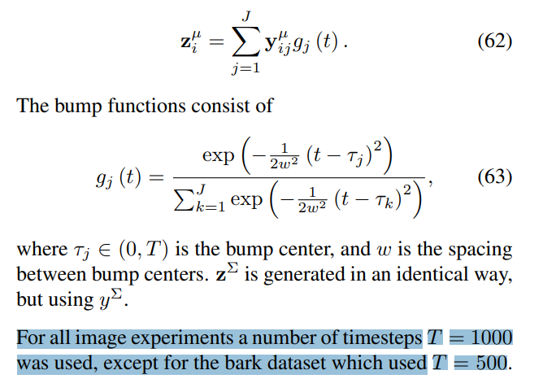
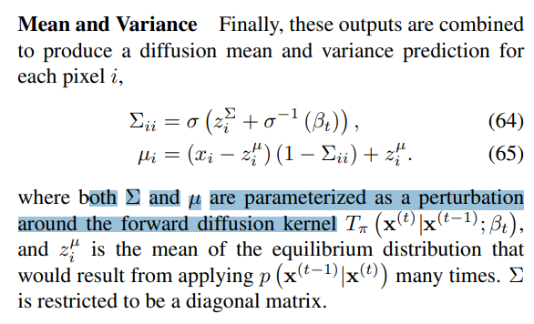
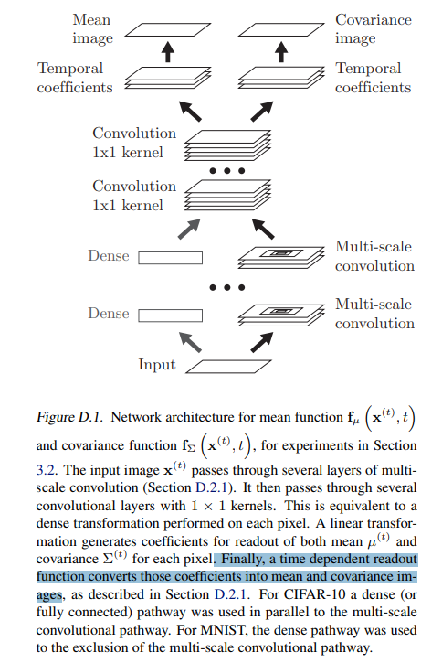
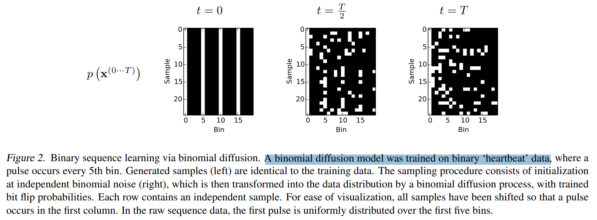
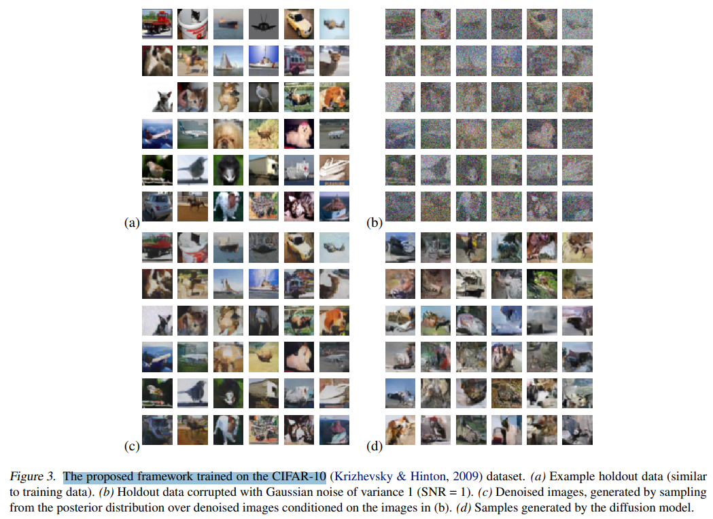
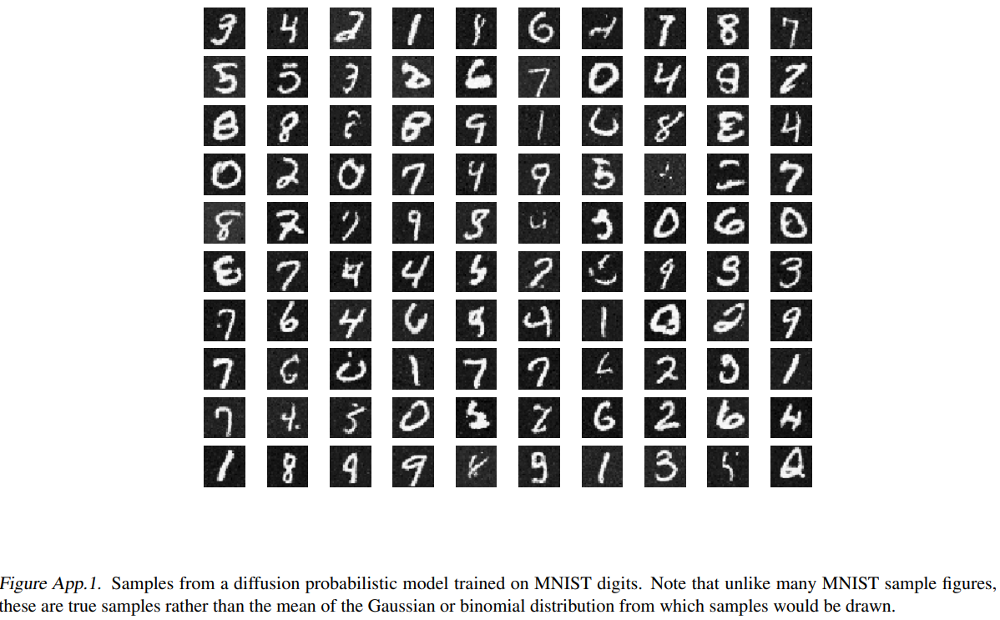
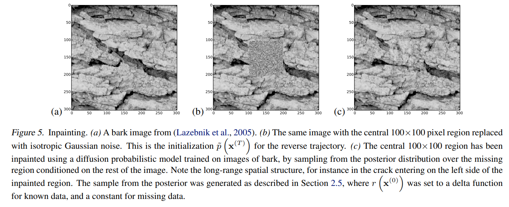

# Deep Unsupervised Learning using Nonequilibrium Thermodynamics

> "Deep Unsupervised Learning using Nonequilibrium Thermodynamics" ICML, 2015 Mar 12
> [paper](http://arxiv.org/abs/1503.03585v8) [code]() [pdf](./2015_03_ICML_Deep-Unsupervised-Learning-using-Nonequilibrium-Thermodynamics.pdf) [note](./2015_03_ICML_Deep-Unsupervised-Learning-using-Nonequilibrium-Thermodynamics_Note.md)
> Authors: Jascha Sohl-Dickstein, Eric A. Weiss, Niru Maheswaranathan, Surya Ganguli

## Key-point

- Task: Diffusion 最原始的文章！

- Problems

  ML 建模数据分布还是很难

  > A central problem in machine learning involves modeling complex data-sets using highly flexible families of probability distributions in which learning, sampling, inference, and evaluation are still analytically or computationally tractable.

- :label: Label:

## Contributions

- 受非均匀热力学启发，提出加噪去噪的方式去建模数据分布，实现更可动态可学习的分布表示

  we develop an approach that simultaneously achieves both flexibility and tractability

  > inspired by non-equilibrium statistical physics, is to systematically and slowly destroy structure in a data distribution through an iterative forward diffusion process. We then learn a reverse diffusion process that restores structure in data, yielding a highly flexible and tractable generative model of the data.

## Introduction

- Q：概率模型有 tractability (数学上易于求解) 和 flexibility（适用于各种数据） 的 trade-off

> probabilistic models suffer from a tradeoff between two conflicting objectives: tractability and flexibility. Models that are tractable can be analytically evaluated and easily fit to data (e.g. a Gaussian or Laplace). However, **these models are unable to aptly describe structure in rich datasets.**

> On the other hand, models that are flexible can be molded to fit structure in arbitrary data. For example, we can define models in terms of any (non-negative) function φ(x) yielding the flexible distribution p (x) = φ(x) Z , where Z is a normalization constant. However, **computing this normalization constant is generally intractable**

提出 Diffusion probabilistic models :star:

> Our method uses a Markov chain to gradually convert one distribution into another, an idea used in non-equilibrium statistical physics (Jarzynski, 1997) and sequential Monte Carlo (Neal, 2001).

验证能够模拟一些分布！

> We demonstrate the utility of these diffusion probabilistic models by training high log likelihood models for a twodimensional swiss roll, binary sequence, handwritten digit (MNIST), and several natural image (CIFAR-10, bark, and dead leaves) datasets.

- "Equilibrium free energy differences from nonequilibrium measurements: a master equation approach" 1997 Jul 30 
  [paper](https://arxiv.org/abs/cond-mat/9707325)

> 全是公式... :dizzy_face:

## methods

> Our goal is to define a forward (or inference) diffusion process which converts any complex data distribution into a simple, tractable, distribution, and then learn a finite-time reversal of this diffusion process which defines our generative model distribution

### Temporal Dependence

VAE 卷积输出的均值，要再**过一下 bump function 加上 T step 时间步的信息**，得到特征 z 的均值

### mean&var

### VAE 结构

>  (·)]). The composition of the **first three linear operations** resembles convolution by a multiscale convolution kernel, up to **blocking artifacts introduced by upsampling**

## setting

## Experiment

> ablation study 看那个模块有效，总结一下

- 二项式分布

- CIFAR-10 上拟合

> a 是原始数据（类似于训练数据）；
>
> b：SNR=1 加噪的数据
>
> c：去噪完得到的数据；d：Diffusion 模型采样得到的数据 （还太小看不出是个啥）:star:

- MNIST

- inpaint

## Limitations

## Summary :star2:

> learn what

### how to apply to our task

