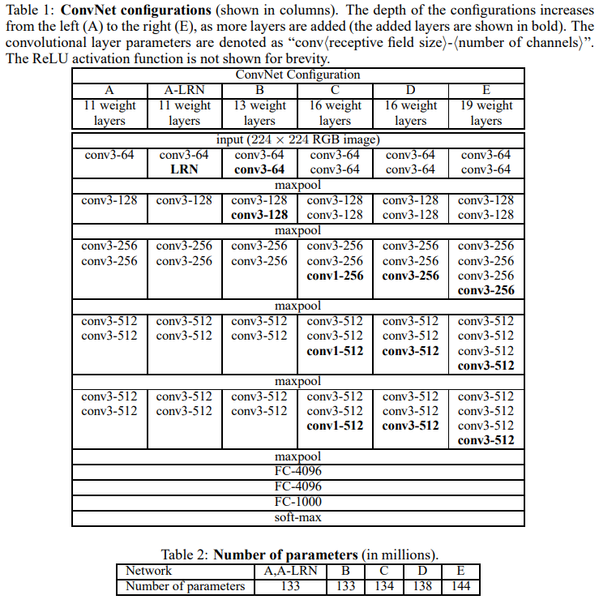
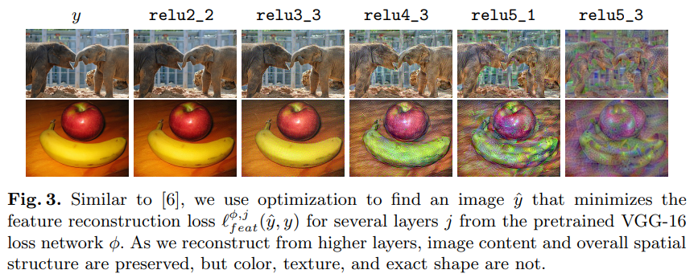

# Perceptual Losses for Real-Time Style Transfer and Super-Resolution

> "Perceptual Losses for Real-Time Style Transfer and Super-Resolution" ECCV, 2016 Mar
> [paper](https://arxiv.org/abs/1603.08155) [code](https://github.com/DmitryUlyanov/texture_nets) 
> [blog](https://iq.opengenus.org/vgg19-architecture/)
> Authors: Justin Johnson, Alexandre Alahi, Li Fei-Fei

## Key-point

- Task: 风格迁移
- Background
- :label: Label:

## Contributions

## Related Work

### **VGG network**

> "Very Deep Convolutional Networks for Large-Scale Image Recognition" ICLR, 2014 Sep
> [paper](https://arxiv.org/pdf/1409.1556.pdf)

Conv Layers: `3x3 Conv` + `2x2 MaxPooling`(不是每个 conv 后面都加) + `Relu`(All hidden layers are equipped with the rectification non-linearity 所有 conv layer 后面都加，保证非线性)

three Fully-Connected (FC) : channel 4096, 4096, 1000(看任务) 

对于 VGG19(表格中 E) 16层卷积 + 3FC，共 5 个 stage



VGG19 有 5 个 stage，每个stage 里面卷积层个数分别为 2,2,4,4,4 一共 16 层卷积


## methods

使用在 ImageNet 上训练得到的 VGG16 作为 Loss Network

### Perceptual loss

> Rather than encouraging the pixels of the output image $\hat{y} = f_W (x)$ to exactly match the pixels of the target image y, we instead **encourage them to have similar feature representations** as computed by the loss network φ
>
> Using a feature reconstruction loss for training our image transformation networks **encourages the output image $\hat{y}$ to be perceptually similar to the target image y, but does not force them to match exactly.**

**feature reconstruction loss is the (squared, normalized) Euclidean distance** 
, $\phi_j$ 为 VGG16 第 j 层的激活函数（Relu），输出特征图大小为 $\begin{aligned}C_j\times H_j\times W_j\end{aligned}$
$$
\ell_{feat}^{\phi,j}(\hat{y},y)=\frac1{C_jH_jW_j}\|\phi_j(\hat{y})-\phi_j(y)\|_2^2
$$
使用 VGG 多层的 loss 相加加权后作为整个 loss
$$
W^*=\arg\min_W\mathbf{E}_{x,\{y_i\}}\left[\sum_{i=1}\lambda_i\ell_i(f_W(x),y_i)\right]
$$


- 小结

  

  1. 提取VGG16 浅层特征，倾向于图像的细节，重建出来的图像和目标图像难以区分；
     对于修复 or 重建任务使用 VGG 浅层特征
  2. 提取深层特征倾向于高级语义信息，保留图像的内容、整体空间结构；但颜色、纹理、具体形状的细节丢失


### Style Reconstruction Loss

Gram matrix 定义
$$
G_j^\phi(x)_{c,c^{\prime}}=\frac1{C_jH_jW_j}\sum_{h=1}^{H_j}\sum_{w=1}^{W_j}\phi_j(x)_{h,w,c}\phi_j(x)_{h,w,c^{\prime}}.
$$
使用了 Gram matrix 适用不同尺寸输入，因为 Gram matrices 尺寸一样

用多层的特征的 loss 结果相加

> perform style reconstruction from a set of layers J


## Usage :star:


> - [Bring old films code](https://github.com/raywzy/Bringing-Old-Films-Back-to-Life/blob/54df59417c9c428c59d38327cc8eb424af6b4b0c/VP_code/models/loss.py#L77)  视频修复任务
>
> - [UEGAN code](https://github.com/eezkni/UEGAN/blob/2c729ee8b8daaf600aee6dc0779c14286e7fd768/losses.py#L12) 图像增强任务，调整亮度信息
>
>   使用 `relu1_1`, `relu2_1`, `relu3_1`, `relu4_1` , `relu5_1` 权值 [1.0/64, 1.0/64, 1.0/32, 1.0/32, 1.0/1]
>
>   模型输出范围 [-1,1]， 输入要做归一化 >> **perceptual loss 使用的 VGG16 在 ImageNet 上训练，先归一化 [0, 1]，在按ImageNet 均值方差标准化** :warning:

Perceptual Loss 论文中 feature reconstruction loss at layer **relu2_2** and style reconstruction loss at layers **relu1_2, relu2_2, relu3_3, and relu4_3** of the VGG-16 loss network


### torchvision VGG 实现

> `torchvision\models\vgg.py` 

```python
cfgs: Dict[str, List[Union[str, int]]] = {
    "A": [64, "M", 128, "M", 256, 256, "M", 512, 512, "M", 512, 512, "M"],
    "B": [64, 64, "M", 128, 128, "M", 256, 256, "M", 512, 512, "M", 512, 512, "M"],
    "D": [64, 64, "M", 128, 128, "M", 256, 256, 256, "M", 512, 512, 512, "M", 512, 512, 512, "M"],
    "E": [64, 64, "M", 128, 128, "M", 256, 256, 256, 256, "M", 512, 512, 512, 512, "M", 512, 512, 512, 512, "M"],
}
```

E 代表 VGG19，数字为通道数，M为 max-pooling，对应 VGG19 的结构图看。VGG19 前面卷积部分：

```python
def make_layers(cfg: List[Union[str, int]], batch_norm: bool = False) -> nn.Sequential:
    layers: List[nn.Module] = []
    in_channels = 3
    for v in cfg:
        if v == "M":
            layers += [nn.MaxPool2d(kernel_size=2, stride=2)]
        else:
            v = cast(int, v)
            conv2d = nn.Conv2d(in_channels, v, kernel_size=3, padding=1)
            if batch_norm:
                layers += [conv2d, nn.BatchNorm2d(v), nn.ReLU(inplace=True)]
            else:
                layers += [conv2d, nn.ReLU(inplace=True)]
            in_channels = v
    return nn.Sequential(*layers)
```

使用时不用 `batch_norm`，每个 Conv layer 为 `[conv2d, nn.ReLU(inplace=True)]`

> `nn.Relu(inplace=True)` inplace 作用？
> [torch doc](https://pytorch.org/docs/stable/generated/torch.nn.ReLU.html#relu)  optionally do the operation in-place. 
> [See Blog](https://blog.csdn.net/manmanking/article/details/104830822) 若 **`inplace = False` 时,不会修改输入对象的值,而是返回一个新创建的对象,**所以打印出**对象存储地址**不同；`inplace = True` 时,会修改输入对象的值,所以打印出对象存储地址相同,

VGG19 最后3层 FC

```python
Class VGG(nn.Module):
    def __init__(...):
        # ...
        self.features = features
        self.avgpool = nn.AdaptiveAvgPool2d((7, 7))
        self.classifier = nn.Sequential(
            nn.Linear(512 * 7 * 7, 4096),
            nn.ReLU(True),
            nn.Dropout(p=dropout),
            nn.Linear(4096, 4096),
            nn.ReLU(True),
            nn.Dropout(p=dropout),
            nn.Linear(4096, num_classes),
        )
        # ...
        
    def forward(self, x: torch.Tensor) -> torch.Tensor:
        x = self.features(x)
        x = self.avgpool(x)
        x = torch.flatten(x, 1)
        x = self.classifier(x)
        return x
```


### example

> old-films 里面的实现

```python
        for x in range(2):
            self.slice1.add_module(str(x), vgg_pretrained_features[x])
        for x in range(2, 7):
            self.slice2.add_module(str(x), vgg_pretrained_features[x])
        for x in range(7, 12):
            self.slice3.add_module(str(x), vgg_pretrained_features[x])
        for x in range(12, 21):
            self.slice4.add_module(str(x), vgg_pretrained_features[x])
        for x in range(21, 30):
            self.slice5.add_module(str(x), vgg_pretrained_features[x])
        if not requires_grad:
            for param in self.parameters():
                param.requires_grad = False
                
    def forward(self, X):
        h_relu1 = self.slice1(X)
        h_relu2 = self.slice2(h_relu1)
        h_relu3 = self.slice3(h_relu2)
        h_relu4 = self.slice4(h_relu3)
        h_relu5 = self.slice5(h_relu4)
        out = [h_relu1, h_relu2, h_relu3, h_relu4, h_relu5]
        return out
```

对应 `relu1_1`, `relu2_1`, `relu3_1`, `relu4_1`, `relu5_1` 的输出；权值从 `[1.0/32, 1.0/16, 1.0/8, 1.0/4, 1.0]` 改成均为 1 PSNR && 调整均值方差，提升 0.6dB


## Experiment

> ablation study 看那个模块有效，总结一下

### SISR

minimizing feature reconstruction loss at layer `relu2_2` from the VGG-16 loss network φ

- report PSNR and SSIM [54], computing both only on the Y channel after converting to the YCbCr colorspace

  PSNR, SSIM 并不符合人对图像质量的观感

  > The traditional metrics used to evaluate super-resolution are PSNR and SSIM [54], both of which have been found to correlate poorly with human assessment of visual quality

  

## Limitations

## Summary :star2:

> learn what & how to apply to our task

