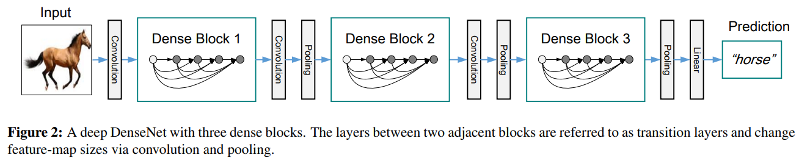

# Densely Connected Convolutional Networks

> "Densely Connected Convolutional Networks" CVPRBestPaper, 2016 Aug 25
> [paper](http://arxiv.org/abs/1608.06993v5) [code](https://github.com/liuzhuang13/DenseNet) [pdf](./2016_08_CVPRBestPaper_Densely-Connected-Convolutional-Networks.pdf) [note](./2016_08_CVPRBestPaper_Densely-Connected-Convolutional-Networks_Note.md) [blog](https://zhuanlan.zhihu.com/p/37189203)
> Authors: Gao Huang, Zhuang Liu, Laurens van der Maaten, Kilian Q. Weinberger

## Key-point

- Task
- Problems
- :label: Label:

相比ResNet，DenseNet提出了一个**更激进的密集连接机制**：即互相连接所有的层，具体来说就是每个层都会接受其前面所有层作为其额外的输入

- Q：前面 denseblock 和后面的如何连接？

在通道维度 concat 起来，导致后面的 block 输入特征通道数会随着网络加深越来越大

- Q：CNN网络一般要经过Pooling或者stride>1的Conv来降低特征图的大小，而DenseNet的密集连接方式需要特征图大小保持一致。

DenseNet网络中使用DenseBlock+Transition的结构，其中DenseBlock是包含很多层的模块，每个层的特征图大小相同，层与层之间采用密集连接方式。而Transition模块是连接两个相邻的DenseBlock，并且通过Pooling使特征图大小降低。图4给出了DenseNet的网路结构，它共包含4个DenseBlock，**各个DenseBlock之间通过Transition连接在一起**。

DenseBlock中的非线性组合函数 �(⋅) 采用的是**BN+ReLU+3x3 Conv**的结构；DenseBlock 输出特征通道数=k，这里的 **k 在`DenseNet`称为growth rate，这是一个超参数。一般情况下使用较小的 k=12 （比如12），就可以得到较佳的性能**

- Q：DenseNet 优势?

1. 由于密集连接方式，DenseNet提升了梯度的反向传播，**使得网络更容易训练**；每层可以直达最后的误差信号，实现了隐式的[“deep supervision”](https://link.zhihu.com/?target=https%3A//arxiv.org/abs/1409.5185)
2. 参数更小且计算更高效，这有点违反直觉，由于DenseNet是通过concat特征来实现短路连接，实现了特征重用，并且采用较小的growth rate，**每个层所独有的特征图是比较小的**
3. 由于特征复用，最后的分类器使用了低级特征。类似多尺度特征

## Contributions

## Introduction

## methods

## Experiment

> ablation study 看那个模块有效，总结一下

## Limitations

## Summary :star2:

> learn what & how to apply to our task

