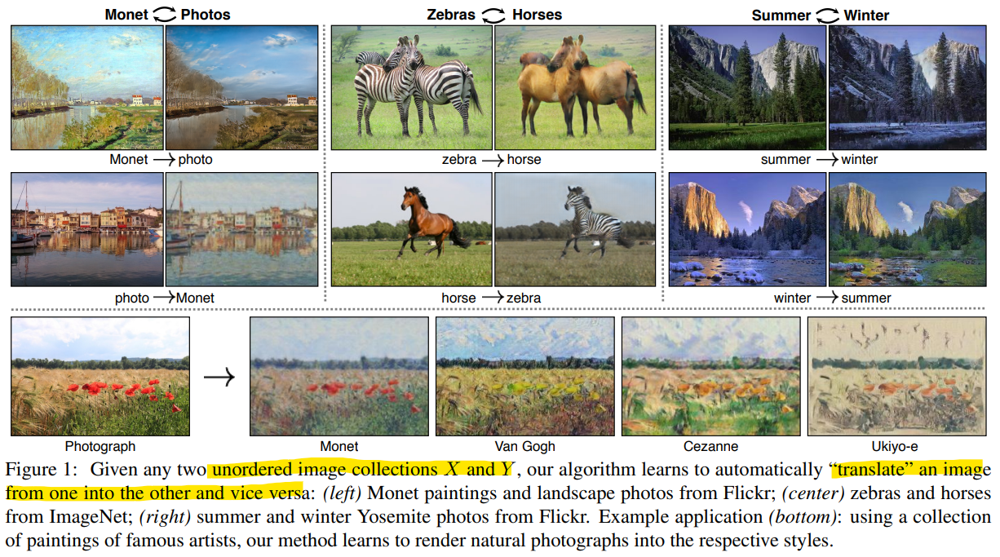
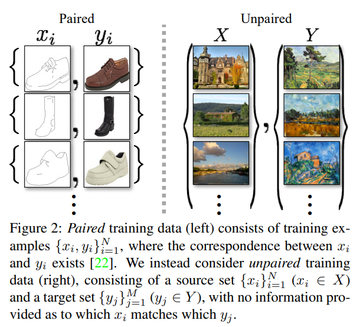
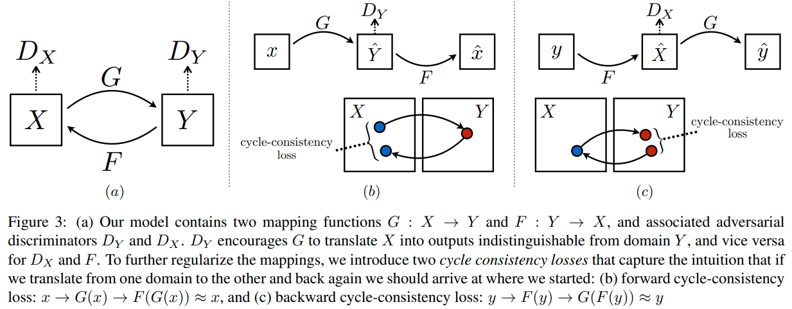
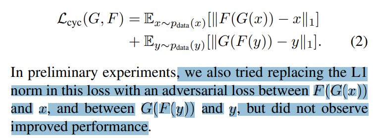
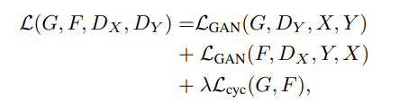
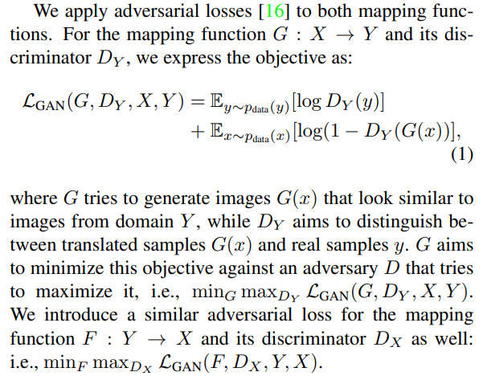
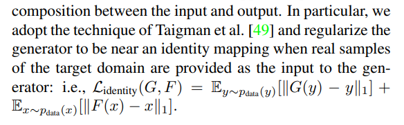
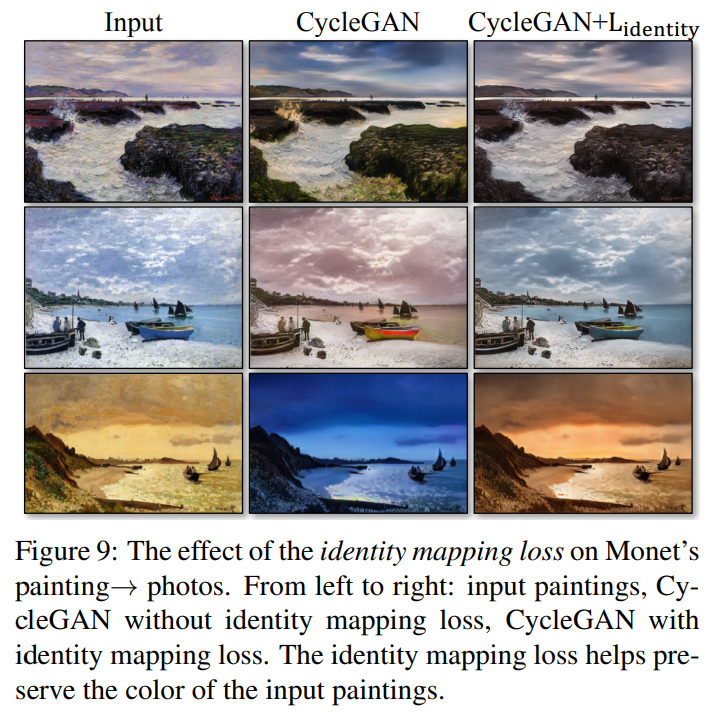

# Unpaired Image-to-Image Translation using Cycle-Consistent Adversarial Networks

> "Unpaired Image-to-Image Translation using Cycle-Consistent Adversarial Networks" ICCV, 2017 Mar 30, `CycleGAN` :star:
> [paper](http://arxiv.org/abs/1703.10593v7) [code]() [website](https://junyanz.github.io/CycleGAN/) [pdf](./2017_03_ICCV_Unpaired-Image-to-Image-Translation-using-Cycle-Consistent-Adversarial-Networks.pdf) [note](./2017_03_ICCV_Unpaired-Image-to-Image-Translation-using-Cycle-Consistent-Adversarial-Networks_Note.md) [blog](https://zhuanlan.zhihu.com/p/402819206) 
> Authors: Jun-Yan Zhu, Taesung Park, Phillip Isola, Alexei A. Efros

## Key-point

- Task: domain translation

- Problems

  Pix2Pix 配对数据很难搞，换一个应用场景就要在搞一堆配对数据太麻烦；

  风格迁移过去内容不一致；

- :label: Label:

非配对数据形式

CycleGAN 用于风格迁移，**提出了一种无监督方式，使用非配对数据进行训练的框架**；并且需要保证图像在转换风格前后，**内容仍然保持一致**

> 是一个通用无监督框架，不只是局限于图像风格迁移（真实照片 > Monet 画风），也可以是文本不同语言翻译，遥感图像转为只有主干道路的地图

- Q：如何实现无监督，框架？

两个生成器，分别实现 X 风格 -> Y 风格的转换（相反一样）

> Our model contains two mapping functions G : X → Y and F : Y → X

- Q：如何保持内容一致？

提出 **consistency-loss**，X->Y->X 再转回原始空间，保证内容一致（两个方向的 cycle 都要做）；

> To further regularize the mappings, we introduce two cycle consistency losses that capture the intuition that if we translate from one domain to the other and back again we should arrive at where we started

- Q：主要看一下提出的 Loss(决定了如何训练)

整体 loss，因为有两组（鉴别器 D & 生成器 G）有两个 GANLoss

**adversarial loss**

鉴别器 $D_Y$ 对于 y 打高分 1，对于不像 Y 中的数据打低分 0； $max_D~{ L_{GAN}}$  希望第一项 $D_Y(y)=1$，取 log 变为 0；第二项对于 $G(x)$ 生成的打低分0，第二项也要是 0；

对于生成器关注 loss 第二项（第一项与 G 无关）$\min_{G_Y}{L_{GAN}}$，希望骗过鉴别器 D，生成出来的让 $D_Y$ 也打高分 1，因此希望 $1-D_Y(G(x)) = 0$, loss 第二项再取 log 变为 $-\infin$

**Cycle Consistency Loss**

用 L1 loss 和 GAN Loss 的效果接近，GanLoss 还要训练个鉴别器模型麻烦（增加了训练的不稳定因素），还是用 L1 Loss

- Q：这个 consistency loss 训练起来真的有效吗？:star:

> [blog](https://zhuanlan.zhihu.com/p/402819206)

**会出现 cycle 回来的那一环内容没约束住（生成器 G 把 x1 错误转为 y2，但有 consistency loss 帮助下回来的那个生成器 F 把错误纠正，$x1 = F(y2~|~y2 = G(x1))$）的情况**：$(x1,y1),(x2,y2)$ 数据，训练出来 $G(x1)=x2, F(x2)=x1$ 的情况；因此还是存在风格转换，内容不一致的问题

- Q：已经是目标风格的数据，能否保持原样输出？

**添加 Identity Loss 保证统一风格下的转换仍然一致（转换为 Monet 画风的生成器，若输入已经是 Monet 画风的图，输出就不要变）** :star:

更新后的 $Loss = L_{GAN} + L_{consistency} + L_{identity}$

 **Identity Loss  的 ablation study 发现不加 Identity Loss 会有色差的问题**

- Q：训练技巧？

图片使用了**Instance Normalization**而非经典DCGAN中所使用的**Batch Normalization**

写代码时，并没有使用上面Loss中的 **log likelihood** 形式，而是使用的**least-squares loss** :star:

**学习率**在前100个epochs不变，在后面的epochs**线性衰减**

batchsize=1 一张图一张图训练

## Contributions

## Introduction

## methods

## Experiment

> ablation study 看那个模块有效，总结一下

## Limitations

## Summary :star2:

> learn what & how to apply to our task

