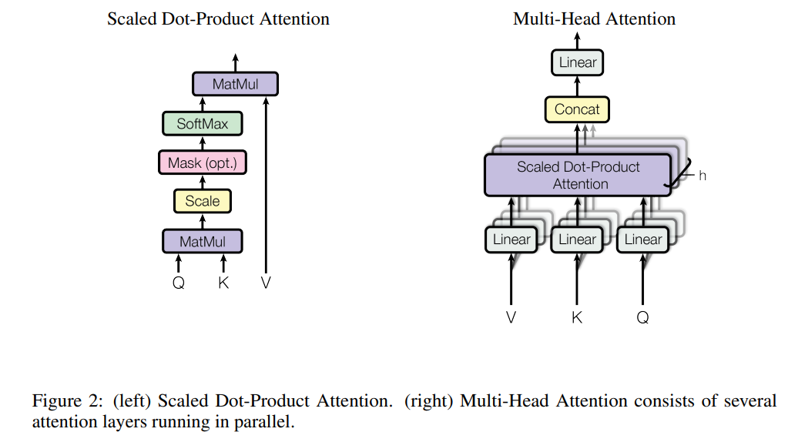
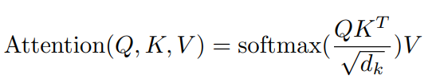
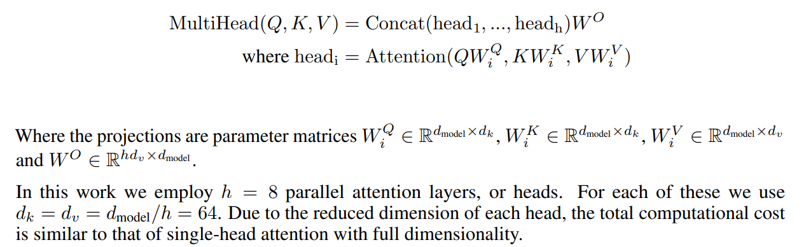
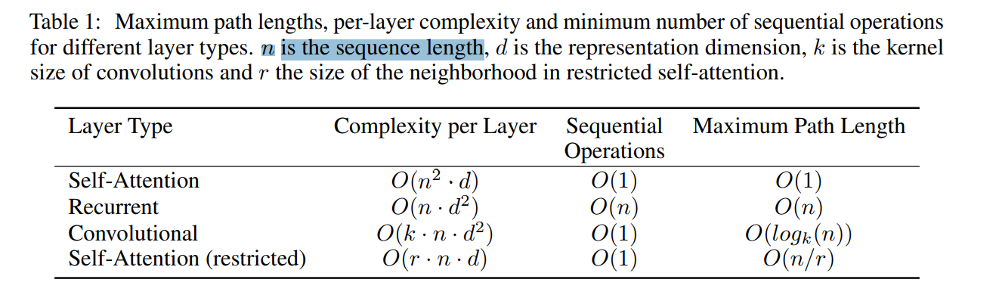
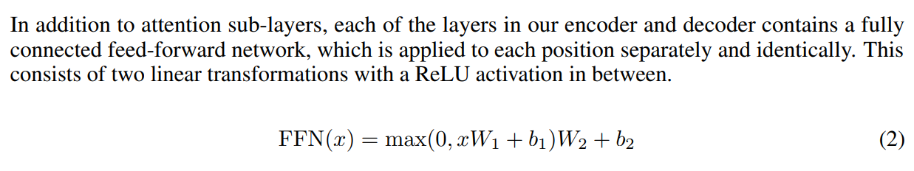
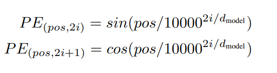

# Attention Is All You Need

> "Attention Is All You Need" NIPS, 2017 Jun 12
> [paper](http://arxiv.org/abs/1706.03762v7) [code]() [pdf](./2017_06_NIPS_Attention-Is-All-You-Need.pdf) [note](./2017_06_NIPS_Attention-Is-All-You-Need_Note.md)
> Authors: Ashish Vaswani, Noam Shazeer, Niki Parmar, Jakob Uszkoreit, Llion Jones, Aidan N. Gomez, Lukasz Kaiser, Illia Polosukhin

## Key-point

- Task
- Problems
- :label: Label:

## Contributions

## Introduction

## methods




### **Scaled Dot-Product Attention**



> The input consists of queries and **keys of dimension dk, and values of dimension dv**
>
> In practice, we compute the attention function on a set of queries simultaneously, packed together into a matrix Q. The keys and values are also packed together into matrices K and V

- Q：$\sqrt{d_k}$ 是干嘛的？

dk 为 Q,K,V 特征的通道数 or 维度 :star: ，用于做 scaling 的，不加会导致 Dot products 值很大，做完 softmax 梯度太小

> We suspect that for **large values of dk, the dot products grow large in magnitude**, pushing the softmax function into regions where it has **extremely small gradients**

- Q：why the dot products get large？:star:

$\sqrt{d_k}$ 是 QK 乘积分布的方差！如果 dk 很大，导致方差很大，**做完 SoftMax 后梯度太小了**

> assume that the components of q and k are independent random variables with mean 0 and variance 1. Then their dot product, q · k = Pdk i=1 qiki, has mean 0 and variance dk output values. These are concatenated and once again projected, resulting in the final values, as depicted in Figure 2
>
> **To counteract this effect, we scale the dot products by $\frac1{\sqrt{d_k}}$ .**


### Multi-head

- Q：什么是 Multi-head Attention?

多个 head 映射到不同子空间，获取更丰富的特征；实现看后面 code 也行，就是把 C 维度拆成 nH 个 head，分别做 attention 最后还原回去

> Multi-head attention allows the model to jointly attend to information from different representation subspaces at different positions. With a single attention head, averaging inhibits this

一般设置 head 数量=8




**复杂度**




### FFN




- Q：**Embeddings and Softmax**


- Q: position embdding?



实验发现用一个可学习的参数，效果差不多；

> We also experimented with using learned positional embeddings [9] instead, and found that the two versions produced nearly identical results (see Table 3 row (E)). We chose the sinusoidal version because it may allow the model to extrapolate to sequence lengths longer than the ones encountered during training.


### Code

以 VideoSwinTransformer 为例

> WindowAttention3D  https://github.com/LokiXun/diffusion_video_restoration_VHS/blob/E2FGVI_restore/model/video_swin_unet.py#L299

**对应公式**
$$
WindowAttention(Q,K,V)=Softmax(Dropout\big(\frac{Q}{\sqrt{d_k}} K^T +Pos + mask)\big) *V
$$

- MLP & multi-head

```python
# MLP
qkv = self.qkv(x).reshape(B_, N, 3, self.num_heads, C // self.num_heads).permute(2, 0, 3, 1, 4)
q, k, v = qkv[0], qkv[1], qkv[2]  # B_, nH, N, C
```

把 C 维度拆为 3 个  `B_, nH, N, C`； N 为 $h\times w$

- Q：什么时候分 head 再怎么还原？

一开始 MLP 把 C 维度拆为 head=8 个，直接做 $Softmax(Dropout(\frac{Q}{\sqrt{d}}*K^T + Pos+mask)  V)$ ，做完直接 `x = (attn @ v).transpose(1, 2).reshape(B_, N, C)` reshape ，把 nH, N 还原为 N


- `dk `为 `self.scale = qk_scale or head_dim ** -0.5`

```python
# dot product
q = q * self.scale
attn = q @ k.transpose(-2, -1)
```

- 相对位置编码 B

```python
relative_position_bias = self.relative_position_bias_table[
    self.relative_position_index[:N, :N].reshape(-1)].reshape(
    N, N, -1)  # Wd*Wh*Ww,Wd*Wh*Ww,nH
relative_position_bias = relative_position_bias.permute(2, 0, 1).contiguous()  # nH, Wd*Wh*Ww, Wd*Wh*Ww
attn = attn + relative_position_bias.unsqueeze(0)  # B_, nH, N, N
```

- 加 mask，Dropout

> https://github.com/LokiXun/diffusion_video_restoration_VHS/blob/768c9ff305be3eded4e1b8b5d43cc21335e0e0eb/model/video_swin_unet.py#L369C1-L377C36

- attn * V 和 FFN

```python
# self.proj = nn.Linear(dim, dim)
# self.proj_drop = nn.Dropout(proj_drop)
x = (attn @ v).transpose(1, 2).reshape(B_, N, C)
```


## setting

## Experiment

> ablation study 看那个模块有效，总结一下

## Limitations

## Summary :star2:

> learn what & how to apply to our task

$$
WindowAttention(Q,K,V)=Softmax(Dropout\big(\frac{Q}{\sqrt{d_k}} K^T +Pos + mask)\big) *V
$$

- Q：$\sqrt{d_k}$ 是干嘛的？

dk 为 Q,K,V 特征的通道数 or 维度 :star: ，用于做 scaling 的，不加会导致 Dot products 值很大，做完 softmax 梯度太小

> We suspect that for **large values of dk, the dot products grow large in magnitude**, pushing the softmax function into regions where it has **extremely small gradients**

- multi-head 就是在一开始 MLP ，把 C 拆成 `nH, C/nH`，单独做 attention；最后做完再 reshape 回去；认为对应到了子空间中的不同位置，能够得到更丰富特征

