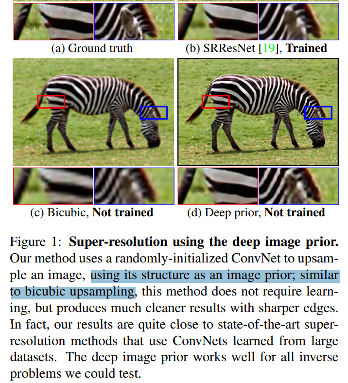
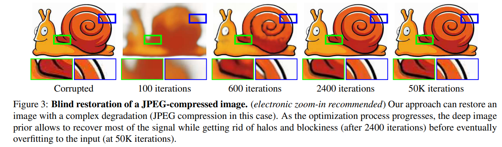
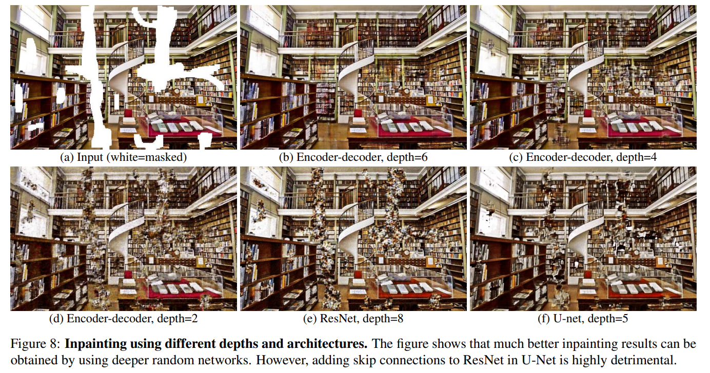
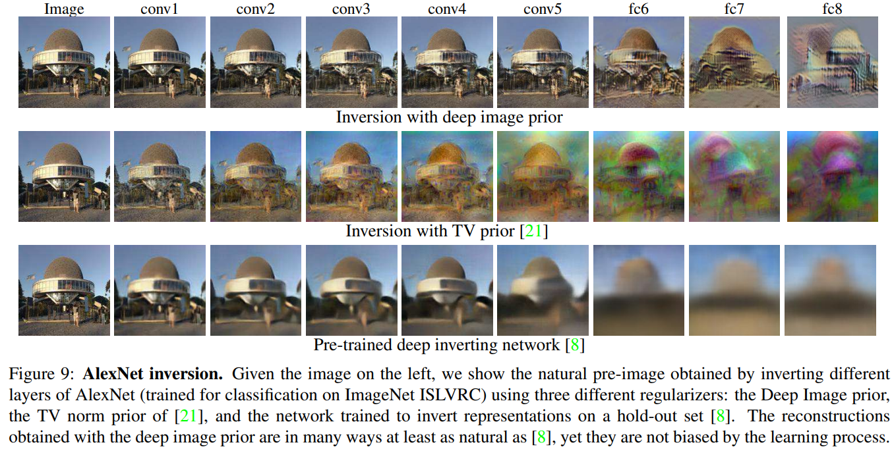

# Deep Image Prior

> "Deep Image Prior" CVPR, 2017 Nov 29, `DIP`
> [paper](http://arxiv.org/abs/1711.10925v4) [code](https://dmitryulyanov.github.io/deep_image_prior) [website](https://dmitryulyanov.github.io/deep_image_prior) [pdf](./2017_11_CVPR_Deep-Image-Prior.pdf) [note](./2017_11_CVPR_Deep-Image-Prior_Note.md) [blog](https://zhuanlan.zhihu.com/p/403585029)
> Authors: Dmitry Ulyanov, Andrea Vedaldi, Victor Lempitsky

## Key-point

- Task
- Problems
- :label: Label:

没有大量的训练数据，只用退化图像 x0 一张图，利用 **NN 迭代拟合这一张图像的过程中的先验**进行去噪；

发现只用随机初始化的 CNN 去拟合单张退化图像 x0 效果可以和先前 SOTA 类似，发现 CNN 在拟合单张图像的迭代过程中，**网络本身存在着先验**

发现了**神经网络的躁声阻抗性（high noise impedance）**

> 有人证明了神经网络可以拟合任意函数，这意味着理论上网络可以生成任何图片。但是作者要强调的是，生成不同类型的图片的难度不是在一个量级上的，作者通过实验证实，尽管神经网络确实可以拟合几乎所有的图片，但是网络能更容易，或者说更快地学习并拟合出自然的，有规律的图片；相比之下，网络学习那些带有不规则噪声，不自然的图片则会慢很多。

**神经网络天生具有对自然信号的低阻抗性和对噪声的高阻抗性**。我们可以充分利用这种差异，通过把握好迭代次数，来把退化图中不自然的分量过滤掉。这就是上文所说的神经网络自身结构带来的先验。

由于网络学信号学得快，学噪声学得慢，所以要利用这一点**控制好迭代次数**：不能太少，否则学不到位，输出结果结构模糊；也不能太多，否则学的太好，跟x0过于相似，把噪声也一起学了。看下面这个例子：

> 最左边是退化图像 x0 ，它经过JPEG有损压缩，有很多瑕疵。网络的目标是学会输出它。在100次迭代后，网络学会了输出很模糊的形体。在2400次迭代后，网络学会了输出一张良好的图片，此时网络学到了有用的信号部分，但是由于**噪声阻抗**特性，此时噪声部分还没来得及学习（此时的输出结果就是我们需要的，应该在此停止迭代）。然后在50000次迭代后，网络才学会了输出带噪声的原图（此时损失虽然最小，但不是我们想要的）。

## Contributions

## Introduction

## methods

Since no aspect of the network is pre-trained from data, such deep image prior is effectively handcrafted, just like the TV norm

## Experiment

> ablation study 看那个模块有效，总结一下

### **Inpainting using different depths and architectures**

- Q：使用的什么 CNN?

作者指出，使用层数较深的encoder-decoder架构的网络效果会更好，但是万不可添加 ResNet 或者UNet的skip connection，这些skip connection会严重破坏修复效果，具体请参看原文。

>  figure shows that much better inpainting results can be obtained by using deeper random networks. However, adding skip connections to ResNet in U-Net is highly detrimental

### **AlexNet inversion**

natural pre-image obtained by inverting different layers of AlexNet 

## Limitations

## Summary :star2:

> learn what & how to apply to our task

