# SuperPoint: Self-Supervised Interest Point Detection and Description

> "SuperPoint: Self-Supervised Interest Point Detection and Description" CVPR-workshop, 2017 Dec 20
> [paper](http://arxiv.org/abs/1712.07629v4) [code](https://github.com/magicleap/SuperPointPretrainedNetwork) [pdf](./2017_12_CVPR-workshop_SuperPoint--Self-Supervised-Interest-Point-Detection-and-Description.pdf) [note](./2017_12_CVPR-workshop_SuperPoint--Self-Supervised-Interest-Point-Detection-and-Description_Note.md)
> Authors: Daniel DeTone, Tomasz Malisiewicz, Andrew Rabinovich

## Key-point

- Task
- Problems
- :label: Label:

## Contributions

- 自监督方式，训练一个 visual descriptor

> This paper presents a self-supervised framework for training interest point detectors and descriptors suitable for a large number of multiple-view geometry problems in computer vision.

- 整图出特征

> As opposed to patch-based neural networks, our fully-convolutional model operates on full-sized images and jointly computes pixel-level interest point locations and associated descriptors in one forward pass.

- Homographic Adaptation

> We introduce Homographic Adaptation, a multi-scale, multihomography approach for boosting interest point detection repeatability and performing cross-domain adaptation (e.g., synthetic-to-real)

- 替换传统特征，system 性能更好

> The final system gives rise to state-of-the-art homography estimation results on HPatches when compared to LIFT, SIFT and ORB

## Introduction

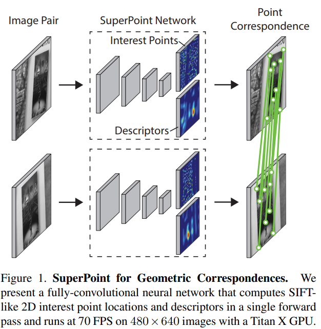

## methods

目标是训练一个能够检测 Interest Point & 能用于匹配的 **visual descriptor**，用于下游匹配任务；**自监督方式打标：**自己先打标一些 Interest Point 训练一个 Point 检测网络，用这个去自动打标数据。再去 DA 两张图，训练 visual descriptor 网络； 

Shared Encoder：VGG 结构

> Our SuperPoint architecture uses a VGG-style [27] encoder to reduce the dimensionality of the image. The encoder consists of convolutional layers, spatial downsampling via pooling and non-linear activation functions. Our encoder uses three max-pooling layers, letting us define Hc = H/8 and Wc = W/8 for an image sized H × W.

Encoder 具体 VGG 结构

> This encoder has a VGG-like [27] architecture that has eight 3x3 convolution layers sized 64-64-64-64-128-128- 128-128. Every two layers there is a 2x2 max pool layer. Each decoder head has a single 3x3 convolutional layer of 256 units followed by a 1x1 convolution layer with 65 units and 256 units for the interest point detector and descriptor respectively. All convolution layers in the network are followed by ReLU non-linear activation and BatchNorm normalization. 

SuperPoint 网络接着 MagicPoint （预测 interest Point）的网络上，接着训练

> To train the fully-convolutional SuperPoint model, we start with a base MagicPoint model trained on Synthetic Shapes. The MagicPoint architecture is the SuperPoint architecture without the descriptor head. The MagicPoint model is trained for 200,000 iterations of synthetic data

Decoder 部分：网络训练时候，加的 decoder 只有不用训练的 Upsample

> The decoder then performs bicubic interpolation of the descriptor and then L2-normalizes the activations to be unit length. This fixed, non-learned descriptor decoder is shown in Figure 3.

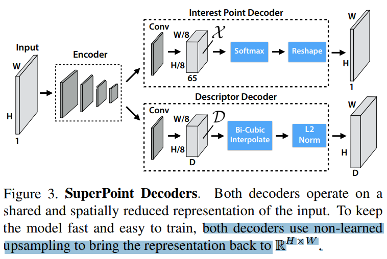

### synthetic data

Stage1&2 构造训练数据集

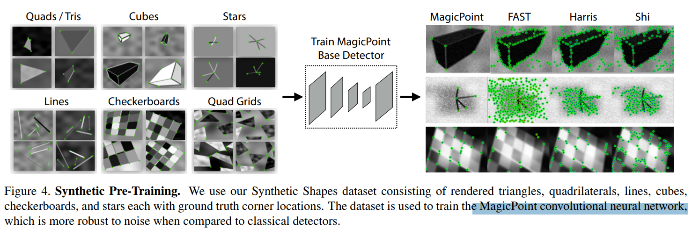

#### Homographic Adaptation

手动标注的 interest Point 对于多个视角分别提取的 interest point 一致性存在问题，因此 DA 一下图像把多个 view 的 point 合起来一个 superset

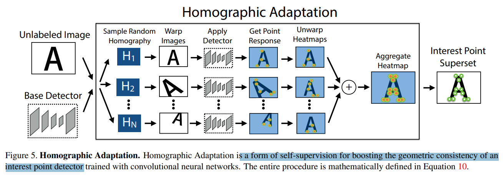

DA

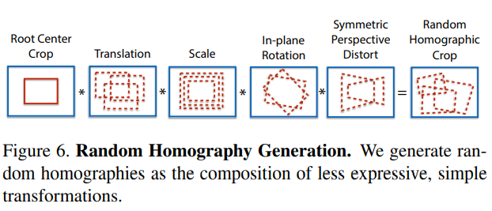

增加这个 DA，训练出来的 interest point 更准确

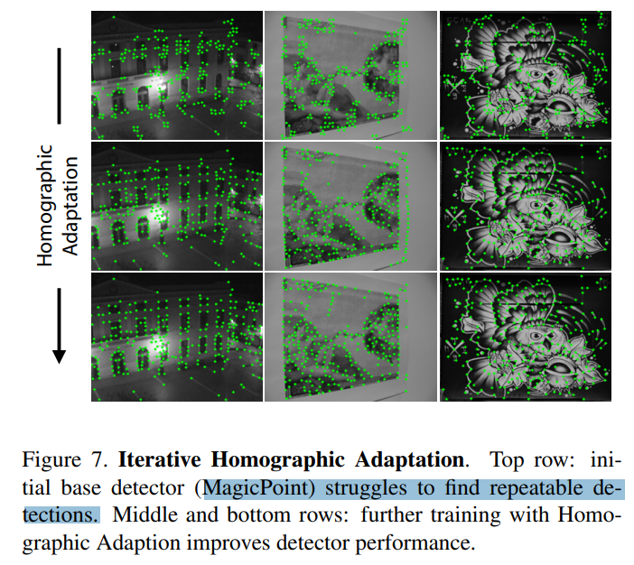

### loss

原图 + Warped 的图有 2 个 interest point loss，再加一个 descriptor loss

interest point loss 为逐点的 cross-entropy loss

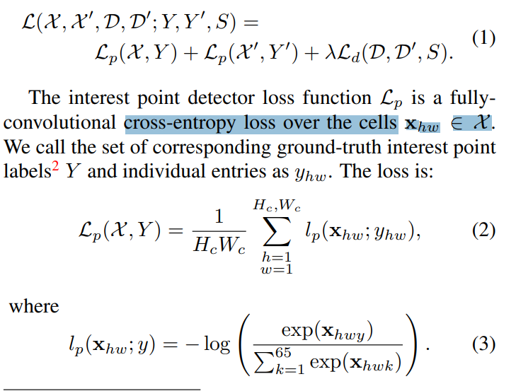

descriptor loss

训练的第两张图，是用一张图 warp 过去的（所以有一个旋转矩阵），用 S 表示匹配点。d 是网络输出的 visual descriptor

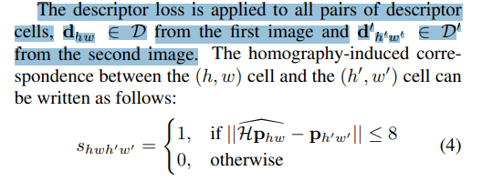

想要能匹配的点 s=1 $d^Td$  越大越好；s=0 无匹配的点 $d^Td$  越小越好

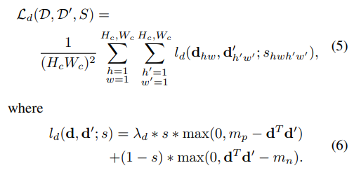

## setting

## Experiment

> ablation study 看那个模块有效，总结一下

相比 SIFT，SuperPoint 能实时 && 只用单个网络

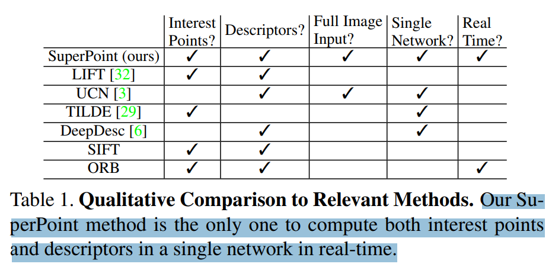

Stage1 造 interest Point 数据，准确率 mAP 还可以

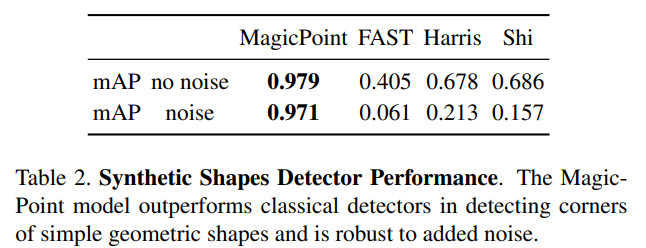

看下特征点提取的质量，**也有因为旋转在训练数据没见过，导致失效的**

> SuperPoint tends to produce more dense and correct matches compared to LIFT, SIFT and ORB

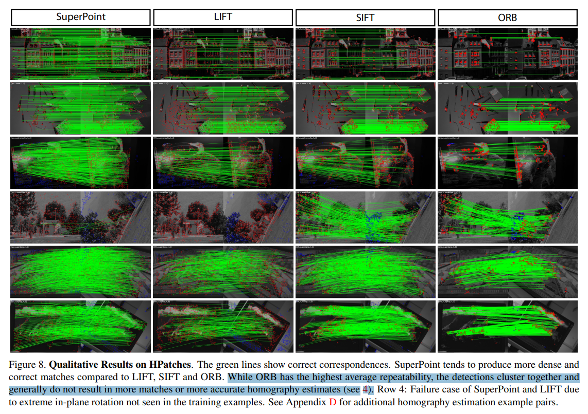

## Limitations

## Summary :star2:

> learn what

### how to apply to our task

- 相比 SIFT 能实时
