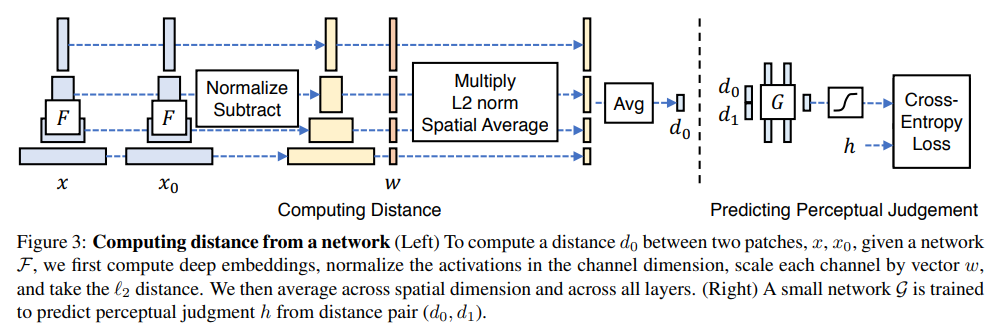

# The Unreasonable Effectiveness of Deep Features as a Perceptual Metric

> "The Unreasonable Effectiveness of Deep Features as a Perceptual Metric" CVPR, 2018 Jan 11
> [paper](http://arxiv.org/abs/1801.03924v2) [code]() [pdf](./2018_01_CVPR_The-Unreasonable-Effectiveness-of-Deep-Features-as-a-Perceptual-Metric.pdf) [note](./2018_01_CVPR_The-Unreasonable-Effectiveness-of-Deep-Features-as-a-Perceptual-Metric_Note.md)
> Authors: Richard Zhang, Phillip Isola, Alexei A. Efros, Eli Shechtman, Oliver Wang

## Key-point

- Task
- Problems
- :label: Label:

**Learned Perceptual Image Patch Similarity (LPIPS)** metric


## Contributions

## Introduction

惊奇的发现网络特征作为 IQA 指标与人类感知更加接近！


## methods



> We use publicly available networks from these and other methods, which use variants of AlexNet [28]

将图像归一化到 [-1, 1]，取指定层的特征，**计算差值的平方**；

```
    def forward(self, in0, in1, retPerLayer=False, normalize=False):
        if normalize: # turn on this flag if input is [0,1] so it can be adjusted to [-1, +1]
            in0 = 2 * in0  - 1
            in1 = 2 * in1  - 1

        # v0.0 - original release had a bug, where input was not scaled
        in0_input, in1_input = (self.scaling_layer(in0), self.scaling_layer(in1)) if self.version=='0.1' else (in0, in1)
        outs0, outs1 = self.net.forward(in0_input), self.net.forward(in1_input)
        feats0, feats1, diffs = {}, {}, {}

        for kk in range(self.L):
            feats0[kk], feats1[kk] = lpips.normalize_tensor(outs0[kk]), lpips.normalize_tensor(outs1[kk])
            diffs[kk] = (feats0[kk]-feats1[kk])**2

        if(self.lpips):
            if(self.spatial):
                res = [upsample(self.lins[kk](diffs[kk]), out_HW=in0.shape[2:]) for kk in range(self.L)]
            else:
                res = [spatial_average(self.lins[kk](diffs[kk]), keepdim=True) for kk in range(self.L)]
        else:
            if(self.spatial):
                res = [upsample(diffs[kk].sum(dim=1,keepdim=True), out_HW=in0.shape[2:]) for kk in range(self.L)]
            else:
                res = [spatial_average(diffs[kk].sum(dim=1,keepdim=True), keepdim=True) for kk in range(self.L)]

        # val = res[0]
        # for l in range(1,self.L):
        #     val += res[l]
        #     print(val)

        # a = spatial_average(self.lins[kk](diffs[kk]), keepdim=True)
        # b = torch.max(self.lins[kk](feats0[kk]**2))
        # for kk in range(self.L):
        #     a += spatial_average(self.lins[kk](diffs[kk]), keepdim=True)
        #     b = torch.max(b,torch.max(self.lins[kk](feats0[kk]**2)))
        # a = a/self.L
        # from IPython import embed
        # embed()
        # return 10*torch.log10(b/a)
        
        # if(retPerLayer):
        #     return (val, res)
        # else:
        # return torch.sum(torch.cat(res, 1), dim=(1,2,3), keepdims=False)
        return torch.cat(res, 1).sum(dim=1).sum(dim=1).sum(dim=1)
```


## setting

## Experiment

> ablation study 看那个模块有效，总结一下

## Limitations

## Summary :star2:

> learn what

### how to apply to our task

