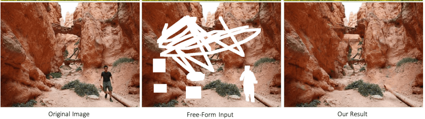
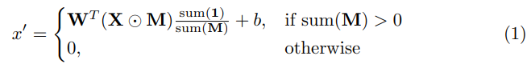
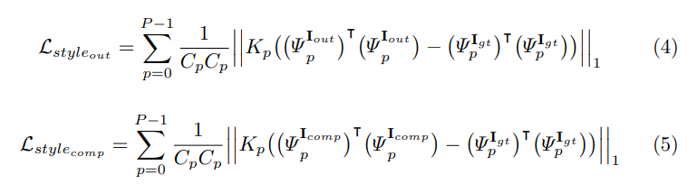
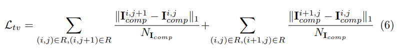
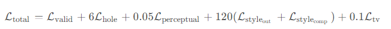
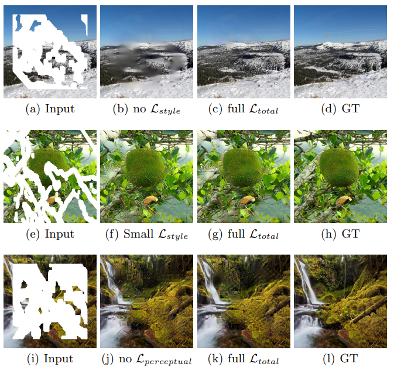
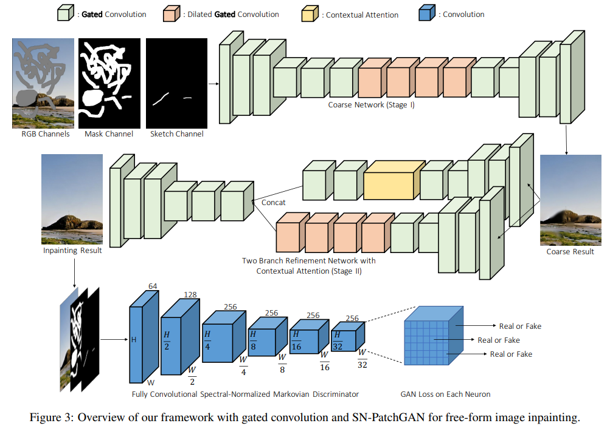
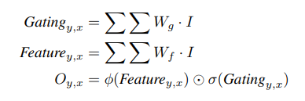
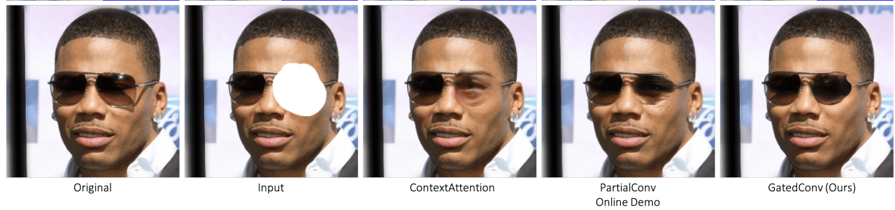

# Free-Form Image Inpainting with Gated Convolution

> "Free-Form Image Inpainting with Gated Convolution" ICCV, 2018 Jun, DeepFillv2
> [paper](http://arxiv.org/abs/1806.03589v2) [code](https://github.com/JiahuiYu/generative_inpainting) [pytorch_code](https://github.com/zhaoyuzhi/deepfillv2) [mmagic_code](https://github.com/open-mmlab/mmagic/blob/c1873ddffde7be866db4fad59daa81087e78c758/configs/_base_/models/base_deepfillv2.py)
> [pdf](./2018_06_ICCV_Free-Form-Image-Inpainting-with-Gated-Convolution.pdf)
> Authors: Jiahui Yu, Zhe Lin, Jimei Yang, Xiaohui Shen, Xin Lu, Thomas Huang

## Key-point

- Task

- Problems

  真实 inpainting 场景没有 mask 

  The proposed gated convolution solves the issue of **vanilla convolution that treats all input pixels as valid ones** 

- :label: Label:

针对 free-form mask and guidance 的 inpainting 场景，mask 形状、位置不固定。先前针对固定区域的 GAN 方法没法用

Vanilla Attention 默认对所有像素权重相同，gated convolution 实现对退化区域去动态筛选

提出 SN-PatchGAN Loss




## Contributions

1. propose gated convolution for free-form image inpainting

## Introduction

- "Image Inpainting for Irregular Holes Using Partial Convolutions"
  [paper](https://arxiv.org/abs/1804.07723) [blog](https://blog.csdn.net/qq_19784349/article/details/119893351)

  使用 Partial Convolution，之前 SOTA；可以稳健地处理任何形状、大小、位置和距离图像边界的Holes



With sufficient successive applications of the partial convolution layer, any mask will eventually be all ones. 搭多层 partial convolution，逐步去收缩 mask

> 需要预先指定 mask 区域，通过前后帧获取 ？是否需要逐步多次去做，有个初始的整体信息？

1. 平滑损失：处理结果图中，相邻像素差异

2.  style-loss

   

3. TV loss (Total Variation Loss) 作为平滑项

   

4. 总损失函数：对100张验证图像执行超参数进行搜索获得

   




## methods

> vanilla convolution 原始的卷积层

发现 Vanilla Attention 没有对划痕有特殊处理，导致 color discrepancy, blurriness and obvious edge responses

> Vanilla convolutions **apply same filters on all valid, invalid and mixed** (for example, the ones on hole boundary) pixels/features. 针对分类任务还可以




### 对比 Partial Convolution

先前 Partial convolution 通过不断调整 mask，提升不规则 mask 的 inpaint 性能。但存在问题：当前 filter 区域获取下一层的 mask 对应区域，filter 区域 valid pixel 个数=1 or 9 在下一层的 mask 均为 1；没法适应额外的输入，例如 mask区域制定了草稿，设计生成内容。

> The mask in next layer will be set to ones no matter how many pixels are covered by the filter range in previous layer (for example, 1 valid pixel and 9 valid pixels are treated as same to update current mask)


### Architecture

> [Stage1 Code](https://github.com/zhaoyuzhi/deepfillv2/blob/master/deepfillv2/network.py) 粗略参考下即可，实现和论文存在不一致
> [mmagic code](https://github.com/open-mmlab/mmagic/blob/c1873ddffde7be866db4fad59daa81087e78c758/configs/_base_/models/base_deepfillv2.py)

Stage1: 使用 Encoder-Decoder 结构，没有用 UNet 全局残差形式。因为发现全局残差对于较大 mask 情况用处不大，因为 mask 区域都是 0 提供不了颜色 or 纹理信息；

输入：将 masked 好的图像 `b 3 h w` 和 mask `b 1 h w` 在 C 维度`concat`，得到 `b 4 h w`


**Gated Convolutions**



```python
class GatedConv2d(nn.Module):
    def __init__()
        # ...
		if sn:
            self.conv2d = SpectralNorm(nn.Conv2d(in_channels, out_channels, kernel_size, stride, padding = 0, dilation = dilation))
            self.mask_conv2d = SpectralNorm(nn.Conv2d(in_channels, out_channels, kernel_size, stride, padding = 0, dilation = dilation))
        self.sigmoid = torch.nn.Sigmoid()
    
    def forward(self, x):
        x = self.pad(x)
        conv = self.conv2d(x)
        mask = self.mask_conv2d(x)
        gated_mask = self.sigmoid(mask)
        x = conv * gated_mask
        if self.norm:
            x = self.norm(x)
        if self.activation:
            x = self.activation(x)
        return x
```

mmagic 实现方式

```python
    def forward(self, x: torch.Tensor) -> torch.Tensor:
        """Forward Function.

        Args:
            x (torch.Tensor): Input tensor with shape of (n, c, h, w).

        Returns:
            torch.Tensor: Output tensor with shape of (n, c, h', w').
        """
        x = self.conv(x)
        x, gate = torch.split(x, x.size(1) // 2, dim=1)
        if self.with_feat_act:
            x = self.feat_act(x)
        if self.with_gate_act:
            gate = self.gate_act(gate)
        x = x * gate

        return x
```


`ContextualAttentionModule`

> [code](https://github.com/open-mmlab/mmagic/blob/c1873ddffde7be866db4fad59daa81087e78c758/mmagic/models/editors/deepfillv1/contextual_attention.py#L10)


**Loss Function**

使用 `hinge loss` 作为生成器 & 鉴别器的优化目标；鉴别器，认为真实输出 1，假的出 -1
$$
\text{z: degraded input; x: gt}\\
\mathcal{L}_{G}=-\mathbb{E}_{z\sim\mathbb{P}_{z}(z)}[D^{sn}(G(z))] \\
L_{D} = E[Relu(1-D(x))] + E[1+D(G(z))]
$$


## Experiment

> ablation study 看那个模块有效，总结一下

## Limitations

inpaint 区域，与其他区域的一致性还不是很好，例如另一半眼睛框失真严重，存在概率是因为**缺乏语义信息（例如眼镜框）支撑**，说明图像本身做自注意力还不足。**视频去做 deformable 当前帧与帧内做关联有意义。**



## Summary :star2:

> learn what & how to apply to our task

1. 视频去做 deformable 当前帧在帧内做关联有意义。

   语义信息通过前后帧补出来
