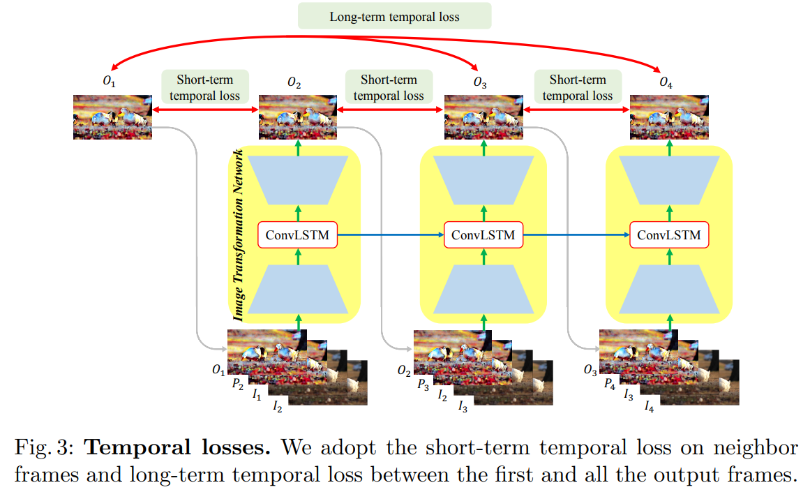
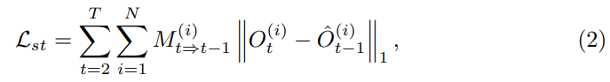
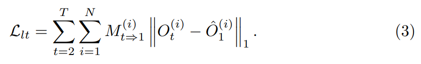

# Learning Blind Video Temporal Consistency

> "Learning Blind Video Temporal Consistency" ECCV, 2018 Aug 1
> [paper](http://arxiv.org/abs/1808.00449v1) [code](https://github.com/phoenix104104/fast_blind_video_consistency) [pdf](./2018_08_ECCV_Learning-Blind-Video-Temporal-Consistency.pdf) [note](./2018_08_ECCV_Learning-Blind-Video-Temporal-Consistency_Note.md)
> Authors: Wei-Sheng Lai, Jia-Bin Huang, Oliver Wang, Eli Shechtman, Ersin Yumer, Ming-Hsuan Yang

## Key-point

- Task
- Problems
- :label: Label:

## Contributions

## Introduction

## methods

### warping error

> https://github.com/phoenix104104/fast_blind_video_consistency/blob/master/evaluate_WarpError.py
>
> 1. To compute the temporal warping error, we first need to **generate optical flow and occlusion masks:** 保存 flow & mask 到本地
> 2. `python evaluate_WarpError.py -method output/MODEL_NAME/epoch_N -task WCT/wave` 每次取读

#### Short-term temporal loss

连续帧

> We formulate the temporal loss as the warping error between the output frames:
>
> where Oˆ t−1 is the frame Ot−1 warped by the optical flow Ft⇒t−1, and Mt⇒t−1 = exp(−αkIt − ˆIt−1k 2 2 ) is the visibility mask calculated from the warping error between input frames It and warped input frame ˆIt−1.

#### Long-term temporal loss.

跨越 5 帧的情况，为了减少计算量，将后面每一帧和**生成的首帧**计算 warp error

> While the short-term temporal loss (2) enforces the temporal consistency between consecutive frames, there is no guarantee for long-term (e.g., more than 5 frames) coherence. 

## setting

## Experiment

> ablation study 看那个模块有效，总结一下

## Limitations

## Summary :star2:

> learn what

### how to apply to our task

