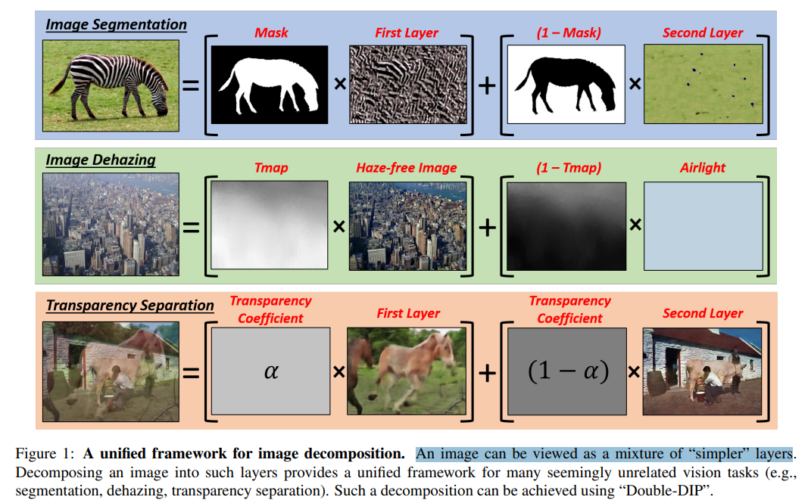
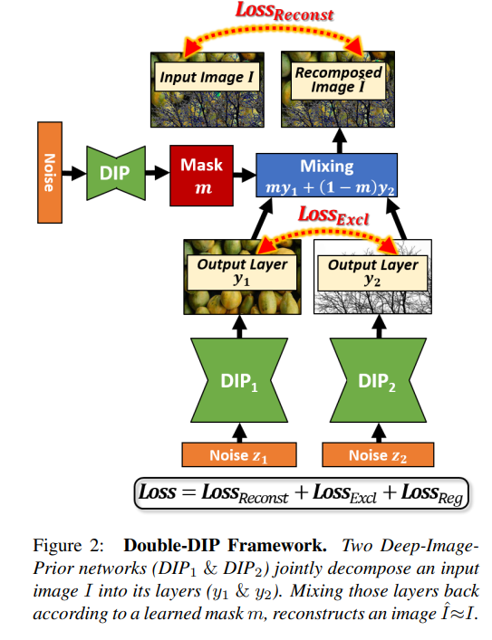
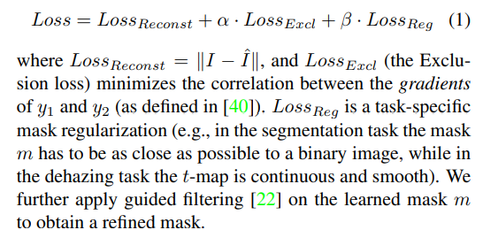
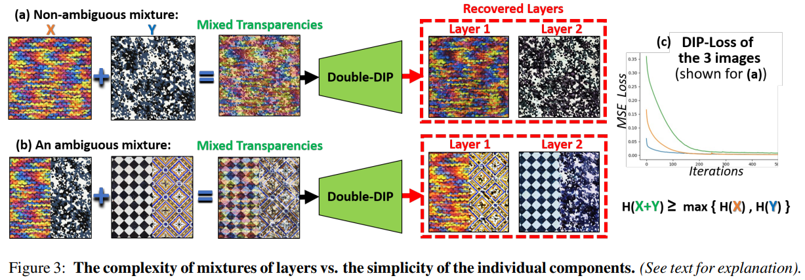
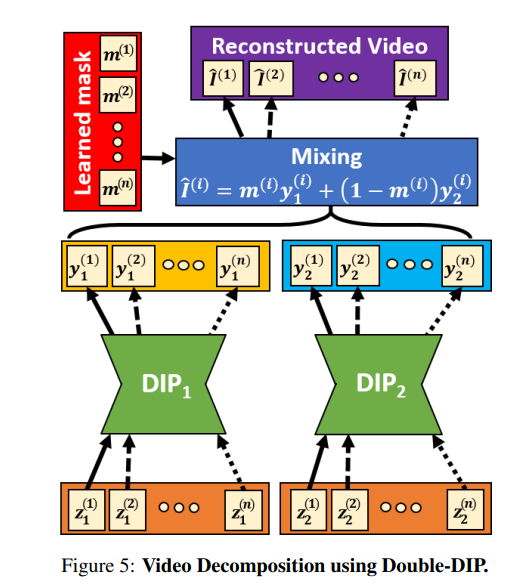

# "Double-DIP": Unsupervised Image Decomposition via Coupled Deep-Image-Priors

> ""Double-DIP": Unsupervised Image Decomposition via Coupled Deep-Image-Priors" CVPR, 2018 Dec 2, `Double-DIP`
> [paper](http://arxiv.org/abs/1812.00467v2) [code](https://github.com/yossigandelsman/DoubleDIP) [website](https://www.wisdom.weizmann.ac.il/~vision/DoubleDIP/) [pdf](./2018_12_CVPR_-Double-DIP---Unsupervised-Image-Decomposition-via-Coupled-Deep-Image-Priors.pdf) [note](./2018_12_CVPR_-Double-DIP---Unsupervised-Image-Decomposition-via-Coupled-Deep-Image-Priors_Note.md) [blog](https://blog.csdn.net/matrix_space/article/details/105322294)
> Authors: Yossi Gandelsman, Assaf Shocher, Michal Irani

## Key-point

- Task
- Problems
- :label: Label:

- Q：**Motivation**？

DIP 中提出用 **NN 本身在训练过程中的先验信息，只去拟合单张低质图像就可以做图像恢复任务**，这个方法可以应用到超分，inpainting 各种任务上；

DoubleDIP 把各种 low-level 任务看作**图层分解任务**，**将图像看作多层 layer 的叠加，每一个图层取用 DIP 方式学习**。可以用于很多下游任务，例如去雾任务分解为一张清晰和雾气图；将视频转场效果分解，视频分割

> An image can be viewed as a mixture of “simpler” layers

- Q：图像分层 framework？

DoubleDIP 基于图像分层的 idea，每一个图层用 DIP 方法（一个 CNN）去拟合；各个图层的混合混合系数 a 也用一个 DIP 去学习

每个图层的训练的 DIP，输入随机噪声;

- Q：loss？

作者提出**假设**混合图层后的图像 z 是可以线性分解为 x,y 的（**模型分解完能够重建回去**）；同时**单个图层内部 similarity 尽可能高，不同图层 similarity 尽可能低**

- Q：**Exclusion Loss**？

- Q：为什么这个框架去学习图层分解可以有效？

**发现**

**混合 layer 图像的 empirical entropy 熵（即不确定程度）比单个 layer 的不确定程度要高**，通过下图 figure3 c) NN 的拟合曲线可以看出，确实混合 layer 的 图像更难拟合

> **Small image patches (e.g., 5x5, 7x7) have been shown to repeat abundantly inside a single natural image** [19, 41].
>
> It was also shown that the empirical entropy of patches inside a single image is much smaller than the entropy in a collection of images
>
> **larger entropy; smaller internal self-similarity**

图层 X, Y 为两个独立变量的话，X+Y 的熵要比 X, Y 任意一个都大；同时 **layer X, Y 的相似度不是很高**

>  The internal self-similarity of patches inside a single natural image tends to be much stronger than the patch similarity across different images

figure a)b) 可视化 layer 叠加方式难易程度；

- Q：图层个数怎么确定，不一定简单地是2个图层？有没有可能本来就是一个图层，强行分为 2 层？

- Q: 如何用于视频？

- Q:training details?

The optimization process is done using ADAM optimizer [25], and takes a few minutes per image on Tesla V100 GPU.

## Contributions

## Introduction

## methods

## Experiment

> ablation study 看那个模块有效，总结一下

## Limitations

## Summary :star2:

> learn what & how to apply to our task

