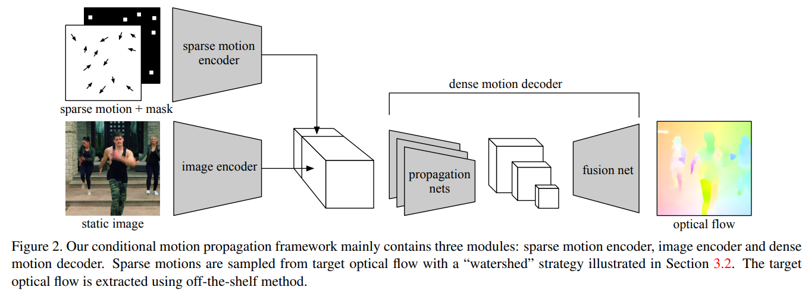
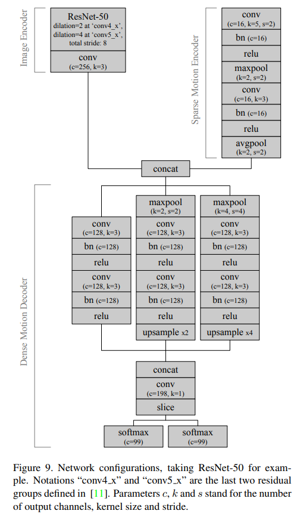
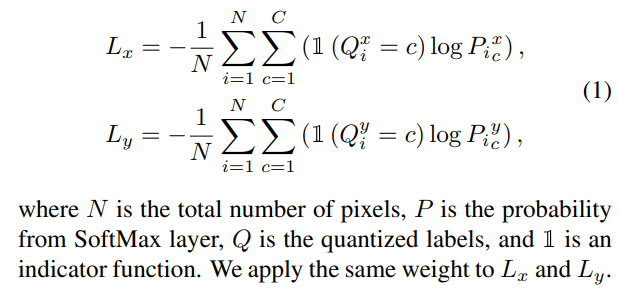
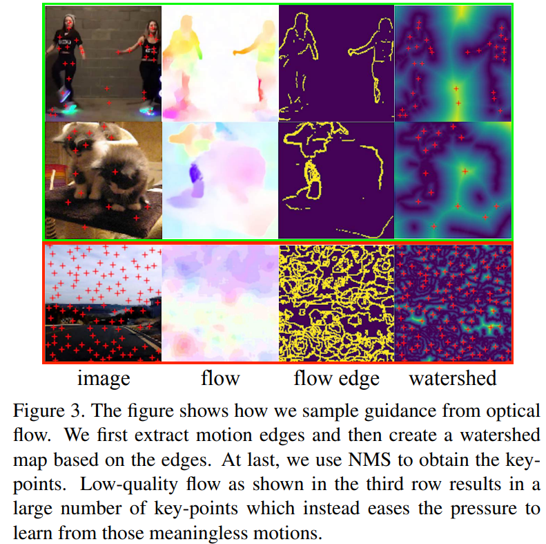

# Self-Supervised Learning via Conditional Motion Propagation

> "Self-Supervised Learning via Conditional Motion Propagation" CVPR, 2019 Mar 27, `CMP`
> [paper](http://arxiv.org/abs/1903.11412v3) [code](https://github.com/XiaohangZhan/conditional-motion-propagation/) [web](http://mmlab.ie.cuhk.edu.hk/projects/CMP/) [pdf](./2019_03_CVPR_Self-Supervised-Learning-via-Conditional-Motion-Propagation.pdf) [note](./2019_03_CVPR_Self-Supervised-Learning-via-Conditional-Motion-Propagation_Note.md)
> Authors: Xiaohang Zhan, Xingang Pan, Ziwei Liu, Dahua Lin, Chen Change Loy

## Key-point

- Task: 

- Problems

  - 运动信息不准（光流不准）导致训练效率很低，预训练模型提取的光流不准; OR 人为指定的运动，条件太强泛化太烂

    > motion is both ambiguous and complex, rendering previous works either suffer from degraded learning efficacy.
    >
    > or resort to strong assumptions on object motions

- :label: Label:

既然预训练的光流不准，就用 sparse motion 信息作为条件再去修正一下；

提出**Conditional Motion Propagation (CMP)**

> design the pretext task as a conditional motion propagation problem
>
> Given an input image and several sparse flow guidance vectors on it, our framework seeks to recover the full-image motion.

1. 基于 sparse 的去预测光流，能够**避免（人为画轨迹 or 预训练模型预测 ...）拿到的 dense 光流中的误差**
2. **扩展性更强，能支持更多运动信息** :star:

## Contributions

## Introduction

- Q: what is optical flow?

> https://www.cs.princeton.edu/courses/archive/fall19/cos429/slides/cos429_fall2019_lecture13_flow.pdf

- Q：Middlebury color wheel？

作者将先前预测运动信息的方法分为 2 类，小结是**运动信息 ambiguous & 复杂**

> previous works have leveraged the motion cues from two directions

- predicting motion from static images

  不准

> motion is inherently ambiguous, direct modeling of future motion creates large learning burden and sometimes results in unstable training

- 基于物体和运动去预测，但假设太强，要求同一物体的 motion 是相似的

  手部**各个关节活动度很大**，各个手指 motion 可能是差异很大的

> most of the objects are intrinsically with high degrees of freedom

## methods

- AlexNet or ResNet-50
-  Conv-BN-ReLU-Pooling

光流图 C=2, mask C=1

### LossFunc

> Fortunately, CMP does not need the output flow to be absolutely accurate. Hence, we quantize the target flow and formulate it as a classification task

### Guidance Selection

**Sampling from Watershed**

- 对光流图计算边缘

  > given the optical flow of an image, we first extract **motion edges** using a Sobel filter

- 每一个像素点计算到边缘的距离，得到一张 `watershed map`

  > Then we assign each pixel a value to be the distance to its nearest edge, resulting in the **topological-distance watershed map**.

- 按 NMS 筛选, kernel size K 越大，得到的采样点越稀疏

  > apply Non-maximum Suppression (NMS) [5] with kernel size K on the watershed map to obtain the key-points.
  >
  > A larger K results in sparser samples

- 增加一些 grid points 学习背景的运动信息，相机自身的运动

  > Since background motion actually reflects camera ego-motion, to avoid ambiguity in learning, we also add several grid points in each image.

论文经验是 384^2 图像上 stride=29 pixel

> average 13.5 sampled guidance points in a 384 × 384 image

**Outlier Handling**

发现光流图的边缘有一些异常边缘，提取的点为离群点；

认为没关系，easy case 能够增加鲁棒性

> disordered flow edges create disconnected watersheds,

## setting

- 对光流预测网络要求不高，选了一个推理快的

  LiteFlowNet [12], an extremely fast optical flow estimation tool to compute optical flows

4 个训练集，从视频里面抽帧，每两帧作为一个 pair，**计算 image-flow pair**

- YFCC100m contains about 700k in-the-wild videos 》》sampled, contains 1.6M images

  **组成 1.26M image-flow pair**

- YouTube9K

- we set the NMS kernel K=81, grid stride G=200

## Experiment

> ablation study 看那个模块有效，总结一下

- Rigidity-aware. Given a single guidance vector on a rigid part, e.g., head, forearm, or thigh, CMP propagates motion on the whole part.

  能学习到头是一个整体

- Kinematically-coherent. Given a guidance vector on a part, CMP is capable of inferring whether the part should be shifting or rotating. 

### Guided Video Generation

基于第一帧 warp 到后面一帧

we first use a CMP model to predict the optical flow and then warp the original image to produce the future frame.

## Limitations

## Summary :star2:

> learn what & how to apply to our task

