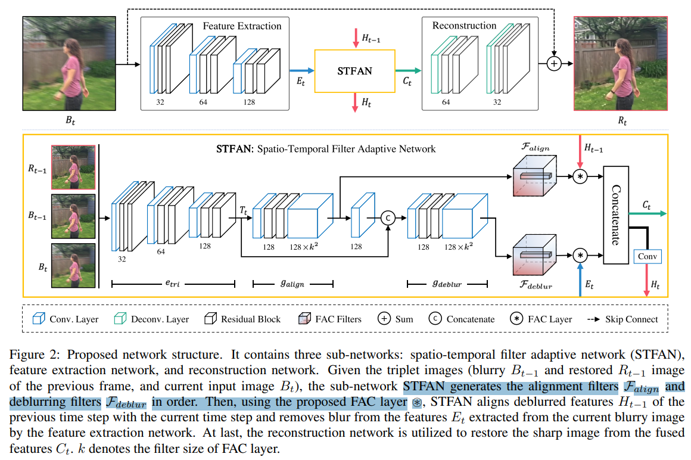
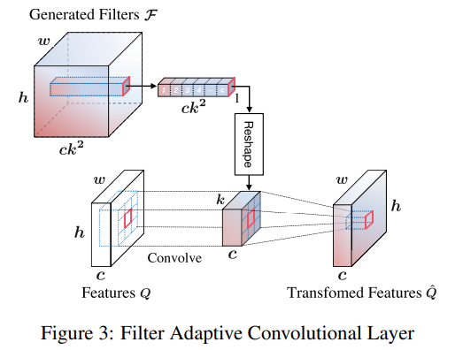

# Spatio-Temporal Filter Adaptive Network for Video Deblurring

> "Spatio-Temporal Filter Adaptive Network for Video Deblurring" ICCV, 2019 Apr 28
> [paper](http://arxiv.org/abs/1904.12257v2) [code]() [pdf](./2019_04_ICCV_Spatio-Temporal-Filter-Adaptive-Network-for-Video-Deblurring.pdf) [note](./2019_04_ICCV_Spatio-Temporal-Filter-Adaptive-Network-for-Video-Deblurring_Note.md)
> Authors: Shangchen Zhou, Jiawei Zhang, Jinshan Pan, Haozhe Xie, Wangmeng Zuo, Jimmy Ren

## Key-point

- Task
- Problems
- :label: Label:

## Contributions

## Introduction

## methods

根据退化去**学习一个 filter**，再用提出的 FAC layer 和特征作用起来；**可以近似理解成学习一个卷积核**

## setting

## Experiment

> ablation study 看那个模块有效，总结一下

## Limitations

## Summary :star2:

> learn what

### how to apply to our task

