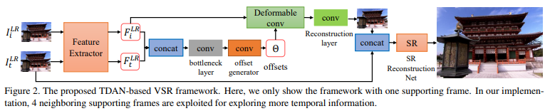
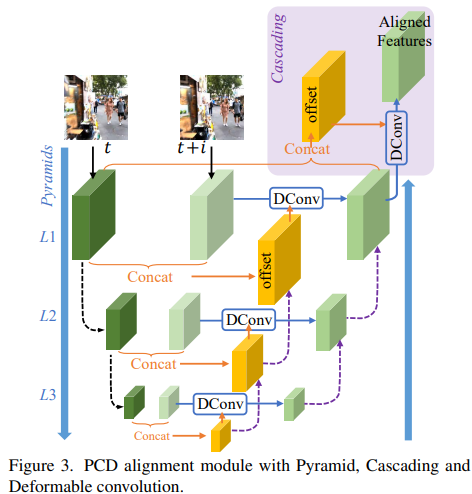
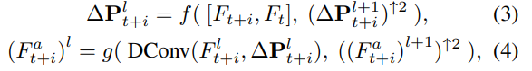
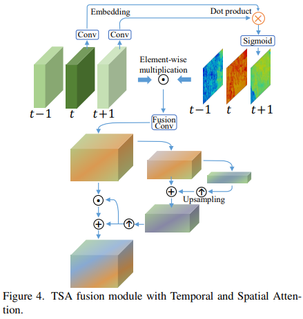
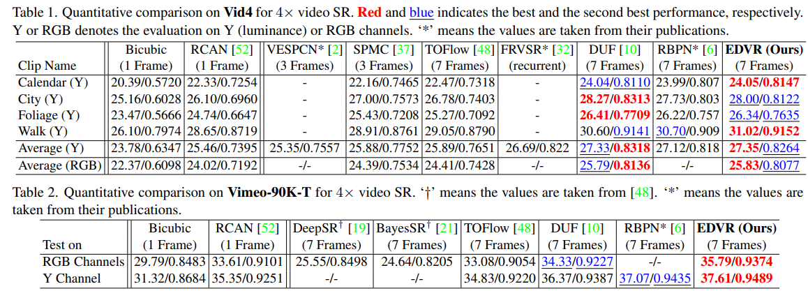
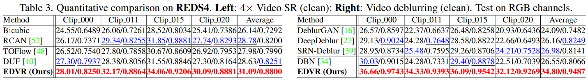
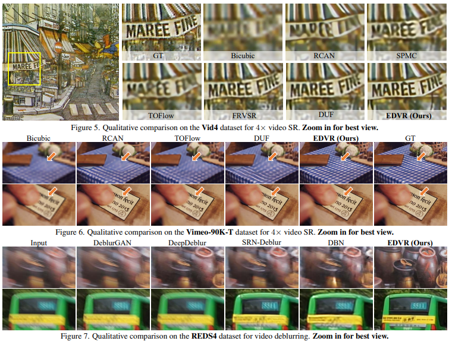
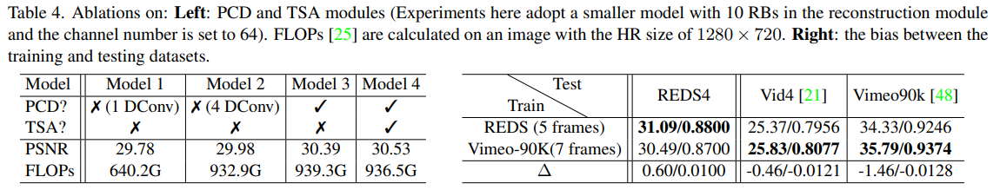
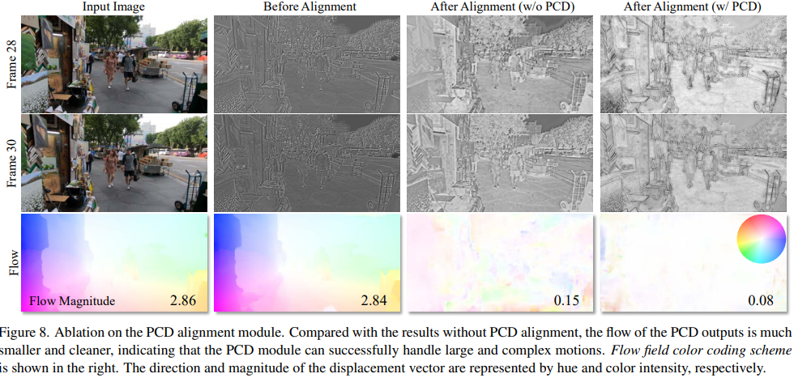
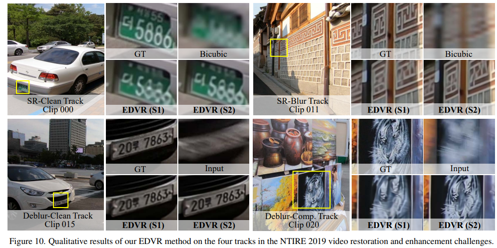

# EDVR: Video Restoration with Enhanced Deformable Convolutional Networks

> "EDVR: Video Restoration with Enhanced Deformable Convolutional Networks" CVPR NTIRE 1st, 2019 May
> [paper](http://arxiv.org/abs/1905.02716v1) [code](https://github.com/xinntao/EDVR) [pdf](./2019_05_CVPR-NTIRE_EDVR--Video-Restoration-with-Enhanced-Deformable-Convolutional-Networks.pdf) [note](./2019_05_CVPR-NTIRE_EDVR--Video-Restoration-with-Enhanced-Deformable-Convolutional-Networks_Note.md)
> Authors: Xintao Wang, Kelvin C. K. Chan, Ke Yu, Chao Dong, Chen Change Loy

## Key-point

- Task: Video restoration, 可处理 VSR, Deblurring

- Problems

  different frames and locations are not equally informative or beneficial to the reconstruction, as some frames or regions are affected by imperfect alignment and blurring.

- :label: Label:

NTIRE 比赛，REDS 数据集，挑战在于：如何对运动较大的视频对齐各帧、融合多帧；
videos in REDS contain larger and more complex motions


## Contributions

1. propose a unified framework, called EDVR 可用于 SR，去模糊等多个任务
2. Pyramid, Cascading and **Deformable (PCD) alignment module**
3. a **Temporal and Spatial Attention (TSA) fusion** module
4. 使用 a two-stage strategy to further boost the performance 进一步提升性能（比赛）
5. SOTA in VSR, deblurring


## Introduction

elaborated pipelines that typically consist of four components, namely feature extraction, alignment, fusion, and reconstruction

- PCD 参考 TDAN 方法，在多个尺度进行融合

  "TDAN: Temporally deformable alignment network for video super-resolution"
  [paper](https://arxiv.org/abs/1812.02898)

  

  "Deformable convnets v2: More deformable, better results"

- TSA is a fusion module that helps aggregate information across multiple aligned features
  The correlation coefficients then weigh each neighboring feature at each location, indicating how informative it is for reconstructing the reference image.


## methods


- PreDeblur

- 给定 $2N + 1$ 张图像，第 t 张作为 referene（目标要修复的帧），前和后的 2N 张图像用 PCD 模块 align 到第 t 帧

  > Each neighboring frame is aligned to the reference one by the PCD alignment module at the feature level

- 加入残差跳连


### PCD

- Motivation

  To address complex motions and large parallax problems in alignment，参考光流方法中的 pyramidal processing & cascading refinement

  > "Optical flow estimation using a spatial pyramid network"
  > "Liteflownet: A lightweight convolutional neural network for optical flow estimation"



1. 多尺度特征 use **strided convolution** filters to downsample the features at the (l−1)-th pyramid level by a factor of 2
2. 当前 $i$ 层计算的 DConv 结果与，$i+1$ 层DConv 结果（尺度不一样， upscaling by a factor s 用 bilinear），通过 g（多层卷积）实现融合
3. 使用 L=3 层 & 为了减少计算量，do not increase channel numbers as spatial sizes decrease




### Temporal and Spatial Attention



- Motivation

  different neighboring frames are not equally informative due to occlusion

  misalignment and unalignment

Temporal Attn: 计算特征相似度，使用卷积获取特征，相乘过 sigmoid
$$
h(F_{t+i}^a,F_t^a)=\text{sigmoid}(\theta(F_{t+i}^a)^T\phi(F_t^a)),\quad\text{(5)}
$$
这个相似度图 h 理解为 mask，对 align 的特征进一步调制 :question:


Spatial attention masks are then computed from the fused features.

> "Recovering Realistic Texture in Image Super-resolution by Deep Spatial Feature Transform" CVPR, 2018 Apr
> [paper](https://arxiv.org/abs/1804.02815)


### 2 stage

- Motivation
  it is observed that the restored images are 4 not perfect, especially when the input frames are **blurry or severely distorted.**
  指标好，但出图很糊

Intuitively, coarsely restored frames would greatly mitigates the pressure for alignment and fusion >> a similar but shallower EDVR network is cascaded to refine the output frames of the first stage

用一个类似 EDVR 的简单网络对输入图像预处理一下，多处理几次


## Experiment

> ablation study 看那个模块有效，总结一下

- Settings

  The PCD alignment module adopts five residual blocks (RB) to perform feature extraction. We use 40 RBs in the reconstruction module and 20 RBs

  -  Charbonnier penalty Loss

  - Adam 0.9, 0.999； LR=$4 \times 10^{-4}$

  - Data

    1. REDS [26] is a newly proposed high-quality (720p),  240 training clips, 30 validation clips and 30 testing clips (each with 100 consecutive frames); REDS4 为比赛的 test set
    2. Vimeo-90K 训练 & Vid4 [21] and Vimeo-90K testing>> **observe dataset bias**

    RGB **patches of size 64×64 and 256×256** as inputs for video SR and deblurring tasks;

    **five consecutive frames (i.e., N=2)** as inputs unless otherwise specified;

    DA:  augment the training data with random horizontal flips and 90◦ rotations

    > EDVR 使用的退化类型很少

    In the evaluation, we include all the input frames and do not crop any border pixels


**Vid4, Vimeo 上 x4 SR 效果**

相比 YUV 的 Y 通道灰度图，RGB 平均测得的 PSNR 会更低




**REDS 测试集上效果**

发现在 deblurring 比先前方法 PSNR 提升 6db，**总结为REDS 数据好** challenging REDS dataset that contains complex blurring




**主观效果**

*缺少语义信息指导，像文字这种人基本上能看出来了，但修复出来很模糊*




### Ablation

> [EDVR alignment 特征图提取方法](https://github.com/xinntao/EDVR/issues/168)

PCD 有效，提升 0.5db；但 TSA 用处不明显



**发现 Vimeo90K 数据集 bias 很大**


PCD 用于帧间对齐，通过可视化对齐前后，**不同帧特征的光流幅值**，看对齐模块的有效性；
PCD 对齐后的特征，再去计算帧间的光流（差异），光流幅值小了一些。

> the flow of the PCD outputs is much smaller and cleaner, indicating that the PCD module can successfully handle large and complex motions.




验证 2 stage 效果，**预处理一下确实有效，清晰不少**




## Code

> [mmagic doc](https://github.com/open-mmlab/mmagic/blob/main/configs/edvr/README.md)

`python tools/train.py configs/edvr/edvrl_c128b40_8xb8-lr2e-4-600k_reds4.py` >> PSNR 最高的版本;
`mmagic/models/editors/edvr/edvr_net.py`


一次前向只处理 5 帧；先将 RGB 通过（1个3x3卷积 & LeakyReLU）映射到 ch=128 的同尺寸特征；**再通过 5 个 ResBlock 提取初始特征 L1** (每个 ResBlock 2层3x3Conv + RELU)；

多尺度（3层）：Conv(3x3 stride=2 来downsample) +  RELU + Conv(3x3 stride=1) + RELU 提取 L2 特征，channel=128 不变；L3 特征基于L2同样处理

> b,t,c,h,w 把 b,t 合并分别用 Conv2d 单独处理


**PCDAlignment**

> [code](https://github.com/open-mmlab/mmagic/blob/c1873ddffde7be866db4fad59daa81087e78c758/mmagic/models/editors/edvr/edvr_net.py#L235)

其余帧，逐帧去和当前帧（center frame）融合


`deform_group=8`

先从 level3 开始，计算得到的 offset 直接 bilinear upsample；i+1 层和 i 层的特征 `feat` 直接 1x1 Conv 融合

```python
self.upsample = nn.Upsample(scale_factor=2, mode='bilinear', align_corners=False)
# ...
upsampled_offset = self.upsample(offset) * 2
upsampled_feat = self.upsample(feat)
```

Cascading 就是把多尺度融合上来的特征 `feat` 和原始 L1 特征用 DCN 再对齐一下

```python
# Cascading
offset = torch.cat([feat, ref_feats[0]], dim=1)
offset = self.cas_offset_conv2(self.cas_offset_conv1(offset))
feat = self.lrelu(self.cas_dcnpack(feat, offset))
return feat
```


**Reconstruction**

后续 BasicVSR 也用的这个

```
# reconstruction
out = self.reconstruction(feat)
out = self.lrelu(self.upsample1(out))
out = self.lrelu(self.upsample2(out))
out = self.lrelu(self.conv_hr(out))
out = self.conv_last(out)
base = self.img_upsample(x_center)
```


## Limitations

1. DA:  augment the training data with random horizontal flips and 90◦ rotations

   > EDVR 使用的退化类型很少 && Visual artifacts also exist on its ground-truth (GT) frames.

2. Alignment 有点复杂

3. **缺少语义信息指导**，像文字这种人基本上能看出来了，但修复出来很模糊

   > 用 diffusion 作为指导去修复


## Summary :star2:

> learn what & how to apply to our task

1. Diffusion 作为后处理，可以比较

2. 学习下如何设计消融实验

   1. 发现在 deblurring 比先前方法 PSNR 提升 6db，**总结为REDS 数据好** >> 好的数据影响很大

      发现 Vimeo90K 数据集 bias 很大

   2. PCD 用于帧间对齐，通过可视化对齐前后，**不同帧特征的光流幅值**，看对齐模块的有效性

3. 模型效果出来烂，试试看多处理几次（用轻量化的模型预处理）

