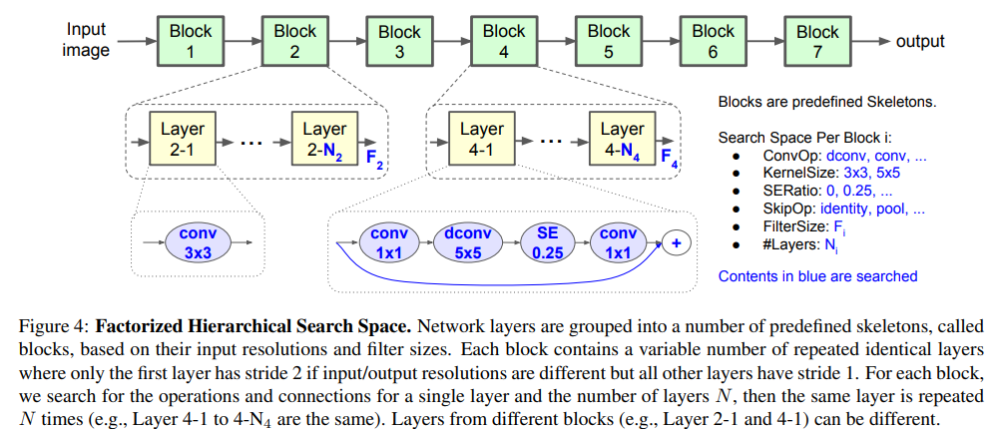
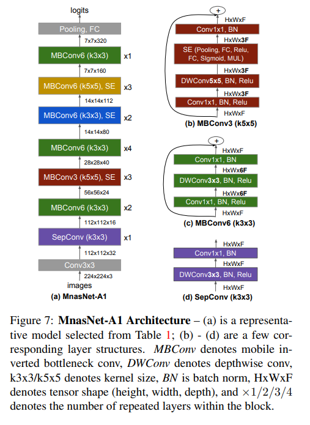
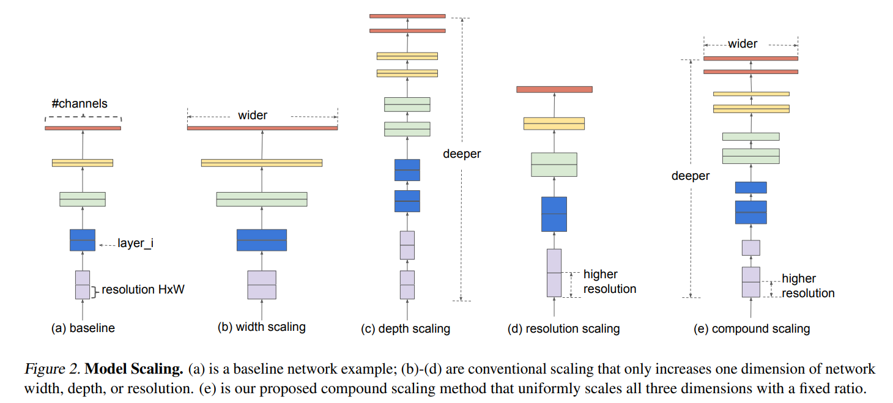
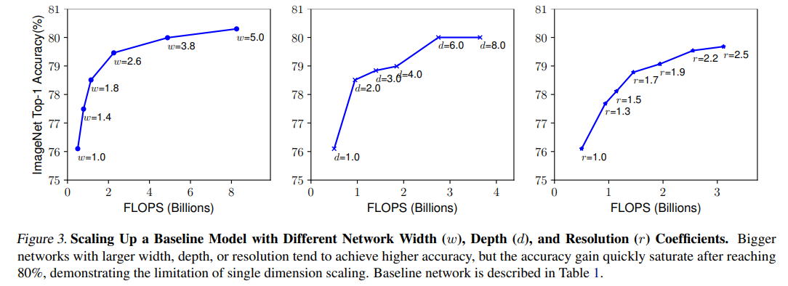
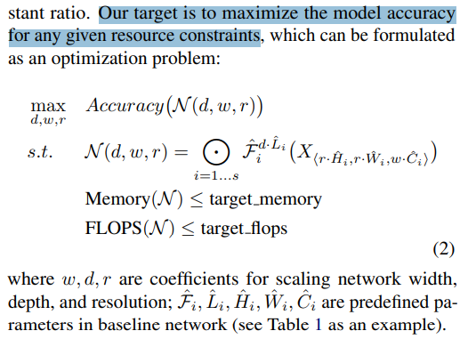
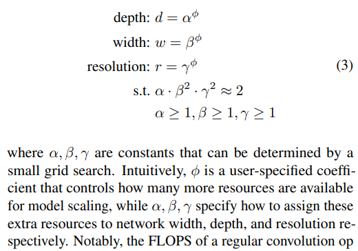
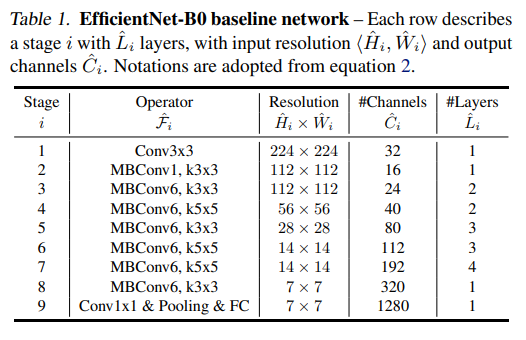
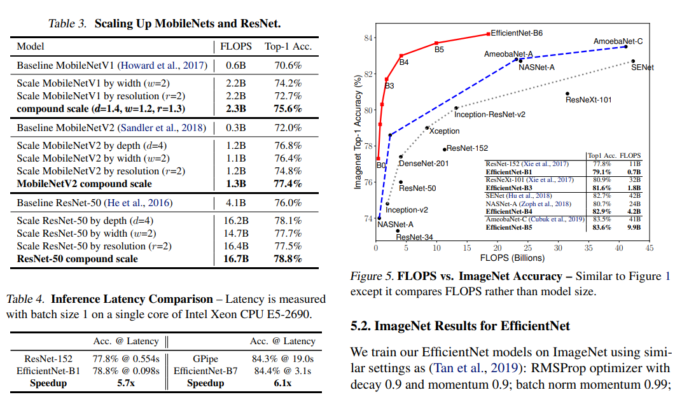
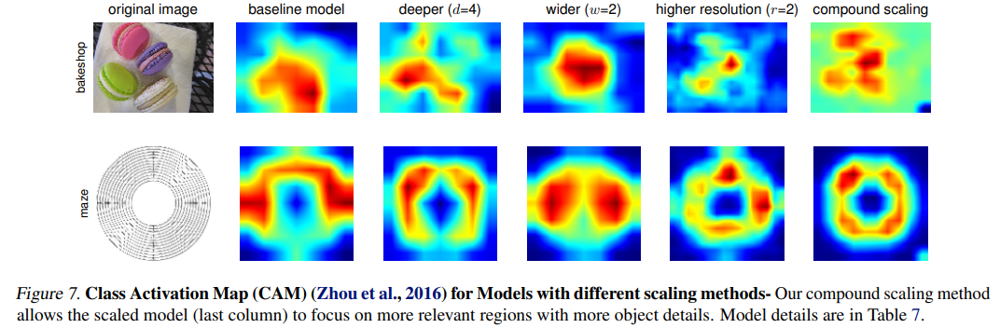
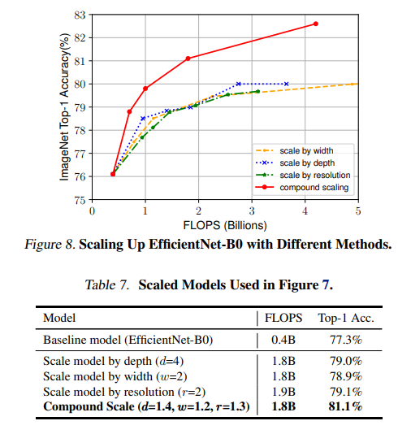

# EfficientNet: Rethinking Model Scaling for Convolutional Neural Networks

> "EfficientNet: Rethinking Model Scaling for Convolutional Neural Networks" ICML, 2019 May
> [paper](http://arxiv.org/abs/1905.11946v5) [code](https://github.com/tensorflow/tpu/tree/master/models/official/efficientnet) 
> [pdf](./2019_05_ICML_EfficientNet--Rethinking-Model-Scaling-for-Convolutional-Neural-Networks.pdf) [note](./2019_05_ICML_EfficientNet--Rethinking-Model-Scaling-for-Convolutional-Neural-Networks_Note.md) 
> [blog](https://medium.com/ai-blog-tw/convolutional-neural-network%E7%9A%84%E8%A8%AD%E8%A8%88%E8%AB%96-nas-efficientnet-v-s-handcraft-regnet-3429b3bbde22) :star:
> Authors: Mingxing Tan, Quoc V. Le

## Key-point

- Task

- Problems

  the process of **scaling up ConvNets has never been well understood** and there are currently many ways to do it

  > is there a principled method to scale up ConvNets that can achieve better accuracy and efficiency?

- :label: Label:

探索 model scaling and identify that **carefully balancing network depth, width, and resolution** can lead to better performance. 用 NAS( neural architecture search) 找最优网络结构，**8.4x smaller and 6.1x faster on inference than the best existing ConvNet.**

propose **a new scaling method that uniformly scales all dimensions of depth/width/resolution** using a simple yet highly effective compound coefficient. 

## Contributions

## Introduction

EfficientNet [7] 是可以说是 (2020年) 移动端 (使用CPU计算) 最强的网络架构；沿用MnasNet [8] 的search space，但将运算资源的估测从latency改成FLOPs，即对于某个网络 m、目标运算量 T，使用一个hyperparameter w控制accuracy与FLOPs的trade-of，最佳化$Accuracy(m)*[FLOPs(m)/T]^w$。

- **Q：人工设计模型如何找最优解？Handcraft Design with Insights**

在一般的情况下，人为设计网络的流程大概是这样：先从一个**大略的网络概念假设一个网络可调整范围** (design space，以NAS的术语是search space)，我们会在这个空间进行**大量的实验后，找到一些容易带来正效益的方向。这时候我们会依照这个方向继续进行实验**，也就等同于收敛到一个更小的design space。而这样递迴地进行，就像下图从 A 走到 B 再走到 C 的过程。

**NAS的三大元素：search space、search strategy、performance evaluation**。其实人为设计与NAS根本没什么两样，只是search strategy是依照着我们自己本身的知识在进行；

1. NAS以performance为最佳依据，擅长找到那一个**性能最强**的模型（优化方向也是人为指定的，例如怎么才算性能好）。

   NAS的优势在于找出对于任务最优势的架构，然而极强的目的性也带来了**泛化性的不确定 (会不会找出over-fitting的架构)** :star:

   这也是为什么 EfficientNet 要做一堆 transfer daatse 的实验；不过，即使transfer到其他同dataset可行，transfer到其他任务或许又是另一个问题。

2. Handcraft 人为设计的过程则是观察 performance，却也同时依照自己过往知识与经验的累积、每个参数代表的意义、每个增加的模块效果等等推测方向，因此找出来的通常一种方向并且带有**某些insight（按创新点为优化方向）**。

- "MnasNet: Platform-Aware Neural Architecture Search for Mobile" CVPR, 2018 Jul
  [paper](https://arxiv.org/abs/1807.11626)

 mobile inverted bottleneck MBConv

## methods

在不大幅改动主架构的情况下，一般常调整的项目就是以下三种

- 深度D (depth)：代表从输入到输出，堆叠的building block或convolution layer的数量。
- 宽度W (width)：代表该building block或convolution layer输出feature map的宽度 (channels或filters数)。
- 分辨率R (resolution)：代表该building block或convolution layer输出feature map张量的长与宽。

基于 baseline 单独调整一个维度，Acc 会在80% 饱和

observe that **different scaling dimensions are not independent.** Intuitively, for higher resolution images, we should increase network depth, such that the larger receptive fields can help capture similar features that include more pixels in bigger images. Correspondingly, we should also increase network width when resolution is higher, in order to capture more fine-grained patterns with more pixels in high resolution images. These intuitions **suggest that we need to coordinate and balance different scaling dimensions rather than conventional single-dimension scaling.**

### compound scaling method

数学角度定义最优模型需要满足的条件(Eq 2)

按最优化角度考虑网络结构(Eq 3)

 the FLOPS of a regular convolution op is proportional to d, w 2 , r 2 , i.e., doubling network depth will double FLOPS, but doubling network width or resolution will increase FLOPS by four times

优化目标用 FLOPS 设计：深度大 d 倍，宽度 w 倍，分辨率大 r 倍，FLOPS 分别要大 $d, w^2,r^2$ :star:

1.  first fix φ = 1, assuming twice more resources available & do a small grid search of α, β, γ based on Equation 2
2. fix α, β, γ as constants and scale up baseline network with different φ using Equation, to obtain EfficientNet-B1 to B7 (Details in Table 2

**Baseline 网络**

参考作者另一个工作的结构

- "MnasNet: Platform-Aware Neural Architecture Search for Mobile" 
  [paper](https://arxiv.org/abs/1807.11626)

## Experiment

> ablation study 看那个模块有效，总结一下

同样 Acc 下 EfficientNet FLOPS 比 ResNet152（手工设计的网络） 低很多

特征图角度看模型结构有效性

验证了组合地去增加模型深度&通道数&分辨率，能够比只加一个更好；每一个维度只加 1.3 倍左右就足够，能比单一一个维度加 4 倍效果更好

## Limitations

EfficientNet在其他视觉任务中，不论是 object detection或是 semantic segmentation中已经展现了强大的能力 [10]，泛化能力乍看无懈可击，不过这个**评比是建立在 "同量级的 FLOPs" 最优先的基准下。**

## Summary :star2:

> learn what & how to apply to our task

1. 验证了组合地去增加模型深度&通道数&分辨率，能够比只加一个更好；每一个维度只加 1.3 倍左右就足够，能比单一一个维度加 4 倍效果更好

2. 每个维度 scale 多少用 NAS 方式去搜索，能有接近 4 % Acc 的提升

3. NAS的优势在于找出对于任务最优势的架构，然而极强的目的性也带来了**泛化性的不确定 (会不会找出over-fitting的架构)** :star:

   因此要做 Transfer dataset & Task 的实验

4. NAS的另一个问题就是**可解释性比较差**。比如说RegNet在sample并演化架构的过程中发现了渐渐增加的网络宽度是好的设计，然而EfficientNet一开始就来了一个宽度从32到16的压缩。虽然EfficentNet结果就是如此优秀，这样的一个难解释的设计却也增加了理解与修改的困扰。

   **NAS 搜出来的网络，后续不知道怎么去改他进一步优化；**

   > “Any fool can know. The point is to understand.” ― Albert Einstein

5. 

