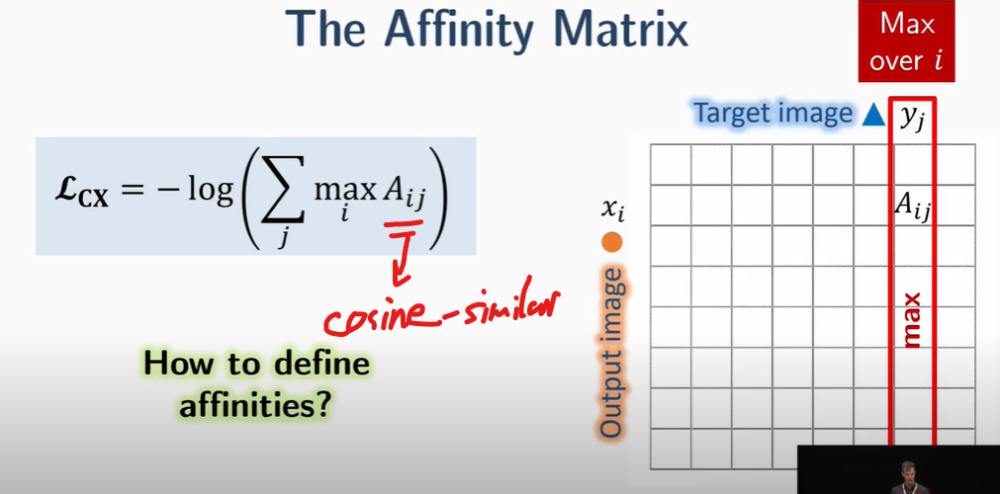
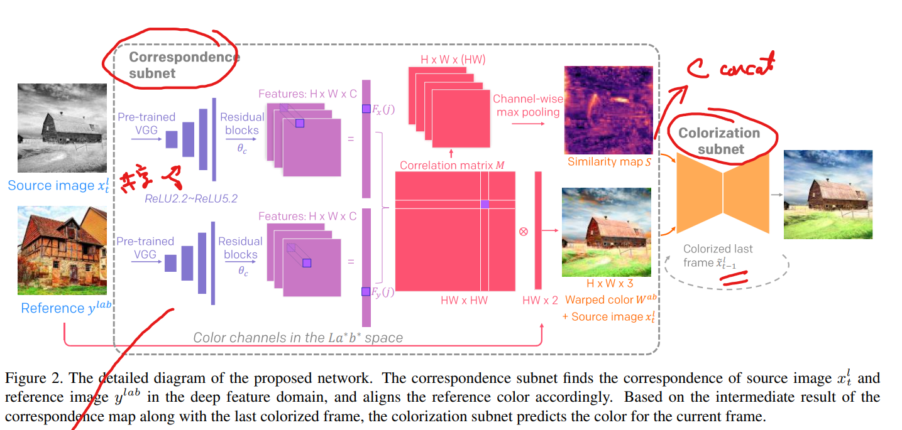

# Deep Exemplar-based Video Colorization

> "Deep Exemplar-based Video Colorization" CVPR, 2019 Jun
> [paper](https://arxiv.org/abs/1906.09909) [code](https://github.com/zhangmozhe/Deep-Exemplar-based-Video-Colorization)
> [local pdf](./2019_07_CVPR_Deep-Exemplar-based-Video-Colorization.pdf)

**Key-point**

**Contributions**

## **Related Work**

- perceptual loss

- smoothness loss

  difference between the color of current pixel and the weighted color of its 8-connected neighborhoods

- contextual loss

- adversarial loss

- Temporal Consistency Loss
  penalizes the color change along the flow trajectory

  $(x_t - x_{t-1}) * mask$ >> mask is optical flow

### Contextual Loss

> "The Contextual Loss for Image Transformation with Non-Aligned Data" ECCV, 2018 Mar
> [paper](https://arxiv.org/pdf/1803.02077.pdf) [author's talk](https://www.youtube.com/watch?v=fdPc2okT_4I)
> Code implementation `models/ContextualLoss.py` 

Contextual Loss则是一种**可用于非对齐(non-aligned)数据的Loss**，其特性在于可以较好地保留ground truth的特征。可以在即便不使用GAN网络的情况下，较好地完成图像风格转换等任务

- 能用于 non-aligned images

- Nearest Neighbor Field (NNF) 特性来匹特征点 >> 体现在 affinity matrix

  当找到对应点，有很多 1on1 特征点 >> max of each col

$$
L_{contextual} = -log(\sum_j{\max_i{A_{ij}}}) \\
Affinity~Matrix:~A_{ij} = \frac{\exp(\frac{1 - d_{ij}}{h})}{\sum_j{\exp(\frac{1 - d_{ij}}{h})}} \\
\text{where h=0.1 and } d_{ij} \text{ is the cosine-distance between xi,yj. the more similar, dij is smaller} >>1-d_{ij} \text{is cosine-similarity}
$$

1. $A_{ij}$ 代表 X 特征点 i 与 目标 Y 特征点 j 的余弦相似度。
   :question: 为啥要转为 cosine distance >> 分母加一个小量，防止 $A_ij$ 指数平均计算的时候分母为 0，注意最后还是转为 cosine similarity (相似 ->1)

   对于每个特征点 I，对于所有 target J 归一化 

2. Loss 公式理解

   对于每个目标特征点 J，找与其相似度最大的原图特征点 I，取这个相似度。把这个相似度当作概率（当作不确定度，当很确定的时候 p=1，此时熵最小），用 cross-entropy 公式：所有特征点一一匹配时候，概率均接近1，loss 最小。

## **methods**

source image A 灰度图，reference image B LAB空间

- `class WarpNet(nn.Module):` >> correspondence subnet

  A，B 输入同一个共享的 VGG19，得到 LAB 空间的 ab 分量和 similarity map

- `class ColorVidNet(nn.Module)` >> Colorization subnet

  将 WarpNet 输出的 4 个分量 channel concat 起来输入，预测上一帧和当前帧信息，合起来

- 一些 Loss

### Dataset

- **Video Data**

  - we collect 1052 videos from Videvo stock 视频网站

  - Hollywood 3D dataset [homepage](https://cvssp.org/Hollywood3D/)

    人类行为动作视频数据集，3669个视频剪辑，视频总长度约为20.1小时，视频包括 12类 不同的人类行为动作，10个 场景，视频剪辑内容来自69部电影。

- **Reference Image**

  每个视频，按类别从 ImageNet dataset 选取 5张最相关的图

- Optical Flow

  用 FlowNet2 抽取 25 帧

- DA 扭曲 & 加噪声，扩充视频 -> 70k

**Limitations**

**Summary :star2:**

> learn what & how to apply to our task