# Generative Modeling by Estimating Gradients of the Data Distribution

> "Generative Modeling by Estimating Gradients of the Data Distribution" NIPS, 2019 Jul 12
> [paper](http://arxiv.org/abs/1907.05600v3) [code]() [pdf](./2019_07_NIPS_Generative-Modeling-by-Estimating-Gradients-of-the-Data-Distribution.pdf) [note](./2019_07_NIPS_Generative-Modeling-by-Estimating-Gradients-of-the-Data-Distribution_Note.md)
> Authors: Yang Song, Stefano Ermon(Stanford)

## Key-point

- Task: generative model
- Problems
- :label: Label:

## Contributions

- 提出一种基于预测 score function 方式的生成模型 （loss 如何设计）：提出使用 Langevin dynamics 生成数据样本，就是用 score matching 方式模拟样本分布（loss 中 GT 的数据分布，方便去学习）

> In this paper, we explore a new principle for generative modeling based on estimating and sampling from the (Stein) score [33] of the logarithmic data density, which is the gradient of the log-density function at the input data point. 

> We introduce a new generative model where samples are produced via Langevin dynamics using gradients of the data distribution estimated with score matching.

- 提出对数据增加高斯噪声扰动，再去预测对应的 scores，来解决训练 score function 训练过程中，低密度区域（少样本）学习困难的问题，随机值落在两个分布中间，训练不出来

> Because gradients can be ill-defined and hard to estimate when the data resides on low-dimensional manifolds, we **perturb the data with different levels of Gaussian noise**, and jointly estimate the corresponding scores, i.e., the vector fields of gradients of the perturbed data distribution for all noise levels.

- 提出一种渐进 Langevin dynamics 方式，实现梯度就是增加的噪声水平。提出的 Loss 训练方式对于多种模型结构很通用

> For sampling, we propose an annealed Langevin dynamics where we use gradients corresponding to gradually decreasing noise levels as the sampling process gets closer to the data manifold. Our framework allows flexible model architectures, requires no sampling during training or the use of adversarial methods, and provides a learning objective that can be used for principled model comparisons.

- SOTA inception score of 8.87 on CIFAR-10。发现在 image inpainting 上有效果

> Our models produce samples comparable to GANs on MNIST, CelebA and CIFAR-10 datasets, achieving a new state-of-the-art inception score of 8.87 on CIFAR-10. Additionally, we demonstrate that our models learn effective representations via image inpainting experiments.

## Introduction

先前生成模型使用 log-likelihood Loss 来训练模型学习数据分布

> likelihood-based method uses log-likelihood (or a suitable surrogate) as the training objective, while the latter uses adversarial training to minimize f-divergences [40] or integral probability metrics [2, 55] between model and data distributions.

- Q: 基于 log 概率训练的模型缺陷？

需要根据公式设计模型结构，并且需要用代替的 Loss 例如 evidence lower bound

>  Although likelihood-based models and GANs have achieved great success, they have some intrinsic limitations. For example, likelihood-based models either have to use specialized architectures to build a normalized probability model (e.g., autoregressive models, flow models), or use surrogate losses (e.g., the evidence lower bound used in variational auto-encoders [29], contrastive divergence in energy-based models [21]) for training. 

GAN 模型训练不稳定 & 不同模型有各自的训练目标，不方便比较，训练方式不通用

> GANs avoid some of the limitations of likelihood-based models, but their training can be unstable due to the adversarial training procedure. In addition, the GAN objective is not suitable for evaluating and comparing different GAN models. While other objectives exist for generative modeling, such as noise contrastive estimation [19] and minimum probability flow [50], these methods typically only work well for low-dimensional data.

提出一种模型，去预测 log 数据密度下的 score (一个向量空间）。这样设计使得某一点的梯度就是 score function -> 就是这个式子 $\nabla_x\log{p(x)}$，用来来模拟数据分布的。

> In this paper, we explore a new principle for generative modeling based on estimating and sampling from the (Stein) score [33] of the logarithmic data density, which is the gradient of the log-density function at the input data point. 

用 score matching 去训练 NN 学习一个 vector field，再用 Langevin dynamics 生成 GT 数据分布（训练图像要整一个分布去学习）

> This is a vector field pointing in the direction where the log data density grows the most. We **use a neural network trained with score matching [24] to learn this vector field from data**. We then **produce samples using Langevin dynamics**, which approximately works by gradually moving a random initial sample to high density regions along the (estimated) vector field of scores

- Q：什么是 score matching?

就是 score function 的 Loss 函数。

Score matching是一种用于估计数据分布梯度（得分）的方法。它的目标是学习数据分布的**梯度场**

注意，这里面 GT 数据分布没有哦！还学不了，所以要先指定一个数据分布。例如给一个图像数据集，数据分布是啥不知道。这里就要用到**提出用 Lagevin dynamics 类似思路，把图像加不同程度噪声，来搞一个数据分布，干净的图像就是 mode**

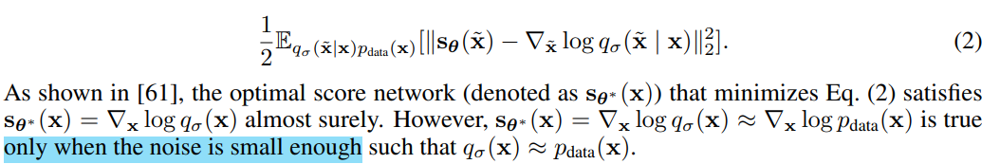

- Q：什么是 Lagevin dynamics？

用来生成真实数据分布的。提出用 Lagevin dynamics 类似思路，把图像加不同程度噪声，来搞一个数据分布，干净的图像就是 mode

模拟粒子组成物体，对于一个高斯噪声（粒子）可以用 score 指定每个点的转换方向，让这个高斯噪声为成一个高清图像

> Langevin dynamics 是一种通过模拟**物理系统中的粒子运动来生成样本**的过程。
>
> 在score-based diffusion中，**Langevin dynamics被用来通过逐步“反向扩散”的方式生成数据点（例如图像）**。它利用得分（score）来驱动这个过程。
>
> 在**扩散过程**（diffusion process）中，数据首先被加入噪声，变得更加模糊；然后通过**反向扩散**（reverse diffusion）将噪声逐渐去除，恢复出清晰的样本。
>
> Langevin dynamics 利用 score 信息来驱动反向去噪过程，从噪声中恢复出样本。（纯高斯噪声，score为每个点的朝图像的变化方向）

- Q：直觉上提出方法的缺陷？

> However, there are two main challenges with this approach. 

有一个 low dimensional manifold，在低维空间上的数据分布（图像数据集可以理解成一个低维数据分布，真实世界为高维度空间），但在高维空间计算 score，这个计算的 score 是对于高维空间来说的，对于低维空间不适用！ 会导致 **score-match 不准**（很容易预测不一致的 score，会指向周围的数据分布）。**高维空间有冗余，不是所有点都能在低维数据分布上找到对应。**

> First, if the data distribution is supported on a low dimensional manifold—as it is often assumed for many real world datasets—the score will be undefined in the ambient space, and score matching will fail to provide a consistent score estimator.
>
> - Q：什么是 low dimentional manifold?
>
> https://www.zhihu.com/question/24015486/answer/194284643 :+1:
>
> 一般数据可以用有冗余的高维空间去衡量（有很多不必要的点实际不在需要的分布上），搞一个空间，所有点都在需要的分布里面 -> manifold
>
> 这个计算的 score 是对于高维空间来说的，对于低维空间不适用？3D 球面上两个点的距离（曲线） vs 3D 空间两点坐标距离

Lagevin dynamics 容易只再一些低密度的区域初始化（样本少学不好），这些区域预测的 score 不准，降低生成质量。模型如何融合多种数据分布，**如何去遍历 low-density 区域**

> Second, the scarcity of training data in low data density regions, e.g., far from the manifold, hinders the accuracy of score estimation and slows down the mixing of Langevin dynamics sampling. Since Langevin dynamics will often be initialized in low-density regions of the data distribution, inaccurate score estimation in these regions will negatively affect the sampling process.
>
> Moreover, mixing can be difficult because of the need of traversing low density regions to transition between modes of the distribution.

总结一下就是怎么生成这个 GT 数据分布很关键！

提出对数据加上不同程度的高斯噪声，来模拟数据分布。

1. 随机增加**不同程度的噪声**，使得数据分布不是在一个 a low-dimension manifold 低维空间上
2. **噪声程度大的 noise** 能够在原先 low-density 低密度区域增加很多数据，解决部分区域数据少的问题，便于学习 score

>  To tackle these two challenges, we propose to perturb the data with random Gaussian noise of various magnitudes. Adding random noise ensures the resulting distribution does not collapse to a low dimensional manifold.
>
> Large noise levels will produce samples in low density regions of the original (unperturbed) data distribution, thus improving score estimation. 

训练一个网络去学习所有 noise 程度的数据 -> 学习构造的高维空间

> Crucially, we train a single score network conditioned on the noise level and estimate the scores at all noise magnitudes. We then propose an annealed version of Langevin dynamics, where we initially use scores corresponding to the highest noise level, and gradually anneal down the noise level until it is small enough to be indistinguishable from the original data distribution.
>
> Our sampling strategy is inspired by simulated annealing [30, 37] which heuristically improves optimization for multimodal landscapes

- Q：这么设计 score matching loss，Lagevin dynamics 类似的增加噪声来生成数据分布的方式，有什么好处？

降低训练模型难度，不需要特殊的模型结构限制 or 不需要用 GAN loss(不稳定)

> Our approach has several desirable properties. First, our objective is tractable for almost all pa rameterizations of the score networks without the need of special constraints or architectures, and can be optimized without adversarial training, MCMC sampling, or other approximations during training. 

设计的 loss，支持再同一个数据集上去衡量不同模型
（不同模型用不同的 loss，学出来好坏，没法判断是模型不好还是训练方式不好。如果我们只看模型的**loss**，有时很难判断模型表现差是因为模型本身的设计不好，还是因为训练过程中使用的损失函数或其他训练方式的问题。）

> The objective can also be used to quantitatively compare different models on the same dataset. 

- Q：score matching?

> "Estimation of non-normalized statistical models by score matching"

## Score-based generative modeling

- score matching 就是 Loss 公式
- Langevin dynamics 是 Loss 公式里面，GT 数据分布 p(x) 的构造方式

> The framework of score-based generative modeling has two ingredients: **score matching and Langevin dynamics**

### Score matching

> "Estimation of non-normalized statistical models by score matching" JMLR, 2005 Apr

参考先前方法，学习 $\nabla_x\log{p(x)}$，而不是直接学概率 p(x)

> - "Sliced score matching: A scalable approach to density and score estimation"
>
> Using score matching, we can directly train a score network s (x) to estimate x logpdata(x) without training a model to estimate pdata(x) first.

Loss 公式

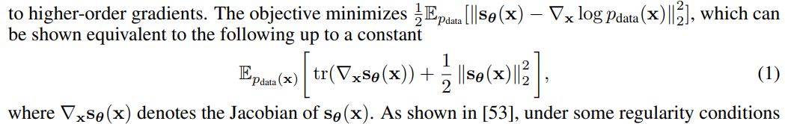

- Q：为什么不用 **score matching 的标准方式（eq1 上面那个小公式）**，用 energy-based model 的梯度？

与传统的score matching方法不同，作者选择不使用能量模型（energy-based model, EBM）的梯度作为得分网络（score network），以避免由于**高阶梯度计算带来的额外计算开销**

> Different from the typical usage of score matching, we opt not to use the gradient of an energy-based model as the score network to avoid extra computation due to **higher-order gradients**.

- Q：Eq1 里面要计算梯度的 trace，计算量太大了，不好用到 NN 里面？？:star:

> However, score matching is not scalable to deep networks and **high dimensional data** [53] due to the computation of $tr(∇_xs_θ(x))$
>
> 

看一下两种 scale 的方法

> Below we discuss two popular methods for large scale score matching.

- Denoising score matching

Denoising score matching 预测加了扰动的数据分布；对数据 x 加上**一个小的噪声（使得优化公式和 eq1 近似）**，去预测加了噪声的数据分布 $p(\tilde{x} \mid x)$

模型 $s(\theta)$ 预测每个点的去噪方向 -> score

- Sliced score matching

对 $tr(∇_xs_θ(x))$ 映射一个接近的，但 $\mathbf{v}^\intercal\nabla_{\mathbf{x}}\mathbf{s}_{\boldsymbol{\theta}}(\mathbf{x})\mathbf{v}$ 需要 4x 计算量

> four times more computations due to the forward mode auto-differentiation

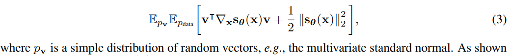

###  Sample with Langevin dynamics

> Langevin dynamics can produce samples from a probability density p(x) using only the score function $\nabla \log p(x)$

上面 loss 公式，GT 数据分布还没有哦！这里给定一个数据集，**用 Langevin dynamics 搞一个分布出来**

迭代加噪公式：对高清图像加噪，构造数据分布

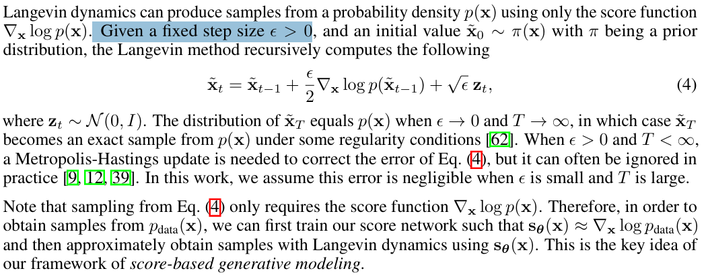

假设 $\epsilon \to 0, T \to \infin$，如果不满足会有一个误差！！认为可以忽略不计

> When $\epsilon > 0, T < \infin$, a **Metropolis-Hastings update** is needed to correct the error of Eq. 4
>
> In this work, we assume this error is negligible when $\epsilon $ is small and T is large.

## Challenges

看一下提出的方法能否解决前面提出的 2 个challenge

**manifold hypothesis**

高维空间很多冗余，实际数据分布只是空间一个小的子集

- Q: 验证？

对比两种数据分布下训练 loss 的趋势。发现只要增加一点点扰动就可以哦（高斯噪声方差 1e-4)

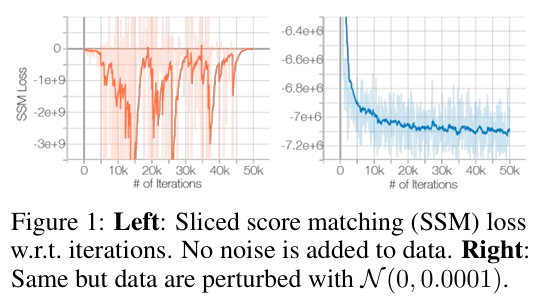

高斯噪声公式

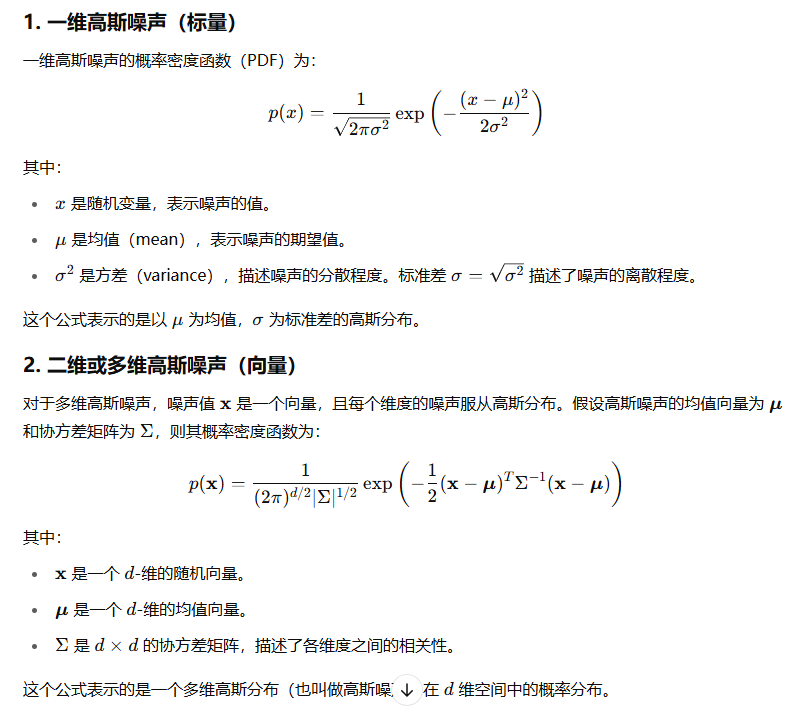

**Low data density regions 预测不准**

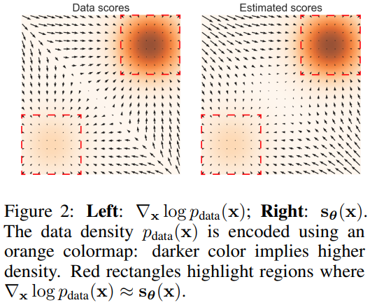

- Slow mixing of Langevin dynamics

两个分布，被一个 low density 区域分割，**Langevin dynamics 没法得到每个分布合适的权重，没法收敛到真实分布**

> When two modes of the data distribution are separated by low density regions, Langevin dynamics will not be able to correctly recover the relative weights of these two modes in reasonable time, and therefore might not converge to the true distribution.

- Q：怎么证明？

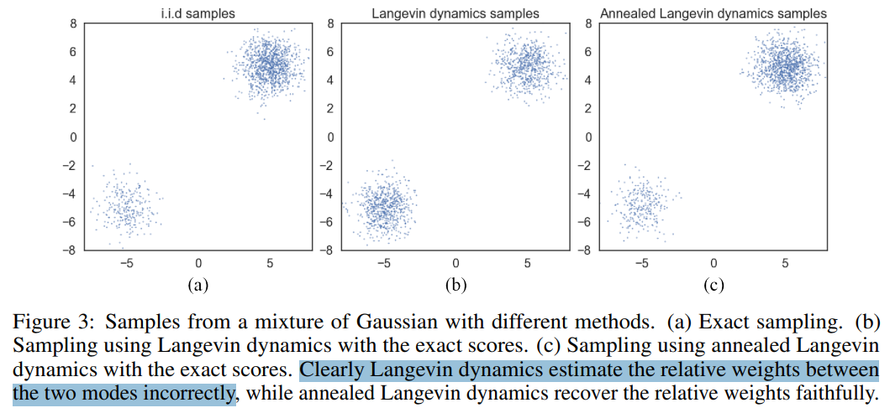

## Model NCSN

> NoiseConditionalScoreNetwork(NCSN).: learning and inference

- Q：motivation？

发现增加随机高斯噪声，能让 score-based 模型更容易收敛；

1. 高斯噪声加的是在全局上的
2. 高斯噪声能够填补 low-density 区域
3. 加不同 level 的噪声获取了一个数据分布的序列，其收敛于真实分布 :star:

> We observe that perturbing data with random Gaussian noise makes the data distribution more amenable to score-based generative modeling
>
> First, since the support of our Gaussian noise distribution is the whole space, the perturbed data will not be confined to a low dimensional manifold, which obviates difficulties from the manifold hypothesis and makes score estimation well-defined.
>
>  Second, large Gaussian noise has the effect of filling low density regions in the original unperturbed data distribution; therefore score matching may get more training signal to improve score estimation.
>
> Furthermore, by using multiple noise levels we can obtain a sequence of noise-perturbed distributions that converge to the true data distribution.

现在要优化：**Langevin Dynamic 在多个数据分布的不收敛到真实分布**

> We can improve the mixing rate of Langevin dynamics on multimodal distributions by leveraging these intermediate distributions in the spirit of simulated annealing [30] and a**nnealed importance sampling** 

和 DDPM 类似，提出多 step（noise level） 加噪 && 用一个模型去预测每个 step （noise level）的噪声

> Built upon this intuition, we propose to improve score-based generative modeling by 1) perturbing the data using various levels of noise; and 2) simultaneously estimating scores corresponding to all noise levels by training a single conditional score network

### train

本文提出的 NCSN 只针对图像生成优化模型结构 :warning:

> We call $s_\theta(x, \sigma)$ a Noise Conditional Score Network (NCSN).
>
> In this work, we mostly **focus on architectures useful for image generation,** and leave the architecture design for other domains as future work

UNet 具体模型结构，看下 Appendix A

- 使用 denoising score matching 方式去优化模型 :star:

denoising score matching 原始公式

定义为**加噪公式为高斯分布，得到微分的式子**，把 score 的那个微分 log 式子解开

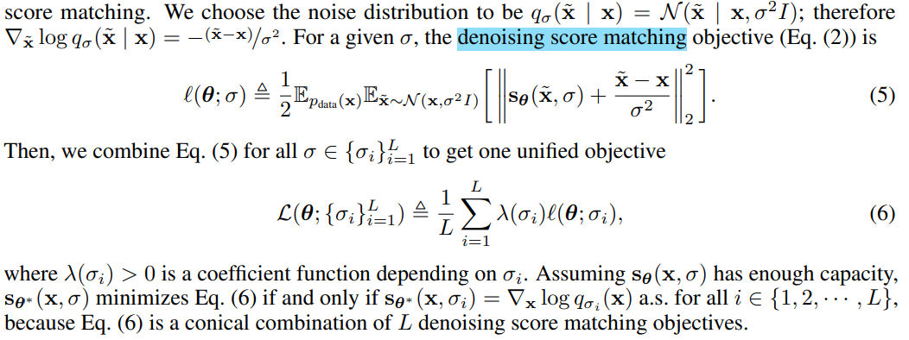

#### infer

加噪

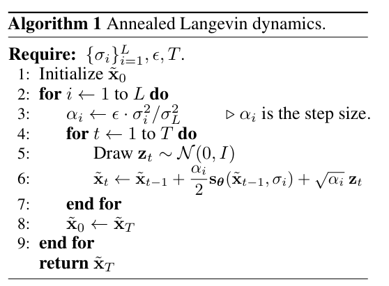

image inpainting

加噪每一步都把 GT 干净区域抠出来

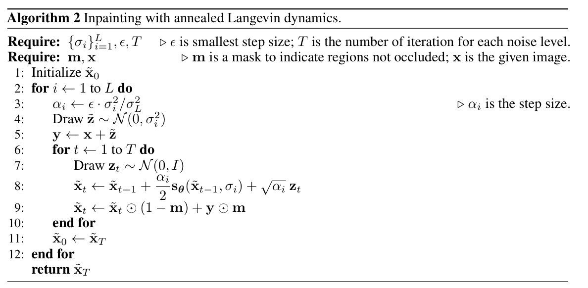

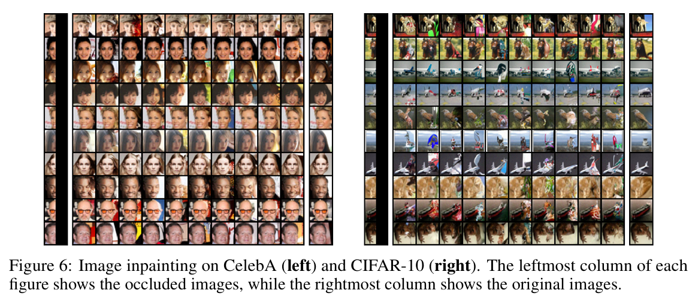

去噪过程可视化

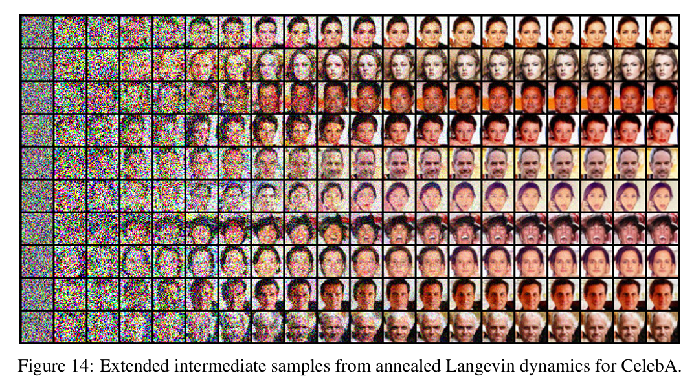

## setting

## Experiment

> ablation study 看那个模块有效，总结一下

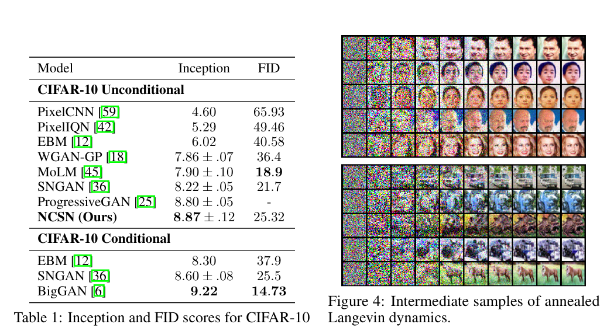

## Limitations

## Summary :star2:

> learn what

- Low-dimension manifold

  有一个 low dimensional manifold，在低维空间上的数据分布（图像数据集可以理解成一个低维数据分布，真实世界为高维度空间），但在高维空间计算 score，这个计算的 score 是对于高维空间来说的，对于低维空间不适用！ 会导致 **score-match 不准**（很容易预测不一致的 score，会指向周围的数据分布）。**高维空间有冗余，不是所有点都能在低维数据分布上找到对应。**

  > First, if the data distribution is supported on a low dimensional manifold—as it is often assumed for many real world datasets—the score will be undefined in the ambient space, and score matching will fail to provide a consistent score estimator.
  >
  > - Q：什么是 low dimentional manifold?
  >
  > https://www.zhihu.com/question/24015486/answer/194284643 :+1:
  >
  > 一般数据可以用有冗余的高维空间去衡量（有很多不必要的点实际不在需要的分布上），搞一个空间，所有点都在需要的分布里面 -> manifold
  >
  > 这个计算的 score 是对于高维空间来说的，对于低维空间不适用？3D 球面上两个点的距离（曲线） vs 3D 空间两点坐标距离

### how to apply to our task

