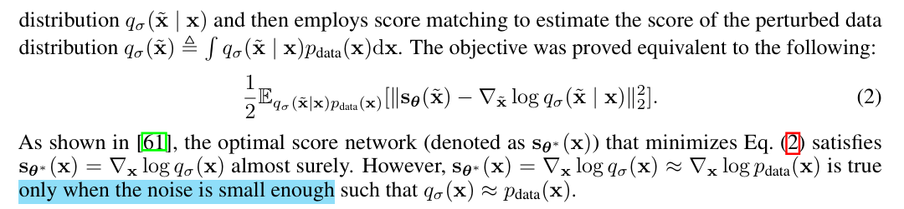

# Generative Modeling by Estimating Gradients of the Data Distribution

> "Generative Modeling by Estimating Gradients of the Data Distribution" NIPS, 2019 Jul 12
> [paper](http://arxiv.org/abs/1907.05600v3) [code]() [pdf](./2019_07_NIPS_Generative-Modeling-by-Estimating-Gradients-of-the-Data-Distribution.pdf) [note](./2019_07_NIPS_Generative-Modeling-by-Estimating-Gradients-of-the-Data-Distribution_Note.md)
> Authors: Yang Song, Stefano Ermon

## Key-point

- Task: generative model
- Problems
- :label: Label:

## Contributions

- 提出一种生成模型

- 提出基于 Langevin dynamics 的采样方式

  > We introduce a new generative model where samples are produced via Langevin dynamics using gradients of the data distribution estimated with score matching.
  >
  > For sampling, we propose an annealed Langevin dynamics where we use gradients corresponding to gradually decreasing noise levels as the sampling process gets closer to the data manifold.

- SOTA inception score of 8.87 on CIFAR-10

## Introduction

**先前生成模型**

> likelihood-based method uses log-likelihood (or a suitable surrogate) as the training objective, while the latter uses adversarial training to minimize f-divergences [40] or integral probability metrics [2, 55] between model and data distributions.

**likelihood-based methods**

- "Pixel recurrent neural networks" NIPS

Limitations: 需要使用指定的模型结构（VAE, flow-model)，使用 surrogate loss 去优化（ELBO, contrastive divergence）

> likelihood-based models either have to use specialized architectures to build a normalized probability model (e.g., autoregressive models, flow models), or use surrogate losses (e.g., the evidence lower bound used in variational auto-encoders [29], contrastive divergence in energy-based models [21]) for training.

 **generative adversarial networks**

- "Generative adversarial nets." NIPS, 2014

Limitations: unstable adversarial training; 训练目标对于不同的 GAN 模型难以公平地去比较

> training can be unstable due to the adversarial training procedure. In addition, the GAN objective is not suitable for evaluating and comparing different GAN models. While other objectives exist for generative modeling, such as noise contrastive estimation [19] and minimum probability flow [50], these methods typically only work well for low-dimensional data.

提出一种生成模型，需要去 vector field 基于 score （logarithmic data density）去采样。

> In this paper, we explore a new principle for generative modeling based on estimating and sampling from the (Stein) score [33] of the logarithmic data density

用 score matching 去训练 NN 学习一个 vector field，再用 Langevin dynamics 去采样

> This is a vector field pointing in the direction where the log data density grows the most. We use a neural network trained with score matching [24] to learn this vector field from data. We then produce samples using Langevin dynamics, which approximately works by gradually moving a random initial sample to high density regions along the (estimated) vector field of scores

- Q：什么是 Lagevin dynamics？

看 introduction 像是逐步加噪 & 去噪的过程；

### Q: challenges?

- 有多个 low-dimension 数据分布，**score-match 不准**（很容易预测不一致的 score，会指向周围的数据分布）
- Lagevin dynamics 容易只再一些低密度的区域初始化，这些区域预测的 score 不准，降低生成质量

> Since Langevin dynamics will often be initialized in low-density regions of the data distribution, inaccurate score estimation in these regions will negatively affect the sampling process. 

- 模型如何融合多种数据分布，**如何去遍历 low-density 区域**

> mixing can be difficult because of the need of traversing low density regions to transition between modes of the distribution.

提出

- **对数据分布逐步加 random noise 扰动**，避免多个数据分布落在一个 low-dimension 分布耦合在一起；大的 noise 能够增加 low-density 区域的采样机会，提升 score match 质量

> Adding random noise ensures the resulting distribution does not collapse to a low dimensional manifold.
> Large noise levels will produce samples in low density regions of the original (unperturbed) data distribution, thus improving score estimation. 

- 提出 annealed version of Langevin Dynamics，**优化存在多个数据分布时的训练**

> propose an annealed version of Langevin dynamics, where we initially use scores corresponding to the highest noise level, and gradually anneal down the noise level until it is small enough to be indistinguishable from the original data distribution
>
>  Our sampling strategy is inspired by simulated annealing [30, 37] which heuristically **improves optimization for multimodal landscapes**

- Q：效果？

- 降低训练模型难度，不需要特殊的限制 or adversarial training

> our objective is tractable for almost all parameterizations of the score networks without the need of special constraints or architectures, and can be optimized without adversarial training, MCMC sampling, or other approximations during training. 

- 设计的训练目标，支持再同一个数据集上去衡量不同模型

> The objective can also be used to quantitatively compare different models on the same dataset. 

## methods

The framework of score-based generative modeling has two ingredients: **score matching and Langevin dynamics**

### Score matching

- "Estimation of non-normalized statistical models by score matching" JMLR, 2005 Apr

没有用 energy-based model 的梯度作为 score network，梯度太大

> Different from the typical usage of score matching, we opt not to use the gradient of an energy-based model as the score network to avoid extra computation due to **higher-order gradients**.

优化目标

- Q：要计算梯度的 trace 不好用到 NN 里面？？:star:

> However, score matching is not scalable to deep networks and **high dimensional data** [53] due to the computation of $tr(∇_xs_θ(x))$

看一下两种 scale 的方法

> two popular methods for large scale score matching.

- Denoising score matching 预测加了扰动的数据分布

对数据 x 加上**一个小的噪声（使得优化公式和 eq1 近似）**，去预测加了噪声的数据分布 $p(\tilde{x} \mid x)$

- Sliced score matching

对 $tr(∇_xs_θ(x))$ 映射一个接近的，但 $\mathbf{v}^\intercal\nabla_{\mathbf{x}}\mathbf{s}_{\boldsymbol{\theta}}(\mathbf{x})\mathbf{v}$ 需要 4x 计算量

> four times more computations due to the forward mode auto-differentiation

$$
\mathbb{E}_{p_{\mathbf{v}}}\mathbb{E}_{p_{\mathrm{data}}}\bigg[\mathbf{v}^\intercal\nabla_{\mathbf{x}}\mathbf{s}_{\boldsymbol{\theta}}(\mathbf{x})\mathbf{v}+\frac12\left\|\mathbf{s}_{\boldsymbol{\theta}}(\mathbf{x})\right\|_2^2\bigg],
$$

###  Langevin dynamics

> Langevin dynamics can produce samples from a probability density p(x) using only the score function $\nabla \log p(x)$

迭代加噪公式

- 假设 $\epsilon \to 0, T \to \infin$，如果不满足会有误差！！所以 Score-based 方法 T 不能少！:warning:

> When $\epsilon > 0, T < \infin$, a **Metropolis-Hastings update** is needed to correct the error of Eq. 4
>
> In this work, we assume this error is negligible when $\epsilon $ is small and T is large.

### Challenges

-  manifold hypothesis

多个分布，score match 容易预测为周围的其他分布

- Low data density regions 预测不准

- Slow mixing of Langevin dynamics

两个分布，被一个 low density 区域分割，**Langevin dynamics 没法得到每个分布合适的权重，没法收敛到真实分布**

> When two modes of the data distribution are separated by low density regions, Langevin dynamics will not be able to correctly recover the relative weights of these two modes in reasonable time, and therefore might not converge to the true distribution.

- Q：怎么证明？

### NCSN

- Q：motivation？

发现增加随机高斯噪声，能让 score-based 模型更容易收敛；

1. 高斯噪声加的是在全局上的
2. 高斯噪声能够填补 low-density 区域
3. 加不同 level 的噪声获取了一个数据分布的序列，其收敛于真实分布 :star:

> We observe that perturbing data with random Gaussian noise makes the data distribution more amenable to score-based generative modeling
>
> First, since the support of our Gaussian noise distribution is the whole space, the perturbed data will not be confined to a low dimensional manifold, which obviates difficulties from the manifold hypothesis and makes score estimation well-defined.
>
>  Second, large Gaussian noise has the effect of filling low density regions in the original unperturbed data distribution; therefore score matching may get more training signal to improve score estimation.
>
> Furthermore, by using multiple noise levels we can obtain a sequence of noise-perturbed distributions that converge to the true data distribution.

现在要优化：**Langevin Dynamic 在多个数据分布的不收敛到真实分布**

> We can improve the mixing rate of Langevin dynamics on multimodal distributions by leveraging these intermediate distributions in the spirit of simulated annealing [30] and a**nnealed importance sampling** 

和 DDPM 类似，提出多 step（noise level） 加噪 && 用一个模型去预测每个 step （noise level）的噪声

> Built upon this intuition, we propose to improve score-based generative modeling by 1) perturbing the data using various levels of noise; and 2) simultaneously estimating scores corresponding to all noise levels by training a single conditional score network

本文提出的 NCSN 只针对图像生成优化模型结构

> We call $s_\theta(x, \sigma)$ a Noise Conditional Score Network (NCSN).
>
> In this work, we mostly **focus on architectures useful for image generation,** and leave the architecture design for other domains as future work

UNet 具体模型结构，看下 Appendix A

- 使用 denoising score matching 方式去优化模型 :star:

denoising score matching 优化公式

改为高斯噪声，用到这里

## setting

## Experiment

> ablation study 看那个模块有效，总结一下

## Limitations

## Summary :star2:

> learn what

### how to apply to our task

