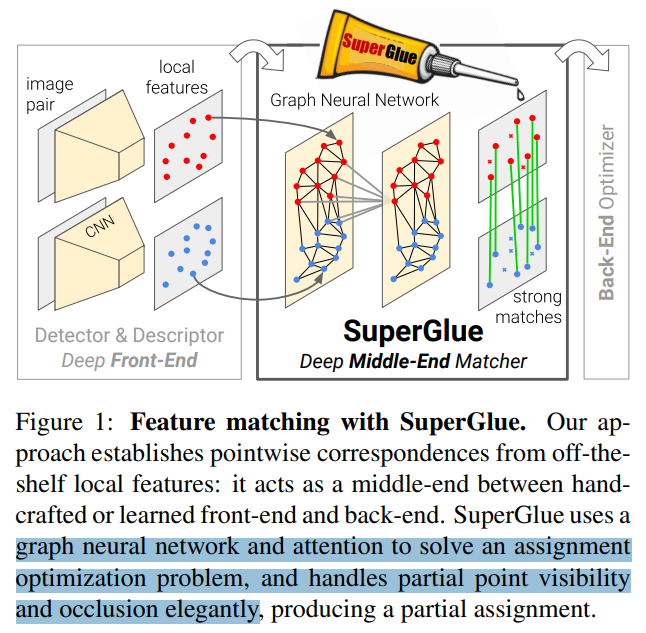
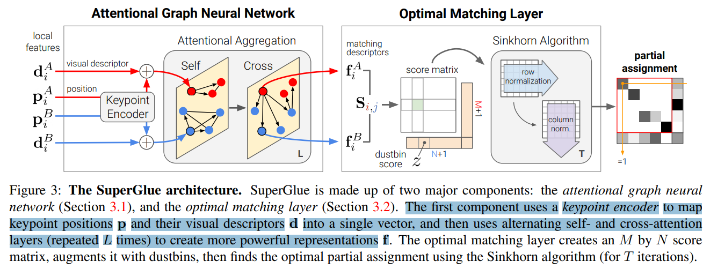
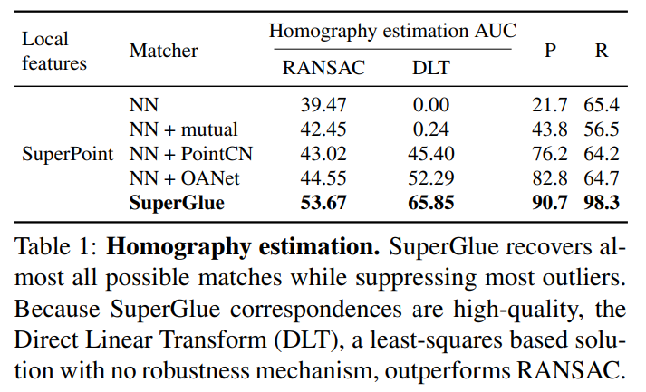
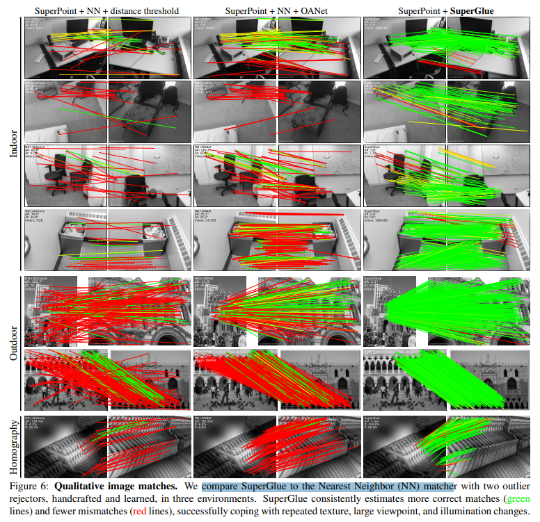
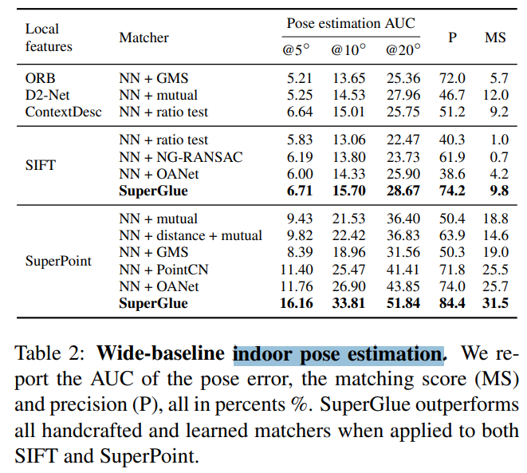

# SuperGlue: Learning Feature Matching with Graph Neural Networks

> "SuperGlue: Learning Feature Matching with Graph Neural Networks" CVPR, 2019 Nov 26
> [paper](http://arxiv.org/abs/1911.11763v2) [code](https://github.com/magicleap/SuperGluePretrainedNetwork) [pdf](./2019_11_CVPR_SuperGlue--Learning-Feature-Matching-with-Graph-Neural-Networks.pdf) [note](./2019_11_CVPR_SuperGlue--Learning-Feature-Matching-with-Graph-Neural-Networks_Note.md)
> Authors: Paul-Edouard Sarlin, Daniel DeTone, Tomasz Malisiewicz, Andrew Rabinovich (ETH)

## Key-point

- Task
- Problems
- :label: Label:

## Contributions

- 图像特征训练得到

> Compared to traditional, hand-designed heuristics, our technique learns priors over geometric transformations and regularities of the 3D world through end-to-end training from image pairs

- 支持实时

> The proposed method performs matching in real-time on a modern GPU and can be readily integrated into modern SfM or SLAM systems

## Introduction

- "SuperPoint: Self-Supervised Interest Point Detection and Description" CVPR-workshop, 2017 Dec 20
  [paper](http://arxiv.org/abs/1712.07629v4) [code](https://github.com/magicleap/SuperPointPretrainedNetwork) [pdf](./2017_12_CVPR-workshop_SuperPoint--Self-Supervised-Interest-Point-Detection-and-Description.pdf) [note](./2017_12_CVPR-workshop_SuperPoint--Self-Supervised-Interest-Point-Detection-and-Description_Note.md)
  Authors: Daniel DeTone, Tomasz Malisiewicz, Andrew Rabinovich

CNN 提取 visual descriptor 特征

## methods

使用 SuperPoint 类似的 visual descriptor 和像素位置作为 local feature。用 GNN 和 Transformer 优化这个 visual feature 用于 correspondence

可以直接放到 SLAM middle-end 部分

> In the context of SLAM, which typically [8] decomposes the problem into the visual feature extraction front-end and the bundle adjustment or pose estimation back-end, our network lies directly in the middle – SuperGlue is a learnable middle-end

拿已有的 local features 过 KeyPoint Encoder，把 position & visual descriptor 打成一个向量，过 self-attn, cross-attn 优化这个特征

### local feature

- Q：图像局部特征点，特征怎么搞？

当 SLAM 前端用 SuperPoint 网络得到的 visual descriptor，是室内室外姿态估计上性能 SOTA 

> When combined with SuperPoint [18], a deep front-end, SuperGlue advances the state-of-the-art on the tasks of indoor and outdoor pose estimation and paves the way towards end-toend deep SLAM

把 (关键点位置，visual-descriptors) 联合作为 local features

> Formulation: Consider two images A and B, each with a set of keypoint positions p and associated visual descriptors d – we refer to them jointly (p, d) as the local features.

**local features：关键点位置包含坐标 和 detection confidence；visual descriptor 使用 SIFT 或 SuperPoint 类似的  CNN 提取特征**

> Positions consist of x and y image coordinates as well as a detection confidence c, pi := (x, y, c)i .
>
> Visual descriptors di ∈ R D can be those extracted by a CNN like SuperPoint or traditional descriptors like SIFT
>
> - "SuperPoint: Self-Supervised Interest Point Detection and Description" CVPR-workshop, 2017 Dec 20
>   [paper](http://arxiv.org/abs/1712.07629v4) [code]() [pdf](./2017_12_CVPR-workshop_SuperPoint--Self-Supervised-Interest-Point-Detection-and-Description.pdf) [note](./2017_12_CVPR-workshop_SuperPoint--Self-Supervised-Interest-Point-Detection-and-Description_Note.md)
>   Authors: Daniel DeTone, Tomasz Malisiewicz, Andrew Rabinovich

## setting

- Each layer has 0.66M parameters. SuperGlue has 18 layers, with a total of 12M parameters.

## Experiment

> ablation study 看那个模块有效，总结一下

### Homography estimation

对比 matcher 方法（主要是近邻搜索）

性能比 NN 好

SuperPoint 特征比 SIFT 好一些。

## Limitations

## Summary :star2:

> learn what

### how to apply to our task

