# Image Quality Assessment: Unifying Structure and Texture Similarity

> "Image Quality Assessment: Unifying Structure and Texture Similarity" TPAMI, 2020 Apr 16, `DISTS`
> [paper](http://arxiv.org/abs/2004.07728v3) [code](https://github.com/dingkeyan93/DISTS.) [pdf](./2020_04_TPAMI_Image-Quality-Assessment--Unifying-Structure-and-Texture-Similarity.pdf) [note](./2020_04_TPAMI_Image-Quality-Assessment--Unifying-Structure-and-Texture-Similarity_Note.md)
> Authors: Keyan Ding, Kede Ma, Shiqi Wang, Eero P. Simoncelli

## Key-point

- Task: IQA
- Problems
- :label: Label:

## Contributions

- 参考人眼对于纹理图像中大致纹理相同，对细节纹理不敏感的特征，发现传统 PSNR & SSIM 指标效果于人眼差异大，提出第一个 full-reference **接近感知的指标 `DISTS`** 去逼近人眼对于纹理的感觉

  Deep Image Structure and Texture Similarity (DISTS)

  > we develop the first full-reference image quality model with explicit tolerance to texture resampling

- 构造一个 injective and differentiable function 用 CNN 提取多个尺度的特征，**发现特征在 spatial 取平均能提取纹理信息**

  > Using a convolutional neural network, we construct an injective and differentiable function that transforms images to multi-scale overcomplete representations. We demonstrate empirically that the spatial averages of the feature maps in this representation capture texture appearance, in that they provide a set of sufficient statistical constraints to synthesize a wide variety of texture patterns.

- SOTA，效果接近人眼，在 Texture classification 任务上也 ok

> show that the resulting Deep Image Structure and Texture Similarity (DISTS) index can be transformed into a proper metric in the mathematical sense. Moreover, DISTS corre lates well with human quality judgments in several inde pendent datasets, and achieves a high degree of invariance to texture substitution.

## Introduction

- Q：人眼对于相同大致纹理相同（都是草坪）但细节区域纹理不一致的图像，感觉是类似的。PSNR & SSIM & MSE 等传统指标基于两张**对齐的图像**去对比，发现对于大致纹理相同&细节不同的图像，和人眼主观感知是有差距的！

> But these methods rely on alignment of the images being compared, and are thus highly sensitive to differences between images of the same texture 

对图 A 用 jpeg 压缩降质得到 b；图 C 是同一片草地重新拍了一张图，只是细节位置和 a 不一致，大致纹理是一致的 & 高清。**但 PSNR & SSIM & MSE 等传统指标认为 b 的指标比 c 更高** :open_mouth:

所以说这些传统指标对于稍微不对齐不影响整体效果的场景，指标不准确 :star:

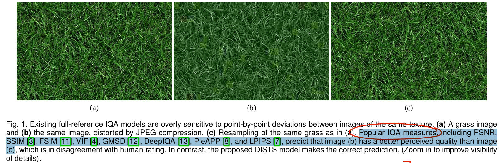

因此需要搞一个和人眼感受类似的指标

> Since textured surfaces are ubiquitous in photographic images, it is important to develop objective IQA metrics that are consistent with this aspect of perceptual similarity

提出一个 Full-reference IQA 指标，**目标对同一纹理图像的重新采样不敏感**（没对齐的同一张图，细节稍微不一致，但主体纹理类似）

> We present the first full-reference IQA method that is insensitive to resampling of visual textures

### metrics

- "Image quality assessment: From error visibility to structural similarity" TIP, 2004 Apr 30, `SSIM` 
  [paper](https://ieeexplore.ieee.org/document/1284395) [code](https://cave.cs.columbia.edu/projects/categories/project?cid=Computational+Imaging&pid=Minimalist+Vision+with+Freeform+Pixels) [pdf](./2004_04_TIP_Image-quality-assessment--From-error-visibility-to-structural-similarity.pdf) [note](./2004_04_TIP_Image-quality-assessment--From-error-visibility-to-structural-similarity_Note.md)
  Authors: Zhou Wang,  A.C. Bovik,  H.R. Sheikh,  E.P. Simoncelli

> A variety of proposed full-reference IQA methods pro vide a better account of human perception than MSE [3]–[8], and the Structural Similarity (SSIM) index [3] has become a de facto standard in the field of image processing.

- "The Unreasonable Effectiveness of Deep Features as a Perceptual Metric" CVPR, 2018 Jan 11, `LPIPS`
  [paper](http://arxiv.org/abs/1801.03924v2) [code]() [pdf](./2018_01_CVPR_The-Unreasonable-Effectiveness-of-Deep-Features-as-a-Perceptual-Metric.pdf) [note](./2018_01_CVPR_The-Unreasonable-Effectiveness-of-Deep-Features-as-a-Perceptual-Metric_Note.md)
  Authors: Richard Zhang, Phillip Isola, Alexei A. Efros, Eli Shechtman, Oliver Wang

## methods

对于同一个大致纹理 & 细节稍微有不一致（非对齐）的图像有一些容忍度

> Our goal is to develop a new full-reference IQA model that combines sensitivity to structural distortions (e.g., artifacts due to noise, blur, or compression) with a tolerance of texture resampling (exchanging the content of a texture region with a new sample of the same texture)

### Initial Transformation

- Q：为啥要先把图像转换成 perceptual 的特征？

> Our model is built on an initial transformation, f : R n 7→ R r , that maps the reference and distorted images (x and y, respectively) to “perceptual” representations (x˜ and y˜, respectively). 

Motivation: 先前工作发现在 RGB 像素角度，**图像不同区域的感知距离是不一样的。全部使用 MSE 去度量不适合作为感知指标 :star:**

> - "Eigen distortions of hierarchical representations" NIPS, 2017
>
> The primary motivation is that **perceptual distances are non-uniform in the pixel space** [35], [36], and this is the main reason that MSE is inadequate as a perceptual IQA model.

因此需要搞一个转换，从图像 RGB 空间，**映射到感知距离一致的一个空间** :star:

>  The purpose of function f is to transform the pixel representation to a space that is more perceptually uniform

### VGG 改进

参考 LPIPS，使用 CNN 的特征去衡量；

> In particular, Zhang et al. [7] have demonstrated that pre-trained deep features from VGG can be used as a substrate for quantifying perceptual quality

使用物体分类的预训练的 VGG16

> As such, we also chose to base our model on the VGG16 CNN [14], pre-trained for object recognition [40] on the ImageNet database [41].

先前工作发现 VGG16 中 max-pooling 容易映入 artifacts，改成 L2 pooling（参考了 Nyquist criterion）

> The “max pooling” operation of the original VGG architecture has been shown to introduce visible aliasing artifacts when used to interpolate between images with geodesic sequences [42]. **To avoid aliasing when subsampling by a factor of two,** the Nyquist theorem requires blurring with a filter whose cutoff frequency is below π 2 radians/sample [43]. Following this principle, we **replaced all max pooling layers in VGG with weighted  $l2$ pooling [42]:**

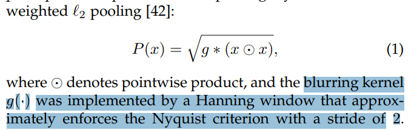

需要特征具有区分度

> A second desired property for our transformation is that it should be injective: distinct inputs should map to distinct outputs
>
> This is necessary to ensure that the final quality measure is a proper metric (in the mathematical sense) - if the representation of an image is non-unique, then equality of the output representations will not imply equality of the input images

提取 VGG 5 层的特征 &&**加入原始图像作为 0th 特征，来保证特征的一一对应性质**

> Like most CNNs, VGG discards information at each stage of transformation. To ensure an injective mapping, we simply included the input image as an additional feature map (the “zeroth” layer of the network). The representation then consists of the input image x, concatenated with the convolution responses of five VGG layers (labelled conv1 2, conv2 2, conv3 3, conv4 3, and conv5 3):

- Q：和 LPIPS 很类似，差距在哪？

>  LPIPS, which is built on VGG but with **no enforcement of the injective property**

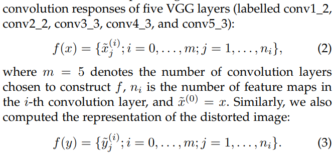

使用图像修复任务，用不同的 IQA 指标作为 loss 来训练，看 IQA 的效果

> We used a na¨ıve task – **reference image recovery** – to visually demonstrate the necessity of injective feature transformations. 

IQA 指标越小，图像质量越高！

> Specifically, given an original image x and an initial image y0, we aim to recover x by numerically optimizing $y^* = arg min_{y} D(x, y)$, where **D denotes a full-reference IQA measure** with a lower score indicating higher predicted quality, and y ? is the recovered image. 
>
> For example, if D is the MSE, the (trivial) analytical solution is y ? = x, indicating full recoverability.
>
> For the majority of existing IQA models, which are continuous and differentiable, solutions must be sought numerically, using gradientbased iterative solvers. 

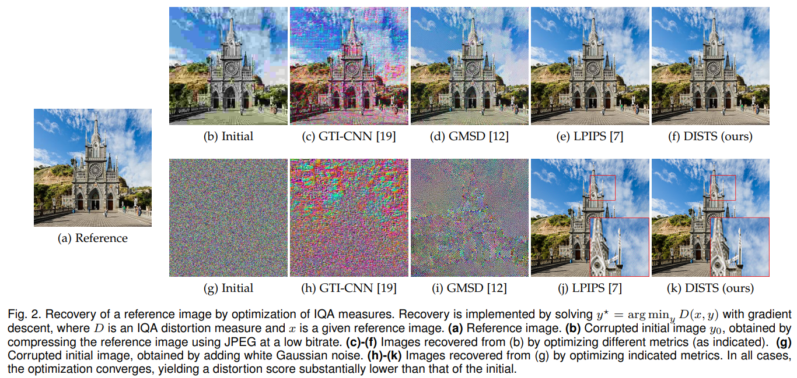

对于纯高斯噪声初始化的图像，LPIPS 作为 loss 修复出来存在伪影 :warning:

> The first two, which are based on surjective mappings, fail dramatically on this simple task when initialized with purely white Gaussian noise. LPIPS, which is built on VGG but with no enforcement of the injective property, recovers most structures and details, but leaves some visible artifacts in the converged image (Fig. 2 (j)). **In contrast, DISTS successfully recovers the reference image from any initialization.**

### Texture Representation

$\mu_{\tilde{x}}^{(i)}$ 是对 $\tilde{x}_j^(i)$ 通道取平均？

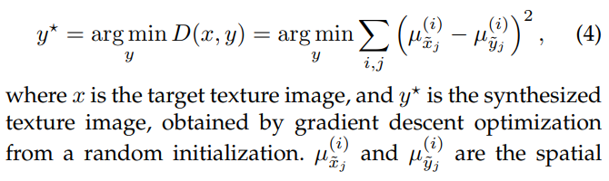

直接用特征的均值作为 loss 训练

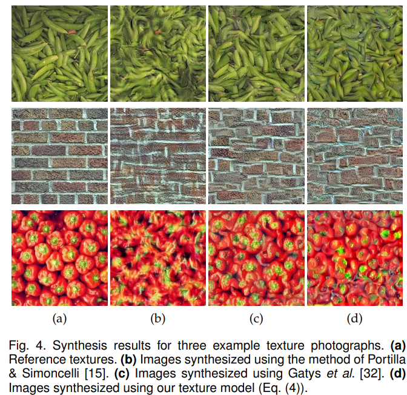

验证之前的发现，**浅层特征学颜色 & 强度等基础特征，深层特征学形状和纹理**

> Similar to observations in Gatys et al. [32], we found that measurements from **early layers appear to capture basic intensity and color information,** and those from **later layers summarize the shape and structure information.** 

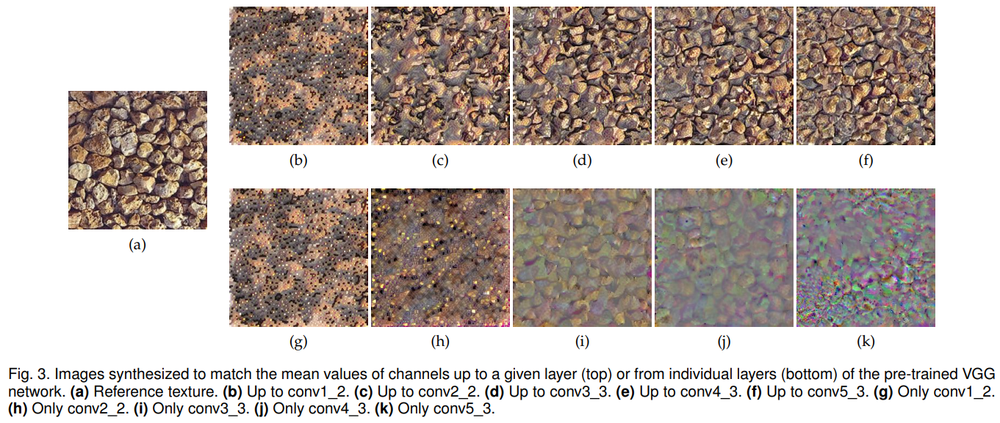

### Perceptual Distance Measure  指标:star:

从 VGG16 提取 5 层特征 & 图像本身，作为特征

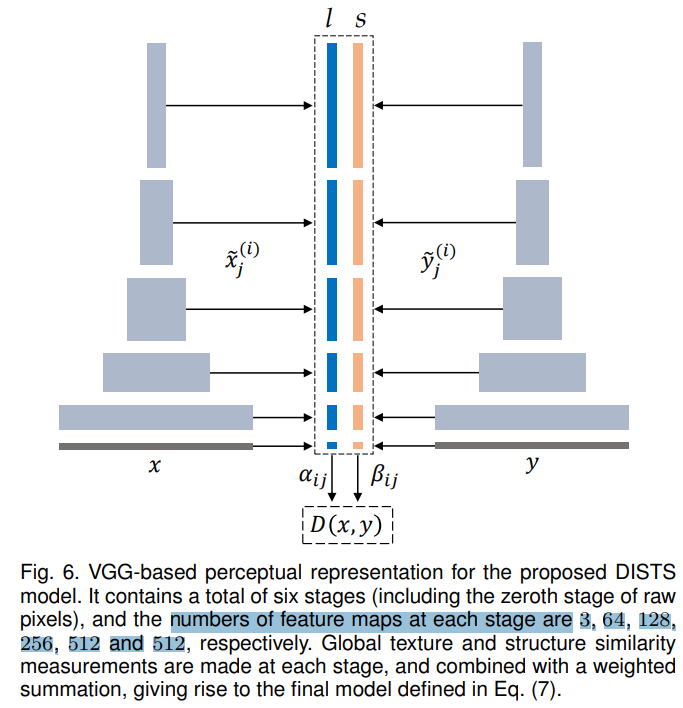

参考 SSIM 设计 texture 和 structure 的度量

> Inspired by the form of SSIM [3], we defined separate quality measurements for the texture (using the global means) and the structure (using the global correlations) of each pair of corresponding feature maps

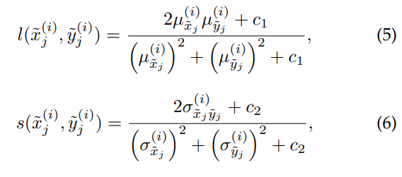

$\mu_{\tilde{x}},~(\sigma_{\tilde{x}})^2$ 是特征 $\tilde{x}$ 的均值和方差

> µ (i) x˜j , µ (i) y˜j , (σ (i) x˜j ) 2 , (σ (i) y˜j ) 2 , and σ (i) x˜j y˜j represent the global means and variances of x˜ (i) j and y˜ (i)

c1, c2 用来保证数值稳定，避免分母 = 0

> Two small positive constants, c1 and c2, are included to avoid numerical instability when the denominators are close to zero.

- **PS：这里 eq5-6 可以看作 texture 相似度 & structure 相似度，越相似越接近 1 :star:**

两项 texture 距离 & structure 距离取加权平均，这里各层的权值相加 = 1

> Finally, the proposed DISTS model combines the quality measurements from different convolution layers using a weighted sum:

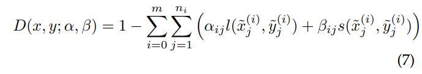

- Q：提取的特征是否有效？

看一下特征图，发现各个 stage 的特征图都有相关性，**说明提取的特征有意义**

> Fig. 5 visualizes some feature maps of the six stages of the reference image “Buildings”.  As can been seen, **spatial structures are present at all stages,** indicating strong statistical dependencies between neighbouring coefficients.

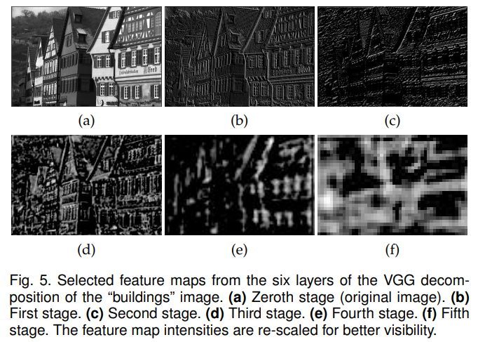

DISTS 性质

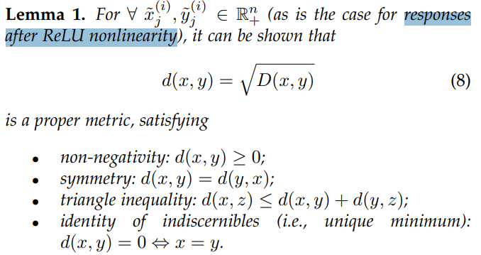

### Train

训练加权的那个权重

> The perceptual weights {α, β} in Eq. (7) were jointly optimized for human perception of image quality and texture invariance
>
> Specifically, for image quality, we minimized the absolute error between model predictions and human ratings:

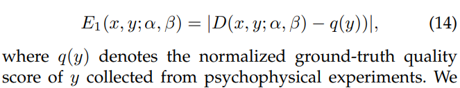

> We chose the large-scale IQA dataset KADID-10k [59] training set, which contains 81 reference images, each of which is distorted by 25 distortion types at 5 distortion levels. 

这里那个 D 是 DISTS score

优化各个 feature 的权重

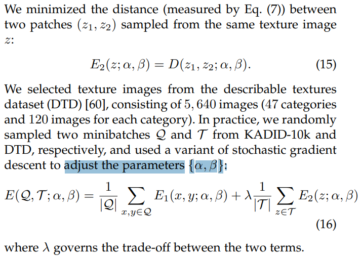

## setting

## Experiment

> ablation study 看那个模块有效，总结一下

- 衡量和人眼接近程度

效果和 LPIPS 很接近

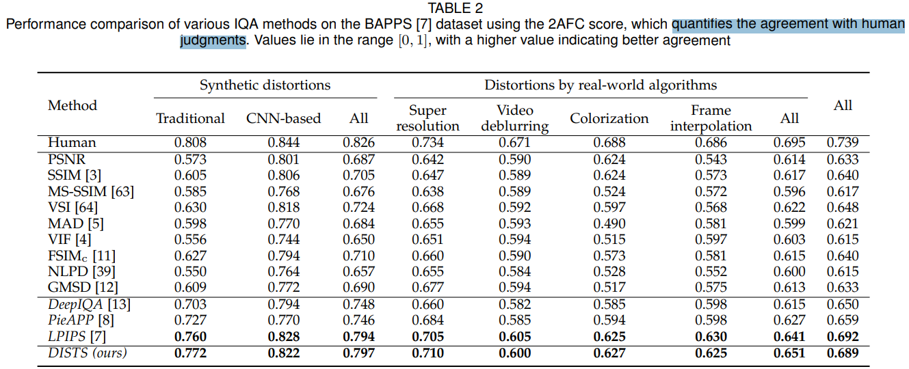

- 对于纹理图像，拉爆 LPIPS

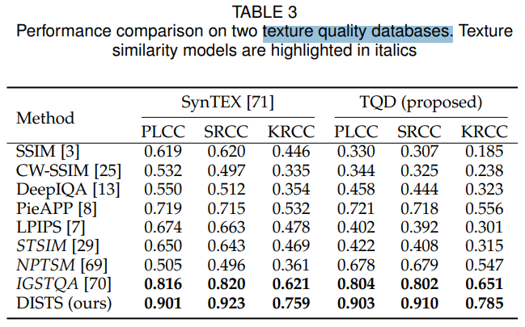

- 使用 DISTS 对退化图像排序

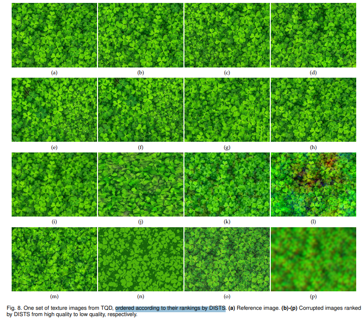

- Brodatz 纹理数据

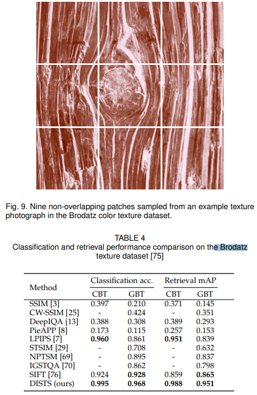

- 纹理图像

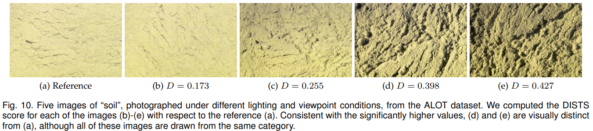

- 看下各种退化，对比 DISTS vs SSIM :star:
  - 对于图像位移 (b)，dilated(c), 旋转(c)，颜色偏移(d)
  - 部分物体移动 (e)
  - 高斯噪声(f), 高斯blur(g), JPEG(h,i)

1. SSIM 对物理位置整体移动很敏感！**对于物体移动 vs 高斯退化，高斯退化后的图像居然 SSIM 更高！！**
2. DISTS 区分度主要在 0-0.2 左右，**对于物体移动不敏感，物体移动但不降低质量的 DISTS 比加高斯噪声的更好**

## Limitations

## Summary :star2:

> learn what

- Q：为什么要在特征空间做？

Motivation: 先前工作发现在 RGB 像素角度，**图像不同区域的感知距离是不一样的。全部使用 MSE 去度量不适合作为感知指标 :star:** 因此需要搞一个转换，从图像 RGB 空间，**映射到感知距离一致的一个空间** :star:

> - "Eigen distortions of hierarchical representations" NIPS, 2017
>
> The primary motivation is that **perceptual distances are non-uniform in the pixel space** [35], [36], and this is the main reason that MSE is inadequate as a perceptual IQA model.

- Q：DISTS 指标咋算？

**PS：这里 eq5-6 可以看作 texture 相似度 & structure 相似度，越相似越接近 1 :star:**

- DISTS 性质

验证 triangle inequality

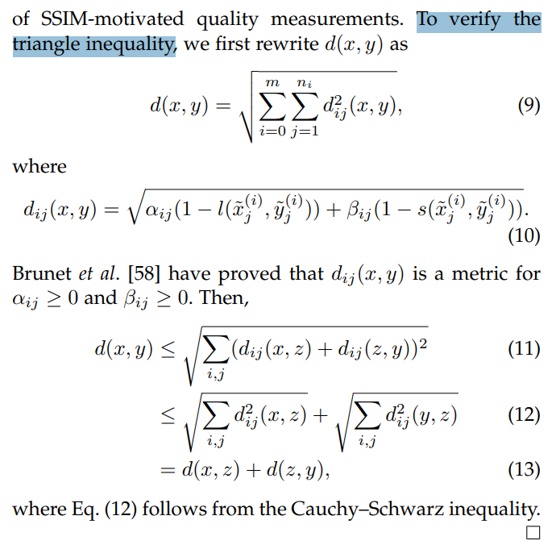

- 看下各种退化，对比 DISTS vs SSIM :star:
  - 对于图像位移 (b)，dilated(c), 旋转(c)，颜色偏移(d)
  - 部分物体移动 (e)
  - 高斯噪声(f), 高斯blur(g), JPEG(h,i)

1. SSIM 对物理位置整体移动很敏感！**对于物体移动 vs 高斯退化，高斯退化后的图像居然 SSIM 更高！！**
2. DISTS 区分度主要在 0-0.2 左右，**对于物体移动不敏感，物体移动但不降低质量的 DISTS 比加高斯噪声的更好**

### how to apply to our task

