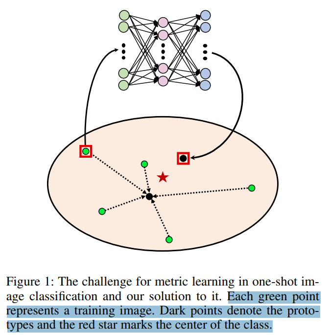
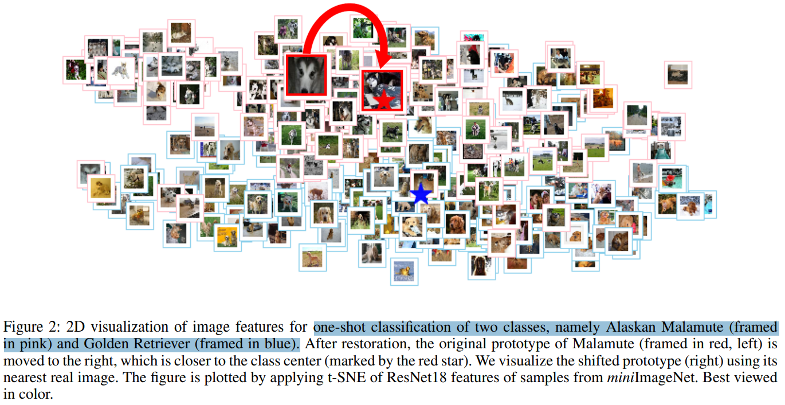
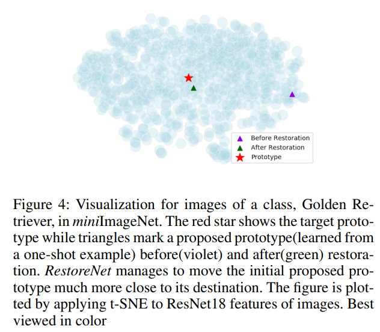

# One-Shot Image Classification by Learning to Restore Prototypes

> "One-Shot Image Classification by Learning to Restore Prototypes" AAAI, 2020 May 4, `RestoreNet`
> [paper](http://arxiv.org/abs/2005.01234v1) [code](https://github.com/xuewanqi/RestoreNet) [pdf](./2020_05_Arxiv_One-Shot-Image-Classification-by-Learning-to-Restore-Prototypes.pdf) [note](./2020_05_Arxiv_One-Shot-Image-Classification-by-Learning-to-Restore-Prototypes_Note.md)
> Authors: Wanqi Xue, Wei Wang

## Key-point

- Task

- Problems

  - for one-shot learning, the existing metric learning approaches would suffer poor performance because the single training image may not be representative of the class. 

    For example, if the image is far away from the class center in the feature space, the metriclearning based algorithms are unlikely to make correct predictions for the test images because the decision boundary is shifted by this noisy image

- :label: Label:

## Contributions

- 学习一个类别无关的特征，**优化图像在特征空间位置** restore 后更靠近中心

> To address this issue, we propose a simple yet effective regression model, denoted by RestoreNet, which learns a class agnostic transformation on the image feature to move the image closer to the class center in the feature space. 

- SOTA

## Introduction

> train image classifiers over the dataset with only one image per category.
>
>  In this paper, **we adopt metric learning** for this problem, which has been applied for few- and many-shot image classification by comparing the distance between the test image and the center of each class in the feature space.

- Q：为啥叫 restore？

可视化一下 t-SNE，原先红色框的狗狗分类错误，现在 restore **新的位置更靠近这个类别图像的中心**

## methods

## setting

## Experiment

> ablation study 看那个模块有效，总结一下

## Limitations

## Summary :star2:

> learn what

### how to apply to our task

