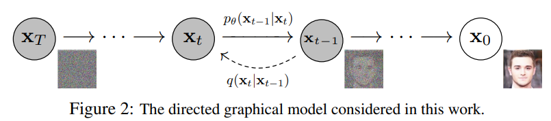
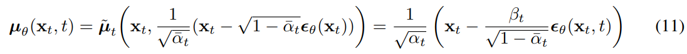

# Denoising Diffusion Probabilistic Models

> "Denoising Diffusion Probabilistic Models" NIPS, 2020 Jun 19
> [paper](http://arxiv.org/abs/2006.11239v2) [code](https://github.com/hojonathanho/diffusion) [pdf](./2020_06_NIPS_Denoising-Diffusion-Probabilistic-Models.pdf) [note](./2020_06_NIPS_Denoising-Diffusion-Probabilistic-Models_Note.md)
> Authors: Jonathan Ho, Ajay Jain, Pieter Abbeel

## Key-point

- Task
- Problems
- :label: Label:

## Contributions

## Introduction

- "Deep Unsupervised Learning using Nonequilibrium Thermodynamics" ICML, 2015 Mar 12
  [paper](http://arxiv.org/abs/1503.03585v8) [code]() [pdf](./2015_03_ICML_Deep-Unsupervised-Learning-using-Nonequilibrium-Thermodynamics.pdf) [note](./2015_03_ICML_Deep-Unsupervised-Learning-using-Nonequilibrium-Thermodynamics_Note.md)
  Authors: Jascha Sohl-Dickstein, Eric A. Weiss, Niru Maheswaranathan, Surya Ganguli

**forward process**

噪声表 $\beta$ 是确定的，因此可以一步加噪

**diffusion process**

**Loss**

ELBO 可以拆成 2 项：VAE Encoder （预测特征z 的分布，和 z 的真实特征分布之间的差异），Decoder 重建项（最大化 z 重建效果）

KL 散度公式（重建 or 去噪）的计算公式

### Langevin dynamics

- "Exponential convergence of langevin distributions and their discrete approximations" 1996
- "Bayesian learning via stochastic gradient langevin dynamics" ICML, 2011
- "Generative Modeling by Estimating Gradients of the Data Distribution" NIPS, 2019 Jul 12
  [paper](http://arxiv.org/abs/1907.05600v3) [code]() [pdf](./2019_07_NIPS_Generative-Modeling-by-Estimating-Gradients-of-the-Data-Distribution.pdf) [note](./2019_07_NIPS_Generative-Modeling-by-Estimating-Gradients-of-the-Data-Distribution_Note.md)
  Authors: Yang Song, Stefano Ermon
- "Improved techniques for training score-based generative models"

> Our $\epsilon$-prediction reverse process parameterization establishes a connection between diffusion models and denoising score matching over multiple noise levels with annealed Langevin dynamics for sampling [55, 56].

## methods

### Forward process

预先确定一个噪声表，用 eq4 加噪，因此加噪是确定的

> Thus, in our implementation, the approximate posterior q has no learnable parameters, so LT is a constant during training and can be ignored.

### Reverse process 一步

先固定方差，也变成一个确定的东西

去噪一步的公式也是这个

**改写成 $x_{t-1}$ 的 loss 形式** :star:

公式8 里面那个均值 $\tilde{\mu_t}(x_t, x_0)$ ，把 $x_0$ 用 parameterization trick 的公式 $x_t = \sqrt{\bar{\alpha_t}} * x_0 + \sqrt{(1-\bar{\alpha_t})}*\epsilon$  改写**得到 x0 作为模型预测的 x0；**
最后带入公式 7 里面那个均值公式，得到公式 10

### summary

> 小结，整理下公式

- 固定加噪

写成公式
$$
x_t = \sqrt{\bar{\alpha_t}} * x_0 + \sqrt{(1-\bar{\alpha_t})}*\epsilon
$$

- 去噪一步

去噪一步的公式

模型预测噪声 $\epsilon_\theta(x_t)$，代入 parameterization trick 得到 $\tilde{x_0}$，再拼成 $\mu_{\theta}$，替换掉 eq7 里面的均值

放到一起就是

Loss 改写

用 eq11 的均值，带入公式10 得到**简化的 loss**

### **training precedure**

> Algorithm 2, resembles Langevin dynamics with $\epsilon_\theta$ as a learned gradient of the data density.

### Data scaling

>  data consists of integers in {0, 1, . . . , 255} scaled linearly to [−1, 1]

## setting

**确定性加噪**

参考先前工作，T=1000, 噪声表中 $\beta_1=1e-4 \text{  linearly increasing to}\to \beta_T=0.02$ :star:

- "Deep Unsupervised Learning using Nonequilibrium Thermodynamics" ICML, 2015 Mar 12
  [paper](http://arxiv.org/abs/1503.03585v8) [code]() [pdf](./2015_03_ICML_Deep-Unsupervised-Learning-using-Nonequilibrium-Thermodynamics.pdf) [note](./2015_03_ICML_Deep-Unsupervised-Learning-using-Nonequilibrium-Thermodynamics_Note.md)
  Authors: Jascha Sohl-Dickstein, Eric A. Weiss, Niru Maheswaranathan, Surya Ganguli

> We set T = 1000 for all experiments so that the number of neural network evaluations needed during sampling matches previous work [53, 55]. We set the forward process variances to constants increasing linearly from β1 = 10−4 to βT = 0.02

**去噪模型**用 UNet

> To represent the reverse process, we use a U-Net backbone similar to an unmasked PixelCNN++ [52, 48] with group normalization throughout [66]
>
> **Parameters are shared across time**, which is specified to the network using the Transformer sinusoidal position embedding [60]

## Experiment

> ablation study 看那个模块有效，总结一下

## Limitations

## Summary :star2:

> learn what

### how to apply to our task

