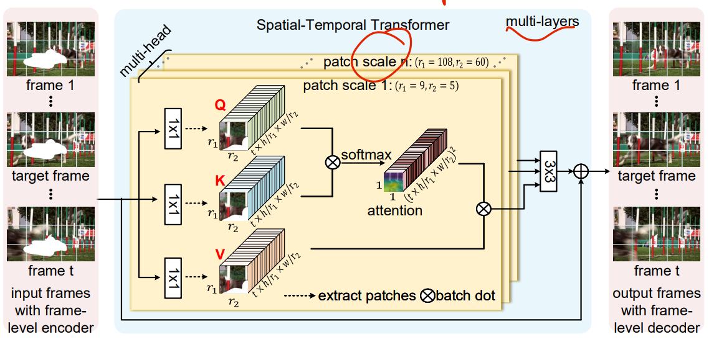
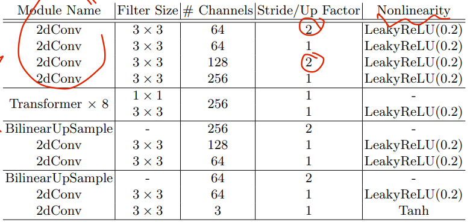
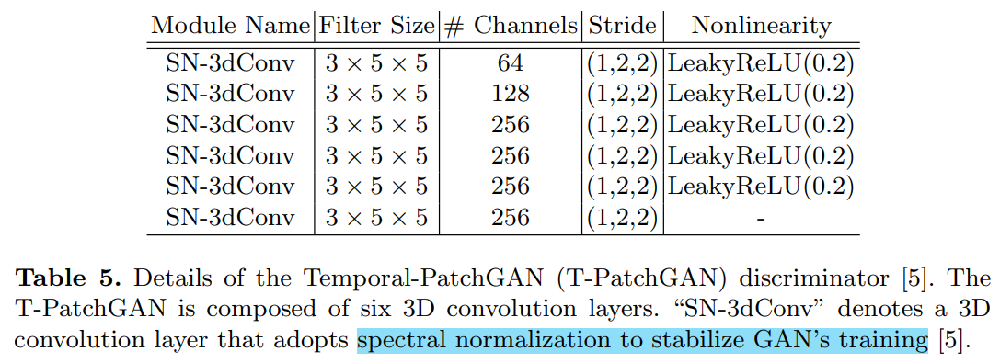

# STTN

> "Learning Joint Spatial-Temporal Transformations for Video Inpainting" ECCV, 2020 Jul, **STTN** :statue_of_liberty:
> [paper](https://arxiv.org/abs/2007.10247) [code](https://github.com/researchmm/STTN)
> [paper local pdf](./2020_07_ECCV_Learning-Joint-Spatial-Temporal-Transformations-for-Video-Inpainting.pdf)

## Key-point

- Task
- Background
- :label: Label:

分解为 patch，计算各个 patch 之间的相似度。

> 先关注 Encoder-Decoder，discriminator，之后工作都用的这个

## Contributions

## Related Work

## methods

- Encoder

  

- Discriminator 

  

  

## Experiment

> ablation study 看那个模块有效，总结一下

## Limitations

## Summary :star2:

> learn what & how to apply to our task