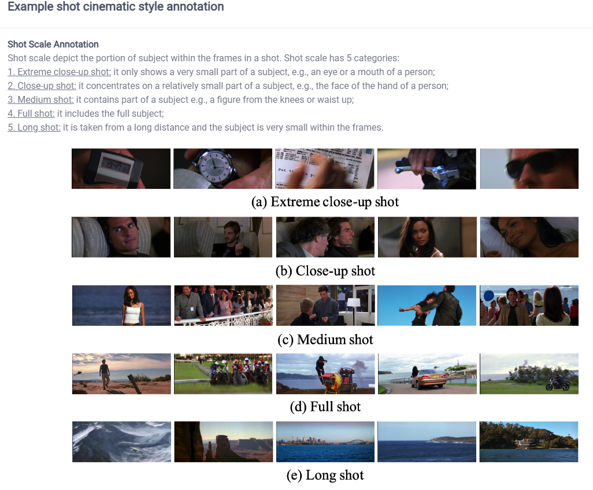
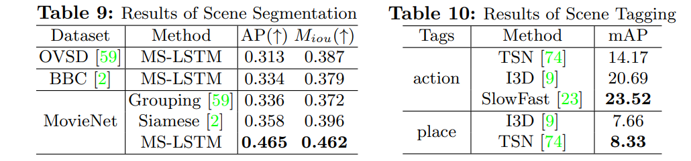

# MovieNet: A Holistic Dataset for Movie Understanding

> "MovieNet: A Holistic Dataset for Movie Understanding" ECCV, 2020 Jul 21
> [paper](http://arxiv.org/abs/2007.10937v1) [code](https://movienet.github.io) [pdf](./2020_07_ECCV_MovieNet--A-Holistic-Dataset-for-Movie-Understanding.pdf) [note](./2020_07_ECCV_MovieNet--A-Holistic-Dataset-for-Movie-Understanding_Note.md)
> Authors: Qingqiu Huang, Yu Xiong, Anyi Rao, Jiaze Wang, Dahua Lin

## Key-point

- Task: Movie Understanding
- Problems
  - how to understand a story-based long video with artistic styles, e.g. movie, remains challenging

- :label: Label:

- 目标：参考电影 clips 如何分类，去收集退化视频


## Contributions

- MovieNet is the largest dataset with richest annotations for comprehensive movie understanding.
- 通过提出的测试集，发现效果差异大，针对电影此类具有艺术手法的数据，video understanding 存在差距！

> Extensive experiments are executed on these benchmarks to show the immeasurable value of MovieNet and the gap of current approaches towards comprehensive movie understanding.

- 第一个数据集 -> 对于电影做多内容的完整标注

> To the best of our knowledge, MovieNet is the rst holistic dataset for movie understanding that contains a large amount of data from di erent modalities and high-quality annotations in di erent aspects.


## Introduction

movie 数据集

- https://opendatalab.com/OpenDataLab/MovieNet/tree/main/raw

```
C:\Users\Loki\workspace\Tongji_CV_group\VHS_video_restoration\dataset\shanghai_film_technology_plant\HQ_data\dataset_MovieNet
```

只提供了 240P 的 KeyFrames

- https://opendatalab.com/OpenDataLab/Moments_in_Time


- Q：和一般视频数据集差异？:star:

电影有艺术拍摄手法，action，scene，shot(镜头先放在面包上，都看不出是一个面包，然后逐渐拉远)

> the hundreds of thousands of movies in history containing rich content and multi-modal information become better nutrition for the data-hungry deep models

展示数据集时长，种类 :+1:

> There are totally 3K hour-long videos, 39M photos, 10M sentences of text and 7M items of meta information in MovieNet.

1. 出现的物体 or 场景一般对于故事有着特殊意义（人物在多个场景重复出现）
2. 拍摄手法：视角，相机运动，光线变化；收集了 46 K shots
3. 电影题材

>  entities, e.g. character, place, are important for high-level story understand
>
>  In addition, since movie is an art of filming, the cinematic styles, e.g., view scale, camera motion, lighting, etc. are also benecial for comprehensive video analysis. 
> Thus we also annotate the view scale and camera motion for more than 46K shots.
>
> genre analysis, cinematic style prediction, character analysis, scene understanding, and movie segment retrieval. 


**MovieNet 数据做了整体的标注**（标注内容的种类多）：照片，电影片段，每个片段的摘要文字，场景/ID/Action 的标识，镜头运动


- Q：收集数据还需要标注哪些数据？

1. ID
   1. 人物 bbox with temporal；
   2. Action/Place/Object Tag
2. scene boundary 切片段
3. 每个片段的 synopsis 摘要文字描述
4. 相机运动
5. 光线变化
6. 电影题材（cartoon, war, sport) 

- Q：Action，题材，使用哪些 Tag 标注？

> 不需要太复杂！


### The Long-Form Video Understanding (LVU) Benchmark

- "MVBench: A Comprehensive Multi-modal Video Understanding Benchmark" CVPR 2024
- "Towards Long-Form Video Understanding" CVPR 2021

> We introduce a framework for modeling long-form videos and develop evaluation protocols on large-scale datasets
>
> Pre-Training Details. We pre-train our models on the MovieClip videos for 308,000 iterations with a batch size of 16

使用 <60s 的电影片段训练

> In preliminary experiments, we do not see advantages with a longer training schedule or using spans longer than 60 seconds.
>
> - https://www.youtube.com/c/MOVIECLIPS

- "MovieChat: From Dense Token to Sparse Memory for Long Video Understanding" CVPR 2024
  [paper](https://openaccess.thecvf.com/content/CVPR2024/html/Song_MovieChat_From_Dense_Token_to_Sparse_Memory_for_Long_Video_CVPR_2024_paper.html)


- "Online Multi-modal Person Search in Videos" ECCV
  [web](https://movienet.github.io/projects/eccv20onlineperson.html)

有人物的 memory


### movie data

- "Scenes-objects-actions: A multi-task, multi-label video dataset" ECCV 2018

  [paper](https://www.ecva.net/papers/eccv_2018/papers_ECCV/papers/Heng_Wang_Scenes-Objects-Actions_A_Multi-Task_ECCV_2018_paper.pdf)

- "A dataset for movie description" CVPR 2015 `LSMDC`

> LSMDC[57] consists of **200 movies** with audio description (AD) pro viding linguistic descriptions of movies for visually impaired people


- "Moviegraphs: Towards understand ing human-centric situations from videos" CVPR

> MovieGraphs [71] is the most related one that provides graph based annotations of social situations depicted in clips of 51 movies. The anno tations consist of characters, interactions, attributes, etc..

标注最为相似的一个数据集，单独搞一个 paragraph 描述

- Q：发现有工作和自己超级相似怎么办？

视频相关更多类型数据

> not only movie clips and annotations, but also photos, subtitles, scripts, trailers, etc.
>
> Although sharing the same idea of multi-level annotations, MovieNet is di erent from MovieGraphs in three aspects: 

应用场景可以更多

> MovieNet can support and exploit different aspects of movie understanding while MovieGraphs focuses on situation recognition only

数据量大

> The scale of MovieNet is much larger than MovieGraphs


## methods

说标注内容可以对应到哪些 task


### Dataset

> We annotate scene boundaries to support the researches on scene segmentation, resulting in 42K scenes.

- Trailer 预告片，字幕
- 电影切分片段（scene segmentation annotation）


#### action & scene :star:

> There are 80 action classes in MovieNet
>
> There are 90 scene classes in MovieNet, 


> As shown in Tab. 7, MovieNet, which contains more than 43K scene boundaries and 65K action/place tags


#### cinematic style :star:

拍摄手法

> Shot scale has 5 categories:

目前 MovieNet 数据集只按镜头距离物体的远景程度来分了 5 类




##### **Shot Movement**

> - "Understanding movies"
>
> The original definitions of these categories come from [26] and we simplify them for research convenience


#### photo

- Photo 也能提供备用信息


- 演员 ID


### Annotation Workflow

> After collecting synopses from IMDb, we further l tered out synopses with **high quality, i.e. those contain more than 50 sentences, for annotating.** 
>
> Then we develop a coarse-to- ne procedure to e ectively align each paragraph to its corresponding segment.

video understanding 给一段描述，**人工去选取能够对应到的片段**

> 1. **At the coarse stage**, **each movie is split into N segments,** each lasting few minutes. Here we set N = 64. For each synopsis paragraph, we **ask the annotators to select K consecutive clips that cover the content of the whole synopsis** paragraph.
> 2. At the re ne stage, the annotators are asked to re ne the boundaries that make the resulting segment better aligned with the synopsis paragraph.


## setting

## Experiment

> ablation study 看那个模块有效，总结一下

提出数据集，看下能用于哪些下游任务，**证明用这个数据集训练效果可以更好！**




## Limitations


## Summary :star2:

> learn what

- video understanding 给一段描述，**人工去选取能够对应到的片段**


### how to apply to our task

- 参考收集数据的标准，自己去收集退化数据，做测试集合

**MovieNet 数据做了整体的标注**（标注内容的种类多）：照片，电影片段，每个片段的摘要文字，场景/ID/Action 的标识，镜头运动


- Q：收集数据还需要标注哪些数据？

1. ID
   1. 人物 bbox with temporal；
   2. Action/Place/Object Tag
2. scene boundary 切片段
3. 每个片段的 synopsis 摘要文字描述
4. 相机运动
5. 光线变化
6. 电影题材（cartoon, war, sport) 

- Q：Action，题材，使用哪些 Tag 标注？

> 不需要太复杂！


- Q：发现有工作和自己超级相似怎么办？

视频相关更多类型数据

> not only movie clips and annotations, but also photos, subtitles, scripts, trailers, etc.
>
> Although sharing the same idea of multi-level annotations, MovieNet is di erent from MovieGraphs in three aspects: 

应用场景可以更多

> MovieNet can support and exploit different aspects of movie understanding while MovieGraphs focuses on situation recognition only

数据量大

> The scale of MovieNet is much larger than MovieGraphs
