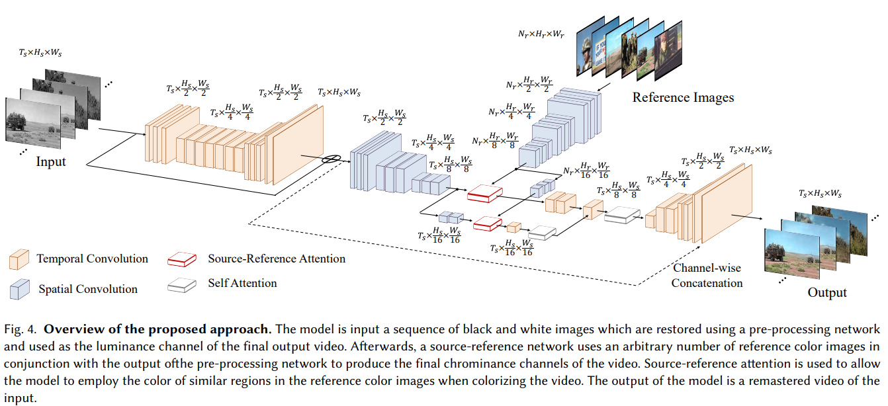

# DeepRemaster: Temporal Source-Reference Attention Networks for Comprehensive Video Enhancement

> "DeepRemaster: Temporal Source-Reference Attention Networks for Comprehensive Video Enhancement" SIGGRAPH-ASIA, 2020 Sep 18
> [paper](http://arxiv.org/abs/2009.08692v1) [web](http://iizuka.cs.tsukuba.ac.jp/projects/remastering/en/index.html) [code](https://github.com/satoshiiizuka/siggraphasia2019_remastering) [pdf](./2019_SIGGRAPH_DeepRemaster-Temporal-Source-Reference-Attention-Networks-for-Comprehensive-Video-Enhancement.pdf) [note](./2020_09_SIGGRAPH-ASIA_DeepRemaster--Temporal-Source-Reference-Attention-Networks-for-Comprehensive-Video-Enhancement_Note.md)
> Authors: Satoshi Iizuka, Edgar Simo-Serra

## Key-point

- Task
- Problems
- :label: Label:

## Contributions

- end2end 老视频修复框架
- 老视频数据合成方法
- reference image 融合特征 >> example-based

## Introduction

propose **a single framework** to tackle the entire video remastering task **semi-interactively.**

- source-reference attention **借助参考图像**实现半监督修复 :star:
- 一个网络整合多个任务

comparison methods：

- restoration

  DnCNN [Zhang et al. 2017b](https://github.com/cszn/DnCNN/tree/master)

  Wide Activation for Efficient and Accurate Image Super-Resolution [Yu et al. 2018](https://arxiv.org/abs/1808.08718)

  

- video colorization

  Real-Time User-Guided Image Colorization with Learned Deep Priors [Zhang et al. 2017a](https://arxiv.org/abs/1705.02999)
  Tracking Emerges by Colorizing Videos [Vondrick et al. 2018](https://arxiv.org/abs/1806.09594)

  

## methods

将**视频从 RGB 分解为 LAB 空间**（L 为亮度分量，AB 为颜色分量）

1. 使用前面一部分 `NetworkR` AutoEncoder 在灰度空间视频进行修复，得到 L 分量。
2. 使用 example-based 方法，用 reference images 提取特征融合到前面老电影得到的 L 分量中。具体融合方式，使用 cross-attention layer ，将 source（老电影特征）作为 Q，reference 特征作为 K, V 进行特征融合，之后 upsample 作为 AB 分量

### Temporal Source-Reference Attention

takes both a set of reference feature maps and a set of source feature maps as an input, and outputs a new set of feature maps of the same dimension as the source feature maps.

> 将 source -> query, reference -> key, value. 用 cross-attention 方式获取 source 与 reference 的关联性矩阵，再与 reference 相乘得到 source 上能用到的 reference 特征，与 source 相加。
>
> tips:coffee: reference 与 关联性矩阵相乘用 `torch.bmm` 矩阵乘法

recursion-based 方法只能**逐帧传递**某帧得到的 reference 信息，无法并行 & 缺乏 long dependencies 能力（相隔较远的帧缺乏一致性）。当 reference 更新，之前的 reference 信息断掉重新开始，导致降低时间轴上各帧的一致性

### Training :star:

> 关注如何合成老电影数据

使用 **合成方式 & example-based deterioration** 合成退化的视频作为老视频。

- 训练数据

  - deterioration 合成的老视频 & color video 视频对

    使用 Youtube-8M 数据集，作者发现里面一些游戏解说视频不适合退化为老视频，就自己挑选了 1569 个视频（给出了数据的 url）工 1kw 帧 （256x256）用于训练。

  - reference color image

  分解到 LAB 空间，对 L 分量 和 AB 分量计算误差

#### reference 选取

Training is done using batches of videos with 5 sequential frames each & [0, 6] 张参考图进行处理

- **number of color references images** z is chosen uniformly from the [0, 6] range.

  1 张 reference 从输入的邻近的 5 帧中抽取

  其余 reference 从剩下视频中随机取

## setting

### Dataset :star:

The list of video URLs used for training the model is available [here](http://iizuka.cs.tsukuba.ac.jp/projects/remastering/data/video_urls.zip) (unfortunately several links are no longer available).

The noise data used for simulating old film degradation is available [here (898MB)](http://iizuka.cs.tsukuba.ac.jp/projects/remastering/data/noise_data.zip).

作者从 Youtube-8M dataset 数据集，筛选了一些合适用于后续合成的视频，共 1569 个youtube 视频，给出了视频 url。作者后续抽帧抽出来 1 kw 帧用于训练。老视频合成方式：

- 用 Table3 里面的退化随机进行处理

- 退化模板 example-based 

  网上搜索 `film noise` 获取退化模板，当作随机的可加性噪声 

the noise data is randomly added to the input greyscale video, independently for each frame

## Experiment

> ablation study 看那个模块有效，总结一下

<video src = "http://iizuka.cs.tsukuba.ac.jp/projects/remastering/images/comparisons/remastering/a-bomb_blast_effects_512kb_comp.mp4"></video>

自己的合成数据测试指标

## Limitations

## Summary :star2:

> learn what

### how to apply to our task

