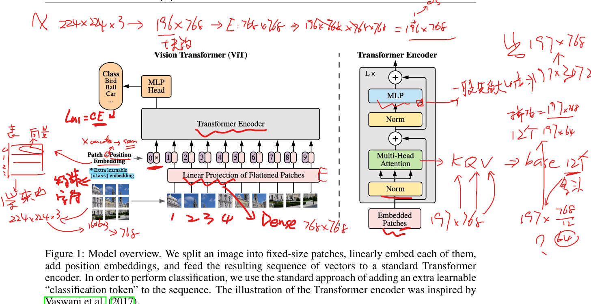
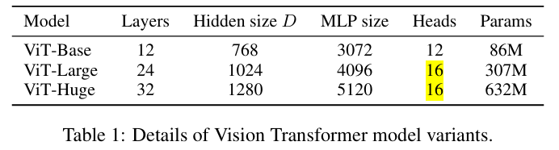

# An Image is Worth 16x16 Words: Transformers for Image Recognition at Scale

> "An Image is Worth 16x16 Words: Transformers for Image Recognition at Scale" ICLR, 2020 Oct 22
> [paper](http://arxiv.org/abs/2010.11929v2) [code]() [pdf](./2020_10_ICLR_An-Image-is-Worth-16x16-Words--Transformers-for-Image-Recognition-at-Scale.pdf) [note](./2020_10_ICLR_An-Image-is-Worth-16x16-Words--Transformers-for-Image-Recognition-at-Scale_Note.md)
> Authors: Alexey Dosovitskiy, Lucas Beyer, Alexander Kolesnikov, Dirk Weissenborn, Xiaohua Zhai, Thomas Unterthiner, Mostafa Dehghani, Matthias Minderer, Georg Heigold, Sylvain Gelly, Jakob Uszkoreit, Neil Houlsby

## Key-point

- Task
- Problems
- :label: Label:

## Contributions

## Introduction

## methods

可学习参数 Position embeddings

> **Position embeddings** are added to the patch embeddings to retain positional information. We use standard learnable 1D position embeddings, since we have not observed significant performance gains from using more advanced 2D-aware position embeddings

> ViT-L/16 means the “Large” variant with 16 16 input patch size.

## setting

## Experiment

> ablation study 看那个模块有效，总结一下

## Limitations

## Summary :star2:

> learn what

### how to apply to our task

