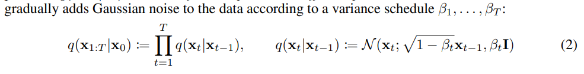
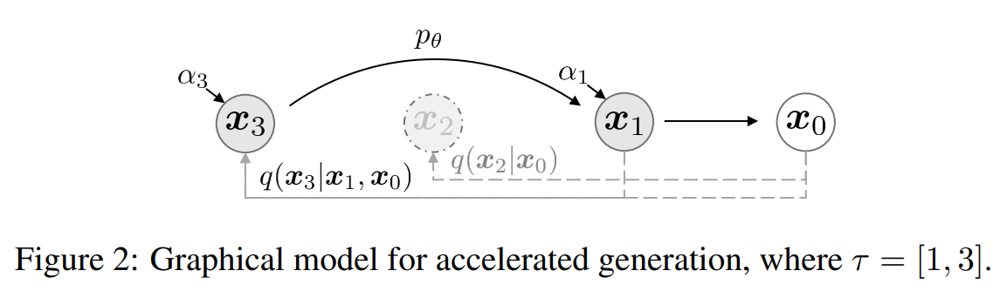

# Denoising Diffusion Implicit Models

> "Denoising Diffusion Implicit Models" ICLR, 2020 Oct 6, `DDIM`
> [paper](http://arxiv.org/abs/2010.02502v4) [code](https://github.com/ermongroup/ddim) [pdf](./2020_10_ICLR_Denoising-Diffusion-Implicit-Models.pdf) [note](./2020_10_ICLR_Denoising-Diffusion-Implicit-Models_Note.md)
> Authors: Jiaming Song, Chenlin Meng, Stefano Ermon

## Key-point

- Task：Diffusion 去噪加速
- Problems
  - DDPM 去噪太慢

- :label: Label:

## Contributions

- 对 DDPM 进行泛化，使用 Non-Markovian Diffusion Process 维持同一个 training objective 的同时，实现加速

  > We generalize DDPMs via a class of non-Markovian diffusion processes that lead to the same training objective. These non-Markovian processes can correspond to generative processes that are deterministic, giving rise to implicit models that produce high quality samples much faster.

  比 DDPM 快 $10\times \to 50 \times$ 倍

  > DDIMs can produce high quality samples 10× to 50× faster in terms of wall-clock time compared to DDPMs, allow us to trade off computation for sample quality,

- 学到的 latent space 能够进行有意义的插值

  > perform semantically meaningful image interpolation directly in the latent space, and reconstruct observations with very low error

## Introduction

> DDIMs are implicit probabilistic models and are closely related to DDPMs, in the sense that they are trained with the same objective function.

- " Learning in implicit generative models."

> - In Section 3, we generalize the forward diffusion process used by DDPMs, which is Markovian, to non-Markovian ones, for which we are still able to design suitable reverse generative Markov chains.
> - In Section 5, we demonstrate several empirical benefits of DDIMs over DDPMs. 
>   1. superior sample generation quality & we accelerate sampling by 10× to 100× using our proposed method
>   2. DDIM samples have the following “consistency” property, which does not hold for DDPMs
>   3. “consistency” in DDIMs, we can perform semantically meaningful image interpolation

### DDPM

- "Denoising Diffusion Probabilistic Models" NIPS, 2020 Jun 19, `DDPM`
  [paper](http://arxiv.org/abs/2006.11239v2) [code](https://github.com/hojonathanho/diffusion) [pdf](./2020_06_NIPS_Denoising-Diffusion-Probabilistic-Models.pdf) [note](./2020_06_NIPS_Denoising-Diffusion-Probabilistic-Models_Note.md)
  Authors: Jonathan Ho, Ajay Jain, Pieter Abbeel

- Q：DDPM 不用 GAN-training 就能生成高质量图像；**但 DDPM 去噪太慢？**

> Denoising diffusion probabilistic models (DDPMs) have achieved high quality image generation without adversarial training, yet they require simulating a Markov chain for many steps in order to produce a sample.

对比一下， GAN 只需要一次前向

> For example, it takes around 20 hours to sample 50k images of size 32 × 32 from a DDPM, but less than a minute to do so from a GAN on a Nvidia 2080 Ti GPU. This becomes more problematic for larger images as sampling 50k images of size 256 × 256 could take nearly 1000 hours on the same GPU.

- 优化目标

换成联合概率的 ELBO :star:

DDPM 中的 Loss 改写

- Q：DDPM 加噪去噪过程是 Markovian process ？

> In DDPMs, the generative process is defined as the reverse of a particular **Markovian diffusion process**

加噪 $x_0 \to x_t$ 拆解为 T 步，每一步的概率连乘！这里就是 Markovian Process :star:

> 记住这个公式，**DDIM paper 里面的 $\alpha$ 是 DDPM paper 里面连乘的那个 $\bar{\alpha}$**，记作了 $\alpha_t = \prod_i^t (1-\beta_i)$

下面这个是 DDPM paper 里面的公式

- Q：DDPM 加噪 & 去噪？

$$
Forward: ~x_t = \sqrt{\alpha_t} x_{t-1} + \sqrt{1-\alpha_t} *\epsilon_{t-1},  ~~ \epsilon_{t-1} \in \N(\epsilon;0,I)\\
=\sqrt{\bar{\alpha}} *x_0 + \sqrt{1-\bar{\alpha}} * \epsilon  \qquad where~\epsilon \in \mathcal{N(0,1)}\\
\\
$$

- a large T allows the reverse process to be close to a Gaussian

> αt evolves over time according to a fixed or learnable schedule

等价式子

> - "Understanding Diffusion Models: A Unified Perspective" Arxiv, 2022 Aug :+1:
>   [paper](https://arxiv.org/abs/2208.11970) [pdf](./2022_08_Arxiv_Understanding Diffusion Models-A Unified Perspective.pdf)

方差固定后，只需要预测均值即可。因此简化下均值的公式

再简化一下，推到见 [paper](https://arxiv.org/abs/2208.11970)

## methods

- 注意：DDIM 这篇论文里的 DDPM 公式 $\alpha$ 是 DDPM paper 里面公式的 $\bar{\alpha}$ :warning: 看起来公式和 DDPM 不一样！

### Summary :field_hockey:

> https://sachinruk.github.io/blog/2024-02-11-DDPM-to-DDIM.html

- `NON-MARKOVIAN FORWARD` 将 DDPM 加噪的式子用联合概率等价地改写一下；
  **每一步加噪 or 去噪都会用到上一步和 x0**，例如加噪 $x_t$ 要用 $x_0, x_{t-1}$，因此就**不是 Markovian 了**
- 去噪 & loss：上述 non-Markovian 去噪公式（Bayes 公式搞一下），得出对应去噪公式；证明了 Loss 和 DDPM 等价，因此不用重新训练
- Accelerated Sampling, 在 1->T 等间隔采样 S 步，稍微改写了下去噪的公式（适配采样的 S 步）

### NON-MARKOVIAN FORWARD

先看下 DDPM 的 Loss 公式，**DDPM 中的 ELBO loss 是根据 $q(x_t | x_0)$ 一步加噪的公式改写的**

> Our key observation is that the DDPM objective in the form of $L_\gamma$ only depends on the marginals $q(x_t | x_0)$ 
>
> 看 Appendix 2

**想换成联合概率看有什么性质 $q(x_{(1T:)} | x_0)$** :star:，因此设计了下面这个图右边的加噪方式

>  Since there are many inference **distributions (joints) with the same marginals**, we explore alternative inference processes that are non-Markovian, which leads to new generative processes (Figure 1, right)

**探索一下去噪公式，想用联合概率的公式改下**，看看和之前一步加噪的有什么联系，

去噪时候想结合联合概率，发现和之前的一步加噪差一个连乘 $\prod q_{\sigma}(x_{t-1} | x_t, x_0)$ ，**因此获取到每次一步去噪的公式 $q_{\sigma}(x_{t-1} | x_{t}, x_0)$；过一个 Bayes 公式得到对应加噪一步的公式  $$q_{\sigma}(x_{t} | x_{t-1}, x_0)$$ **

- **每一步加噪 or 去噪都会用到上一步和 x0**，例如加噪 $x_t$ 要用 $x_0, x_{t-1}$，因此就不是 Markovian 了 :star:

> the **forward process here is no longer Markovian**, since each xt could depend on both xt−1 and x0.

- 注意上面**去噪公式里面有一个 $\sigma$，其决定了加噪的随机性**，如果变为 $\sigma = 0$ 加噪就和 DDPM 一样变成确定的了 :star:

> The magnitude of σ controls the how stochastic the forward process is; when σ → 0, we reach an extreme case where as long as we observe x0 and xt for some t, then xt−1 become known and fixed.

#### $q(x_{t-1}|x_t,x_0)$ 推导

- Q：为什么 $q(x_{t-1}|x_t,x_0)$ 是 eq7 这个式子？:star:

- 首先 eq8 是一个 Bayes 公式 

> [Bayes' rule with 3 variables](https://math.stackexchange.com/a/1281558)
>
> Taking it one step at a time. :star:

$$
\begin{align}
\mathsf P(R\mid H, S) & = \frac{\mathsf P(R,H,S)}{\mathsf P(H, S)}
\\[1ex] & =\frac{\mathsf P(H\mid R,S)\,\mathsf P(R, S)}{\mathsf P(H, S)}
\\[1ex] & =\frac{\mathsf P(H\mid R,S)\,\mathsf P(R\mid S)\,\mathsf P(S)}{\mathsf P(H, S)}
\\[1ex] & =\frac{\mathsf P(H\mid R,S)\,\mathsf P(R\mid S)}{\mathsf P(H\mid S)}\frac{\mathsf P(S)}{\mathsf P(S)}
\\[1ex] & =\frac{\mathsf P(H\mid R,S)\;\mathsf P(R\mid S)}{\mathsf P(H\mid S)}
\end{align}
$$

把 eq7 推导一下得到，
$$
\begin{align}
\mathsf P(x_{t-1} \mid x_t, x_0 ) & = \frac{\mathsf P(x_t, x_0, x_{t-1})}{\mathsf P(x_0, x_{t})}
\\ & = \frac{\mathsf P(x_t \mid x_0, x_{t-1}) \mathsf P(x_0, x_{t-1})}{\mathsf P(x_{t}, x_0)}

\\ & = \frac{\mathsf P(x_t \mid x_0, x_{t-1}) \mathsf P(x_{t-1} \mid x_0) \cancel{\mathsf P(x_0)}}{\mathsf P(x_{t} \mid x_0) \cancel{\mathsf P(x_0)}} 

\end{align}
$$

- 得到三个加噪的公式就 ok 拉

$$
\mathsf P(x_t \mid x_0, x_{t-1}) = \mathcal{N}(\sqrt{\alpha_t} \dotproduct x_{t-1}, ~(1-\alpha_t)I ) 
\\ \mathsf P(x_{t-1} \mid x_0) = \mathcal{N}(\sqrt{\bar\alpha_{t-1}} \dotproduct x_{0}, ~(1-\bar\alpha_{t-1})I )
\\ \mathsf P(x_{t} \mid x_0) = \mathcal{N}(\sqrt{\bar\alpha_{t}} \dotproduct x_{0}, ~(1-\bar\alpha_{t})I )
$$

- 按高斯分布展开，看下

> - "Understanding Diffusion Models: A Unified Perspective" Arxiv, 2022 Aug :+1:
>   [paper](https://arxiv.org/abs/2208.11970) [pdf](./2022_08_Arxiv_Understanding Diffusion Models-A Unified Perspective.pdf)
>
> 看 PDF P12 eq74 有推导，

### 去噪 & loss

**模型还是用之前一样的公式预测 x0**，去噪 $x_{t-1}$ 要用到 $x_t, x_0$ 去噪公式要分类一下，用 eq7 那个公式

- $t \neq 1$ 时候，去噪一步的 non-Markovian 公式 eq7

#### Loss

将 DDPM 的 ELBO 中 $q(x_T|x_0)$ 改写为 $q(x_{1:T} | x_0)$  

这个 loss 里面要用到的公式，再列一下

- $p(x_{0:T})$ &&  **DDIM 把 DDPM 的 ELBO 改写成联合概率，现在优化 loss 的由来** :star:

  

  eq2 的 loss 进一步简化一下得到下面这个 loss，**发现有一个 $\gamma$** ，后面会说到这个 $\gamma$会对 DDIM 的 loss 有啥影响

  

- $q(x_{1:T} | x_0)$

  

- Q：去噪一步的式子 $q(x_{1:T} | x_0)$ 有一个超参 $\sigma$ (加噪程度)，**会造成 DDIM 的 ELBO loss $\mathcal{J}_\theta{(\epsilon_\theta)}$ 和 DDPM 的 Loss 有什么区别？**

注意这里去噪一步的式子里面有一个 $\sigma$，这也意味着不同模型加噪的程度不同，是不同的生成过程！

> From the definition of Jσ, it would appear that a different model has to be trained for every choice of σ, since it corresponds to a different variational objective (and a different generative process)

这里说明了为什么 DDIM 和 DDPM 训练的 loss 实际上是同一个！:star:

> However, Jσ is equivalent to Lγ for certain weights γ, as we show below

- Q：没看懂为什么模型参数和 t 无关时候， $\gamma$  不影响和 DDPM loss 的一致性? :question:

DDPM 训练时候这个 $\gamma = 1$ 

### SAMPLING :star:

DDIM 上述非 Markovian 的加噪方式，**去噪一步的公式**里面会需要一个 $\sigma$ 的超参；

>  many non-Markovian forward processes parametrized by σ that we have described.

同时上面也论证了 DDPM 和 DDIM 优化目标是一样的，**因此可以用 DDPM 的模型，去调整 DDIM 的超参 $\sigma$**

> focus on finding a generative process that is better at producing samples subject to our needs by changing σ.

- 回顾一下前面去噪一步的公式 :star: (主要是 eq7 ，这里还不是最简，看下面)

  
  

#### DDIM

把 eq7 再简化一下得到下面这个去噪一步公式，因此要用到 $x_t$ 得到的 noise

有以下几个发现

- 当 $\sigma$ 改成 DDPM 里面那个固定的式子，DDIM 采样就变为 DDPM 了，**因此 DDPM 是 DDIM 的一个特例** （DDIM 把 DDPM 去噪公式推广了一下，**这里还没加速哦**）:warning:
- **$\sigma_t = 0$ 加噪过程就一样也是确定的**，去噪过程中 random noise 那一项也是 0，模型就变成了 Implicit probabilistic model

上面 eq12 公式里面的方差 $\sigma$ 具体形式，可以对比 DDPM 公式

- Q：什么是 Implicit probabilistic model？

> - "Learning in implicit generative models" Arxiv, 2016 Oct 11,
>   [paper](https://arxiv.org/abs/1610.03483)

特征去噪固定？？

> where samples are generated from latent variables with a fixed procedure (from xT to x0)

因此称作 denoising diffusion implicit model

> We name this the denoising diffusion implicit model (DDIM, pronounced /d:Im/), because it is an implicit probabilistic model trained with the DDPM objective (despite the forward process no longer being a diffusion)

#### Accelerated Sampling :star:

只要 $q(x_t \mid x_0)$ 是固定的，模型训练也不依赖于特定的 forward 方式**（前面验证了 Loss 是等价的）**

> Using a similar argument as in Section 3, we can justify using the model trained with the L1 objective, so **no changes are needed in training**

尝试看看把原来的**加噪 T 步，等间隔采样 timestep 缩短为 S 步 $\{x_{\tau 1}, ..., x_{\tau S} \}, (S<<T)$**

- 前面论证过 Loss 是一样的，因此不需要重新训练；只需要对 eq12 去噪一步的公式稍微改一丢丢，因为是有间隔的 step 要改一下

> 细节看 Appendix C.1

**在 $1\to T $ 中随机采样 S 步**，构成 $[1, \tau_1, ..., \tau_S=T]$，看 fig2 是从 x1 开始的

Comparing with origin T-steps formula, $q_{\sigma}(x_{1:T} \mid x_0)$. Seems to have a additional item  $\prod{q_{\sigma,\tau}}(x_t \mid x_0)$，

- Q: how eq6 comes from? :question:

  > https://github.com/ermongroup/ddim/issues/41

#### Relevance to NEURAL ODES

把 eq12 改写为 ODE 形式

可以类似获取有意义的特征

> This suggests that unlike DDPM, we can use DDIM to obtain encodings of the observations (as the form of xT ), which might be useful for other downstream applications that requires latent representations of a model

- 与 SDE 的联系

SDE 对 $dt$ 取 Euler steps，DDIM 对 $d_{\sigma}(t)$ 取 Euler steps

> **has an equivalent probability flow ODE** corresponding to the “Variance-Exploding” SDE in Song et al. (2020).
>
> In fewer sampling steps, however, these choices will make a difference; we take Euler steps with respect to dσ(t) (which depends less directly on the scaling of “time” t) whereas Song et al. (2020) take Euler steps with respect to dt.

## setting

- FID 越低越好

## Experiment

> ablation study 看那个模块有效，总结一下

- 速度比 DDPM 快

  > we show that DDIMs outperform DDPMs in terms of image generation when fewer iterations are considered, giving speed ups of 10× to 100× over the original DDPM generation process.

- 一旦 $x_T$ 确定了，DDIM 能够获取高维度的图像特征，进行有意义的插值；DDPM 做不了

  > unlike DDPMs, once the initial latent variables xT are fixed, DDIMs retain high

- DDIM 可以拿 latent space 进行重建图像，DDPM 由于需要随机采样做不到有较好的图像特征

这里做实验的模型和 DDPM 用的同一个，因为不需要重新训练！

> we use the same trained model with T = 1000 and the objective being Lγ from Eq. (5) with γ = 1;

区别在于，加速采样的步数 $\tau$ 和随机性 $\sigma$ (方差)，实验生成效果

> The only changes that we make is **how we produce samples from the model;** we achieve this by **controlling $\tau$** (which controls how fast the samples are obtained) and $\sigma$ (which interpolates between the deterministic DDIM and the stochastic DDPM).

- 控制式子里面的 $\eta$  实现随机性的控制 $\sigma(\eta)$

  DDPM $\eta=1$ , DDIM $\eta=0$

### SAMPLE QUALITY AND EFFICIENCY

- models trained on CIFAR10 and CelebA

- 这个表格里面 $\eta=0$ 认为是 DDIM，$\eta=1$ DDPM; $\hat\sigma$ 代表较大扰动的 

  $\sigma$ 和DDPM 论文中一样，因此结果最好

  > https://github.com/ermongroup/ddim/issues/8

S 表示采样步数

1. S=100 时候 $\eta=0$ 的 DDIM  vs  $\eta=1$ 的 DDPM T=1000 , **DDIM 生成图像的 FID 更低 or 稍微搞一丢 ，但速度快了 x10**
2. T 取小了，DDPM 完全不能打，DDIM 还稍微好一些，FID 好了一倍
3. DDPM 论文里面较大扰动的 $\hat\sigma$ 对于步数较少的生成完全不太能用

小结一下：**DDIM 在采样更少步数的情况下，效果比 DDPM 好很多**

> We observe that DDIM (η = 0) achieves the best sample quality when dim(τ ) is small, and DDPM (η = 1 and σˆ) typically has worse sample quality compared to its less stochastic counterparts with the same dim(τ ),

### S 不同时，生成图像的一致性

DDIM 对于分辨率较小的图像，**T=1k, 100, 50 效果接近，且一致性很好；**

### INTERPOLATION

特征插值，采样 2 个 xT，插值一下，再用 DDIM 去噪出图

插值结果是有意义的

### 重建

> encode from x0 to xT (reverse of Eq. (14)) and reconstruct x0 from the resulting xT

- 可以看出 S 越大，DDIM 有更低的重建误差

- Q：DDIM 有类似 ODE flow 的性质？？:question:

  > and have properties similar to Neural ODEs and normalizing flows

## Limitations

## Summary :star2:

> learn what & how to apply to our task

- DDIM 加噪去噪过程不是 Markovian Process 了

  DDPM 去噪公式用的是一步加噪的公式改的，DDIM 想看下用联合概率和之前有什么联系，推到了一下公示，改写为

  **每一步加噪 or 去噪都会用到上一步和 x0**，例如加噪 $x_t$ 要用 $x_0, x_{t-1}$，因此每一步加噪去噪就不是 Markovian 了 :star:

- Q：为什么 $q(x_{t-1}|x_t,x_0)$ 是 eq7 这个式子？:star:

  Bayes 公式花间一下，就可以变成 3 个加噪的公式

- DDIM 能更高效（步数更少）的情况下，比 DDPM，SDE 有更高的生成质量

  > quality samples much more efficiently than existing DDPMs and NCSNs,

- Q：什么是 Implicit probabilistic model？
- Q：DDIM 有类似 ODE flow 的性质？？:question:

