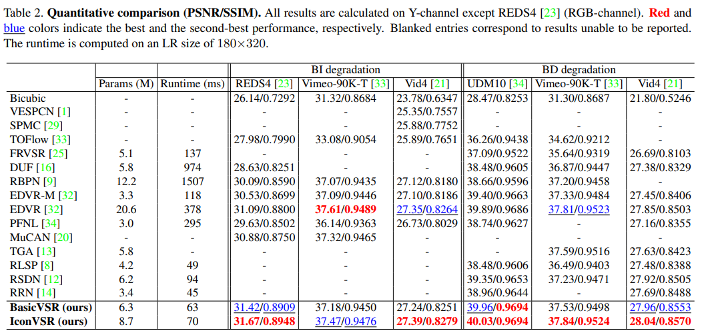

# BasicVSR: The Search for Essential Components in Video Super-Resolution and Beyond

> "BasicVSR: The Search for Essential Components in Video Super-Resolution and Beyond" CVPR, 2020 Dec, **BasicVSR & IconVSR**
> [paper](http://arxiv.org/abs/2012.02181v2) [code](https://github.com/open-mmlab/mmagic/blob/main/configs/iconvsr/README.md) 
> [pdf](./2020_12_CVPR_BasicVSR--The-Search-for-Essential-Components-in-Video-Super-Resolution-and-Beyond.pdf)
> Authors: Kelvin C. K. Chan, Xintao Wang, Ke Yu, Chao Dong, Chen Change Loy

## Key-point

- Task: VSR
- Problems：先前 VSR 框架差异很大，没有统一的标准框架，设计复杂度也层次不齐。
- :label: Label:

整合 VSR 框架为 4 个模块，分析各个 VSR 模块的有效性：four inter-related components, namely, **propagation, alignment, aggregation, and upsampling**

By using BasicVSR as a foundation, we present **IconVSR** that comprises two novel extensions to improve the aggregation and the propagation components.


## Contributions

1. 分析现有 VSR 方法模型中各个模块的有效性，归纳为4个模块，提出最精简的 VSR 模型

   BasicVSR provides a viable **starting point for extending VSR model**

2. SOTA: (up to 0.61 dB) and efficiency (up to 24× speedup）

2. 提出 Information-Refill 模块缓解 inaccurate alignment & Coupled Propagation 模块进一步利用前后向信息


## Intro

- EDVR 模型计算量大

  "EDVR: Video Restoration with Enhanced Deformable Convolutional Networks"
  [paper](https://arxiv.org/abs/1905.02716) [code](https://github.com/xinntao/EDVR)

- Motivation：先前 VSR 方法模型设计复杂，没有一个统一的共识，需要分析各个模块有效性，得到一个基准模型

  **A strong, simple yet extensible baseline is needed**

> most existing methods entail **four inter-related components,** namely, propagation, alignment, aggregation, and upsampling. 
>
> Our experiments suggest the use of **bidirectional propagation scheme** to maximize information gathering, and an **optical flow-based method** to estimate the correspondence between two neighboring frames for feature alignment


1. leverages an additional module to extract features from sparsely selected frames (keyframes)
2. coupled propagation scheme, which facilitates information exchange between the forward and backward propagation branches

reduce error accumulation during propagation due to occlusions and image boundaries, but also allow the propagation to access complete information


### Alignment

- Deformable or 光流

  "Understanding Deformable Alignment in Video Super-Resolution" :star:
  [paper](https://arxiv.org/abs/2009.07265)

  > The aligned feature with multiple offsets are more coherent
  >
  > **flow-based alignment is performed on image level**: When aligning images, the spatial warping inevitably introduces information loss, especially high-frequency details

  


### Interval Methods

> Information Refill 使用关键帧的特征，在 alignment 后再次融合，减少误差累积

"Accel: A Corrective Fusion Network for Efficient Semantic Segmentation on Video" CVPR, 2019, **Accel**
[paper](https://arxiv.org/abs/1807.06667)

按关键帧分区间处理，两个分支：使用上一个关键帧的特征（reference）和当前帧计算 score & 用光流 warp 到当前帧；当前帧作为 update 分支，对 warp 来的特征进行进一步修正


使用光流 + bilinear 方式 warp


## methods


### Propagation

Existing propagation schemes can be divided into **three main groups: local, unidirectional and bidirectional** propagations

先分析 local, unidirectional 的缺陷

**Local Propagation**

sliding-window methods

1.  滑动窗口分段越多，PSNR 降低地越厉害
   information in distant frames is beneficial to the restoration and should not be neglected :star:
2. necessity of adopting long sequences to accumulate long-term information.


**Unidirectional Propagation**

a consistent performance drop of 0.5 dB；最后一帧比双向好，是由于随即初始化造成的


### Alignment

three categories: without alignment, image alignment, and feature alignment

**Without Alignment**

substandard performance >> BasicVSR 把对齐模块去掉，PSNR 降低 1.19dB

 directly concatenate the non-aligned features for restoration && Conv 感受野有限，因此效果不行

**Image Alignment**

> "Understanding Deformable Alignment in Video Super-Resolution" 
> 发现在 feature space 进行 alignment 效果更好

`BasicVSR` 同样进行实验，用图像上计算的 optical flow & 在 feature 上 warping；在图像上 warping 的对比实验, a drop of 0.17 dB

**Feature Alignment**
$$
\begin{aligned}s_i^{\{b,f\}}&=S(x_i,x_{i\pm1}),\\
\bar{h}_i^{\{b,f\}}&=W(h_{i\pm1}^{\{b,f\}},s_i^{\{b,f\}}),\quad\quad(2)
\\h_i^{\{b,f\}}&=R_{\{b,f\}}(x_i,\bar{h}_i^{\{b,f\}}),\end{aligned}
$$
> S: flow estimation module; W denote spatial warping modules; R is a stack of residual blocks

结合 `IconVSR` 的 information refill 结构图一起看


### Aggregation and Upsampling

用卷积层 & `pixel-shuffle` 模块


### IconVSR

> - :question: R 是怎么融合的？
> - 如何参考 Information Refill 针对存在大量噪声的相邻帧进行改进？

Information-refill mechanism and coupled propagation (IconVSR) >> mitigate error accumulation during propagation and to facilitate information aggregation


**Information-refill**

- Motivation

  **Inaccurate alignment** in occluded regions and on image boundaries is a prominent challenge >> lead to **error accumulation**

  此类误差累积在 long-term propagation 更加严重？

对于**关键帧**传播的特征，再次使用原始帧的特征融合，进行增强；**只对关键帧进行再次融合**，减少计算量

> feature extractor and feature fusion are **applied to the sparsely-selected keyframes only**;
> the intervals (separated by the keyframes) 参考了 Accel 文章使用关键作为 reference 的方法


**Coupled Propagation**

前后向传播，对于 forward pass 的某一帧来看，之前只能看到前一帧特征，**融合另一个方向的特征一起融合**


## Experiment

> ablation study 看那个模块有效，总结一下

- 模型结构

  pre-trained SPyNet [24] and EDVR-M 作为 Encoder

  - train: REDS [23] and Vimeo-90K
  - Adam optimizer [18] and Cosine Annealing 训练 300K；在开始的 5K iteration 不训练光流
  - patch=64x64
  - `Charbonnier loss`: better handles outliers and improves the performance over
  - 关键帧的选取：every five frames are selected as keyframes
  - training on REDS, we use a sequence of 15 frames as inputs




EDVR 为先前 SOTA，效果比 EDVR 好0.5db

> VSR 提速 0.5db 就很难了

对比 EDVR 有更 sharp 的边缘


### Ablation Study

> :question: Alignment 特征图怎么提取？
> [EDVR 特征图评估 alignment](https://github.com/xinntao/EDVR/issues/168)


-  Coupled Propagation & refill

  针对 **non-existing correspondences**，使用 information refill 有效

  > 发现：In those regions, information from neighboring frames cannot be effectively aggregated due to alignment error, often resulting in inferior quality

  

- Refill 使用多少关键帧作为参考

  关键帧的选取：every five frames are selected as keyframes
  
  
  
- 传播时候使用关键帧特征

  


## Code

> [BasicVSR](https://github.com/open-mmlab/mmagic/blob/c1873ddffde7be866db4fad59daa81087e78c758/mmagic/models/editors/basicvsr/basicvsr_net.py#L18)  & [config-file](https://github.com/open-mmlab/mmagic/blob/c1873ddffde7be866db4fad59daa81087e78c758/configs/iconvsr/iconvsr_2xb4_reds4.py) 
> 把仓库 clone 下来看, ps: `mmagic` Register 类 [`MODEL`](https://github.com/open-mmlab/mmagic/blob/c1873ddffde7be866db4fad59daa81087e78c758/mmagic/registry.py#L132) 作为全局变量覆盖了 mmcv 中的对应 
>
> - :question: kaiming_init 是啥 [blog](https://blog.csdn.net/qq_41917697/article/details/116033589)

```
# single-gpu train
python tools/train.py configs/iconvsr/iconvsr_2xb4_reds4.py
```

*Support only x4 upsampling.*


`S`: flow estimation module; `W` denote spatial warping modules; `R` is a stack of residual blocks；在 Propagation 同时做 alignment；

图中 $s_i$ 为当前帧和上一帧（如果是 backward，就是 $x_{i+1} \to x_{i}$）的光流，先用 `SpyNet` 先算好存入；
$h^f_{i-1}$ 为传播的特征


输入 LRs `n, t, c, h, w = lrs.size()`

***Compute optical flow using SPyNet for feature warping.***

```python
# compute optical flow
flows_forward, flows_backward = self.compute_flow(lrs)
# 输出 (n, t - 1, 2, h, w)
```

- 减少计算量

  类似 RealBasicVSR 中 DA 方法，读取 $L/2$ 帧图像，反向一下组成 L 帧，只要计算反向光流 ok （一次性算了前向和反向的），不再计算前向

```python
        flows_backward = self.spynet(lrs_1, lrs_2).view(n, t - 1, 2, h, w)

        if self.is_mirror_extended:  # flows_forward = flows_backward.flip(1)
            flows_forward = None
        else:
            flows_forward = self.spynet(lrs_2, lrs_1).view(n, t - 1, 2, h, w)

        return flows_forward, flows_backward
```


**residual block**

一层卷积 + LeakyReLU + 30 个 `residual block`

```python
main.append(nn.Conv2d(in_channels, out_channels, 3, 1, 1, bias=True))
main.append(nn.LeakyReLU(negative_slope=0.1, inplace=True))

# residual blocks
main.append(
    make_layer(
        ResidualBlockNoBN, num_blocks, mid_channels=out_channels))
```

`ResidualBlockNoBN` 里面 Conv 参数用 `kaiming_init` ，scale=0.1

```python
    for m in module.modules():
        if isinstance(m, nn.Conv2d):
            kaiming_init(m, a=0, mode='fan_in', bias=0)
            m.weight.data *= scale  # 0.1
```


**Flow warp**

> [code](https://github.com/open-mmlab/mmagic/blob/c1873ddffde7be866db4fad59daa81087e78c758/mmagic/models/utils/flow_warp.py)

`F.grid_sample`


**upsample**

1. 前后向特征 `channel=64*2`  用 1x1 卷积融合

2. Pixelshuffle 先 3x3 卷积升通道再 `pixel_shuffle`

3. 与输入残差跳连

   ```
   out = self.conv_last(out)
   base = self.img_upsample(lr_curr)
   out += base
   outputs[i] = out
   ```


### IconVSR

> [IconVSR](https://github.com/open-mmlab/mmagic/blob/c1873ddffde7be866db4fad59daa81087e78c758/mmagic/models/editors/iconvsr/iconvsr_net.py#L20)


## Limitations

> 参考后续改进，如何发现问题点


## Summary :star2:

> learn what & how to apply to our task

1. **特征对齐模块的改进**：参考 Information Refill 再次融合原始特征来缓解 inaccurate alignment；Information Refill 可以有效缓解相邻帧没有对应的情况（会降低质量）

   :question:  针对视频修复任务，使用“干净区域”的特征再次融合. **如何衡量这个干净区域？**>> 参考 Multi-View 的自监督方式，提取 scene 特征，与 scene 的特征计算相似度

   1. 参考帧的选择：将关键帧的概念代替为修复较好的帧？IQA

   2. 融合：参考 Accel，将 reference 理解成对当前帧的修复 or 微调

      加权融合，目前只用一个值来对全局的特征进行融合，直觉上不太好（但可以作为初筛，**相差较大的图像没必要去融合**） && 这个加权值是与当前帧画面的 SSIM 粒度太粗了》》**特征同尺寸的 similarity map**, 分为 patch 计算相似度

   

