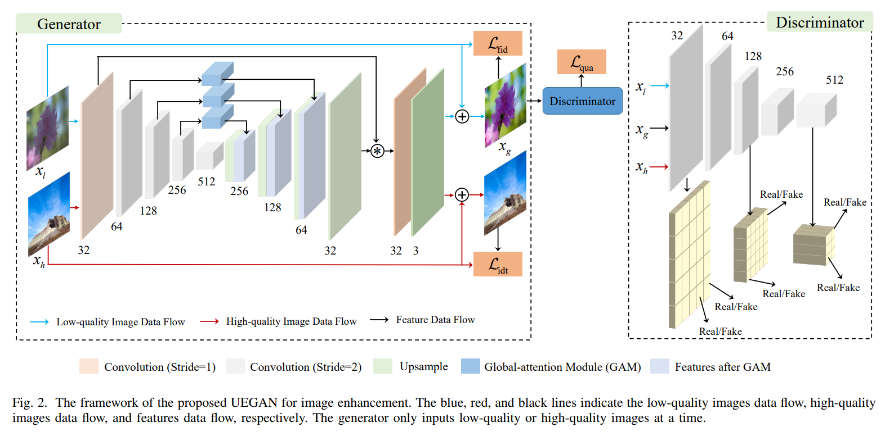

# UEGAN

> "Towards Unsupervised Deep Image Enhancement with Generative Adversarial Network" TIP, 2020 Dec, UEGAN
> [paper](https://arxiv.org/abs/2012.15020)
> [paper_local_pdf](./2020_12_TIP_Towards-Unsupervised-Deep-Image-Enhancement-with-Generative-Adversarial-Network.pdf)

## Key-point

- Task: Unsupervised Image Enhancement
- Background
- :label: Label: Unsupervised

> 关注 Encoder-Decoder, `RaHingeGAN` Relativistic average HingeGAN

learning an image-to-image mapping function F to generate the high-quality counterpart

## Contributions

- a global attention module and a modulation module
- unsupervised framework
- quality loss, fidelity loss, and identity loss

## Related Work

- "Unpaired Image-to-Image Translation using Cycle-Consistent Adversarial Networks" ICCV, 2017 Mar, CycleGAN
  [paper](https://arxiv.org/abs/1703.10593) [code](https://github.com/junyanz/pytorch-CycleGAN-and-pix2pix)

  > transferring image style between unpaired data

## methods

### Encoder&Decoder

> [code](https://github.com/eezkni/UEGAN/blob/2c729ee8b8daaf600aee6dc0779c14286e7fd768/models.py#L10)

### RaHingeGAN

> Relativistic average HingeGAN 相对 GAN
> [code](https://github.com/eezkni/UEGAN/blob/2c729ee8b8daaf600aee6dc0779c14286e7fd768/losses.py#L348C5-L361C109)

- 鉴别器 Discriminator 理解：对应数据正常分类即可，低质 0 高质 1

  > 区别：这里 $E_{x_{h}\sim P_{h}}D(x_{h})$ 使用均值

- 生成器 G: 希望生成的图让鉴别器误以为是高质的

- 权重相对于 Fidelity loss 为 $\frac1{20}$

$$
\begin{gathered}
 \mathcal{L}^{D}=\mathbb{E}_{x_{l}\sim P_{l}}\left[\operatorname*{max}(0,1+(D(x_{l})-E_{x_{h}\sim P_{h}}D(x_{h})))\right] \\
+\mathbb{E}_{x_h\sim P_h}\left[\max(0,1-(D(x_h)-E_{x_l\thicksim P_l}D(x_l)))\right] \\
+\mathbb{E}_{x_g\sim P_g}\left[\max(0,1+(D(x_g)-E_{x_h\thicksim P_h}D(x_h)))\right] \\
+\mathbb{E}_{x_h\sim P_h}\left[\max(0,1-(D(x_h)-E_{x_g\thicksim P_g}D(x_g)))\right], \\
 \mathcal{L}_{\mathrm{qua}}^{G}=\mathbb{E}_{x_{h}\sim P_{h}}\left[\max(0,1+(D(x_{h})-E_{x_{g}\sim P_{g}}D(x_{g})))\right] \\
+\mathbb{E}_{x_g\sim P_g}\left[\max(0,1-(D(x_g)-E_{x_h\thicksim P_h}D(x_h)))\right], 
\end{gathered}
$$

### Fidelity Loss

> 类似 perceptual loss？作为主要的 loss

$$
\mathcal{L}_{\text{fid}}=\sum_{j=1}^J\{\mathbb{E}_{x_l\sim P_l}\left[\left\|\phi_j(x_l)-\phi_j(G(x_l))\right\|_2\right]\}
$$

无监督方式训练，在特征空间去约束 Encoder，希望生成结果和输入有相似内容。
使用预训练 VGG16 中间层特征的 L2 距离

###  Identity Loss

无监督方式，输入还有内容不一致的高质量图。计算高质量图作为输入时的输出，和自己的 L1 loss，**用高质量图去调整 generator**，encourage preservation of the color distributions and contrast

- Identity Loss 权重为 Fidelity Loss 的 $\frac1{10}$

## Experiment

> ablation study 看那个模块有效，总结一下

### setting

- Learning rate

  fixed at the first 75 epochs and then linearly decays to zero in the next 75 epochs.

## Limitations

## Summary :star2:

> **learn what & how to ap**ply to our task