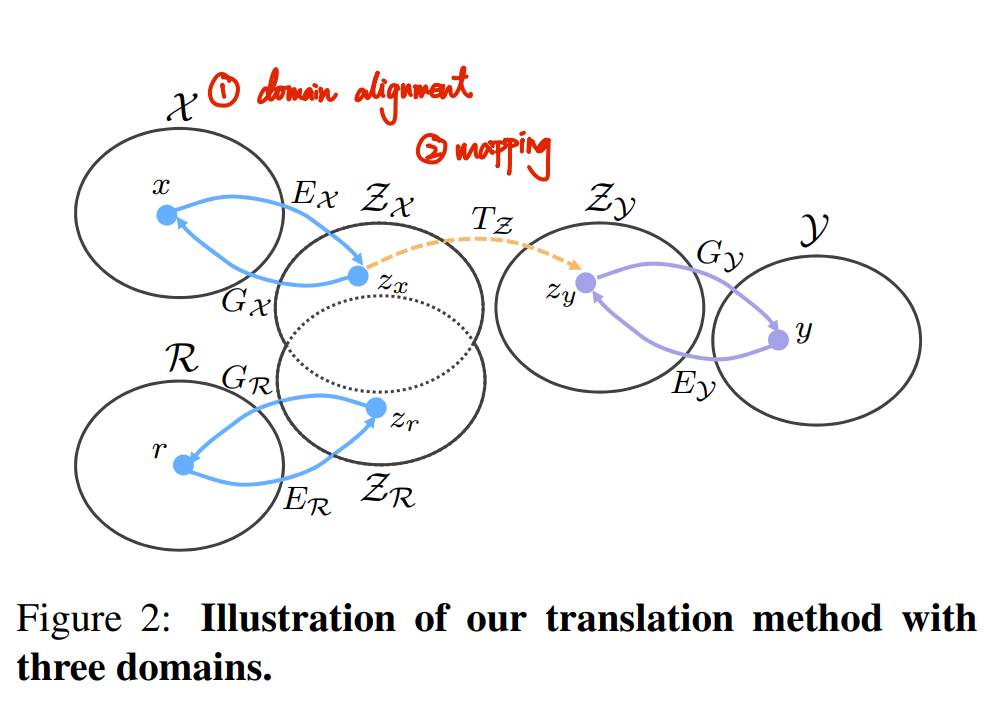
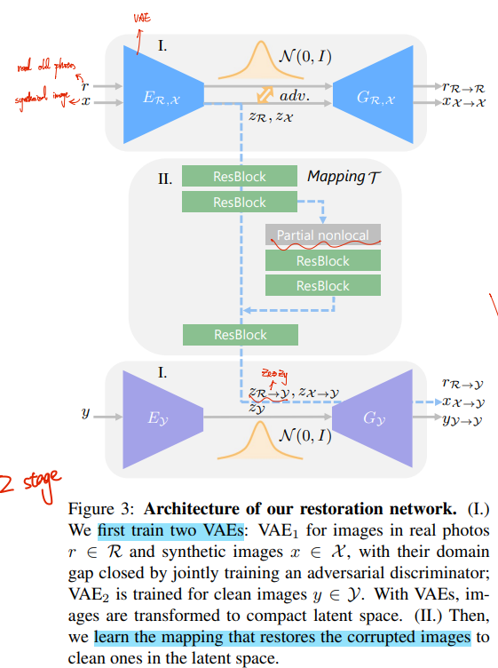
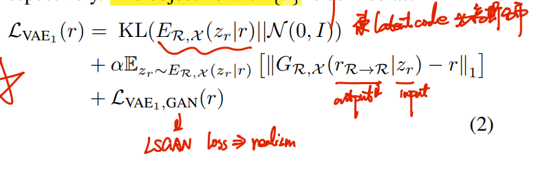
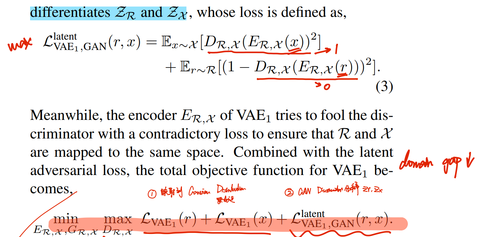
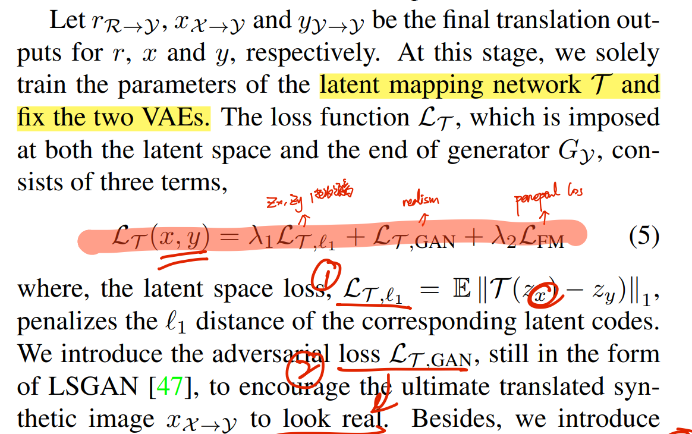
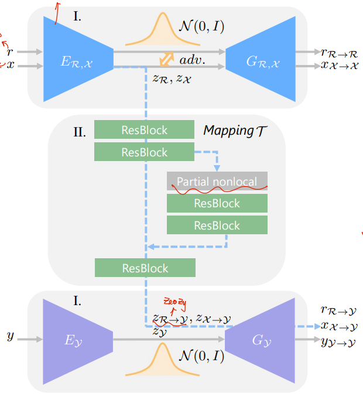
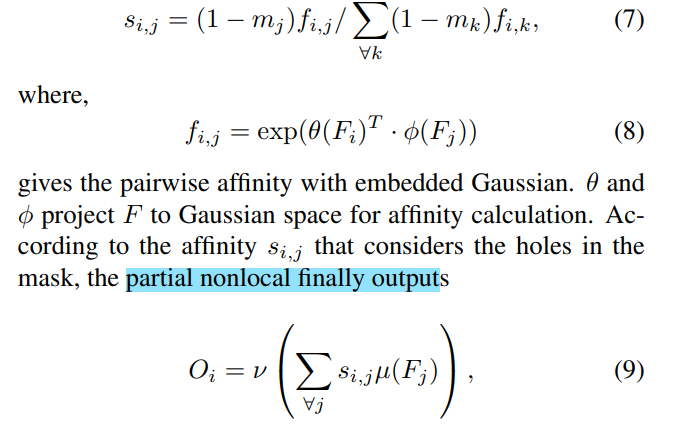
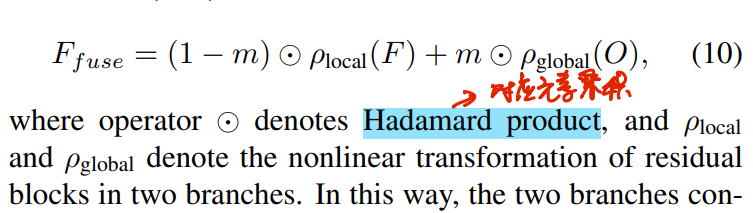
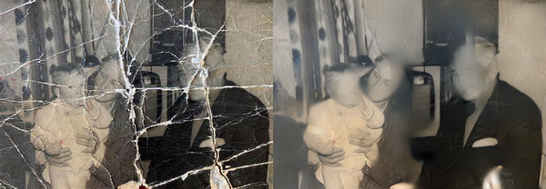

# Bringing Old Photos Back to Life

> [paper(CVPR version)](https://arxiv.org/abs/2004.09484) [paper(TPAMI version) ](https://arxiv.org/pdf/2009.07047v1.pdf)TPAMI 版本的算法原理更多一些
> [code](https://github.com/microsoft/Bringing-Old-Photos-Back-to-Life) [website](http://raywzy.com/Old_Photo/)
> [博客参考](https://zhuanlan.zhihu.com/p/414309177)
> [local pdf(TPAMI_version)](./2020_CVPR_Bringing-Old-Photos-Back-to-Life_TPAMI_version.pdf)



## **Background**

> 介绍老照片修复背景

**老照片修复**相比于 image restoration 任务更加复杂，可以简单归纳为一下两点：

1. 没有  degradation model 来模拟老照片的瑕疵 （无法简单地模仿老照片的瑕疵，数据少）
2. 老照片为 一些列 degradations 的组合，需要不同的方法去修复。

- 老照片瑕疵可以归纳为
  - **unstructured defects** 
    墨水，褪色 film grain and color fading, should be restored by utilizing the pixels in the neighbor
  - **structured defects** 
    划痕，scratches, dust spots, etc.

并且老照片数据，**有对应的修复结果（clean image Ground Truth）的数据很少**  ，影响训练。以往的工作大多使用干净图像，对老照片进行合成来造数据，但会存在 **domain gap 的问题（造的数据和真实老照片差距很大）**：

- Prior DL methods 修复功能有限

  对划痕类似的 localized defects 检测，再用 inpainting 方法修复。缺点是无法修复 墨水，褪色等 spatially-uniform defects。

- DL-based image restoration methods 修复效果不好

  在合成图像上处理，但无法处理涂色 & inpaint 混合的情况。存在 domain gap，导致图像修复结果看起来还是很旧。

> 文章方法核心思想

**作者借鉴 image translation 任务思想，将`合成图 X、真实图 Y，老照片 R` 都映射到 latent space 来进行修复**。<u>*将合成图和真实老照片通过共享的 VAE 映射到同一个 latent space，通过对 VAE Encoder 进行限制（Gaussian Distribution & GAN Discriminator），让合成图和老照片的 latent code 尽可能接近。*</u>然后在 latent space <u>学习合成图 X 到真实图 Y latent code 的映射</u>，最后将映射结果通过 Decoder 恢复出真实图。如果老照片和合成图的 latent code 分布接近，则可以借鉴前面学到到的 mapping (合成图-> 真实图的映射)，得到修复结果的 latent code，再恢复出原图。


**Contributions**

- 映射到 latent space，使用合成图训练。降低 domain gap，避免使用老照片 GT （数据很少）进行训练
- 在 Latent space 进行修复，mapping 修复网络支持多种 degradation 混合的情况。


## **Related Work**

- [ ] [2003_EUROCON_Towards-the-automated-restoration-of-old-photographic-prints--a-survey.pdf](./2003_EUROCON_Towards-the-automated-restoration-of-old-photographic-prints--a-survey.pdf)
- [ ] [2022_master_report_DSTT-MARB--Multi-scale-Attention-Based-Spatio-Temporal-Transformers-for-Old-Film-Restoration.pdf](https://ntnuopen.ntnu.no/ntnu-xmlui/bitstream/handle/11250/3023083/no.ntnu:inspera:118516831:64411262.pdf?sequence=1)
- [ ] VAE
- [ ] baseline
  - [ ] Pix2Pix
  - [ ] CycleGAN
  - [ ] Deep image prior


- [矩阵乘法总结](https://zhuanlan.zhihu.com/p/148125394)

  - Hadamard Product >> 矩阵对应元素乘积 

  - Kronecker product >> 两个任意大小的矩阵间的运算

    如果*A*是一个*m*×*n*的矩阵，而*B*是一个*p*×*q*的矩阵，**克罗内克积**则是一个*mp*×*nq*的[分块矩阵](https://link.zhihu.com/?target=https%3A//baike.baidu.com/item/%E5%88%86%E5%9D%97%E7%9F%A9%E9%98%B5)

- [Wasserstein Distance](https://zhuanlan.zhihu.com/p/58506295)

  衡量概率分布差异，能够很自然地度量离散分布和连续分布之间的距离 & 给出了距离的度量，而且给出如何把一个分布变换为另一分布的方案 & 能够连续地把一个分布变换为另一个分布，在此同时，能够保持分布自身的几何形态特征；


### VAE

> [苏剑林老师 VAE 讲解](https://zhuanlan.zhihu.com/p/34998569)

### nonlocal-block 


## methods




> 图中的符号解释
> `R`: 真实的老照片; `y`: 无损图像；`x`: 从 `y` 退化（人工退化后）的合成老照片图，x 和 y 是合成得到的退化-真值图像对。 `z_y`, `z_x`, `z_r` 为无损图 y，对应合成图 x 和老照片 r 的 `latent code `

**核心思想：映射到 latent space，借鉴 x-> y 的映射来修复老照片 r** :star:

- 作者将**希望将 R,X 映射得到的 latent code 接近** >> Domain alignment in the VAE latent space

  因此作者提出的方法为 2 stage 的，要先训好 x,r 的 VAE encoder；再去训 mapping 和 decoder

- 借鉴 `z_y`, `z_x` 之间的映射，作用于 `z_r` >> Restoration through latent mapping

- 提出 partial nonlocal block 在 mapping 修复的过程中 >> Multiple degradation restoration


### Domain alignment

希望老照片和合成图的 latent code 接近，之后老照片 latent code 才能够合理地用合成图的映射进行修复。

- KL 散度损失，将 latent code 分布接近高斯分布，限制向量元素的范围，实现更接近。

- 再从 GAN discriminator 角度使得 z_r z_x 接近

  
  
  


### Restoration through latent mapping

通过 latent Mapping Network $T$ 在 latent space 中将合成图 $z_x$ 修复为原图 $z_y$

1.  优化 mapping 结果 `T(z_x)` 与 `z_y` L1 距离
2. LSGAN >> 使得 latent code 恢复出的图更真实
3. perceptual loss




### multiple-degradation

Mapping 网络在 latent space 通过映射的方式实现修复，但老照片的退化有比较复杂。上面的 mapping 只考虑了 local feature，对于 structured defects 需要利用更大范围的信息进行填充以保证全局图像结构的一致性。因此作者**提出了一个全局分支，该分支包含一个 partial nonlocal block 和两个残差块，对 Mapping 模块加上约束**，如下图所示



- partial nonlocal block 作为 global branch 去修复待 inpainting 区域

  在 ECCV2018 提出的 nonlocal block 改造而来：借用完好区域（源区域）的信息来修补损坏的区域（目标区域）。

  - $S_{i,j}$ 表示中间层输入的 Feature Map $F$ 中**完好区域元素** i, j 的亲和度。

    文章中用 U-net 去分割出裂痕等 mask （$m_i$ ：1 represents the defect regions to be inpainted and 0 represents the intact regions）
    
    > U-net mask 分割
    >
    > 作者自己标注了 783 张有划痕的老照片，去 finetune U-net(现在合成的瑕疵上训)
    
    **最后模块输出 O 理解：对于受损元素 i，用亲和的完好区域 j 元素来加权修复** :star:

  

  

- 融合一下全局操作修复 inpainting，局部操作修复原本就完好的区域

  

  > :question: local 修复和 全局 inpaint 结果直接相加？


## **Experiment**

- [DIV2K 数值量化比较](./2020_CVPR_Bringing-Old-Photos-Back-to-Life.pdf#page=7)

  PSNR，SSIM，FID

- Qualitative comparison 修复图像效果

  由于无GT，直接看图

- User study >> 找人看，几个方法的结果排名

### ablation study

- latent space 距离
  - BRISQUE 评估修复结果图像质量
  - Wasserstein : 合成图和老照片 latent space 距离

- inpainting

- limitations 对于复杂的退化修复不了

  


### Dataset

> TAPMI version paper, `Section 4.2 Data Generation`
>
> - Ancient Face 找真实老照片
> - Pascal VOC，DIV2K  数据去合成；人脸优化用 FFHQ 数据
> - 退化模板没 release ？按 Deepremaster 同样方式按关键字去 google

For fair comparison, we train all the methods with the same **training dataset (Pascal VOC) and test them on the corrupted images synthesized from DIV2K dataset [64] and the test set of our old photo dataset.**

- **synthesize old photos** using images from the **Pascal VOC dataset**
  训练时随机 crop 256x256 区域

- **collect 5718 old photos**

  真实照片没 release 但论文里面的老照片有 `ancientFaces` 网站的水印，可以去上面找数据

- face enhancement network, we use 50,000 aligned HQ face images from **FFHQ**

- **Unstructured Degradation**

  用 Gaussian white noise, blur 等 DA 方式随机对数据处理

- **Structured** 退化模板

  collect 62 scratch texture images and 55 paper texture image


## **Summary:star2:**

> learn what & how to apply to our task

- 老照片缺失 GT 的问题**（降低 domain gap）**

  造一个类似的假数据，映射到 latent sapce 通过 KL 散度，GAN 实现 latent code 接近 


## Code

- install https://github.com/microsoft/Bringing-Old-Photos-Back-to-Life/issues/248#issuecomment-1344901139

**Train Domain_A**

> Data Preparation `class UnPairOldPhotos_SR(BaseDataset):  ## Synthetic + Real Old`

随机 50% 概率取 Pascal VOC 或真实老照片。对于合成噪声

1. `cv2.GaussianBlur` P=70%

2. 加噪声 `synthesize_gaussian, synthesize_speckle, synthesize_salt_pepper` 转化为 numpy 采样 gaussian

3. 降低分辨率 + 在还原原分辨率

   ```python
   new_w=random.randint(int(w/2),w)
   new_h=random.randint(int(h/2),h)
   img=img.resize((new_w,new_h),Image.BICUBIC)
   img=img.resize((w,h),Image.NEAREST)  # P=0.5
   ```

4. JPEG 压缩

   ```python
   def convertToJpeg(im,quality):
       with BytesIO() as f:
           im.save(f, format='JPEG',quality=quality)
           f.seek(0)
           return Image.open(f).convert('RGB')
   ```

- <10% 概率，转为灰度图，再转回 RGB 
- resize 到 256
- flip & normalize

```python
input_dict = {'label': A_tensor, 'inst': is_real_old,  # Union[0,1]
              'image': A_tensor,
              'feat': feat_tensor,  # 0
              'path': path}
return input_dict
```

**Domain alignment loss**

`input_dict['label']` 进入 Encoder 获取 hidden tensor, 加上噪声还原 >> 作为 fake 数据给判别器

```python
hiddens = self.netG.forward(input_concat, 'enc')
noise = Variable(torch.randn(hiddens.size()).cuda(hiddens.data.get_device()))
# This is a reduced VAE implementation where we assume the outputs are multivariate Gaussian distribution with mean = hiddens and std_dev = all ones.
# We follow the the VAE of MUNIT (https://github.com/NVlabs/MUNIT/blob/master/networks.py)
fake_image = self.netG.forward(hiddens + noise, 'dec')
```

- KL loss

  ```python
  hiddens = self.netG.forward(input_concat, 'enc')
  
  loss_G_kl = torch.mean(torch.pow(hiddens, 2)) * self.opt.kl
  ```

  


> `Global/models/networks.py`

`class Pix2PixHDModel(BaseModel)` 中定义了 Generator，Discriminator

- `self.netG` >> generator
  `netG = GlobalGenerator_DCDCv2(input_nc, output_nc, ngf, k_size, n_downsample_global, norm_layer, opt=opt)`

  定义 Encoder Decoder >> U-Net 结构，具体参考 TAPAMI 版本pdf Page6

-  `self.netD` >> discriminator

  `netD = MultiscaleDiscriminator(input_nc: 3, opt, ndf: 64, n_layers_D: 3, norm_layer, use_sigmoid, num_D, getIntermFeat)`

  三层 PatchGAN discriminator，每层之间加个 AveragePooling

  ```
  class NLayerDiscriminator(nn.Module)
  - Conv2d & LeakyReLU  # side = side / 2
  - [Conv2d & norm & LeakyReLU] * 2  # 下采样 side = side / 2
  - [Conv2d & norm & LeakyReLU]  # 不下采样
  ```

  

  ### NonLocal Block

  > https://github.com/tea1528/Non-Local-NN-Pytorch

  

  `class NonLocalBlock2D_with_mask_Res(nn.Module)`

  

  

