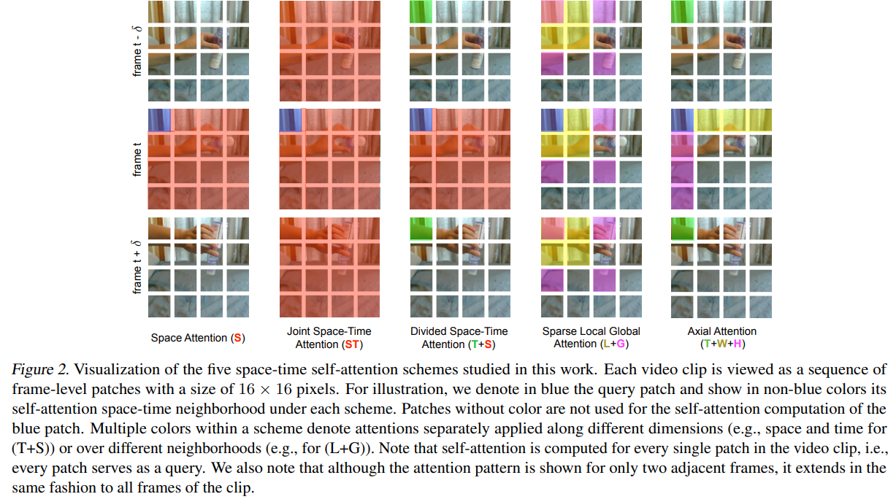
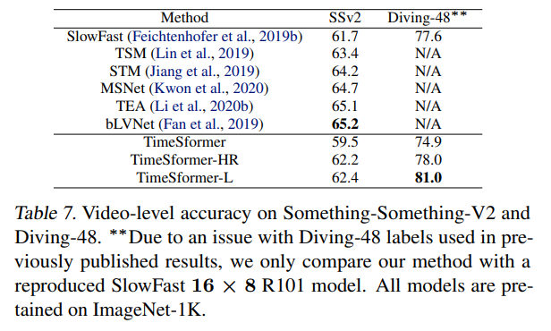

# Is Space-Time Attention All You Need for Video Understanding?

> "Is Space-Time Attention All You Need for Video Understanding?" ICML, 2021 Feb
> [paper](http://arxiv.org/abs/2102.05095v4) [code](https://github.com/facebookresearch/TimeSformer.) [blog](https://zhuanlan.zhihu.com/p/372712811)
> [pdf](./2021_02_ICML_Is-Space-Time-Attention-All-You-Need-for-Video-Understanding-.pdf)
> Authors: Gedas Bertasius, Heng Wang, Lorenzo Torresani

## Key-point

- Task
- Problems
- :label: Label:

## Contributions

1. 第一篇使用纯Transformer结构在视频识别上的文章

## Introduction

## methods

每个 t 上，在 Spatial 维度划分 patch， 不是在 t 上也有个窗口

5 种 attention 变体，Spatial-Time Attn 计算前后帧全部 token 特征

从而带来的计算量差异很大

5个变体的框架图

## Experiment

> ablation study 看那个模块有效，总结一下

对比 SOTA

## Limitations

`self-attention`的计算复杂程度跟token的数量直接相关，对于video来说，相比于图像会有更多的token(有N帧), 计算量会更大

## Summary :star2:

> learn what & how to apply to our task

