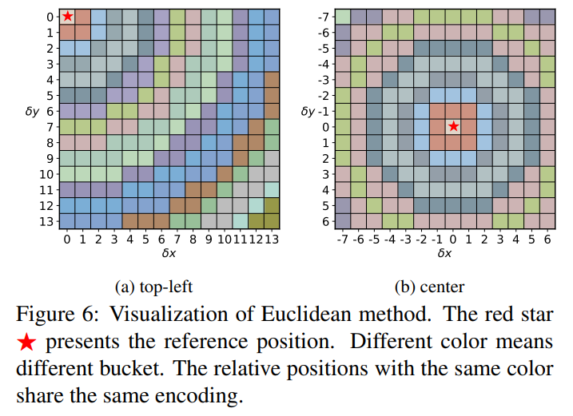

# Swin Transformer: Hierarchical Vision Transformer using Shifted Windows

> "Swin Transformer: Hierarchical Vision Transformer using Shifted Windows" ICCV_best_paper, 2021 Mar
> [paper](http://arxiv.org/abs/2103.14030v2) [code](https://github.com/microsoft/Swin-Transformer) 
> [pdf](./2021_03_ICCV2021BestPaper_SwinTransformer.pdf)
> Authors: Ze Liu, Yutong Lin, Yue Cao, Han Hu, Yixuan Wei, Zheng Zhang, Stephen Lin, Baining Guo
>
> [blog](https://zhuanlan.zhihu.com/p/367111046) [blog2](https://zhuanlan.zhihu.com/p/507105020)

## Key-point

- Task
- Background
- :label: Label:

## Contributions

## Related Work


## methods

将多帧逐帧去处理：`b t c h w -> (b t) c h w`


Swin-T是在计算Attention的时候做了一个`相对位置编码`，ViT会单独加上一个可学习参数，作为分类的token。而Swin-T则是**直接做平均**，输出分类

最重要的改进：Shifted window

ViT的特征都是单一尺度的，且是low resolution的，自注意力始终都是在这个大窗口上进行的（整图上进行的），是全局建模，复杂度跟图像尺寸是平方倍增长的.

Swin transformer 在小窗口内算自注意力 (h, w) 窗口


**PatchEmbed PatchUnEmbed**

输入 `b c h w` 特征，经过两层卷积降采样 2 倍，得到 `(b, c, h/2, w/2)` 特征；

PatchEmbed  ，`(b, c, h/2, w/2)` 拉直为 1D 向量 `(b, h/2*w/2, c)`；PatchUnEmbed 将 1D 向量还原回 `(b, c, h/2, w/2)`

> *SwinIR* 中 Swin-Transformer Block 用法

```python
# Swin-Transformer workflow
# 0. feature extraction: downscale scale=1/2
x1 = self.lrelu(self.conv_first(x))  # b c h w
x = self.conv_second(x1)  # b c h/2 w/2
x_size = (x.shape[2], x.shape[3])    # b c h/2 w/2
x = self.patch_embed(x)

# 1. Swin-Transformer Block(RSTB)
x = self.conv_after_body(self.forward_features(x)) + x

# 2. PostProcess: Upscale x2
x = self.conv_before_upsample(x)
x = self.lrelu(self.conv_up1(torch.nn.functional.interpolate(x, scale_factor=2, mode='nearest')) + x1)
x = self.conv_last(x)


def forward_features(self, x):
    x_size = (x.shape[2], x.shape[3])  # b c h w
    x = self.patch_embed(x)
    if self.ape:
        x = x + self.absolute_pos_embed
        x = self.pos_drop(x)

	for layer in self.layers:
        x = layer(x, x_size)  # RSTB

    x = self.norm(x)  # B L C
    x = self.patch_unembed(x, x_size)

    return x

class PatchEmbed(nn.Module):
    # ...
    
    def forward(self, x):
        x = x.flatten(2).transpose(1, 2)  # B Ph*Pw C
        if self.norm is not None:
            x = self.norm(x)  # LayerNorm, normalize over C channel
        return x

class PatchUnEmbed(nn.Module):
    # ...
    def forward(self, x, x_size):
        B, HW, C = x.shape
        x = x.transpose(1, 2).view(B, self.embed_dim, x_size[0], x_size[1])  # B Ph*Pw C
        return x
```


`class RSTB` >> `class BasicLayer(nn.Module)` 为 `SwinTransformerBlock` + `downsample` >> `class SwinTransformerBlock` 

部分参数 `depth=[2,2,2], head=[4,4,4]` >> SwinTransformer 要成对（`W-MSA`,`SW-MSA` 按 `shift_size=0 if (i % 2 == 0) else window_size // 2,` 区分）

流程：若是 SW-MSA 先做 `cyclic shift`； `window_partition`  + `WindowAtten` + `window_reverse` + `cyclic shift` 回去 + `window_reverse` + FFN


**Window Partition/Reverse**

- :question:  `permute`, `view` 的顺序？能做和图像分 patch 的功能？
  [torch.view blog](https://zhuanlan.zhihu.com/p/463664495)

按 `window_size=8` 拆成不重叠的 patch

> RSTB 输入特征图尺寸要能被 `window_size` 整除！:warning:

```python
def window_partition(x, window_size):
    """
    Args:
        x: (B, H, W, C)
        window_size (int): window size
    Returns:
        windows: (num_windows*B, window_size, window_size, C)
    """
    B, H, W, C = x.shape
    x = x.view(B, H // window_size, window_size, W // window_size, window_size, C)  # (b N_h h N_w w c)
    windows = x.permute(0, 1, 3, 2, 4, 5).contiguous().view(-1, window_size, window_size, C)
    return windows

def window_reverse(windows, window_size, H, W):
    """
    Args:
        windows: (num_windows*B, window_size, window_size, C)
        window_size (int): Window size
        H (int): Height of image
        W (int): Width of image
    Returns:
        x: (B, H, W, C)
    """
    B = int(windows.shape[0] / (H * W / window_size / window_size))
    x = windows.view(B, H // window_size, W // window_size, window_size, window_size, -1)
    x = x.permute(0, 1, 3, 2, 4, 5).contiguous().view(B, H, W, -1)
    return x
```

- `view` 把图像分为什么样的 patch? 

  对于 `shape=(h=4,w=4)` 的tensor 分为 `2x2` 窗口，想要`(4/2, 2, 4/2, 2)` 大小的tensor。按维度从最后向前逐步填满，先对最后一个维度 w 每 2 个元素分为一块，每 2 个块归为倒数第二个维度，以此类推

```python
>>> a
tensor([[ 1.,  2.,  3.,  4.],
        [ 5.,  6.,  7.,  8.],
        [ 9., 10., 11., 12.],
        [13., 14., 15., 16.]])
>>> b=a.view(2,2,2,2)
tensor([[[[ 1.,  2.],
          [ 3.,  4.]],

         [[ 5.,  6.],
          [ 7.,  8.]]],


        [[[ 9., 10.],
          [11., 12.]],

         [[13., 14.],
          [15., 16.]]]])
>>> b.permute(0,2,1,3).contiguous().view(-1,2,2)
tensor([[[ 1.,  2.],
         [ 5.,  6.]],

        [[ 3.,  4.],
         [ 7.,  8.]],

        [[ 9., 10.],
         [13., 14.]],

        [[11., 12.],
         [15., 16.]]])
```


### **WindowAttention**

常见 Transformer 操作，$Softmax(QK + \text{relative\_bias}  + mask) *V $ ，结果再过一层 MLP

SwinTransformer 区别在于加了相对位置编码和 mask

**相对位置编码** 

> [issue](https://github.com/microsoft/Swin-Transformer/issues/281)
> "Rethinking and Improving Relative Position Encoding for Vision Transformer"
> [paper](https://arxiv.org/pdf/2107.14222.pdf)

使用广播机制 `relative_coords = coords_flatten[:, :, None] - coords_flatten[:, None, :] `


相对位置编码，可视化 




### mask


整体看各个 window

> 这张图里面的原始是对应像素（特征）， window 概念。后续对特征拉直


> `slice(start, end, step)` 访问某一范围的元素

在某一窗口维度上，切割为（原始窗口范围，shift 后仍为原始位置的小窗口，shift 过来的窗口）`slice(-window_size[0])` 访问第 0 个 window，设为 0；

```python
def compute_mask(D, H, W, window_size, shift_size, device):
    img_mask = torch.zeros((1, D, H, W, 1), device=device)  # 1 Dp Hp Wp 1
    cnt = 0
    for d in slice(-window_size[0]), slice(-window_size[0], -shift_size[0]), slice(-shift_size[0], None):
        for h in slice(-window_size[1]), slice(-window_size[1], -shift_size[1]), slice(-shift_size[1], None):
            for w in slice(-window_size[2]), slice(-window_size[2], -shift_size[2]), slice(-shift_size[2], None):
                img_mask[:, d, h, w, :] = cnt
                cnt += 1
    mask_windows = window_partition(img_mask, window_size)  # nW, ws[0]*ws[1]*ws[2], 1 >> 特征拉直
    mask_windows = mask_windows.squeeze(-1)  # nW, ws[0]*ws[1]*ws[2]
    attn_mask = mask_windows.unsqueeze(1) - mask_windows.unsqueeze(2)  # >> 广播
    attn_mask = attn_mask.masked_fill(attn_mask != 0, float(-100.0)).masked_fill(attn_mask == 0, float(0.0))
    return attn_mask
```


## Experiment

> ablation study 看那个模块有效，总结一下

## Limitations

## Summary :star2:

> learn what & how to apply to our task

