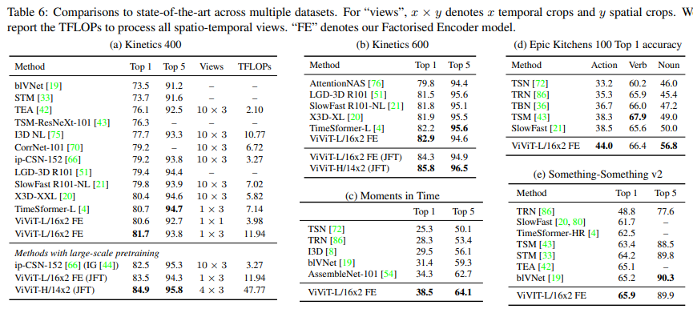

# ViViT: A Video Vision Transformer

> "ViViT: A Video Vision Transformer" ICCV, 2021 Mar
> [paper](http://arxiv.org/abs/2103.15691v2) [code](https://github.com/google-research/scenic/tree/main/scenic/projects/vivit) [blog](https://zhuanlan.zhihu.com/p/451386368)
> [pdf](./2021_03_ICCV_ViViT--A-Video-Vision-Transformer.pdf)
> Authors: Anurag Arnab, Mostafa Dehghani, Georg Heigold, Chen Sun, Mario Lučić, Cordelia Schmid

## Key-point

- Task
- Problems
- :label: Label:

 presented four pure-transformer models for video classification; regularize such high-capacity models for training on smaller datasets

## Contributions

## Introduction

- "Is space-time attention all you need for video understanding?"

## methods

> - position embedding 用什么？

输入 `(b t c h w)` >> 按窗口大小 `t1 h1 w1` 分为不重叠的 patch ，每个 patch 拉直映射为 C 维向量，总的就是 `(B, N窗口数, C)`

分类任务，uniformly sample $n_t$ frames from the input video clip

ViViT 各种变形

Model 2 先空间后时序

Model3 Spatil+temporal 交叉

### Tricks

**Stochastic depth**

we linearly increase the probability of dropping a layer according to its depth within the network

**Mixup**

## Experiment

> ablation study 看那个模块有效，总结一下

- ViT-Base (ViT-B, L=12, NH=12, d=768) L is the number of transformer layers

- ViT-Large (ViT-L, L=24, NH=16, d=1024)

- ViT-Huge (ViT-H, L=32, NH=16, d=1280)

  ViViT-B/16x2 denotes a ViTBase backbone with a tubelet size of h×w×t = 16×16×2

1. Spatial Temporal 一起做注意力效果更好，但计算量也相应更大，更耗时
2. Transformer Layer 层数到 8 层差不多

DA 的影响：MixUp 有用！

对比 SOTA

## Limitations

## Summary :star2:

> learn what & how to apply to our task

