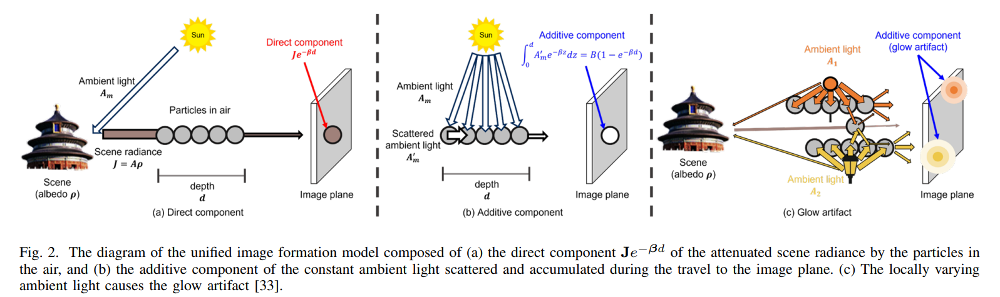
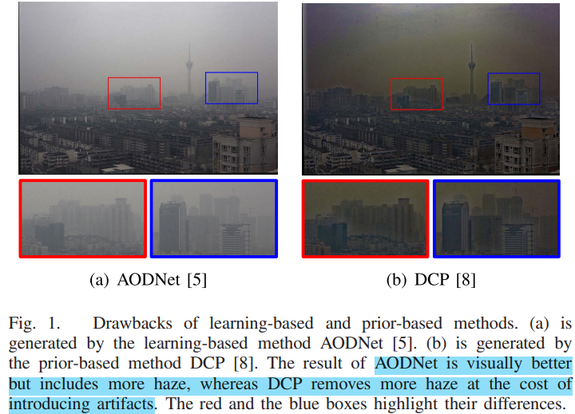
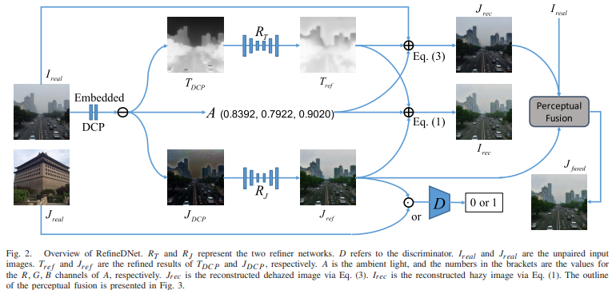
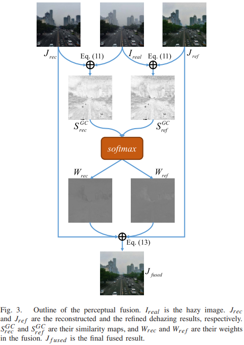
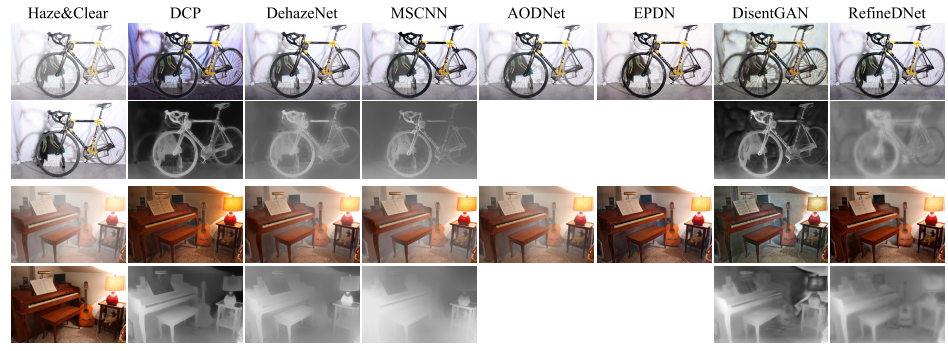
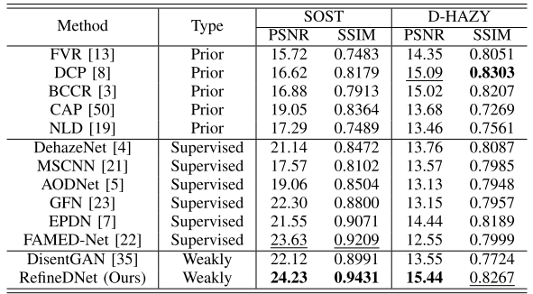
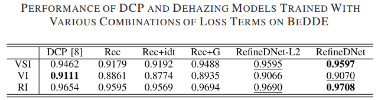
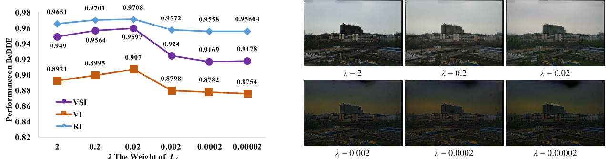
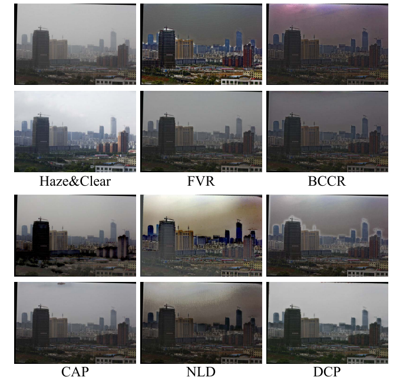
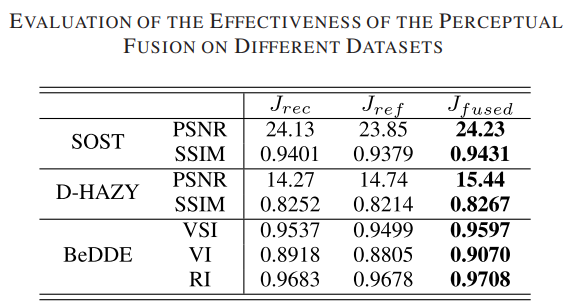

# RefineDNet: A Weakly Supervised Refinement Framework for Single Image Dehazing

> "RefineDNet: A Weakly Supervised Refinement Framework for Single Image Dehazing" TIP, 2021 Mar, `RefineDNet`
> [paper](https://ieeexplore.ieee.org/document/9366772) [code](https://github.com/xiaofeng94/RefineDNet-for-dehazing) [pdf](./2021_03_TIP_RefineDNet--A-Weakly-Supervised-Refinement-Framework-for-Single-Image-Dehazing.pdf) [note](./2021_03_TIP_RefineDNet--A-Weakly-Supervised-Refinement-Framework-for-Single-Image-Dehazing_Note.md)
> Authors: [Shiyu Zhao](https://ieeexplore.ieee.org/author/37086638386); [Lin Zhang](https://ieeexplore.ieee.org/author/37406079100); [Ying Shen](https://ieeexplore.ieee.org/author/37085566774); [Yicong Zhou](https://ieeexplore.ieee.org/author/37399620500)

## Key-point

- Task: Image dehazing
- 存在的问题
  1. 去雾任务的配对数据很少
  2. 配对数据少，监督方式训练的效果有限；
  3. 先前 prior-based 方法去雾效果好，但引入了伪影。Learning-based 方法主观更自然，但去雾效果不足
- :label: Label:

1. 弱监督（未配对的 foggy & clean）
2. dark channel prior 感知融合策略

## Contributions

1. 提出了一个 two-stage 弱监督框架，先使用现有 prior-based 方法 DCP 去雾，在使用 GAN 提速图像真实性；解决 unpaired 数据的利用问题
2. 提出一种感知（IQA）融合策略，融合不同的去雾结果
3. 提出了一个 unpaired 数据集

## Introduction

Existing dehazing methods can be roughly classified into two categories

### prior-based

`Koschmieder’s law`
$$
I\left(\mathbf{x}\right)=J\left(\mathbf{x}\right)t\left(\mathbf{x}\right)+A\left(1-t\left(\mathbf{x}\right)\right). \\
\text{$I\left(\mathbf{x}\right)$ is foggy image, $J\left(\mathbf{x}\right)$ is clean img;}\\
\text{$t(x)$ is the transmission of the intrinsic luminance in the atmosphere, A is ambient light}
$$
there are more than two unknown variables in Koschmieder’s law 没法直接只用一个 foggy 输入求解，**proposed various priors as extra constraints** to find a proper solution for $J(x)$ ；但这些 prior 只能针对特定场景才有效果

- "Single image haze removal using dark channel prior"
  [blog](https://zhuanlan.zhihu.com/p/440903916)

###  learning-based approach

 learn to estimate A and t(x), or to recover J (x) directly from the input hazy image via supervised learning 
直接去学 $J(x)$ 但需要大量同一场景的配对训练数据，对于 real-world 场景数据很少，因此很多方法在有 depth 信息的室内场景做

发现 Prior 方法去雾效果ok，但引入了很多噪声，realness 差一些；Learning-based 方法真实性好，但有些雾没去掉

- "Unpaired Image-to-Image Translation using Cycle-Consistent Adversarial Networks"
  [paper](https://arxiv.org/abs/1703.10593) [Learning-Unpaired-Data Course Video](https://www.bilibili.com/video/BV1Wv411h7kN/?p=61&vd_source=eee3c3d2035e37c90bb007ff46c6e881)

  

## methods

1. 先使用先前 prior-based 方法 DCP 得到 $J$ 初步去雾结果，T 传导率图，A 环境光（对应 `Koschmieder’s law`）。

2. 通过 RT is a U-Net，RJ is a ResNet，D is a CNN with 5 convolution layers. 几个模块处理一下，这些模块参考 CycleGAN。为了证明 RefineDNet 的有效性，就没有用主流的去雾网络去实现 $R_T, R_J$。

   **模型预测得到两个去雾图像**：$J_{ref}$ 为对 DCP 预处理去雾图过一个网络修正的结果, $J_{rec}$ 为对 DCP预测的 Transmission Map 修正后，通过物理模型得到的结果

3. 弱监督方式训练

   1. 根据物理模型，重建出输入的噪声图像，做 L1 loss
   2. 生成鉴别器，对 unpaired 真实数据和预测的去雾图像进行判别

4. Perceptual Fusion

   预测得到的去雾图 $J_{ref}$ 不符合任何物理模型，进行修正一下; 另一个分支通过物理模型得到的 $J_{rec}$ 和预测得到的输出假设可以在某些区域互补

### DCP 现有模型结果

Dark Channel
$$
I^{dark}(\mathbf{x})=-maxpool(-\min_{c\in R,G,B}(I^c(\mathbf{x})))\\
I\left(\mathbf{x}\right)=J\left(\mathbf{x}\right)t\left(\mathbf{x}\right)+A\left(1-t\left(\mathbf{x}\right)\right).
$$
DCP 假设 $J^{dark}\to 0$ ，因此可根据 $A$ 直接求出 $t(x)$ 传导率

Ambient Light A 直接取 $I^{dark}$ 里面 0.1% 最亮的像素，取这些像素在原图中 RGB 的均值作为 A

### 弱监督训练

GAN loss

1. 生成器 Loss：希望鉴别器对于 $J_{real}$ （非配对的高清无雾图，可能是不同场景）
   $$
   \begin{aligned}
   L_{G}(R_{J},D)& =\mathbb{E}_{J_{real}\sim\mathcal{J}_{real}}[\log D(J_{real})]  \\
   &+\mathbb{E}_{J_{DCP}\sim\mathcal{J}_{DCP}}[\log(1-D(R_{J}(J_{DCP})))]
   \end{aligned}
   $$

2. 通过物体模型重建输入
   $$
   L_{rec}=\|I_{real}-I_{rec}\|
   $$

3. Identity Loss 对预测去雾图的模型进一步限制，防止生成不存在的噪声 :star:

   > 有用嘛？

   $$
   L_{idt}=\|J_{real}-R_{J}{(J_{real})}\|
   $$

Loss 里面计算距离，发现 L1 L2 效果差不多
$$
R_T^*,R_J^*=\arg\min_{R_T,R_J}\max_D\lambda L_G+L_{rec}+L_{idt}
$$

- 小结

  用弱监督，输出的图可以用 GAN loss 来约束，同时要有一个"物理模型" 去重建输入做 L1 Loss，在我们视频修复任务，可以去预测噪声（原始低质输入减去这个噪声得到高清图？）

### perceptual fusion

To get appropriate similarity maps, we adopt two features, i.e., **gradient modulus (GM) and chrominance information** of the LMN color space (ChromMN), which are widely adopted in the field of IQA.

- GM 相似度
  $$
  S^G(\mathbf{x})=\frac{2G_1(\mathbf{x})\cdot G_2(\mathbf{x})+C_1}{G_1^2(\mathbf{x})+G_2^2(\mathbf{x})+C_1}\quad\quad(9)
  $$

- 颜色相似度>> 类似 SSIM
  $$
  S^{C}\left(\mathbf{x}\right)=\frac{2M_{1}\left(\mathbf{x}\right)\cdot M_{2}\left(\mathbf{x}\right)+C_{2}}{M_{1}^{2}\left(\mathbf{x}\right)+M_{2}^{2}\left(\mathbf{x}\right)+C_{2}}\cdot\frac{2N_{1}\left(\mathbf{x}\right)\cdot N_{2}\left(\mathbf{x}\right)+C_{2}}{N_{1}^{2}\left(\mathbf{x}\right)+N_{2}^{2}\left(\mathbf{x}\right)+C_{2}}\quad\quad(10)
  $$

- 两个相似度融合一下

  > Following the previous IQA study [40], we set α = 0.4 in our experiments.

  $$
  S^{GC}(\mathbf{x})=S^G(\mathbf{x})\cdot[S^C(\mathbf{x})]^\alpha 
  $$

  

- 因为模型预测得到了两个去雾图像 J，分别和原图 I 计算相似度（原图的 realness 好）

  得到两个权重，`softmax`一下，然后加权
  $$
  \hat{J}_{fused}=\sum_i^nW_i\odot J_i
  $$
  

## Experiment

> ablation study 看那个模块有效，总结一下
>
> - :question: VSI, RI, VI 是什么指标

- setting

  Dataset: RESIDE-standard [11] called ITS (Indoor Training Set). 配对数据，因为做弱监督直接 shuffle

  an Nvidia Titan X GPU. We employed the Adam optimizer [49] with a learning rate of 0.0002.

  GAN loss 交替训练生成、鉴别器

- Comparison with SOTA

  

  指标：效果比监督的还要好（因为监督方式的数据少）

  
  
  - 真实数据上的效果
  
  

### Ablation Study

- 两阶段模型有效性

- Loss 

  

  Rec: 只用重建输入监督

  Rec+G： 通过物体模型重建输入 & GAN >> 提升0.3,说明 GAN loss 有效

  RefineDNet-L2: 通过物体模型重建输入 & GAN & Identity Loss >> **相对 Rec+G 提升0.1，Identity Loss 有点用**

  > GAN loss seems to introduce unwanted structures that don’t exist in the original scene

  Rec+idt: 通过物体模型重建输入 & Identity Loss >> **Identity Loss 缓解 GAN loss 造成的不存在物体 &&需要和 GAN loss一起搭配，只用 Identity Loss 用处不大;**

  - GAN loss 权重：弱监督里面还不能太小

    

- 用哪种先验模型

  

  

- Perceptual Fusion

  模型预测了 3 个去雾结果，$J_{rec}$ 基于物理模型重建的结果，$J_{ref}$ 为学习得到的去雾结果，$J_{fused}$ 对前面两个结果融合的结果，性能提升 1db，能有效结合两个结果

  

## Limitations

## Summary :star2:

> learn what & how to apply to our task

