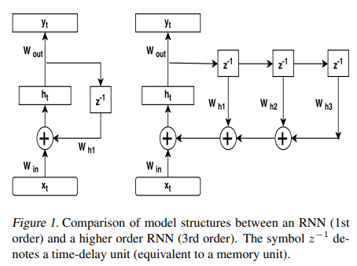
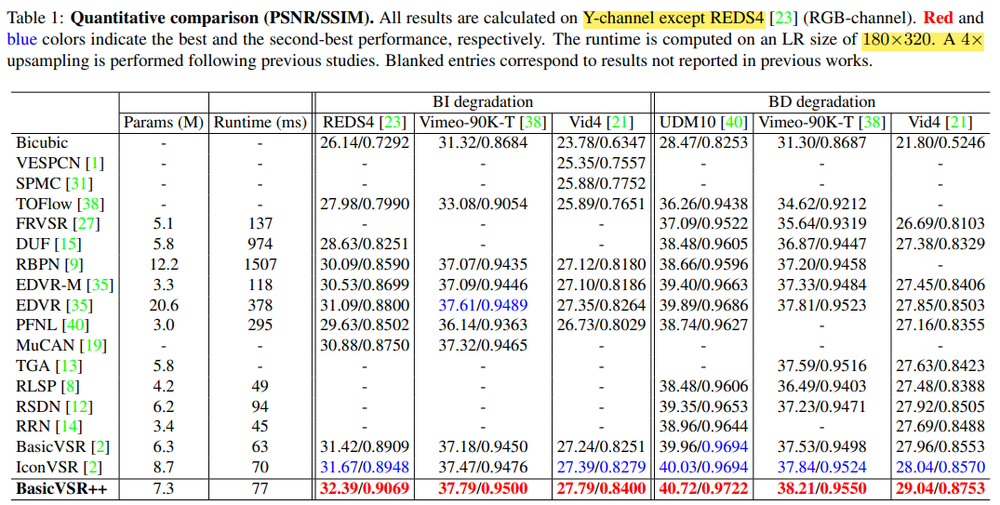
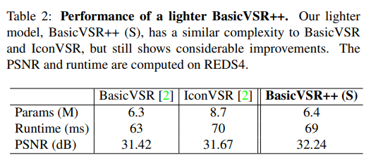
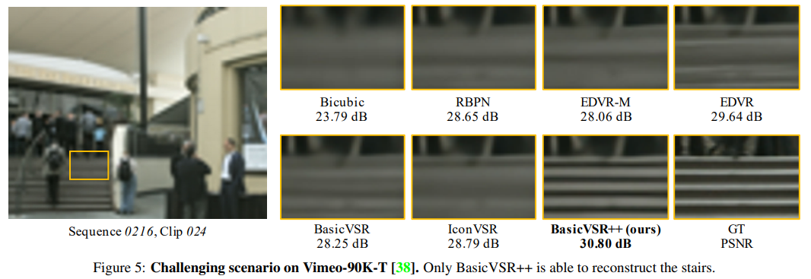
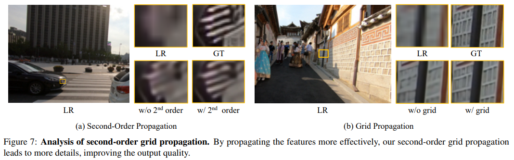
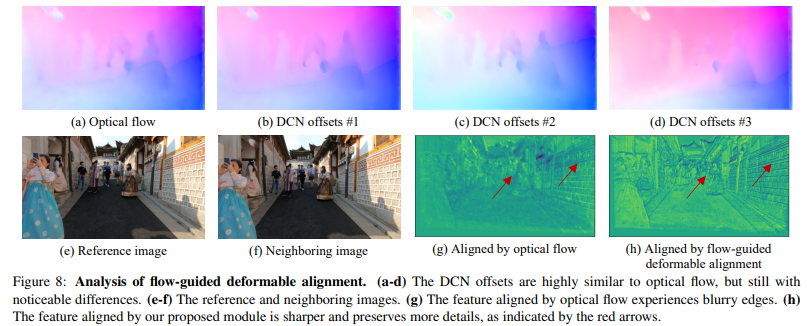
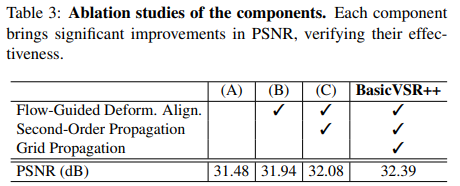

# BasicVSR++: Improving Video Super-Resolution with Enhanced Propagation and Alignment

> "BasicVSR++: Improving Video Super-Resolution with Enhanced Propagation and Alignment" CVPR, 2021 Apr
> [paper](http://arxiv.org/abs/2104.13371v1) [code](https://github.com/open-mmlab/mmagic/blob/main/configs/basicvsr_pp/README.md) 
> [pdf](./2021_04_CVPR_BasicVSR++--Improving-Video-Super-Resolution-with-Enhanced-Propagation-and-Alignment.pdf)
> Authors: Kelvin C. K. Chan, Shangchen Zhou, Xiangyu Xu, Chen Change Loy

## Key-point

- Task: VSR

- Problems

  BasicVSR 在 Propagation, Alignment 模块的设计很基础，信息交互不够高效。细节修复不足，对于遮挡or复杂区域修复不好

- :label: Label:

BasicVSR 将 VSR 框架总结为 4个模块 propagation, alignment, aggregation, and upsampling;

BasicVSR++ 针对 propagation & alignment 模块进行改进，对于 propagation 模块使用 second-order grid propagation 提高信息传播效率，对于 alignment 提出结合 Deformable 缓解 inaccurate optical flow 问题

## Contributions

1. 改进 propagation 模块，**second-order grid propagation**
2. 改进 alignment 模块，Deformable + 光流
3. SOTA

## Introduction

- Sliding window

  - EDVR

- second-order connection

  

- Deformable 在 VSR 有效，但训练不稳定

  > "Understanding deformable alignment in video super-resolution" AAAI, 2021"

## methods

### **second-order grid propagation**

- ### Motivation

  BasicVSR: assumption of first-order Markov property；双向传播模块太简单，信息利用不够高效

1. allow more aggressive bidirectional propagation arranged in a grid-like manner

2. second-order connection(red line): relax the assumption of first-order Markov property in BasicVSR

   BasicVSR 有 Markov chain 假设，只用上一个 branch 的输出的特征和当前特征 align；改进使用2个时刻的特征一起融合，缩放这个假设

### **flow-guided deformable alignment**

- Motivation

  optical-flow 对于遮挡等情况不够鲁棒，不准确的光流降低修复效果；Deformable 训练不稳定

  > "Understanding deformable alignment in video super-resolution" AAAI, 2021

## Experiment

> ablation study 看那个模块有效，总结一下

- setting

  Adam + Cosine o 1×10−4 and 2.5×10−5

  total number of iterations is 600K, and the weights of the **flow network are fixed during the first 5,000 iterations**

  Charbonnier loss

  

相比 BasicVSR 提升接近 1db，**提升明显**

lighter BasicVSR++ 在 REDS4 测试集上测得

### Ablation Studies

 second-order grid propagation 增加了更多细节

只用光流进行 warp 效果很差，搭配 Deformable

## Limitations

## Summary :star2:

> learn what & how to apply to our task

