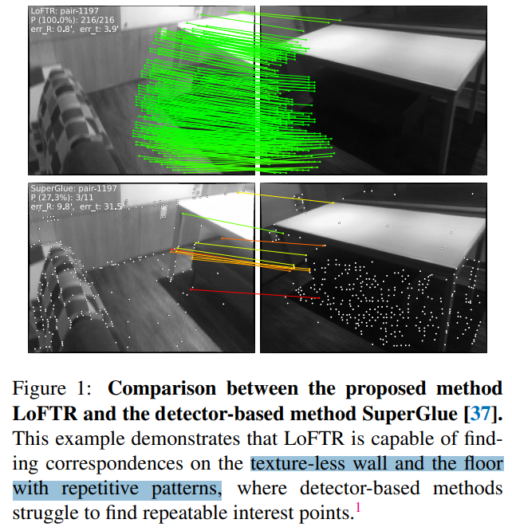
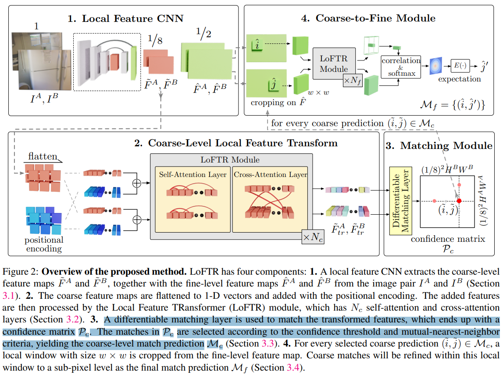
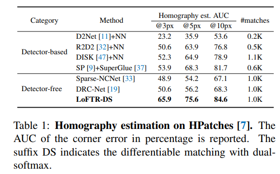

# LoFTR: Detector-Free Local Feature Matching with Transformers

> "LoFTR: Detector-Free Local Feature Matching with Transformers" CVPR, 2021 Apr 1
> [paper](http://arxiv.org/abs/2104.00680v1) [code]() [pdf](./2021_04_CVPR_LoFTR--Detector-Free-Local-Feature-Matching-with-Transformers.pdf) [note](./2021_04_CVPR_LoFTR--Detector-Free-Local-Feature-Matching-with-Transformers_Note.md)
> Authors: Jiaming Sun, Zehong Shen, Yuang Wang, Hujun Bao, Xiaowei Zhou

## Key-point

- Task: local image feature matching
- Problems
- :label: Label:

## Contributions

- Transformer 优化特征

> In contrast to dense methods that use a cost volume to search correspondences, we use self and cross attention layers in Transformer to obtain feature descriptors that are conditioned on both images. 

- 提取的特征点更好

>  The global receptive field provided by Transformer enables our method to produce dense matches in low-texture areas, where feature detectors usually struggle to produce repeatable interest points

## Introduction

- "SuperGlue: Learning Feature Matching with Graph Neural Networks" CVPR, 2019 Nov 26
  [paper](http://arxiv.org/abs/1911.11763v2) [code](https://github.com/magicleap/SuperGluePretrainedNetwork.) [pdf](./2019_11_CVPR_SuperGlue--Learning-Feature-Matching-with-Graph-Neural-Networks.pdf) [note](./2019_11_CVPR_SuperGlue--Learning-Feature-Matching-with-Graph-Neural-Networks_Note.md)
  Authors: Paul-Edouard Sarlin, Daniel DeTone, Tomasz Malisiewicz, Andrew Rabinovich

> detector-based methods struggle to find repeatable interest points

## methods

不需要借助预训练的 SuperPoint CNN 模块去得到 visual descriptor

## setting

## Experiment

> ablation study 看那个模块有效，总结一下

## Limitations

## Summary :star2:

> learn what

### how to apply to our task

