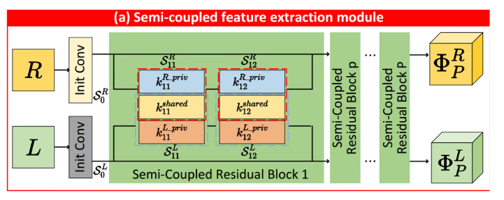
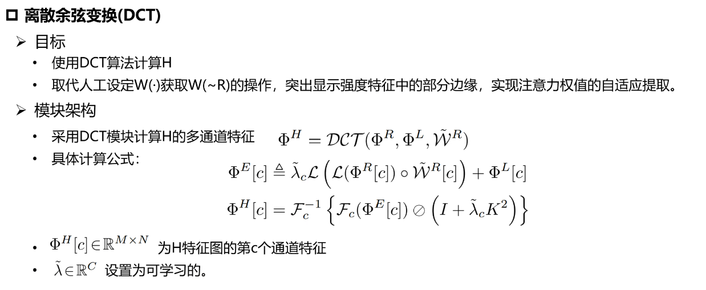
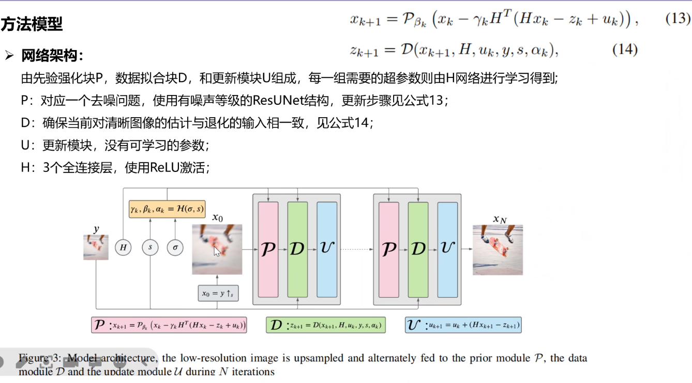

# Discrete Cosine Transform Network for Guided Depth Map Super-Resolution

> "Discrete Cosine Transform Network for Guided Depth Map Super-Resolution" CVPR_oral, 2021 Apr
> [paper](http://arxiv.org/abs/2104.06977v3) [code](https://github.com/Zhaozixiang1228/GDSR-DCTNet) 
> [pdf](./2021_04_CVPR_oral_Discrete-Cosine-Transform-Network-for-Guided-Depth-Map-Super-Resolution.pdf)
> Authors: Zixiang Zhao, Jiangshe Zhang, Shuang Xu, Zudi Lin, Hanspeter Pfister

## Key-point

- Task

  深度图目前设备限制，分辨率比 RGB 低很多，为了要和 RGB 匹配应用，需要将 depth 图 SR 到同样分辨率

- Problems

- :label: Label:

学习下论文写作，用传统的方法，用深度学习简化求解

## Contributions

## Introduction

## methods

特征融合

> 参考画图

$\lambda \in \mathbb{R}^C$  可学习参数，看下code

## Experiment

> ablation study 看那个模块有效，总结一下

## Limitations

## Summary :star2:

> learn what & how to apply to our task

- Laplace 滤波

  求解梯度的算子 sobel, prewitt

  Canny 非极大抑制

# Deep Model-Based Super-Resolution with Non-uniform Blur

- ADMM

