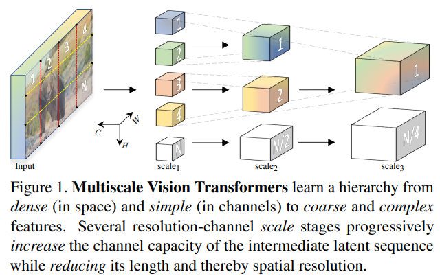
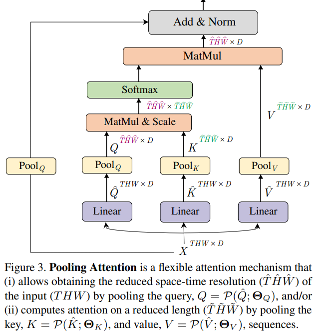
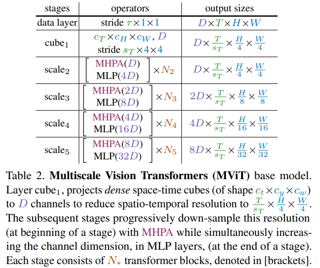
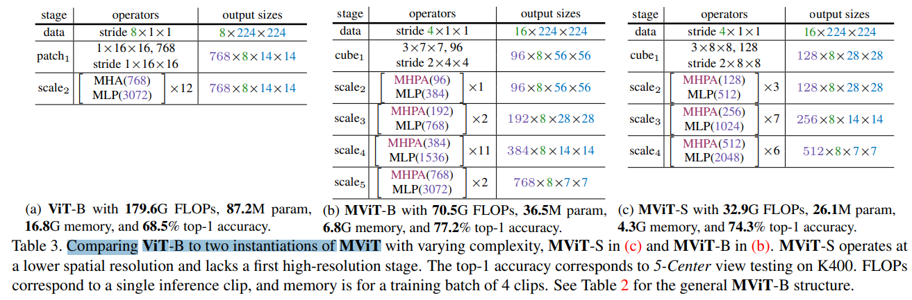
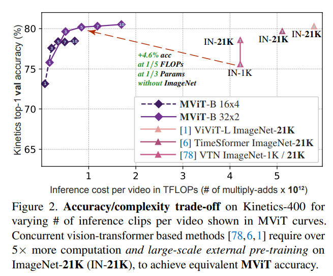

# Multiscale Vision Transformers

> "Multiscale Vision Transformers" ICCV, 2021 Apr
> [paper](http://arxiv.org/abs/2104.11227v1) [code](https://github.com/facebookresearch/SlowFast) 
> [pdf](./2021_04_ICCV_Multiscale-Vision-Transformers.pdf)
> Authors: Haoqi Fan, Bo Xiong, Karttikeya Mangalam, Yanghao Li, Zhicheng Yan, Jitendra Malik, Christoph Feichtenhofer

## Key-point

- Task
- Problems
- :label: Label:

借鉴之前CNN里面的方式，构造特征金字塔，得到多尺度的信息，进行融合学习；核心在于增加通道容量，同时减小空间分辨率

> - operate at high spatial resolution to model simple low-level visual information
> - the deeper layers can effectively focus on spatially coarse but complex high-level features to model visual semantics

ViT 结构的确还有很多的改进空间，本文主要就是提出了一种池化的 operator，改进了之前的自注意机制，使得能够学到多尺度的特征

## Contributions

## Introduction

## methods

### Multi Head Pooling Attention

Multi Head Pooling Attention (MHPA) 使用 Pooling 操作降低序列长度，降低计算量

Pooling Attention is a flexible attention mechanism that (i) allows obtaining the reduced space-time resolution (TˆHˆWˆ )

MViT 网络结构

相比 ViT 大量节省参数量、计算量

## Experiment

> ablation study 看那个模块有效，总结一下

相比 TimeSFormer 和 Vivit 节省了计算量

对比 SOTA，参数只有 vivit 的 1/4 左右

## Limitations

## Summary :star2:

> learn what & how to apply to our task

