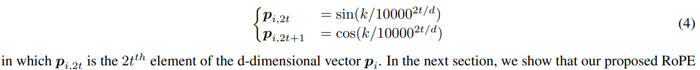
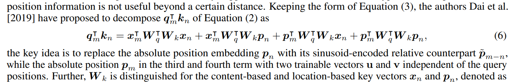

# RoFormer: Enhanced Transformer with Rotary Position Embedding

> "RoFormer: Enhanced Transformer with Rotary Position Embedding" Neurocomputing, 2021 Apr 20,`RotaryPositionEmbedding(RoPE)`
> [paper](http://arxiv.org/abs/2104.09864v4) [code](https://huggingface.co/docs/transformers/model_doc/roformer) [pdf](./2021_04_Neurocomputing_RoFormer--Enhanced-Transformer-with-Rotary-Position-Embedding.pdf) [note](./2021_04_Neurocomputing_RoFormer--Enhanced-Transformer-with-Rotary-Position-Embedding_Note.md)
> Authors: Jianlin Su, Yu Lu, Shengfeng Pan, Ahmed Murtadha, Bo Wen, Yunfeng Liu

## Key-point

- Task: transformer Position encoding
- Problems
- :label: Label:

## Contributions

- RoPE 可以在 transformer 学习序列信息时，提供位置信息

  > Rotary Position Embedding(RoPE), to leverage the positional information into the learning process of PLMS. Specifically, RoPE encodes the absolute position with a rotation matrix and meanwhile incorporates the explicit relative position dependency in self-attention formulation

- RoPE 有很多优异性质

  - 支持可变序列长度；
  - 位置偏差越多的两个 token 相关性越小；
  - 对 linear-attention 场景添加相对位置编码，之前的 relative pos encoding 不支持哦

  > RoPE is prioritized over the existing methods through valuable properties, including the **sequence length flexibility**, decaying inter-token dependency with increasing relative distances, and the capability of equipping the linear self-attention with relative position encoding.

- 加了 RoPE 的 transformer SOTA

## Introduction

Attention 基础

QK 乘积，除以 $\sqrt{d}$，Softmax 得到 attention weight 再乘上 V

- Q：position embedding 在哪？

特征 x 为了获取 Q，K, V 用一个 MLP 映射之前要先加上 pos embedding

### sinusoidal

最早的是 "Attention is all you need" 中使用的 **sinusoidal function**

> In the next section, we show that our proposed RoPE is related to this intuition from the sinusoidal function perspective. However, instead of directly adding the position to the context representation, **RoPE proposes to incorporate the relative position information by multiplying with the sinusoidal functions.**

### Relative Position Encoding

> - " Self-attention with relative position representations"

QK 乘积看作矩阵运算分解开，可以看到**中间两项是关于相对位置编码的**

后面有一系列工作基于 eq6 改进，都是想要把 pos-embedding 直接加上去

>  They commonly introduced to **directly add the position information to the context representations.** 

本文提出使用旋转矩阵的方式将 pos-embedding 融合到特征上

> Unlikely, our approach aims to derive the relative position encoding from Equation (1) under some constraints. Next, we show that the derived approach is more interpretable by **incorporating relative position information with the rotation of context representations.**

## methods

### 2D

### general form

使用仿射变换矩阵，来代替之前加上去的相对位置编码 :star:

> In contrast to the additive nature of position embedding method adopted in the previous works, i.e., Equations (3) to (10), **our approach is multiplicative.** Moreover, RoPE naturally incorporates relative position information through rotation matrix product instead of altering terms in the expanded formulation of additive position encoding when applied with self-attention.

可视化一下

###  Properties of RoPE

#### Linear Attn

- RoPE 实现的相对位置编码是通过旋转矩阵方式乘上去的，变换后的特征的范数 norm 不变！

> Since RoPE injects position information by rotation, which keeps the norm of hidden representations unchanged, we can combine RoPE with linear attention by multiplying the rotation matrix with the outputs of the non-negative functions.

应用 RoPE 到 linear attn 上很自然很漂亮！:star:

### Computational efficient

- Q：due to the sparsity of Rd Θ, applying matrix multiplication directly as in Equation (16) is not computationally efficient;

$R^d_\phi$ 稀疏矩阵，计算矩阵相乘不是很高效！改写一下

### decay

希望距离间隔越远的两个 token，做完 attn 的 atten weight 应该越小！

改写下公式，计算 attn weights 的 sum

效果

## setting

## Experiment

> ablation study 看那个模块有效，总结一下

-  The well-known BERT Devlin et al. [2019] is adopted as our baseline model. Note that we use bert-base-uncased in our experiments.
- 句子翻译配对 Task

> choose the standard WMT 2014 English-German datasetBojar et al. [2014], which consists of approximately 4.5 million sentence pairs.

- 对于短序列 512 效果接近，还看不出效果。**继续增加序列长度到 1024，效果逐渐明显**

> With short text cut-offs,i.e., 512, the result from RoFormer is comparable to WoBERT and is slightly better than the BERT implementation. However, when increasing the maximum input text length to 1024, RoFormer outperforms WoBERT by an absolute improvement of 1.5%.

## Limitations

## Summary :star2:

> learn what

- 之前获取 QKV 的 $f(x)=W(x+P)$ 是加上去的，RoPE 使用旋转矩阵乘上去

- RoPE 实现的相对位置编码是通过旋转矩阵方式乘上去的，变换后的特征的范数 norm 不变！

应用 RoPE 到 linear attn 上很自然很漂亮！:star:

- 对于短序列 512 效果接近，还看不出效果。**继续增加序列长度到 1024，效果逐渐明显**

> With short text cut-offs,i.e., 512, the result from RoFormer is comparable to WoBERT and is slightly better than the BERT implementation. However, when increasing the maximum input text length to 1024, RoFormer outperforms WoBERT by an absolute improvement of 1.5%.

### how to apply to our task

