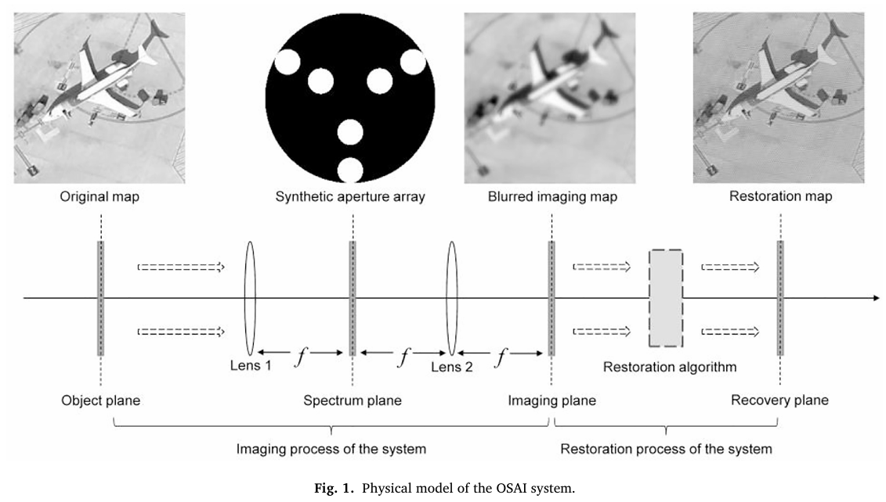
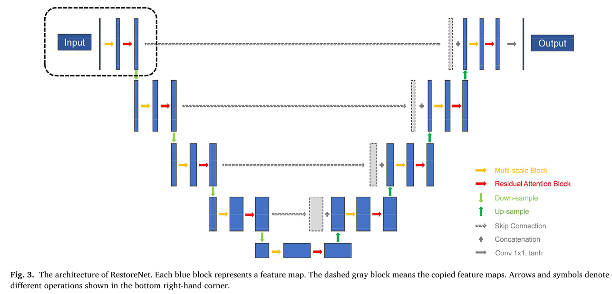
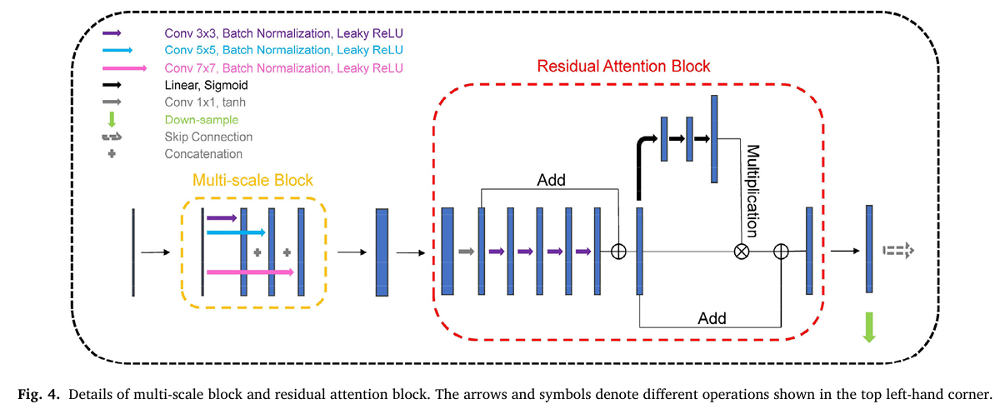
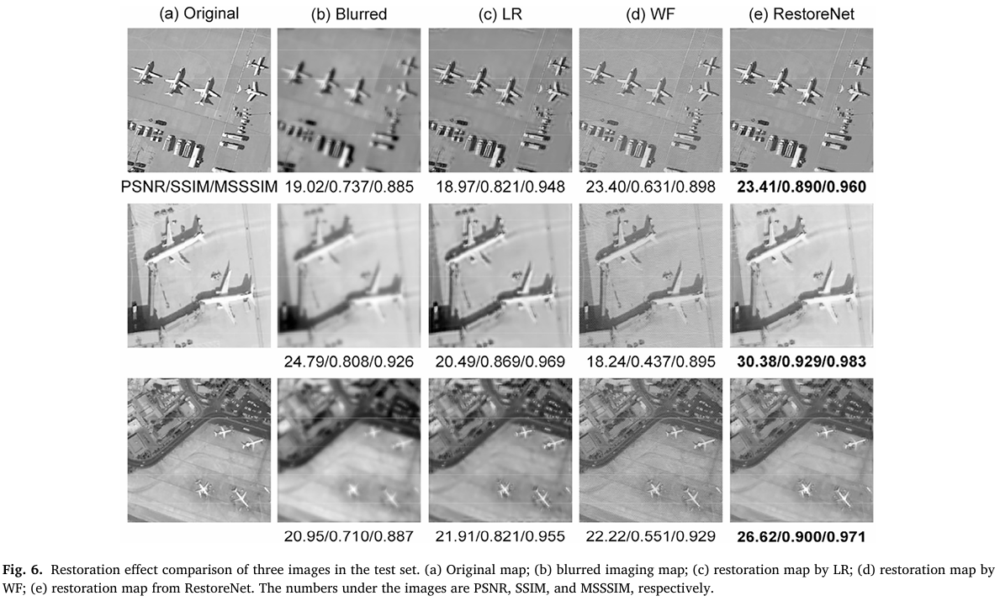

# RestoreNet: a deep learning framework for image restoration in optical synthetic aperture imaging system

> "RestoreNet: a deep learning framework for image restoration in optical synthetic aperture imaging system" OpticsandLasers, 2021 Apr 1
> [paper](https://ieeexplore.ieee.org/document/10704335) [code]() [pdf](./2021_04_OpticsandLasers_RestoreNet--a-deep-learning-framework-for-image-restoration-in-optical-synthetic-aperture-imaging-system.pdf) [note](./2021_04_OpticsandLasers_RestoreNet--a-deep-learning-framework-for-image-restoration-in-optical-synthetic-aperture-imaging-system_Note.md)
> Authors: Ju Tang, Kaiqiang Wang, Zhenbo Ren, Wei Zhang, Xiaoyan Wu, Jianglei Di, Guodong Liu, Jianlin Zhao

## Key-point

- Task: image restoration. Optics
- Problems
- :label: Label: `DIAMNT cooperate`

## Contributions

- UNet, 设计了一个 attention block ....

## Introduction

成像物理模型

## methods

搞了一个 attention block...

## setting

## Experiment

> ablation study 看那个模块有效，总结一下

## Limitations

## Summary :star2:

> learn what

### how to apply to our task

