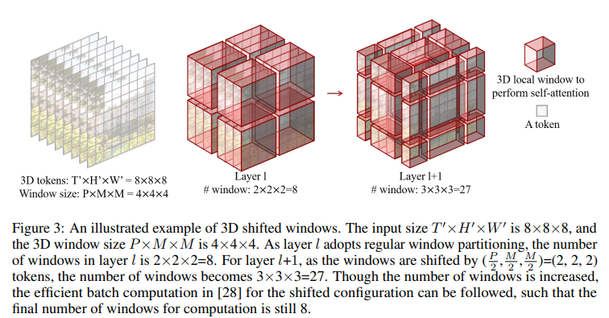

# Video Swin Transformer

> "Video Swin Transformer" CVPR, 2021 Jun
> [paper](http://arxiv.org/abs/2106.13230v1) [code](https://github.com/SwinTransformer/Video-Swin-Transformer) [blog](https://blog.csdn.net/zjupeco/article/details/122860198)
> [pdf](./2021_06_CVPR_Video-Swin-Transformer.pdf)
> Authors: Ze Liu, Jia Ning, Yue Cao, Yixuan Wei, Zheng Zhang, Stephen Lin, Han Hu

## Key-point

- Task
- Problems
- :label: Label:

## Contributions


## Introduction


## methods

instead advocate an inductive bias of locality in video Transformers, which leads to a better speed-accuracy trade-off.

在 Temporal 维度增加一个 window，T=2


输入 `(b t c h w)` , PatchPartition 按 `(2, 4, 4)` 拉直得到 `b, 96, t/2, h/4, w/4` 特征 （`96 == (2*4*4*3)`）

整个过程模仿了 CNN 模块中的下采样过程，这也是为了让模型可以针对不同尺度生成特征。**浅层可以看到小物体**，深层则着重关注大物体。

```python
depths=[2, 2, 6, 2],
num_heads=[8, 8, 8, 8],
window_size=(2, 8, 8),  >> shift_size = tuple(i // 2 for i in window_size)
mlp_ratio=4.,
drop_path_rate=0.2
```

**cycle shift**




**window partition**

在 T 维度窗口 window=2, 移动一帧，等于只有前后帧信息


## Experiment

> ablation study 看那个模块有效，总结一下

## Limitations

## Summary :star2:

> learn what & how to apply to our task

