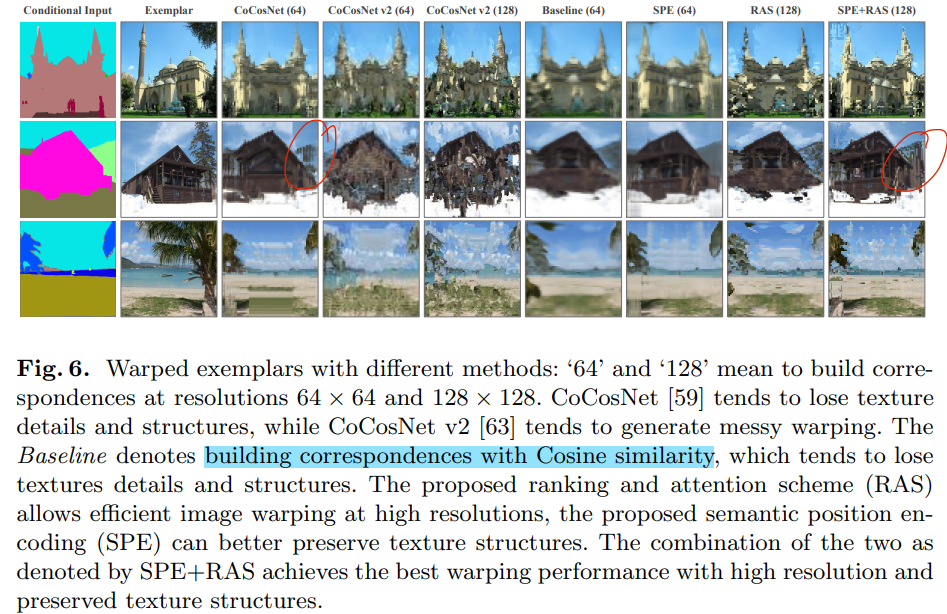
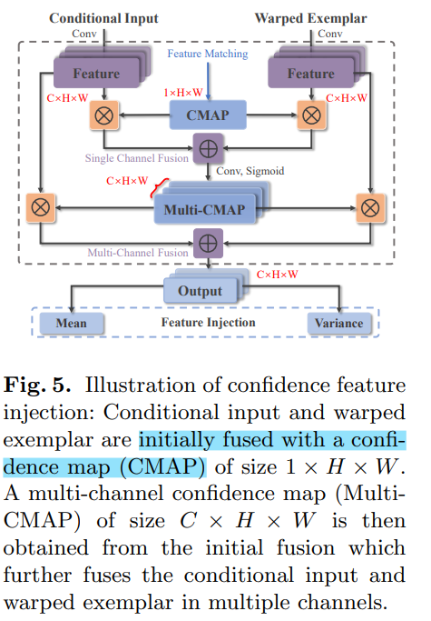
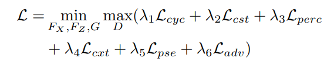
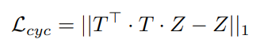
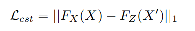
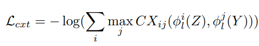
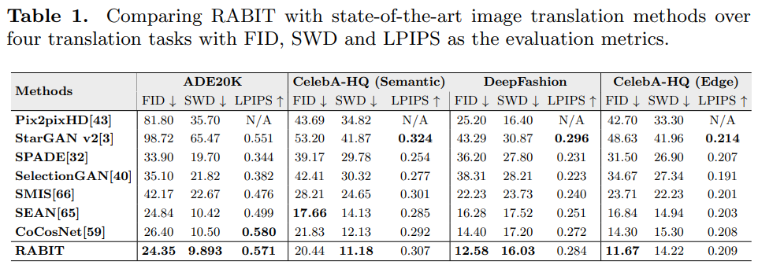
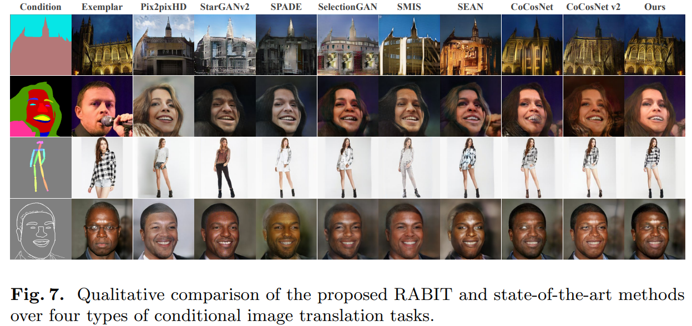

# Bi-level Feature Alignment for Versatile Image Translation and Manipulation

> "Bi-level Feature Alignment for Versatile Image Translation and Manipulation" ECCV, 2021 Jul
> [paper](http://arxiv.org/abs/2107.03021v2) [code](https://github.com/fnzhan/RABIT) 
> [pdf](./2021_07_ECCV_Bi-level-Feature-Alignment-for-Versatile-Image-Translation-and-Manipulation.pdf)
> Authors: Fangneng Zhan, Yingchen Yu, Rongliang Wu, Jiahui Zhang, Kaiwen Cui, Aoran Xiao, Shijian Lu, Chunyan Miao

## Key-point

- Task: Image translation
- Problems
- :label: Label: dense correspondences, `Image-to-Image Translation`

两阶段方法

1. 将 exemplar & condition 分 patch 提取特征，取余弦相似度 topk，**用提出的 RAS 做 atten 做 feature alignment 来得到 warped exemplar** 图像。align 时候用了提出的 semantic position encoding (SPE) 提升性能
2. 将 warped exemplar 和 condition 图像用提出的 CONFI 模块（就是计算特征余弦相似度作为 confidence）加权平均一下，最后输出


## Contributions

1. framework reduces the memory cost

   non-differentiable top-k operation 无法传递梯度，参考先前方法使用 EMD 距离解决

2. preserve texture structures and patterns
   design a **semantic position encoding (SPE)** mechanism 对 patch 增加位置编码，比先前 coordconv 方法更好

3. 问题：conditional inputs and exemplars are seldom perfectly matched, e.g., conditional inputs could **contain several semantic classes that do not exist** in exemplar images

   designing a **CONfidence Feature Injection (CONFI)** fuses the features of conditional inputs and warped exemplars according to the reliability of the built correspondences


## Introduction

- VAE struggles to encode the complex distribution of natural image styles and often suffers from posterior collapse

  > posterior collapse "Don’t blame the elbo! a linear vae perspective on posterior collapse"

  直接用特征，让网络自己去对齐很困难


- exemplar-based image synthesis
  "Cocosnet v2: Full-resolution correspondence learning for image translation"

  - "Patchmatch: A randomized correspondence algorithm for structural image editing"

  问题：tend to build correspondences based on the semantic coherence **without considering the structure coherence** within each semantic region

  Warping exemplars with such pure semantic correspondence may cause destroyed texture patterns in the warped exemplars, and consequently result in inaccurate guidance for image generation

- "Cross-domain correspondence learning for exemplar-based image translation."


## methods

> - :question: EMD 距离
> - 怎么 warp exemplar 图像？

- Motivation

  The alignment network learns the correspondence between a conditional input and an exemplar for warping the exemplar to be aligned with the conditional input. generation network produces the final generation under the guidance of the warped exemplar and the conditional input

  将对齐拆成 2 步

  1. a top-k ranking operation

     输入 exemplar, condition 图像划分 patch 映射为特征，用每个 condition 的 patch 作为 Q 去在 exemplar 中查找最相似的 K 个特征

  2. a dense attention module

     筛选后的 patch 特征之间做 attention 去 warp exemplar 图像？

  之后将 warped exemplar 和 condition 加权融合，生成输出


### Bi-level Feature Alignment

- Motivation

  building correspondence has quadratic complexity which incurs large memory and computation costs

  之前 CoCosNet 只能处理 64x64 的图，细节缺失

  现在工作也只有 128x128

提出 ranking and attention scheme (RAS) 2 阶段方法，降低计算量&显存，能在128x128 图上用

1. first level that introduces top-k ranking to generate block-wise ranking matrices
2. second level that achieves dense attention between the features **within blocks.**




### differentiable top-k

> " Differentiable top-k with optimal transport"
> [EMD(earth mover's distances) 距离](https://zhuanlan.zhihu.com/p/270675634)
> [homepage](https://homepages.inf.ed.ac.uk/rbf/CVonline/LOCAL_COPIES/RUBNER/emd.htm)
> [从Wasserstein距离、对偶理论到WGAN](https://spaces.ac.cn/archives/6280)

tackle top-k as a regularized earth mover’s problem which allows gradient computation via implicit differentiation.

it can be proved that solving the Earth Mover’s problem is equivalent to select the largest K elements from A = [a1, · · · , aN ] >> check supplementary material.


> basics 补充：推土机距离”（Earth Mover's Distance）

EMD 就是将一个土堆 转换 为另一个土堆所需的最小总工作量

The Earth Mover's Distance (EMD) is a method to evaluate **dissimilarity between two multi-dimensional distributions** in some feature space

Intuitively, given two distributions, one can be seen as a mass of earth properly spread in space, the other as a collection of holes in that same space. Then, the EMD measures the least amount of work needed to fill the holes with earth. Here, a unit of work corresponds to transporting a unit of earth by a unit of *ground distance*.


### Generation Network

- Motivation

  先前 SOTA CoCosNet 简单地将 warped exemplar 和 condition 输入 concatenate。warped 之后区域结构上相似，但内容存在很大差异，直接 concat 会把 warp 的噪声映入，影响生成效果

  warped input image and edited semantic map could be **structurally aligned but semantically different** especially when they have severe semantic discrepancy. unreliably warped exemplars could serve as **false guidance** and heavily deteriorate the generation performance

  **conditional inputs and exemplars are seldom perfectly matched, e.g., conditional inputs could contain several semantic classes that do not exist in exemplar images** :star:

希望 unreliable style guidance 的 warped 区域，权值低一些；**计算余弦相似度作为 confidence 加权平均一下**

提出使用 confidence map (CMAP) 对输入 X(condition), Z(warped exemplar) 分别含有 N 个特征的序列 ，对于 `X_i` 去和所有 Z 计算余弦相似度得到 condience score `A = [a1, · · · , aN ]` 取最大值作为 confidence。最终得到 NxN 的 confidence map ；
对 condition 和 exemplar 加权融合 `F = X∗(1−CMAP)+(T ·Z)∗CMAP` 得到单个通道的融合结果，之后将 F 通过 Conv 得到多通道特征。

> 1. 这里的 Z 为输入 exemplar 图像，经过 T 变换实现 warp
> 2. 注意：这里和 condition 图像的特征计算相似度是否合理？
>    之后 loss 有约束让 condition 提取的特征尽可能和 GT 的特征类似，还 ok；但 condition 很模糊，例如只有区域背景，这样提取到的特征直觉上很难会很好




### Loss

整体 loss，$\lambda$ 是的各个 loss 均衡




$L_{cyc}$ warped 的 exemplar 再 warp 一次还原回去



输入 X(condition) 和 gt 的特征需要很相似；feature extractors FX and FZ aim to extract invariant semantic information across domains,



1. 输出的合成图 Y 要和 GT 相似，用 **perceptual loss 约束**

2. statistical consistency between the generated image Y and the exemplar Z

   希望合成输出的纹理，和 exemplar 很相似，**用 contextual loss 约束**

   

3. 使用 CoCosNet 中的 a pseudo pairs loss Lpse

4. adversarial loss


### Code

> [model](https://github.com/fnzhan/RABIT/blob/658c6af2cbea1d6dbff87e769f7875250a47840b/models/networks/generator.py#L18)

`class Pix2PixModel` 整合训练流程，实际 model 为 `self.net = torch.nn.ModuleDict(self.initialize_networks(opt))` ；`def run_generator_one_step` `def run_discriminator_one_step(self, data)` 实现 [forward](https://github.com/fnzhan/RABIT/blob/658c6af2cbea1d6dbff87e769f7875250a47840b/trainers/pix2pix_trainer.py#L76) 

forward 流程

```python
    def generate_fake(self, input_semantics, real_image, ref_semantics=None, ref_image=None, self_ref=None):
        generate_out = {}
        ref_relu1_1, ref_relu2_1, ref_relu3_1, ref_relu4_1, ref_relu5_1 = self.vggnet_fix(ref_image, ['r12', 'r22', 'r32', 'r42', 'r52'], preprocess=True)
        
        # 第一阶段 feature alignmnet 生成 wapred emexplar（ 实现 warp）
        coor_out = self.net['netCorr'](ref_image, real_image, input_semantics, ref_semantics)

        generate_out['ref_features'] = [ref_relu1_1, ref_relu2_1, ref_relu3_1, ref_relu4_1, ref_relu5_1]
        generate_out['real_features'] = self.vggnet_fix(real_image, ['r12', 'r22', 'r32', 'r42', 'r52'], preprocess=True)
		
        # 第二阶段：根据 warped exemplar 和 condition 生成输出
        generate_out['fake_image'] = self.net['netG'](warp_out=coor_out['warp_out'])

        generate_out = {**generate_out, **coor_out}
        return generate_out
```


#### Stage1 

> [code `class NoVGGCorrespondence`](https://github.com/fnzhan/RABIT/blob/658c6af2cbea1d6dbff87e769f7875250a47840b/models/networks/correspondence.py#L150) 看 forward

提取特征

```
        seg_feat2, seg_feat3, seg_feat4, seg_feat5, seg_feat6 = self.adaptive_model_seg(seg_map, seg_map, multi=True)
        ref_feat2, ref_feat3, ref_feat4, ref_feat5, ref_feat6 = self.adaptive_model_img(ref_img, ref_img, multi=True)
```

feature branch ？

RAS matching. >> attention

> [code](https://github.com/fnzhan/RABIT/blob/658c6af2cbea1d6dbff87e769f7875250a47840b/models/networks/correspondence.py#L288C9-L288C24)

`feature alignment` ？？

        ref_ = F.interpolate(ref_img, size=(64, 64), mode='nearest')
        channel_ = ref_.shape[1]
        ref_ = ref_.view(batch_size, channel_, -1).permute(0, 2, 1)
        y_ = torch.matmul(R[:, :, :, 0], ref_)


## Experiment

> ablation study 看那个模块有效，总结一下

对比 SOTA






没做 ablation study


## Limitations

1. 注意：这里和 condition 图像的特征计算相似度是否合理？
   之后 loss 有约束让 condition 提取的特征尽可能和 GT 的特征类似，还 ok；但 condition 很模糊，例如只有区域背景，这样提取到的特征直觉上很难会很好


## Summary :star2:

> learn what & how to apply to our task

- 直接使用 alignment warp 之后的 example 图去生成，细节还是不符合直觉，warp 引入了噪声

  **先前方法直接 concatenate 效果不好**，文章去计算余弦相似度作为 confidence （训练时候 condition 的特征使用 loss 约束和 gt 接近，这样计算相似度还算合理），加权平均一下

  建立原图细节的对应位置，细节区域再去和 exmple 提取；例如：理解皱褶？再和 example 特征去提取

  
