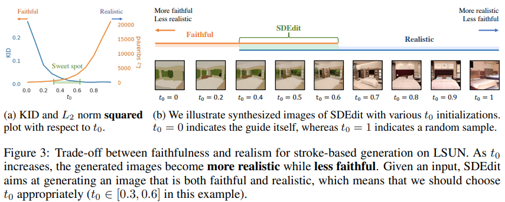

# SDEdit: Guided Image Synthesis and Editing with Stochastic Differential Equations

> "SDEdit: Guided Image Synthesis and Editing with Stochastic Differential Equations" Arxiv, 2021 Aug
> [paper](http://arxiv.org/abs/2108.01073v2) [code](https://github.com/ermongroup/SDEdit) 
> [pdf](./2021_08_Arxiv_SDEdit--Guided-Image-Synthesis-and-Editing-with-Stochastic-Differential-Equations.pdf)
> Authors: Chenlin Meng, Yutong He, Yang Song, Jiaming Song, Jiajun Wu, Jun-Yan Zhu, Stefano Ermon

## Key-point

- Task
- Background
- :label: Label:

Stochastic Differential Editing (SDEdit):  diffusion model generative prior, synthesizes realistic images by iteratively denoising through a stochastic differential equation (SDE)

## Contributions

## Related Work

## methods

"hijack" the reverse stochastic process of SDE-based generative models, as illustrated in the figure below. Given an input image for editing, such as a stroke painting or an image with color strokes, we can add a suitable amount of noise to make its artifacts undetectable, while still preserving the overall structure of the image. We then initialize the reverse SDE with this noisy input, and simulate the reverse process to obtain a denoised image of high quality. The final output is realistic while resembling the overall image structure of the input.

> when we add more Gaussian noise and run the SDE for longer, the synthesized images are more realistic but less faithful >> 设置一个参数 $s\in [0,1]$ 找到 realism 和 faithfulness 平衡

对于平衡真实度（是否自然）和可信度（接近输入图像）

## Experiment

> ablation study 看那个模块有效，总结一下

## Limitations

## Summary :star2:

> learn what & how to apply to our task

