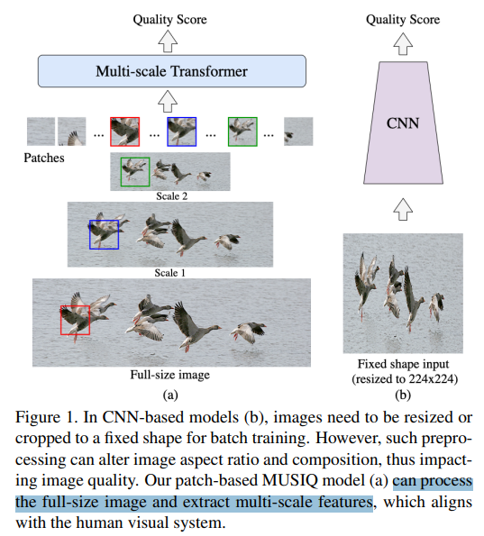
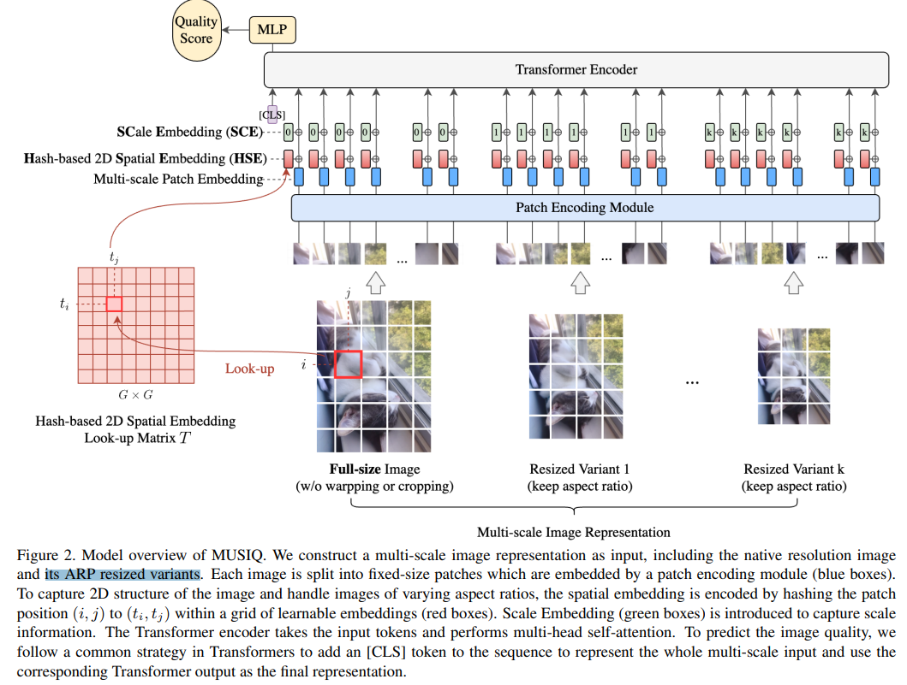

# MUSIQ: Multi-scale Image Quality Transformer

> "MUSIQ: Multi-scale Image Quality Transformer" ICCV, 2021 Aug 12
> [paper](http://arxiv.org/abs/2108.05997v1) [code](https://github.com/google-research/google-research/tree/master/musiq) [pdf](./2021_08_ICCV_MUSIQ--Multi-scale-Image-Quality-Transformer.pdf) [note](./2021_08_ICCV_MUSIQ--Multi-scale-Image-Quality-Transformer_Note.md)
> Authors: Junjie Ke, Qifei Wang, Yilin Wang, Peyman Milanfar, Feng Yang

## Key-point

- Task

- Problems

  - 输入图像需要 resize，为了做 IQA 引入了新的 degradation

    > The performance of CNN-based models is often compromised by the fixed shape constraint in batch training. To accommodate this, the input images are usually resized and cropped to a fixed shape, causing image quality degradation. 

- :label: Label:

论文开头画一张图介绍先前存在的问题（motivation）

## Contributions

- To address this, we design a multi-scale image quality Transformer (MUSIQ) to process native resolution images with varying sizes and aspect ratios. 
- With a multi-scale image representation, our proposed method can **capture image quality at different granularities**.
- SOTA

## Introduction

## methods

> For MUSIQ, the multi-scale representation is constructed as the native resolution image and two ARP resized input (L1 = 224 and L2 = 384) by default

## setting

## Experiment

> ablation study 看那个模块有效，总结一下

## Limitations

## Summary :star2:

> learn what

### how to apply to our task

