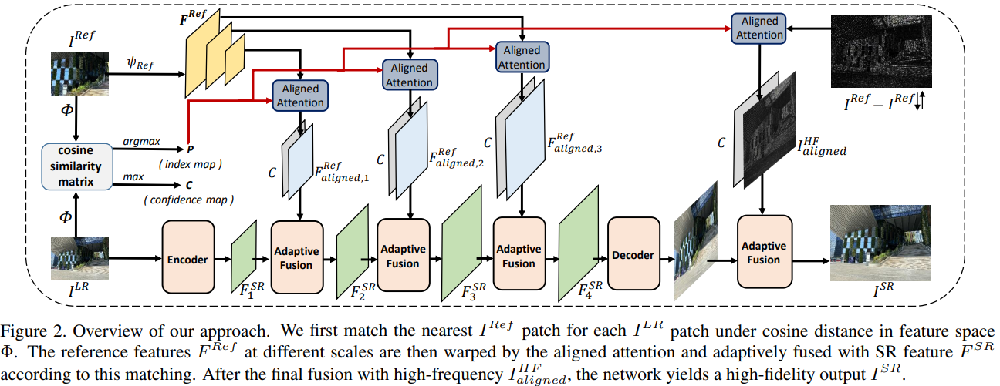
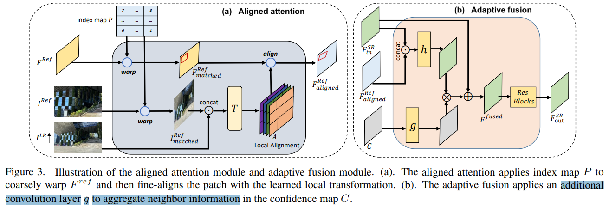

# Dual-Camera Super-Resolution with Aligned Attention Modules

> "Dual-Camera Super-Resolution with Aligned Attention Modules" ICCV oral, 2021 Sep, DCSR
> [paper](https://arxiv.org/abs/2109.01349) [code](https://github.com/Tengfei-Wang/DCSR) [web](https://tengfei-wang.github.io/Dual-Camera-SR/index.html) [pdf](./2021_09_ICCV_oral_Dual-Camera-Super-Resolution-with-Aligned-Attention-Modules.pdf) [note](./2021_09_ICCV_oral_Dual-Camera-Super-Resolution-with-Aligned-Attention-Modules_Note.md)

## **Key-point**

两个镜头不同位置 or 焦距拍摄的照片，geometric misalignment & color mismatch

- reference-based super-resolution

  correlated patterns from reference images 参考 ref23,46 >> **在 patch-wise 匹配或 pixel 对齐**

  1. Patch-wise 因为显示地用了相似度，效果好。但 vanilla patch-level matching 对噪声 or 完全不匹配的 reference 很不鲁棒
  2. average the misaligned Ref and LR patches to produce blurry images :star:
  3. 对 4K 高分辨率去匹配 match 耗时
  4. 新颖的 Loss，不用 L1：转到高低频来看（低频加模糊 kernel，高频比较**最近的像素**差距 》》的确有效）

- 自监督方式训练，反而能增强模型的泛化性

**Contributions**

## **Related Work**

- "Patchmatch: A randomized correspondence algorithm for structural image editing"

- "Feature representation matters: End-to-end learning for reference-based image super-resolution"

  Patch-based attn

- 之前 Dual-Camera 方法，由于 domain gap，用于真实数据效果骤降

## **methods**

### Adaptive Feature Fusion

> "Learning Texture Transformer Network for Image Super-Resolution"
> [paper](https://arxiv.org/abs/2006.04139)
>
> Soft-Fusion methods 效果和本文提出的 adaptive fusion 效果差不多

### Loss 

1. 发现直接用 GT 去 L1 loss 训出来的细节不好！分别在高 & 低频带计算重建 loss

   - 低频：直接 SR结果和 GT 过 Gaussian Kernel

   - 高频：X,Y 图像中最相似像素的距离
      enforces the statistics similarity

   $$
   \mathcal{L}_{rec}=\left\|I_{blur}^{SR}-I_{blur}^{HR}\right\|+\sum_{i}\delta_{i}(I^{SR},I^{HR})
   $$

   

2. **只用上面的 loss 效果还是很糊，去看训练过程中 Fusion Feature Map 发现都是 1**，就是说 reference 的信息没用上 or 用的很少 :star:

   > "The Contextual Loss for Image Transformation with Non-Aligned Data"
   > [paper](https://arxiv.org/abs/1803.02077)

   $$
   \mathcal{L}_{fid}=\frac{\sum_i\delta_i(I^{SR},I^{Ref})\cdot c_i}{\sum_ic_i}
   $$

   

### Self-supervised Real-image Adaptation

真实数据，没有 GT，自监督训练，**把 GT 换成广角拍出的图，用一样的 loss**，反而泛化性能更好！

用自监督方式，在真实数据上训练，根据 ablation study 可以看出SR的细节和泛化性更好！

## **Experiment**

> ablation study 看那个模块有效，总结一下

### Ablation Study

- Similarity Levels

- aligned attn >> feature warping

  > visualize warped imgs by flow-based method

  adaptive fusion only in the feature space, high-frequency details are not be fully transferred

  **Adaptive Fusion 只用 feature 效果还没 "Learning Texture Transformer Network for Image Super-Resolution" 的 Soft Fusion 好**

- Adaptive Fusion Type

  - add
  - soft fusion
  - learnable confidence map >> 比 soft fusion 好 0.18db 

> 看 SR 的结果，人脸和还能看清楚的文字最后都扭曲了 >> 引入 diffusion 先验做一下效果直觉上直接起飞
>
> 对 diffusion 的先验也用一个 adaptive fusion 选择一下！

- Loss: fidelity loss 确实有用！
- Self-supervised Real-image Adaption：用这种方式（换数据）训练，的确清晰很多！

## **Limitations**

## Code

## **Summary :star2:**

> learn what & how to apply to our task

- 推广 2 张不同 Focal 的图像，到视频帧上面