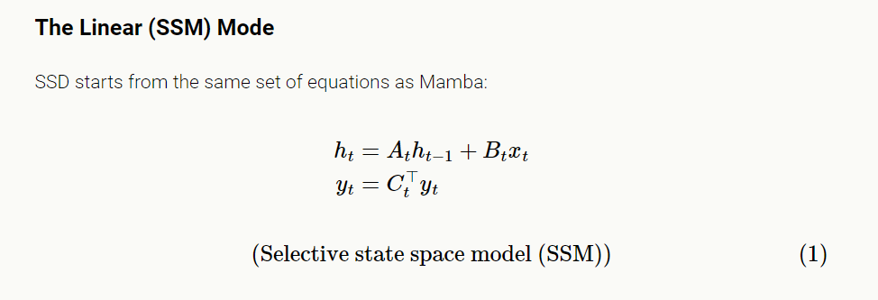

# Efficiently Modeling Long Sequences with Structured State Spaces

> "Efficiently Modeling Long Sequences with Structured State Spaces" Arxiv, 2021 Oct 31
> [paper](http://arxiv.org/abs/2111.00396v3) [code]() [pdf](./2021_10_Arxiv_Efficiently-Modeling-Long-Sequences-with-Structured-State-Spaces.pdf) [note](./2021_10_Arxiv_Efficiently-Modeling-Long-Sequences-with-Structured-State-Spaces_Note.md)
> Authors: Albert Gu, Karan Goel, Christopher Ré

## Key-point

- Task
- Problems
- :label: Label:

## Contributions

## Introduction

## methods

> https://srush.github.io/annotated-s4/

The [Structured State Space for Sequence Modeling](https://arxiv.org/abs/2111.00396) (S4) architecture is a new approach to very **long-range sequence modeling tasks** for vision, language, and audio, showing a capacity to capture dependencies over tens of thousands of steps

### SSM

The [state space model](https://en.wikipedia.org/wiki/State-space_representation) is defined by this simple equation. It maps a 1-D input signal �(�)*u*(*t*) to an �*N*-D latent state �(�)*x*(*t*) before projecting to a 1-D output signal �(�)*y*(*t*).

The original Mamba (or more precisely its core “S6” layer) is exactly a selective SSM with diagonal structure.

- **The SSD layer of Mamba-2 makes only one small modification**: it restricts the diagonal �*A* even further to a *scalar times identity* structure; in other words the diagonal elements of �*A* must all be the same value.

  对 Mamba 使用的 S6 中的 A 变量进一步约束为对角矩阵

#### MULTIHEAD SSMS

输入 $X \in \R ^{(T, P)}$, T 为时序维度，P 为通道数，这里对 P 分为多个 head

SSM 和 Attention 是一个东西，只要对 SSM $y=Mx$ 的 M 约束一下

## Experiment

> ablation study 看那个模块有效，总结一下

## Limitations

## Summary :star2:

> learn what & how to apply to our task

