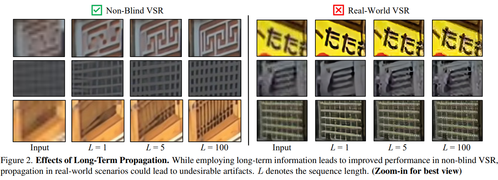
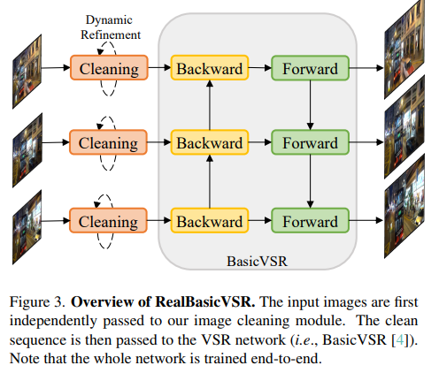
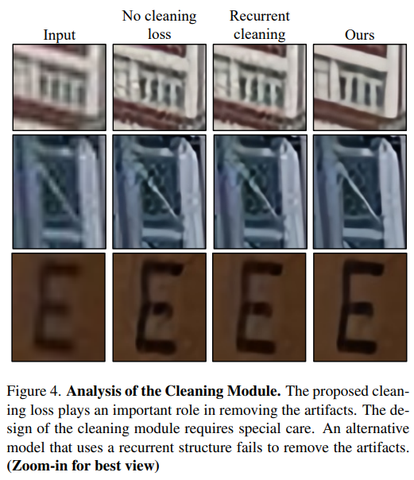
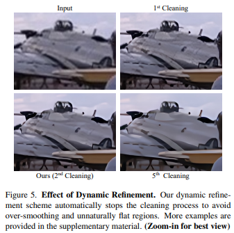
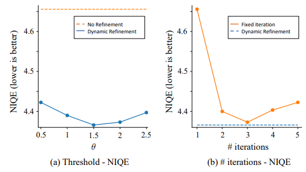
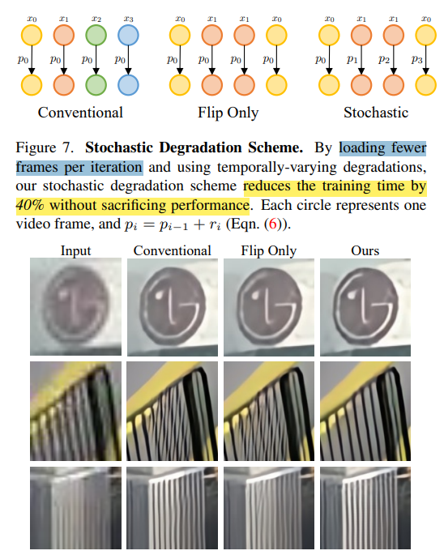
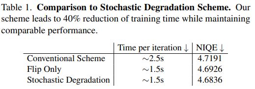
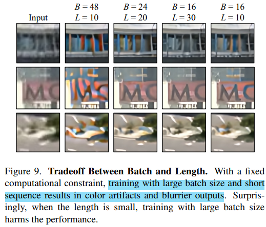
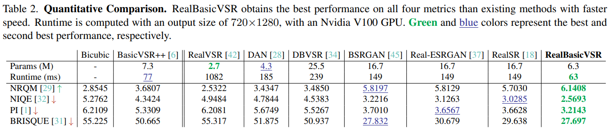
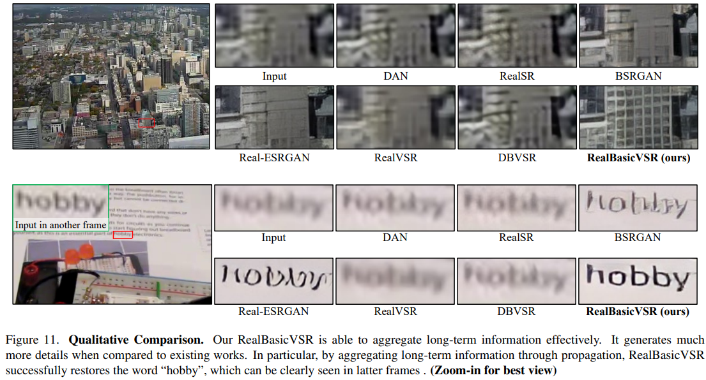

# Investigating Tradeoffs in Real-World Video Super-Resolution

> "Investigating Tradeoffs in Real-World Video Super-Resolution" CVPR, 2021 Nov, **RealBasicVSR**
> [paper](http://arxiv.org/abs/2111.12704v1) [code](https://github.com/ckkelvinchan/RealBasicVSR) 
> [pdf](./2021_11_CVPR_Investigating-Tradeoffs-in-Real-World-Video-Super-Resolution.pdf)
> Authors: Kelvin C. K. Chan, Shangchen Zhou, Xiangyu Xu, Chen Change Loy

## Key-point

- Task: real-world VSR 盲视频超分（无GT）

- Problems

  1.  long-term propagation 对于 severe in-the-wild degradations 效果很烂

      image pre-cleaning stage 来平衡修复的细节和噪声

  2. diverse degradation，泛化性能

     增加退化种类，只能缓解没解决

  3. 计算量大，造成处理速度、batch-length trade-off

     stochastic degradation scheme that reduces up to 40% of training time without sacrificing performance

- Motivation

  To balance the tradeoff between detail synthesis and artifact suppression

- :label: Label:


## Contributions

1. **发现长距离传播存在噪声在真实数据中，时序越长反而影响性能**，提出 Cleaning Module + Dynamic Refinement

2. reveal several challenges in real-world VSR：计算量大、

   只读取 L/2 帧，提出 stochastic degradation 在降低计算量的情况下，维持性能


## Introduction

- long-term propagation 存在的问题

  error accumulation during propagation


### Real-world 退化

相对于 non-blind 需要更长的训练时间，更大的计算量； training with long sequence 很难》》硬件限制？

常用方式时降低 batch & sequence 长度，提出 stochastic degradation scheme

> RealVSR iphone 两个摄像头手机 paired 视频
>
> 使用 Real-ESRGAN 方式:+1:


## methods

### findings(Motivations)

> 1. :question: non-blind 是啥？

在 non-blind 设定下时序越长（100帧）能够缓解噪声。但在 real-world 情况下，处理单帧还可以，时序长了反而效果更烂

**连续几帧有噪声，没特殊考虑**，造成了偏差，需要很远的时序一起均衡掉：1. 确实需要从很远的地方拿；2. 由于累积的误差，需要更多帧来均衡掉

> non-blind settings, when the sequence length L increases, BasicVSR is able to aggregate useful information through long-term propagation 




根据发现的误差累计情况，**选择去 clean input sequence 对噪声图预处理来缓解误差累计的问题**




#### **cleaning module**

使用几层卷积作为预处理模块，得到预处理结果 $\tilde{x_i}$ >> image cleaning loss 约束
$$
\tilde{x}_i=C\left(x_i\right).\\
\mathcal{L}_{clean}=\sum_i\rho\left(\tilde{x}_i-d(z_i)\right),\\
\mathcal{L}_{out}=\sum_{i}\rho\left(y_{i}-z_{i}\right).
$$
加入后主观结果更加平滑




**Dynamic Refinement**
发现只去1次不太好，动态地去，人为指定 $\theta=1.5$
$$
\begin{cases}\tilde x_i^{j+1}=C(\tilde x_i^j)&\quad\text{if}mean\left(|\tilde x_i^j-\tilde x_i^{j-1}|\right)\geq\theta,\\\tilde x_i=\tilde x_i^j&\quad\text{otherwise},\end{cases}
$$


研究阈值 $\theta$，加入 Dynamic Refinement 确实好一些，说明输入图像确实噪声在传播时候存在干扰




### Tradeoff in Training

主要解决：计算量大，推理速度慢，batch-length 降低导致性能下降的问题

CPU 一次读取 `B*L` 张图像 

#### **stochastic degradation scheme**

只读取 L/2 帧，降低 CPU 负担 & 减少内容的变化， 

> we load L/2 frames and flip the sequence temporally. loading fewer frames per iteration. **reduces the training time by 40% without sacrificing performance**

合成数据前后帧用不同退化参数 $p_{i+1}=p_i+r_{i+1}.$



量化比较，训练策略略提速 40%，性能差不多




**Batch Size vs. Sequence Length**

B=48, L=10



## VideoLQ Dataset

- RealVSR dataset [42] consists of LR-HR pairs of videos 》》同一个相机，归类为 camera-specific degradation

从网上下载的 Flickr and YouTube, with a Creative Common license；videos with different resolutions and contents to cover as many degradations as possible. For each video, we extract a sequence of **100 frames with no scene changes**


## Experiment

> ablation study 看那个模块有效，总结一下

### Training Data

Following Real-ESRGAN [37], we adopt the second-order order degradation model >> apply random blur, resize, noise, and JPEG compression as image-based degradations; apply compression with randomly selected codecs and bitrates during training

- REDS dataset
- Adam, patch 64*64, L=30; 
- 两阶段训练
  1. batch size 16 and learning rate 10−4, 300K only Output loss & Cleaning loss; 
  2. finetune  perceptual loss, GAN loss >> 150K, batch=8; LR: 生成器 LR=$5*10^{-5}$，鉴别器LR=$10^{-4}$
- We use BasicVSR as our VSR network S； adopt the discriminator of Real-ESRGAN


盲视频超分，没有 GT，看主观指标



主观效果对比：针对指定数据例如文字、网格，无法获取到物体语义信息，人已经可以大概看出来是什么字，但算法修出来还是有差距




## Code

> `mmedit\models\backbones\sr_backbones\real_basicvsr_net.py`
> [mmedit RealBasicVSR doc](https://github.com/open-mmlab/mmagic/blob/main/configs/real_basicvsr/README.md)
>
> [mmediting 文档](https://zyhmmediting-zh.readthedocs.io/zh-cn/latest/get_started/overview.html) & [Tutorial 4: Train and test in MMagic](https://github.com/open-mmlab/mmagic/blob/main/docs/en/user_guides/train_test.md#tutorial-4-train-and-test-in-mmagic)

```
python tools/train.py configs/real_basicvsr/realbasicvsr_c64b20-1x30x8_8xb1-lr5e-5-150k_reds.py
```


## Limitations

1. [画面中边缘部分模糊](https://github.com/ckkelvinchan/RealBasicVSR/issues/74)
2. 针对指定数据例如文字、网格，无法获取到物体语义信息，人已经可以大概看出来是什么字，但算法修出来还是有差距
3. 输出分辨率只有 720p


## Summary :star2:

> learn what & how to apply to our task


1. findings

   1. 时序太长会引入太多的噪声，反而降低了性能 >> 预处理一下

      > long-term information is also beneficial to this task **but do not come for free**

   2. iteration 的时序长度 L=10 会造成 color artifact >> 增加到 L=30 好一些 （注意本文只读取 L/2 个图像）
