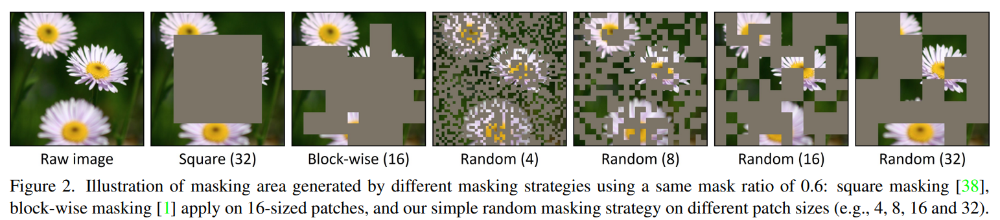

# SimMIM: A Simple Framework for Masked Image Modeling

> "SimMIM: A Simple Framework for Masked Image Modeling" CVPR, 2021 Nov 18
> [paper](http://arxiv.org/abs/2111.09886v2) [code](https://github.com/microsoft/SimMIM) [pdf](./2021_11_CVPR_SimMIM--A-Simple-Framework-for-Masked-Image-Modeling.pdf) [note](./2021_11_CVPR_SimMIM--A-Simple-Framework-for-Masked-Image-Modeling_Note.md)
> Authors: Zhenda Xie, Zheng Zhang, Yue Cao, Yutong Lin, Jianmin Bao, Zhuliang Yao, Qi Dai, Han Hu

## Key-point

- Task
- Problems
- :label: Label:

参考此工作如何设计 mask

## Contributions

- 设计了一种 mask strategy

## Introduction

## methods

The framework consists of 4 major components:

- Masking strategy. Given an input image, this component designs how to select the area to mask, and how to implement masking of selected area. The transformed image after masking will be used as the input.

## setting

## Experiment

> ablation study 看那个模块有效，总结一下

## Limitations

## Summary :star2:

> learn what & how to apply to our task

