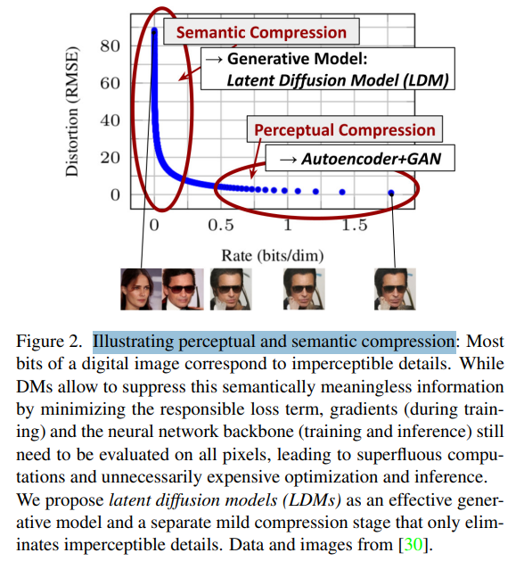

# High-Resolution Image Synthesis with Latent Diffusion Models

> "High-Resolution Image Synthesis with Latent Diffusion Models" CVPR-highlight, 2021 Dec 20
> [paper](http://arxiv.org/abs/2112.10752v2) [code](https://github.com/CompVis/latent-diffusion) [SDv2.1-cdoe](https://github.com/Stability-AI/stablediffusion) [pdf](./2021_12_CVPR-highlight_High-Resolution-Image-Synthesis-with-Latent-Diffusion-Models.pdf) [note](./2021_12_CVPR-highlight_High-Resolution-Image-Synthesis-with-Latent-Diffusion-Models_Note.md)
> Authors: Robin Rombach, Andreas Blattmann, Dominik Lorenz, Patrick Esser, Björn Ommer
>
> [Stable Diffusion with 🧨 Diffusers](https://huggingface.co/blog/stable_diffusion#how-does-stable-diffusion-work)

## Key-point

- Task: Image Synthesis

- Problems

  - RGB pixel space 推理消耗显存

    > However, since these models typically operate directly in pixel space, optimization of powerful DMs often consumes hundreds of GPU days and inference is expensive due to sequential evaluations

- :label: Label:

## Contributions

- 使用 VAE 映射到 latent space 再去生成，降低显存，同时保证重建质量

> To enable DM training on limited computational resources while retaining their quality and flexibility, we apply them in the latent space of powerful pretrained autoencoders
>
> In contrast to previous work, training diffusion models on such a representation allows for the first time to reach a near-optimal point between complexity reduction and detail preservation, greatly boosting visual fidelity.

- 使用 cross-attn 方式引入更多 condition，支持文本引导

> By introducing cross-attention layers into the model architecture, we turn diffusion models into powerful and flexible generators for general conditioning inputs such as text or bounding boxes and high-resolution synthesis becomes possible in a convolutional manner

- 多个 task SOTA 同时显存要求更低

> Our latent diffusion models (LDMs) achieve new state-of-the-art scores for image inpainting and class-conditional image synthesis and highly competitive performance on various tasks, including text-to-image synthesis, unconditional image generation and super-resolution, while significantly reducing computational requirements compared to pixel-based DMs.
>
> We achieve competitive performance on multiple tasks **(unconditional image synthesis, inpainting, stochastic super-resolution)** and datasets while significantly lowering computational costs. Compared to pixel-based diffusion approaches, we also significantly decrease inference costs

- 相比 VAE & Diffusion 同时训练的模型，不需要考虑 weighting -> 重建 & 生成质量，训练简单一些

> We show that, in contrast to previous work [93] which learns both an encoder/decoder architecture and a score-based prior simultaneously, our approach does not require a delicate weighting of reconstruction and generative abilities. This ensures extremely faithful reconstructions and requires very little regularization of the latent space


## Introduction

1. GAN 方法生成样本多样性不足 & 训练不稳定
2. VAE 方法生成，生成图像的质量不行
3. DDPM 在 RGB 像素空间生成，生成慢

> image generation has been tackled mainly through **four families of models**: Generative Adversarial Networks (GANs), Variational Autoencoders (VAEs), Autoregressive Models (ARMs), Diffusion Probabilistic Models(DMs)
>
> - GANs: show promising results for **data with limited variability**, bearing mode-collapse, **unstable training**
>
> **Mode collapse**: *this phenomenon occurs when the generator can alternately generate a limited number of outputs that fool the discriminator. In general, GANs **struggle capturing the full data distribution.***
>
> - VAE(Variational Autoencoders)
>
> not suffer from mode-collapse and can efficiently generate high-resolution images. **sample quality** is **not** always **comparable to** that of **GANs**.
>
> - DDPM
>
> operation in **pixel space** by adding or removing noise to a tensor of the same size as the original image results in **slow inference speed** and **high computational cost**


基于 GAN 的方法，多数在少量数据上通过对抗学习的方式训练 & 存在训练不稳定 & 存在 mode-collapse 问题，很难训练参数量提升到 billion 级别的模型

> In contrast, the promising results of GANs [3, 27, 40] have been revealed to be mostly confined to data with comparably limited variability as their adversarial learning procedure does not easily scale to modeling complex, multi-modal distributions

- Q：什么是 GAN 方法训练的 mode collapse 问题？

生成器只生成固定的几个样本，其他都很垃圾，没法建模完整的数据分布

> **Mode collapse**: *this phenomenon occurs when the generator can alternately generate a limited number of outputs that fool the discriminator. In general, GANs **struggle capturing the full data distribution.***


DDPM 等方法展示出很好的图像生成性能，也有一些 SR，class-condition 的工作，对于不同任务的适配性能很好

> Recently, diffusion models [82], which are built from a hierarchy of denoising autoencoders, have shown to achieve impressive results in image synthesis [30,85] and beyond [7,45,48,57], and define the state-of-the-art in class-conditional image synthesis [15,31] and super-resolution [72]. Moreover, even unconditional DMs can readily be applied to tasks such as inpainting and colorization [85] or stroke-based synthesis [53], in contrast to other types of generative models [19,46,69].

likelihood-based model 避免了 GAN 方法的 mode-collapse 问题，训练更稳定。多 timestep 使用一个模型，能够减模更复杂的数据分布。能够更方便地训练 billion 参数量的模型

> Being likelihood-based models, they do not exhibit **mode-collapse and training instabilities as GANs** and, by heavily exploiting parameter sharing, they can model highly complex distributions of natural images without involving billions of parameters as in AR models [67].


高分辨率图像生成，DDPM 生成占用显存很多

>  Although the reweighted variational objective [30] aims to address this by undersampling the initial denoising steps, DMs are still computationally demanding, since training and evaluating such a model requires repeated function evaluations (and gradient computations) in the high-dimensional space of RGB images.

- Q：训练成本？

"Diffusion models beat gan" 方法训练需要 1k V100 Days, 8 卡就是 125 天

推理要 1k step 也贼慢，一个 V100 去生成 50k 个图像需要 5天


> As an example, training the most powerful DMs often takes hundreds of GPU days (e.g. **150 - 1000 V100 days in [15])** and repeated evaluations on a noisy version of the input space render also inference expensive, so that producing **50k samples takes approximately 5 days [15] on a single A100 GPU.** 
>
> - "Diffusion models beat gans on image synthesis" COPR, 2021 https://arxiv.org/pdf/2105.05233


- Q：motivation?

训练要求高，只有少数卡多的组可以做 & 训练成本高 -> 碳排放。。。

> This has two consequences for the research community and users in general: Firstly, training such a model requires massive computational resources only available to a small fraction of the field, and leaves a huge carbon footprint [65, 86]. 

推理时间 & 显存大

> Secondly, evaluating an already trained model is also expensive in time and memory, since the same model architecture must run sequentially for a large number of steps (e.g. 25 - 1000 steps in [15]).

需要一种显存要求更低的方法，加速推理，让模型更多地被用起来

> **To increase the accessibility of this powerful model class and at the same time reduce its significant resource consumption**, a method is needed that reduces the computational complexity for both training and sampling. Reducing the computational demands of DMs without impairing their performance is, therefore, key to enhance their accessibility


- Q：转到 latent 合理吗？

训练一个不同压缩比的模型，重建一下去计算 RMSE。

压缩的越多，细节损失越多。发现大多数 bit 是粗看感知不到的细节，这部分生成认为可以优化掉

> : Fig. 2 shows the rate-distortion trade-off of a trained model. 




训练 2 个 stage

1.  perceptual compression stage：训练一个 VAE，去掉高频细节
2. 训练 diffusion 生成模型

> As with any likelihood-based model, learning can be roughly divided into two stages: First is a perceptual compression stage which removes high-frequency details but still learns little semantic variation. 
>
>  In the second stage, the actual generative model learns the semantic and conceptual composition of the data (semantic compression).

目的是找到一个生成图像的感知差不多 & 计算量更少的 space

> We thus aim to first find a perceptually equivalent, but computationally more suitable space, in which we will train diffusion models for high-resolution image synthesis


训练 VAE，确定 low-dimensional space，也不用压缩太多 -> Latent space 

> Following common practice [11, 23, 66, 67, 96], we separate training into two distinct phases: **First, we train an autoencoder which provides a lower-dimensional (and thereby efficient) representational space** which is perceptually equivalent to the data space.
>
> Importantly, and in contrast to previous work [23,66], **we do not need to rely on excessive spatial compression, as we train DMs in the learned latent space**, which exhibits better scaling properties with respect to the spatial dimensionality.

Latent space 上去学习 diffusion model，进行生成，称作 LDM

> The reduced complexity also provides efficient **image generation from the latent space with a single network pass**. We dub the resulting model class **Latent Diffusion Models (LDMs).**

同时 VAE 重建质量对比 GAN 方法好一丢


- Q：好处？

latent space 训完一次以后，可以适配后续不同任务

> A notable advantage of this approach is that we need to train the universal autoencoding stage only once and can therefore reuse it for multiple DM trainings or to explore possibly completely different tasks [81].
>
> This enables efficient exploration of a large number of diffusion models for various image-to-image and text-to-image tasks

Diffusion 网络结构用 UNet

> For the latter, we design an architecture that connects transformers to the DM’s UNet backbone [71] and enables arbitrary types of token-based conditioning mechanisms, see Sec. 3.3
>
> - "Unet: Convolutional networks for biomedical image segmentation" MICCAI, 2015  https://arxiv.org/abs/1505.04597


### Two-Stage Image Synthesis

> VQ-VAEs [67, 101] use autoregressive models to learn an expressive prior over a discretized latent space. 
>
> - "Generating Diverse High-Fidelity Images with VQ-VAE-2" NIPS, 2019 Jun 2
>   [paper](http://arxiv.org/abs/1906.00446v1) [code]() [pdf](./2019_06_NIPS_Generating-Diverse-High-Fidelity-Images-with-VQ-VAE-2.pdf) [note](./2019_06_NIPS_Generating-Diverse-High-Fidelity-Images-with-VQ-VAE-2_Note.md)
>   Authors: Ali Razavi, Aaron van den Oord, Oriol Vinyals
>
> - "Videogpt: Video generation using VQ-VAE and transformers" CoPR, https://arxiv.org/abs/2104.10157
>
> - "Taming Transformers for High-Resolution Image Synthesis" CVPR, 2020 Dec, **VQ-GAN** :star:
>
>   [paper](https://arxiv.org/abs/2012.09841) [website](https://compvis.github.io/taming-transformers/) [note](./2021_CVPR_VQGAN_Taming-Transformers-for-High-Resolution-Image-Synthesis_Note.md)


VQ-VAEs Encoder 先提取特征 -> 再映射到一个离散的 codebook

> The VQ-VAE model [37] can be better **understood as a communication system.** It comprises of an encoder that maps observations onto a sequence of discrete latent variables, and a decoder that reconstructs the observations from these discrete variables. 
>
> - "Generating Diverse High-Fidelity Images with VQ-VAE-2" NIPS, 2019 Jun 2
>   [paper](http://arxiv.org/abs/1906.00446v1) [code]() [pdf](./2019_06_NIPS_Generating-Diverse-High-Fidelity-Images-with-VQ-VAE-2.pdf) [note](./2019_06_NIPS_Generating-Diverse-High-Fidelity-Images-with-VQ-VAE-2_Note.md)
>   Authors: Ali Razavi, Aaron van den Oord, Oriol Vinyals


VQ-GAN 用于生成

> Different from VQ-VAEs, VQGANs [23, 103] employ a first stage with an adversarial and perceptual objective to scale autoregressive transformers to larger images


> Our work prevents such tradeoffs, as our proposed LDMs scale more gently to higher dimensional latent spaces due to their convolutional backbone. Thus, we are free to choose the level of compression which optimally mediates between learning a powerful first stage, without leaving too much perceptual compression up to the generative diffusion model while guaranteeing highfidelity reconstructions (see Fig. 1).


## methods


### Perceptual Image Compression

VAE 的训练，参考 VQ-GAN

1. perceptual loss
2. patch-based [33] adversarial objective

> Our perceptual compression model is based on previous work [23] and consists of an autoencoder trained by combination of a perceptual loss [106] and a patch-based [33] adversarial objective [20, 23, 103]. 
>
> - "Taming Transformers for High-Resolution Image Synthesis" CVPR, 2020 Dec, **VQ-GAN** :star:
>
>   [paper](https://arxiv.org/abs/2012.09841) [website](https://compvis.github.io/taming-transformers/) [note](./2021_CVPR_VQGAN_Taming-Transformers-for-High-Resolution-Image-Synthesis_Note.md)


- Q：用这两个 loss 的好处？

使用 L1 loss 会导致局部区域的细节丢失，造成 blur

> This ensures that the reconstructions are confined to the image manifold by enforcing local realism and avoids bluriness introduced by relying solely on pixel-space losses such as L2 or L1 objectives.


几个符号，x 为 RGB 图像


避免训练一个随机的高维度 latent space -> 增加一些正则化限制

> In order to avoid arbitrarily high-variance latent spaces, we experiment with two different kinds of regularizations.

loss 类似 VQ-VAE


> The first variant, KL-reg., imposes a slight KL-penalty towards a standard normal on the learned latent, similar to a VAE [46, 69], whereas VQ-reg. uses a vector quantization layer [96] within the decoder. This model can be interpreted as a VQGAN [23] but with the quantization layer absorbed by the decoder. 

使用 2维度 h,w 的 latent，之前的 codebook 使用 1D 序列，忽略了图像的结构。使用 2d latent 还原细节更好

>  This is in contrast to previous works [23, 66], which relied on an arbitrary 1D ordering of the learned space z to model its distribution autoregressively and thereby ignored much of the inherent structure of z.
>
> Hence, our compression model preserves details of x better (see Tab. 8). The full objective and training details can be found in the supplement.


### Latent Diffusion Models

Diffusion 原理类似

> - "Understanding Diffusion Models: A Unified Perspective" Arxiv, 2022 Aug 25
>   [paper](http://arxiv.org/abs/2208.11970v1) [code]() [pdf](./2022_08_Arxiv_Understanding-Diffusion-Models--A-Unified-Perspective.pdf) [note](./2022_08_Arxiv_Understanding-Diffusion-Models--A-Unified-Perspective_Note.md)
>   Authors: Calvin Luo


VAE 训练的 latent space 重建能力可以，还进行了压缩。同样适用 loglikelihood loss

> Compared to the high-dimensional pixel space, this space is more suitable for likelihood-based generative models, as they can now (i) focus on the important, semantic bits of the data and (ii) train in a lower dimensional, computationally much more efficient space.


- Q: UNet 结构？

time condition UNet

> The neural backbone  $\epsilon$θ(◦, t) of our model is realized as a **time-conditional UNet [71].**
>
> [StableDiffusion_structure.drawio](./StableDiffusion_structure.drawio)


### Conditioning Mechanisms

当时 condition 多数都是 class label & blurred 图像，使用文生图的还很少

> In the context of image synthesis, however, combining the generative power of DMs with other types of conditionings beyond **class-labels [15] or blurred variants of the input image** [72] is so far an under-explored area of research.

在 UNet 内用 cross-attn 引入文本

> We turn DMs into more flexible conditional image generators by augmenting their underlying UNet backbone with the cross-attention mechanism [97], which is effective for learning attention-based models of various input modalities [35,36]. 


还是用原来的 loss 一起训练就 ok


每个 word 对应 token 有点意义的


## setting

- Exp 里面说一些模型用一个 A100 训练的


### SD Version

SDv1.5 在 SDv1.2 基础上用 laion-aesthetics v2 5+ 数据集微调 + 提升 CFG

> https://huggingface.co/stable-diffusion-v1-5/stable-diffusion-v1-5
>
> The **Stable-Diffusion-v1-5** checkpoint was initialized with the weights of the [Stable-Diffusion-v1-2](https://huggingface.co/steps/huggingface.co/CompVis/stable-diffusion-v1-2) checkpoint and subsequently fine-tuned on 595k steps at resolution 512x512 on "laion-aesthetics v2 5+" and 10% dropping of the text-conditioning to improve [classifier-free guidance sampling](https://arxiv.org/abs/2207.12598).

SDv2  支持 768x768， UNet 一样，TextCLIP 替换为 OpenCLIP-ViT/H，使用 v-prediction loss

> https://github.com/Stability-AI/stablediffusion :star:
>
> - New stable diffusion model (*Stable Diffusion 2.0-v*) at 768x768 resolution. Same number of parameters in the U-Net as 1.5, but uses [OpenCLIP-ViT/H](https://github.com/mlfoundations/open_clip) as the text encoder and is trained from scratch. *SD 2.0-v* is a so-called [v-prediction](https://arxiv.org/abs/2202.00512) model.

> - https://huggingface.co/stabilityai/stable-diffusion-2

SDv2.1 调整参数继续微调 55k + 155k steps

> - https://huggingface.co/stabilityai/stable-diffusion-2-1
>
> This `stable-diffusion-2-1` model is fine-tuned from [stable-diffusion-2](https://huggingface.co/stabilityai/stable-diffusion-2) (`768-v-ema.ckpt`) with an additional 55k steps on the same dataset (with `punsafe=0.1`), and then fine-tuned for another 155k extra steps with `punsafe=0.98`.


## Experiment

> ablation study 看那个模块有效，总结一下

>  A visual comparison between the effects of first stage regularization schemes on LDM training and their generalization abilities to resolutions > 2562 can be found in Appendix D.1.

网络结构细节，看  E.2

>  In E.2 we list details on architecture, implementation, training and evaluation for all results presented in this section.


Efficiency Analysis

> All models have a comparable number of parameters as provided in Tab. 13 and 14. We maximize the learning rates of the individual models such that they still train stably. Therefore, the learning rates slightly vary between different runs cf . Tab. 13 and 14.


###  On Perceptual Compression Tradeoffs

对比不同压缩比 f 训练出来的效果

> This section analyzes the behavior of our LDMs with different downsampling factors f ∈ {1, 2, 4, 8, 16, 32}

都用一个 A100 训练

> To obtain a comparable test-field, we fix the computational resources to a single NVIDIA A100 for all experiments in this section and train all models for the same number of steps and with the same number of parameters.


虽然 VQ-VAE 的重建稍微烂一丢丢，但训练的 LDM 生成质量居然更好

> . Interestingly, we find that LDMs trained in VQregularized latent spaces sometimes achieve better sample quality, **even though the reconstruction capabilities of VQregularized first stage models slightly fall behind those of their continuous counterparts**, cf . Tab. 8.

看一下 VAE 重建的指标

> Tab. 8 shows hyperparameters and reconstruction performance of the first stage models used for the LDMs com


对比不同压缩比训练的模型，训练时长 & 效果 -> FID

LDM-1 训练 2M steps 都还没收敛。。。**确实最后的 f8-16 都还可以，能正常训出来**。推理用 100steps DDIM

> Fig. 6 shows sample quality as a function of training progress for 2M steps of class-conditional models on the ImageNet [12] dataset. We see that, i) small downsampling factors for LDM-{1,2} result in slow training progress, whereas ii) overly large values of f cause stagnating fidelity after comparably few training steps.

> Results obtained with 100 DDIM steps [84] and κ = 0.


- Q：为啥 LDM-1&2 训得慢，LDM-32很垃圾？

> Revisiting the analysis above (Fig. 1 and 2) we attribute this to i) leaving most of perceptual compression to the diffusion model and ii) too strong first stage compression resulting in **information loss and thus limiting the achievable quality**

VAE 压缩比太大太拉了


对比不同压缩比，在 CelebA & ImageNet 上效果，**F8,16 确实可以**


总结一下就是 LDM-4-8 效果最好

> In summary, LDM-4 and -8 offer the best conditions for achieving high-quality synthesis results.


### Image Generation with Latent Diffusion

和 GAN 方法，对比图像生成效果

> Moreover, LDMs consistently improve upon GAN-based methods in Precision and Recall, thus confirming the advantages of their mode-covering likelihood-based training objective over adversarial approaches.

- Q：为啥说比 GAN 好？

虽然对比几个 FID 弱了一些（几乎接近），但 Precision Recall 更高，对于整体数据分布建模更好

> Moreover, LDMs consistently improve upon GAN-based methods in **Precision and Recall,** thus confirming the advantages of their **mode-coverin**g likelihood-based training objective over adversarial approaches.


### Conditional

1.45B 模型

>  For textto-image image modeling, we train a 1.45B parameter KL-regularized LDM conditioned on language prompts on LAION-400M [78]
>
> We employ the BERT-tokenizer [14] and implement τθ as a transformer [97] to infer a latent code which is mapped into the UNet via (multi-head) crossattention (Sec. 3.3). 


Layout-to-Image


256x256 训练的模型，可以直接推理 512x1024! 进一步降低训练要求 :star:


SR

> - "Image super-resolution via iterative refinement"SR3


#### inpaint

Inpainting 任务上对比一下 LDM vs DM 提速 x2.7, 指标 x1.6 :star:

> Tab. 6 reports the training and sampling throughput at resolution 2562 and 5122 , the total training time in hours per epoch and the FID score on the validation split after six epochs. Overall, we observe a speed-up of at least 2.7× between pixel- and latent-based diffusion models while improving FID scores by a factor of at least 1.6×.


看下 inpaint 指标 -> SOTA


## Code


> pytorch-lighting  >> save moves for zero the gradient,...
> [stable-diffusion code analysis blog](https://zhuanlan.zhihu.com/p/613337342)
>
> - Summary
>
>   有了 x 和 condition info ( class_name )
>
>   1. 将 x 通过 VQGAN encoder 映射为 latent code
>
>   2. DDPM 训练
>
>      1. 从 0-1000 随机取 timestep 
>
>      2. condition  经过 `ClassEmbedder `映射得到 1x512 tensor
>
>      3. `def p_losses` 从干净 x0 加噪 T 步
>
>         随机取噪声 noise $\epsilon$ (shape 和 x0 一样)
>
>         `def q_sample` 按公式加噪 $q(x_t | x_0)\sim \mathcal{N}(\sqrt{\bar{a_t}} x_0, (1-\bar{a_t})I)$
>
>      4. 调 U-net 输入 x_t, t, condition 预测噪声，与之前随机取的 noise $\epsilon$ 计算 L2 loss

```
# training config
configs/autoencoder/autoencoder_kl_64x64x3.yaml  # dataset image->256x256x3
configs/latent-diffusion/cin-ldm-vq-f8.yaml
```

- Loading module from yaml info >> use same code to initialize different classes

  ```python
  import importlib
  
  """ yaml example
      unet_config:
        target: ldm.modules.diffusionmodules.openaimodel.UNetModel
        params:
          image_size: 32
  """
  
  def instantiate_from_config(config):
      if not "target" in config:
          if config == '__is_first_stage__':
              return None
          elif config == "__is_unconditional__":
              return None
          raise KeyError("Expected key `target` to instantiate.")
      return get_obj_from_str(config["target"])(**config.get("params", dict()))
  
  
  def get_obj_from_str(string, reload=False):
      module, cls = string.rsplit(".", 1)
      if reload:
          module_imp = importlib.import_module(module)
          importlib.reload(module_imp)
      return getattr(importlib.import_module(module, package=None), cls)
  ```

  

### AutoencoderKL

`def training_step` main training procedures happens

> VQGAN code learning

- **LPIPS Loss >> perceptual loss**

  input & reconstruction from Autoencoder all shapes like [B, 3, 256, 256]

  use **pretrained `VGG16`'s feature Module**, which is `nn.Sequential` hence the layer could be visited by index. What `LPIPS` do is **split the starting 30 layers into 5 slice `nn.Sequential`** (cut at layer indexing by 3,8,15,22,29 and **each module ends with layer `RELU(inplace=True)`**)

  ```python
  from torchvision import models
  
  vgg_pretrained_features = models.vgg16(pretrained=pretrained).features  # nn.Sequential 31 layers
  # [64, 64, 'M', 128, 128, 'M', 256, 256, 256, 'M', 512, 512, 512, 'M', 512, 512, 512, 'M']
  # number-> ConvModule(conv2d+relu) "M"->Maxpooling
  
  # output with 5 moudle's output (each end with RELU layer)
  vgg_outputs = namedtuple("VggOutputs", ['relu1_2', 'relu2_2', 'relu3_3', 'relu4_3', 'relu5_3'])
  ```

  > What could we learn from this LPIPS implementation？
  >
  > **tear pretrained Module apart to get intermediate layers output** 
  >
  > ```python
  > class vgg16(torch.nn.Module):
  >  def __init__(self, requires_grad=False, pretrained=True):
  >      super(vgg16, self).__init__()
  >      vgg_pretrained_features = models.vgg16(pretrained=pretrained).features  # nn.Sequential hence could be visit by index 
  >      self.slice1 = torch.nn.Sequential()
  >      for x in range(4):
  >          self.slice1.add_module(str(x), vgg_pretrained_features[x]) 
  > 
  >      # ...
  > 	def forward(self, X): 
  >      h = self.slice1(X)
  >      h_relu1_2 = h
  >      # ...
  >      vgg_outputs = namedtuple("VggOutputs", ['relu1_2', 'relu2_2', 'relu3_3', 'relu4_3', 'relu5_3'])
  >      return vgg_outputs(h_relu1_2, h_relu2_2, h_relu3_3, h_relu4_3, h_relu5_3)
  > 
  > ```

  

- download file standard ways

  ```python
  def download(url, local_path, chunk_size=1024):
      os.makedirs(os.path.split(local_path)[0], exist_ok=True)
      with requests.get(url, stream=True) as r:
          total_size = int(r.headers.get("content-length", 0))
          with tqdm(total=total_size, unit="B", unit_scale=True) as pbar:
              with open(local_path, "wb") as f:
                  for data in r.iter_content(chunk_size=chunk_size):
                      if data:
                          f.write(data)
                          pbar.update(chunk_size)
  ```

- import module from string in config file

  ```python
  import importlib
  
  def get_obj_from_str(string, reload=False):
      module, cls = string.rsplit(".", 1)
      if reload:
          module_imp = importlib.import_module(module)
          importlib.reload(module_imp)
      return getattr(importlib.import_module(module, package=None), cls)
  ```

  

- KL loss

  > [How to generate Gaussian samples](https://medium.com/mti-technology/how-to-generate-gaussian-samples-347c391b7959)
  >
  > - Variance 方差
  > - Standard Deviation
  >   Standard deviation is a statistic that measures the dispersion of a dataset relative to its [mean](https://www.investopedia.com/terms/m/mean.asp) and is calculated as the square root of the [variance](https://www.investopedia.com/terms/v/variance.asp). 
  > - KL divergence [blog](https://zhuanlan.zhihu.com/p/438129018)

  `class DiagonalGaussianDistribution` >> `ldm/modules/distributions/distributions.py`

  - sample

    `logvar` >> $\log{(\sigma^2)}$
    $$
    \text{assume } z\sim\mathcal{N}(0,1) \\
    if \\
    x = \mu + \sigma * Z = \mu + exp(0.5 * \log{(\sigma^2)}) * Z \\
    \text{lets say } x\sim\mathcal{N}(\mu, \sigma)\\
    $$

  - KL divergence
    $$
    KL\_Loss = 0.5 *\sum{(\mu^2 + \sigma^2 - 1 - \log{\sigma^2})}
    $$

  - VQ-GAN adaptive weight
    $$
    Loss = \mathcal{L}_{resc} +\lambda * \mathcal{L}_{GAN} \\
    \lambda = \frac{\nabla_{GL}{\mathcal{L}_{resc}}}{\nabla_{GL}{\mathcal{L}_{GAN}} +1e-4}
    $$
    **获取最后一层 layer 的梯度**

    ```
    last_layer = self.decoder.last_layer.weight
    
    nll_grads = torch.autograd.grad(nll_loss, last_layer, retain_graph=True)[0]
    ```

- PatchGAN discriminator

  > [Question: PatchGAN Discriminator](https://github.com/junyanz/pytorch-CycleGAN-and-pix2pix/issues/39)
  >
  > In fact, a "PatchGAN" is just a convnet! Or you could say all convnets are patchnets: the power of convnets is that they process each image patch identically and independently. 卷积核处理的时候就是一个 image patch

  

### LatentDiffusion Train

>  in `ldm/models/diffusion/ddpm.py`
>  configure file=`configs/latent-diffusion/cin-ldm-vq-f8.yaml`

initialize the `class DDPM(pl.LightningModule)`

#### UNetModel

> U-net model in `self.model = DiffusionWrapper(unet_config, conditioning_key)`
> `class UNetModel(nn.Module):`  >> `ldm/modules/diffusionmodules/openaimodel.py`
>
> *The full UNet model with attention and timestep embedding.* 
> See U-net structure >> [Stable-diffusion_U-net-structure-with-Note.pdf](Stable-diffusion_U-net-structure-with-Note.pdf)
>
> - [What is the 'zero_module' used for?](https://github.com/openai/guided-diffusion/issues/21)
>
>   is used to initialize certain modules to zero. 
>
>   ```python
>   def zero_module(module):
>       """
>       Zero out the parameters of a module and return it. >> Initialize the module with 0
>       """
>       for p in module.parameters():
>           p.detach().zero_()
>       return module
>   ```


> Upsample 一般都是先 Upsample 再接 `Conv2d(kernel_size=3,stride=1,padding=1)`


#### **timestep_embedding**

> `ldm/modules/diffusionmodules/util.py`
> [timestep embedding blog](https://kazemnejad.com/blog/transformer_architecture_positional_encoding/#what-is-positional-encoding-and-why-do-we-need-it-in-the-first-place) :star:
> [detailed proof for]

**basics**

the time-embedding should satisfy the following criteria:

1. unique each  timestep(word's position)
2. distance between 2 time-step should be consistent across different sentence
3. generalize to longer sentences
4. determinstic

using binary values would be a waste of space in the world of floats. So instead, we can use their float continous counterparts - **Sinusoidal functions. Indeed, they are the equivalent to alternating bits.** 

<figure>
    
    <figcaption> 
        <center>
        <I>Sinusoidal embedding for dim=50
        </center>
    </figcaption>
</figure>


***sinusoidal timestep embeddings.***

$POS_{i} * POS_{i+k}$ 随着间隔 K 增大，逐渐减小来表示相对位置关系。但内积是对称的，无法区分前后关系

```python
freqs = torch.exp(-math.log(max_period) * torch.arange(start=0, end=half, dtype=torch.float32) / half).to(device=timesteps.device)
args = timesteps[:, None].float() * freqs[None]  # [N,1] * [1, half] >> [N, half]
embedding = torch.cat([torch.cos(args), torch.sin(args)], dim=-1)  # [N, dim]

time_embed_dim = model_channels * 4
time_embed = nn.Sequential(
            linear(model_channels, time_embed_dim),
            nn.SiLU(),
            linear(time_embed_dim, time_embed_dim),
        )
```


**LitEma**

滑动平均


**register_schedule**

> Whole bunch of formulations could be check at [DDPM video 42:19](https://www.youtube.com/watch?v=y7J6sSO1k50)

- beta >> linear 
  `torch.linspace(linear_start ** 0.5, linear_end ** 0.5, n_timestep, dtype=torch.float64) ** 2`

- alpha $[1, 0.9999, \cdots, 7e-4]$

- $\bar{\alpha_i}$ 

  ```
  alphas_cumprod = np.cumprod(alphas, axis=0)
  alphas_cumprod_prev = np.append(1., alphas_cumprod[:-1])
  ```


### **VQModelInterface**

> `ldm.models.autoencoder.VQModelInterface`


### LitEMA :open_hands:

> [blog: stable-diffusion optimization: EMA weights on CPU](https://lunnova.dev/articles/stable-diffusion-ema-on-cpu/)
> Stable Diffusion 的 LitEMA 滑动平均回到是参数在 GPU 某一时刻加倍，可能导致显存溢出！可以根据此 blog 修改 `LitEMA()` 将参数存在 CPU 上，据说可以从 32G -> 27G 显存

Stable diffusion uses an Exponential Moving Average of the model's weights to improve quality of resulting images and **avoid overfitting to the most recently trained images.**

Stable Diffusion includes an implementation of an EMA called `LitEma`, found at [ldm/modules/ema.py](https://github.com/CompVis/stable-diffusion/blob/69ae4b35e0a0f6ee1af8bb9a5d0016ccb27e36dc/ldm/modules/ema.py)

- How do you implement an EMA for a machine learning model?

  With PyTorch modules you can use [the `named_parameters()` iterator](https://pytorch.org/docs/stable/generated/torch.nn.Module.html#torch.nn.Module.named_parameters) to access all parameters. :star:

- the EMA weights end up on the GPU like everything else. This **doubles the memory required** to store the model parameters! 可能造成显存溢出 !! :warning:

  > [How to keep some LightningModule's parameters on cpu when using CUDA devices for training](https://github.com/Lightning-AI/lightning/issues/3698)


### Text2Image

> `scripts/txt2img.py`

#### PLMS

> [PNDM github repo](https://github.com/luping-liu/PNDM)
> [arXiv: Pseudo Numerical Methods for Diffusion Models on Manifolds](https://arxiv.org/abs/2202.09778)
> [local pdf](./2022_ICLR_PNDM_Pseudo-Numerical-Methods-for-Diffusion-Models-on-Manifolds.pdf)

- [invisible-watermark](https://github.com/ShieldMnt/invisible-watermark)


### finetune SDv2-inpaint

> [diffuser baisc training](https://huggingface.co/docs/diffusers/tutorials/basic_training)
>
> SDv2-inpaint checkpoint https://huggingface.co/stabilityai/stable-diffusion-2-inpainting :star:

This `stable-diffusion-2-inpainting` model is resumed from [stable-diffusion-2-base](https://huggingface.co/stabilityai/stable-diffusion-2-base) (`512-base-ema.ckpt`) and trained for another 200k steps.

- Q：输入？

```python
z, c, x, xrec, xc = super().get_input(batch, self.first_stage_key, return_first_stage_outputs=True,force_c_encode=True, return_original_cond=True, bs=bs)
# inpaint: [z: jpg_vae_fea, c:text_fea, x:jpg, xrec: vae_Recon, xc: text]
bchw = z.shape

c_cat = list()  # 
# mask, resize to z's shape
cc = torch.nn.functional.interpolate(cc, size=bchw[-2:])
c_cat.append(cc)
# masked_image, apply vae-encde; 
cc = self.get_first_stage_encoding(self.encode_first_stage(cc))
c_cat.append(cc)

c_cat = torch.cat(c_cat, dim=1)
all_conds = {"c_concat": [c_cat], "c_crossattn": [c]}
```

初始噪声 xT，训练时候直接对 GT 加噪

```
prng = np.random.RandomState(seed)
start_code = prng.randn(num_samples, 4, h // 8, w // 8)
start_code = torch.from_numpy(start_code).to(
device=device, dtype=torch.float32)
```

- SDv2-inpaint UNet 输入 [code](https://vscode.dev/github/Stability-AI/stablediffusion/blob/main/ldm/models/diffusion/ddpm.py#L1346)

将 noise_fea(c=4), mask(c=1), masked_image_fea(c=4) 合并起来输入 Unet，**调整 unet 的 conv_in 的 C=9 通道**

```
        elif self.conditioning_key == 'hybrid':
            xc = torch.cat([x] + c_concat, dim=1)
            cc = torch.cat(c_crossattn, 1)
            out = self.diffusion_model(xc, t, context=cc)
```

Framework 参考 BrushNet 的 Controlnet 部分的输入


- Q：SDv2 github repo 代码基于 pytorch lightning，不方便

重写一个 diffuser 的，找一个 diffusers SDv2 的代码 :star:

> issue https://github.com/huggingface/diffusers/issues/1392#issuecomment-1326349638 >> https://huggingface.co/stabilityai/stable-diffusion-2-inpainting

```python
from diffusers import StableDiffusionInpaintPipeline
pipe = StableDiffusionInpaintPipeline.from_pretrained(
    "stabilityai/stable-diffusion-2-inpainting",
    torch_dtype=torch.float16,
)
pipe.to("cuda")
prompt = "Face of a yellow cat, high resolution, sitting on a park bench"
#image and mask_image should be PIL images.
#The mask structure is white for inpainting and black for keeping as is
image = pipe(prompt=prompt, image=image, mask_image=mask_image).images[0]
image.save("./yellow_cat_on_park_bench.png")
```


- Q：没有 controlnet or Lora 如何 finetune？

> SDv2 inpaint finetune model [code](https://github.com/Stability-AI/stablediffusion/blob/cf1d67a6fd5ea1aa600c4df58e5b47da45f6bdbf/ldm/models/diffusion/ddpm.py#L1504)

只微调一个 input block

```python
                 finetune_keys=("model.diffusion_model.input_blocks.0.0.weight",
                                "model_ema.diffusion_modelinput_blocks00weight"
                                ),
```


## Limitations

- 推理比 GAN 慢多了。。。

> While LDMs significantly reduce computational requirements compared to pixel-based approaches, their sequential sampling process is still slower than that of GANs.

- VAE 重建还是有损失 -> 高细节要求的场景很难用

> Moreover, the use of LDMs can be questionable when high precision is required: although the loss of image quality is very small in our f = 4 autoencoding models (see Fig. 1), their reconstruction capability can become a bottleneck for tasks that require fine-grained accuracy in pixel space. 


## Summary :star2:

> learn what

### how to apply to our task

